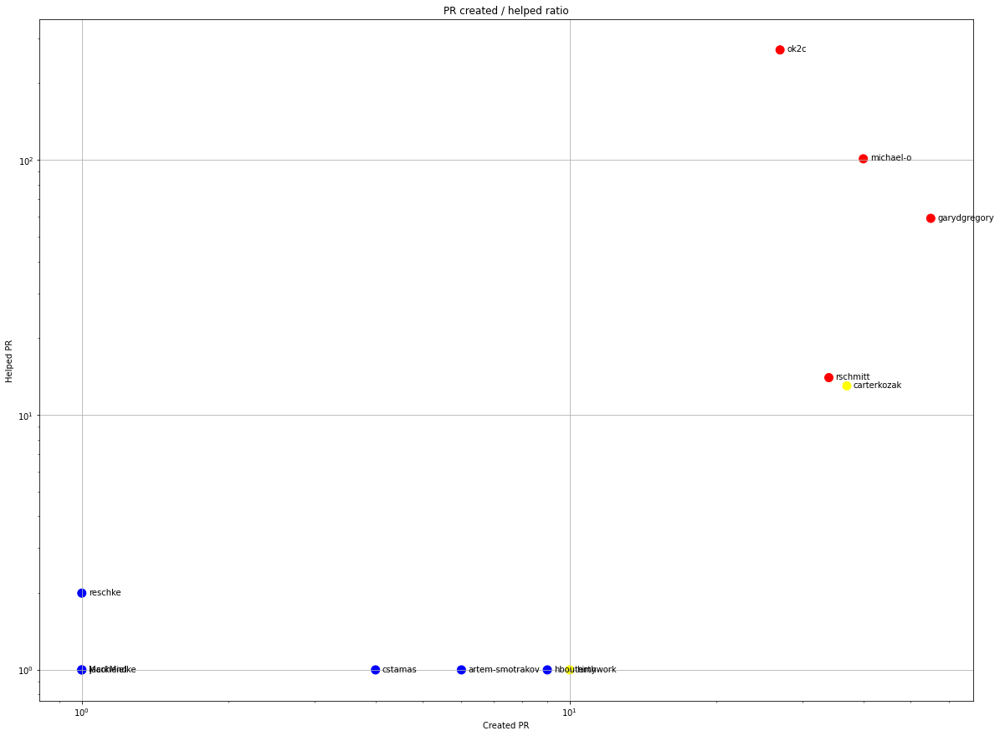

Latest record from the dataset:

<table border="1" class="dataframe">
  <thead>
    <tr style="text-align: right;">
      <th></th>
      <th>org</th>
      <th>repo</th>
      <th>type</th>
      <th>identifier</th>
      <th>subidentifier</th>
      <th>date</th>
      <th>author</th>
      <th>owner</th>
      <th>project</th>
    </tr>
  </thead>
  <tbody>
    <tr>
      <th>2631</th>
      <td>apache</td>
      <td>httpcomponents-core</td>
      <td>PR_CREATED</td>
      <td>262</td>
      <td>NaN</td>
      <td>2021-02-14 07:21:43+00:00</td>
      <td>arturobernalg</td>
      <td>arturobernalg</td>
      <td>httpcomponents</td>
    </tr>
  </tbody>
</table>

# Github Contributions per user

<table border="1" class="dataframe">
  <thead>
    <tr style="text-align: right;">
      <th></th>
      <th>contributions</th>
    </tr>
    <tr>
      <th>author</th>
      <th></th>
    </tr>
  </thead>
  <tbody>
    <tr>
      <th>ok2c</th>
      <td>939</td>
    </tr>
    <tr>
      <th>michael-o</th>
      <td>345</td>
    </tr>
    <tr>
      <th>garydgregory</th>
      <td>115</td>
    </tr>
    <tr>
      <th>asfgit</th>
      <td>36</td>
    </tr>
    <tr>
      <th>rschmitt</th>
      <td>28</td>
    </tr>
    <tr>
      <th>DaddyWri</th>
      <td>23</td>
    </tr>
    <tr>
      <th>carterkozak</th>
      <td>22</td>
    </tr>
    <tr>
      <th>hboutemy</th>
      <td>9</td>
    </tr>
    <tr>
      <th>neykov</th>
      <td>6</td>
    </tr>
    <tr>
      <th>adriancole</th>
      <td>5</td>
    </tr>
  </tbody>
</table>

## Contributors per participations in PRs which are not created by self (helping PRs)

<table border="1" class="dataframe">
  <thead>
    <tr style="text-align: right;">
      <th></th>
      <th>identifier</th>
    </tr>
    <tr>
      <th>author</th>
      <th></th>
    </tr>
  </thead>
  <tbody>
    <tr>
      <th>ok2c</th>
      <td>270</td>
    </tr>
    <tr>
      <th>michael-o</th>
      <td>101</td>
    </tr>
    <tr>
      <th>garydgregory</th>
      <td>59</td>
    </tr>
    <tr>
      <th>asfgit</th>
      <td>36</td>
    </tr>
    <tr>
      <th>rschmitt</th>
      <td>14</td>
    </tr>
    <tr>
      <th>carterkozak</th>
      <td>13</td>
    </tr>
    <tr>
      <th>fxbonnet</th>
      <td>3</td>
    </tr>
    <tr>
      <th>thc202</th>
      <td>2</td>
    </tr>
    <tr>
      <th>reschke</th>
      <td>2</td>
    </tr>
    <tr>
      <th>asfbot</th>
      <td>2</td>
    </tr>
    <tr>
      <th>e-hubert</th>
      <td>2</td>
    </tr>
    <tr>
      <th>comcast-jonm</th>
      <td>2</td>
    </tr>
    <tr>
      <th>l3ender</th>
      <td>1</td>
    </tr>
    <tr>
      <th>neykov</th>
      <td>1</td>
    </tr>
    <tr>
      <th>petermant</th>
      <td>1</td>
    </tr>
    <tr>
      <th>perlun</th>
      <td>1</td>
    </tr>
    <tr>
      <th>jacohend</th>
      <td>1</td>
    </tr>
    <tr>
      <th>pethers</th>
      <td>1</td>
    </tr>
    <tr>
      <th>ryantxu</th>
      <td>1</td>
    </tr>
    <tr>
      <th>tmaret</th>
      <td>1</td>
    </tr>
  </tbody>
</table>

## Contributors per participations in any PRs

<table border="1" class="dataframe">
  <thead>
    <tr style="text-align: right;">
      <th></th>
      <th>identifier</th>
    </tr>
    <tr>
      <th>author</th>
      <th></th>
    </tr>
  </thead>
  <tbody>
    <tr>
      <th>ok2c</th>
      <td>274</td>
    </tr>
    <tr>
      <th>michael-o</th>
      <td>120</td>
    </tr>
    <tr>
      <th>garydgregory</th>
      <td>107</td>
    </tr>
    <tr>
      <th>carterkozak</th>
      <td>45</td>
    </tr>
    <tr>
      <th>rschmitt</th>
      <td>42</td>
    </tr>
    <tr>
      <th>asfgit</th>
      <td>36</td>
    </tr>
    <tr>
      <th>arturobernalg</th>
      <td>20</td>
    </tr>
    <tr>
      <th>hirthwork</th>
      <td>11</td>
    </tr>
    <tr>
      <th>hboutemy</th>
      <td>10</td>
    </tr>
    <tr>
      <th>rhernandez35</th>
      <td>9</td>
    </tr>
    <tr>
      <th>coxlinton</th>
      <td>9</td>
    </tr>
    <tr>
      <th>artem-smotrakov</th>
      <td>7</td>
    </tr>
    <tr>
      <th>xiaohu-zhang</th>
      <td>7</td>
    </tr>
    <tr>
      <th>kirill-usov</th>
      <td>6</td>
    </tr>
    <tr>
      <th>theangrydev</th>
      <td>6</td>
    </tr>
    <tr>
      <th>faisal-hameed</th>
      <td>5</td>
    </tr>
    <tr>
      <th>sparsick</th>
      <td>5</td>
    </tr>
    <tr>
      <th>cstamas</th>
      <td>5</td>
    </tr>
    <tr>
      <th>martin-g</th>
      <td>5</td>
    </tr>
    <tr>
      <th>agherardi</th>
      <td>5</td>
    </tr>
  </tbody>
</table>

# Bus factor (number of contributors responsible for the 50% of the prs) from last half year

## Contributors until the half of the all contributions

<table border="1" class="dataframe">
  <thead>
    <tr style="text-align: right;">
      <th></th>
      <th>author</th>
      <th>identifier</th>
      <th>cs</th>
      <th>ratio</th>
    </tr>
  </thead>
  <tbody>
    <tr>
      <th>0</th>
      <td>arturobernalg</td>
      <td>20</td>
      <td>20</td>
      <td>22.222222</td>
    </tr>
    <tr>
      <th>1</th>
      <td>hboutemy</td>
      <td>9</td>
      <td>29</td>
      <td>10.000000</td>
    </tr>
    <tr>
      <th>2</th>
      <td>michael-o</td>
      <td>7</td>
      <td>36</td>
      <td>7.777778</td>
    </tr>
    <tr>
      <th>3</th>
      <td>garydgregory</td>
      <td>6</td>
      <td>42</td>
      <td>6.666667</td>
    </tr>
  </tbody>
</table>

## Pony number (bus factor)

    5

## Dev power (All the contributions in the ration of the top contributor)

    4.499999999999999

    

    

## People with created PRs > reviewed/commented PRS

    

    

## Same graph with focusing to the last 6 month

Only contributors with both created pr and helped pr visible

    

    

# Number of individual contributors per month

Number of different Github users who either created PR, commented PR, added review to a PR

Note: only events from apache/hadoop-ozone repository are included. Earlier PRs/comments are not here.

    

    

# Number of PRs closed/created per month

    /usr/lib/python3.9/site-packages/pandas/core/arrays/datetimes.py:1101: UserWarning: Converting to PeriodArray/Index representation will drop timezone information.
      warnings.warn(

    

    

# PR activity heatmap

    

    

