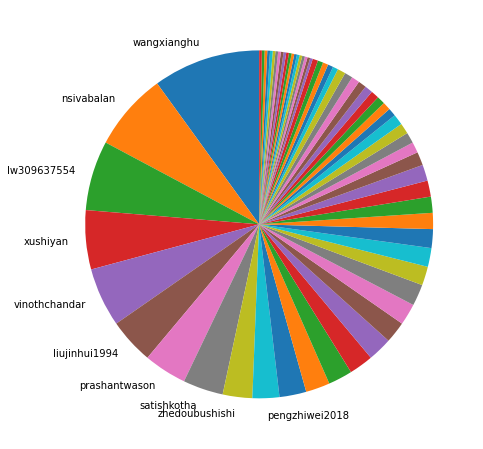
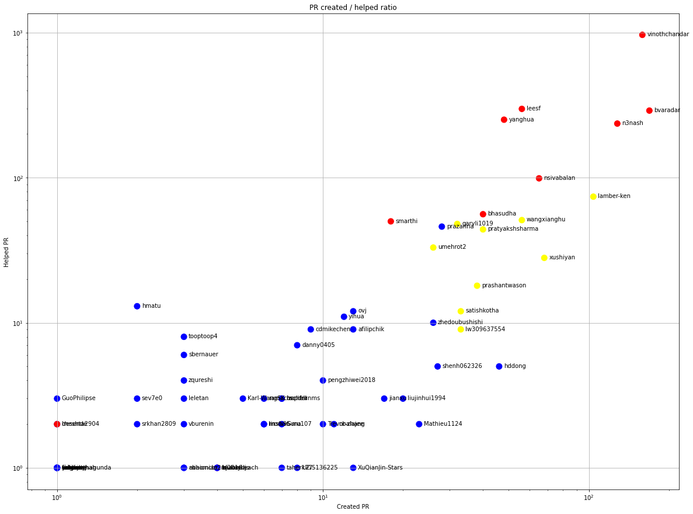
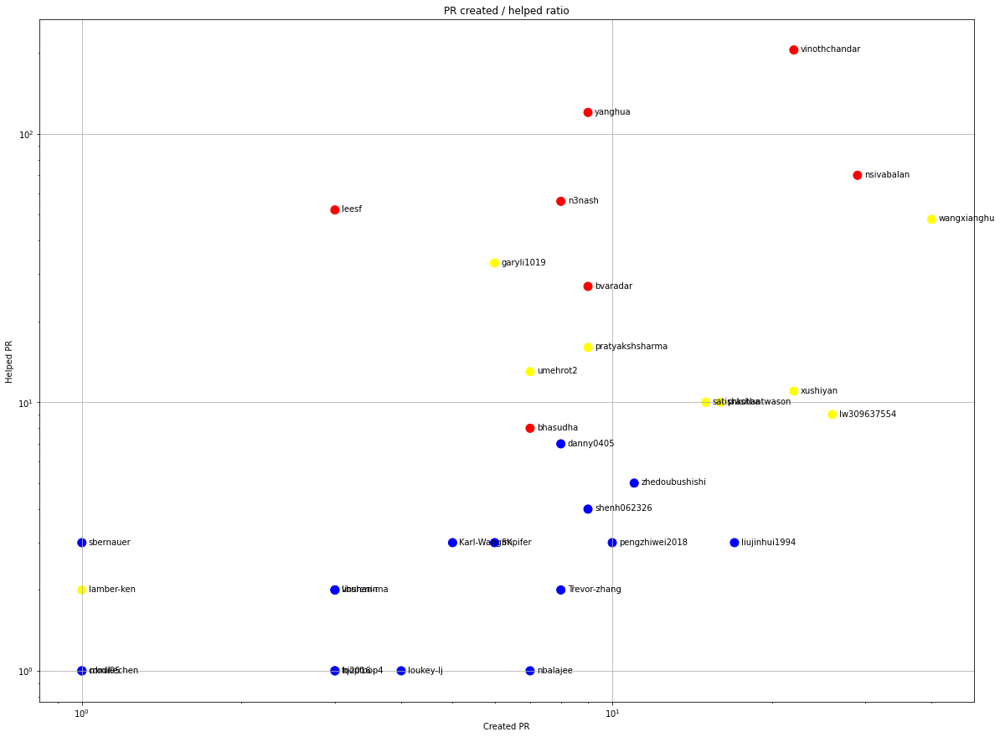
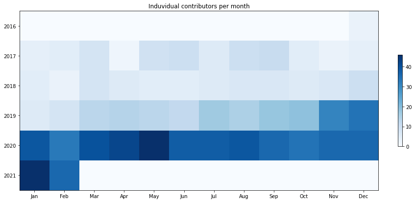
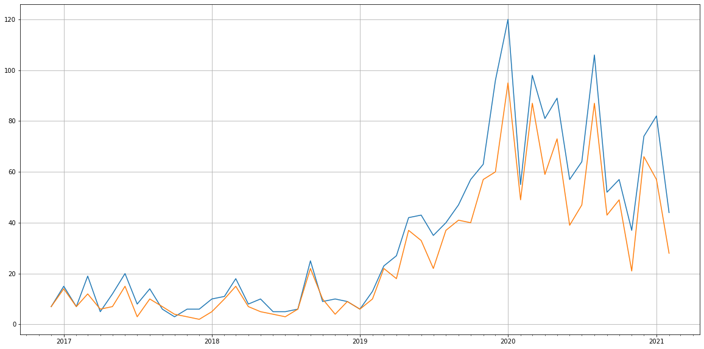
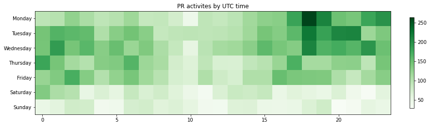

Latest record from the dataset:

<table border="1" class="dataframe">
  <thead>
    <tr style="text-align: right;">
      <th></th>
      <th>org</th>
      <th>repo</th>
      <th>type</th>
      <th>identifier</th>
      <th>subidentifier</th>
      <th>date</th>
      <th>author</th>
      <th>owner</th>
      <th>project</th>
    </tr>
  </thead>
  <tbody>
    <tr>
      <th>13325</th>
      <td>apache</td>
      <td>hudi</td>
      <td>PR_CREATED</td>
      <td>2576</td>
      <td>NaN</td>
      <td>2021-02-13 22:53:47+00:00</td>
      <td>tooptoop4</td>
      <td>tooptoop4</td>
      <td>hudi</td>
    </tr>
  </tbody>
</table>

# Github Contributions per user

<table border="1" class="dataframe">
  <thead>
    <tr style="text-align: right;">
      <th></th>
      <th>contributions</th>
    </tr>
    <tr>
      <th>author</th>
      <th></th>
    </tr>
  </thead>
  <tbody>
    <tr>
      <th>vinothchandar</th>
      <td>3301</td>
    </tr>
    <tr>
      <th>n3nash</th>
      <td>1285</td>
    </tr>
    <tr>
      <th>leesf</th>
      <td>1029</td>
    </tr>
    <tr>
      <th>yanghua</th>
      <td>863</td>
    </tr>
    <tr>
      <th>bvaradar</th>
      <td>826</td>
    </tr>
    <tr>
      <th>codecov-io</th>
      <td>347</td>
    </tr>
    <tr>
      <th>nsivabalan</th>
      <td>338</td>
    </tr>
    <tr>
      <th>pratyakshsharma</th>
      <td>171</td>
    </tr>
    <tr>
      <th>lamber-ken</th>
      <td>169</td>
    </tr>
    <tr>
      <th>garyli1019</th>
      <td>149</td>
    </tr>
  </tbody>
</table>

## Contributors per participations in PRs which are not created by self (helping PRs)

<table border="1" class="dataframe">
  <thead>
    <tr style="text-align: right;">
      <th></th>
      <th>identifier</th>
    </tr>
    <tr>
      <th>author</th>
      <th></th>
    </tr>
  </thead>
  <tbody>
    <tr>
      <th>vinothchandar</th>
      <td>965</td>
    </tr>
    <tr>
      <th>codecov-io</th>
      <td>347</td>
    </tr>
    <tr>
      <th>leesf</th>
      <td>298</td>
    </tr>
    <tr>
      <th>bvaradar</th>
      <td>290</td>
    </tr>
    <tr>
      <th>yanghua</th>
      <td>251</td>
    </tr>
    <tr>
      <th>n3nash</th>
      <td>236</td>
    </tr>
    <tr>
      <th>nsivabalan</th>
      <td>99</td>
    </tr>
    <tr>
      <th>codecov-commenter</th>
      <td>75</td>
    </tr>
    <tr>
      <th>lamber-ken</th>
      <td>74</td>
    </tr>
    <tr>
      <th>bhasudha</th>
      <td>56</td>
    </tr>
    <tr>
      <th>wangxianghu</th>
      <td>51</td>
    </tr>
    <tr>
      <th>smarthi</th>
      <td>50</td>
    </tr>
    <tr>
      <th>garyli1019</th>
      <td>48</td>
    </tr>
    <tr>
      <th>prazanna</th>
      <td>46</td>
    </tr>
    <tr>
      <th>pratyakshsharma</th>
      <td>44</td>
    </tr>
    <tr>
      <th>CLAassistant</th>
      <td>40</td>
    </tr>
    <tr>
      <th>umehrot2</th>
      <td>33</td>
    </tr>
    <tr>
      <th>xushiyan</th>
      <td>28</td>
    </tr>
    <tr>
      <th>prashantwason</th>
      <td>18</td>
    </tr>
    <tr>
      <th>hmatu</th>
      <td>13</td>
    </tr>
  </tbody>
</table>

## Contributors per participations in any PRs

<table border="1" class="dataframe">
  <thead>
    <tr style="text-align: right;">
      <th></th>
      <th>identifier</th>
    </tr>
    <tr>
      <th>author</th>
      <th></th>
    </tr>
  </thead>
  <tbody>
    <tr>
      <th>vinothchandar</th>
      <td>1124</td>
    </tr>
    <tr>
      <th>bvaradar</th>
      <td>459</td>
    </tr>
    <tr>
      <th>n3nash</th>
      <td>364</td>
    </tr>
    <tr>
      <th>leesf</th>
      <td>354</td>
    </tr>
    <tr>
      <th>codecov-io</th>
      <td>347</td>
    </tr>
    <tr>
      <th>yanghua</th>
      <td>299</td>
    </tr>
    <tr>
      <th>lamber-ken</th>
      <td>178</td>
    </tr>
    <tr>
      <th>nsivabalan</th>
      <td>164</td>
    </tr>
    <tr>
      <th>wangxianghu</th>
      <td>107</td>
    </tr>
    <tr>
      <th>xushiyan</th>
      <td>96</td>
    </tr>
    <tr>
      <th>bhasudha</th>
      <td>96</td>
    </tr>
    <tr>
      <th>pratyakshsharma</th>
      <td>84</td>
    </tr>
    <tr>
      <th>garyli1019</th>
      <td>80</td>
    </tr>
    <tr>
      <th>codecov-commenter</th>
      <td>75</td>
    </tr>
    <tr>
      <th>prazanna</th>
      <td>74</td>
    </tr>
    <tr>
      <th>smarthi</th>
      <td>68</td>
    </tr>
    <tr>
      <th>umehrot2</th>
      <td>59</td>
    </tr>
    <tr>
      <th>prashantwason</th>
      <td>56</td>
    </tr>
    <tr>
      <th>hddong</th>
      <td>51</td>
    </tr>
    <tr>
      <th>satishkotha</th>
      <td>45</td>
    </tr>
  </tbody>
</table>

# Bus factor (number of contributors responsible for the 50% of the prs) from last half year

## Contributors until the half of the all contributions

<table border="1" class="dataframe">
  <thead>
    <tr style="text-align: right;">
      <th></th>
      <th>author</th>
      <th>identifier</th>
      <th>cs</th>
      <th>ratio</th>
    </tr>
  </thead>
  <tbody>
    <tr>
      <th>0</th>
      <td>wangxianghu</td>
      <td>40</td>
      <td>40</td>
      <td>9.975062</td>
    </tr>
    <tr>
      <th>1</th>
      <td>nsivabalan</td>
      <td>29</td>
      <td>69</td>
      <td>7.231920</td>
    </tr>
    <tr>
      <th>2</th>
      <td>lw309637554</td>
      <td>26</td>
      <td>95</td>
      <td>6.483791</td>
    </tr>
    <tr>
      <th>3</th>
      <td>xushiyan</td>
      <td>22</td>
      <td>117</td>
      <td>5.486284</td>
    </tr>
    <tr>
      <th>4</th>
      <td>vinothchandar</td>
      <td>22</td>
      <td>139</td>
      <td>5.486284</td>
    </tr>
    <tr>
      <th>5</th>
      <td>liujinhui1994</td>
      <td>17</td>
      <td>156</td>
      <td>4.239401</td>
    </tr>
    <tr>
      <th>6</th>
      <td>prashantwason</td>
      <td>16</td>
      <td>172</td>
      <td>3.990025</td>
    </tr>
    <tr>
      <th>7</th>
      <td>satishkotha</td>
      <td>15</td>
      <td>187</td>
      <td>3.740648</td>
    </tr>
    <tr>
      <th>8</th>
      <td>zhedoubushishi</td>
      <td>11</td>
      <td>198</td>
      <td>2.743142</td>
    </tr>
  </tbody>
</table>

## Pony number (bus factor)

    10

## Dev power (All the contributions in the ration of the top contributor)

    10.024999999999999

    

    

## People with created PRs > reviewed/commented PRS

    

    

## Same graph with focusing to the last 6 month

Only contributors with both created pr and helped pr visible

    

    

# Number of individual contributors per month

Number of different Github users who either created PR, commented PR, added review to a PR

Note: only events from apache/hadoop-ozone repository are included. Earlier PRs/comments are not here.

    

    

# Number of PRs closed/created per month

    /usr/lib/python3.9/site-packages/pandas/core/arrays/datetimes.py:1101: UserWarning: Converting to PeriodArray/Index representation will drop timezone information.
      warnings.warn(

    

    

# PR activity heatmap

    

    

