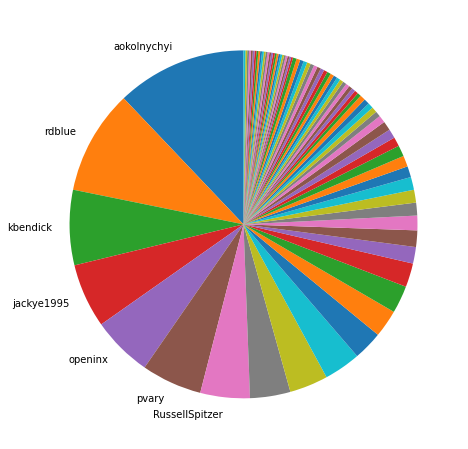
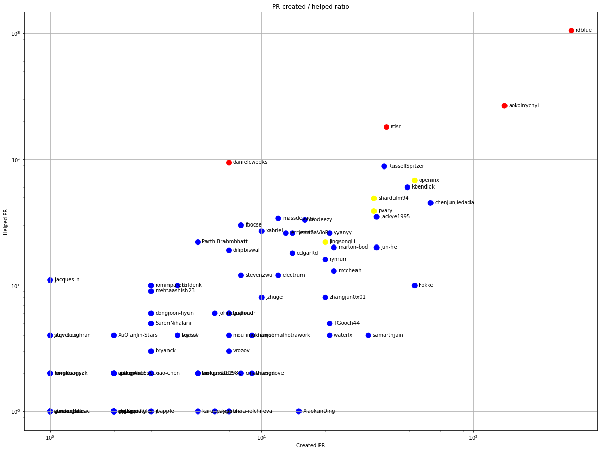
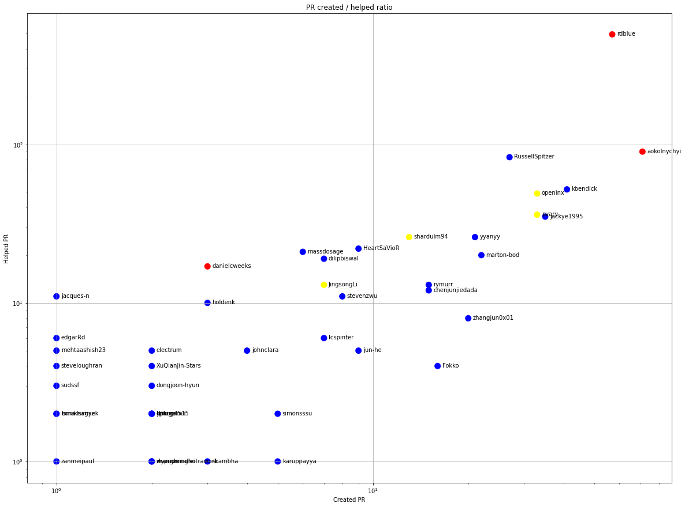
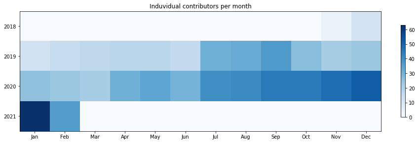
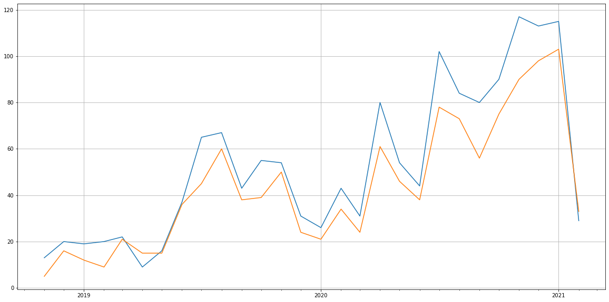
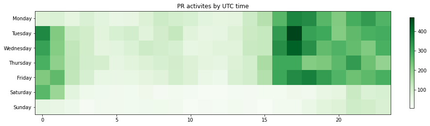

Latest record from the dataset:

<table border="1" class="dataframe">
  <thead>
    <tr style="text-align: right;">
      <th></th>
      <th>org</th>
      <th>repo</th>
      <th>type</th>
      <th>identifier</th>
      <th>subidentifier</th>
      <th>date</th>
      <th>author</th>
      <th>owner</th>
      <th>project</th>
    </tr>
  </thead>
  <tbody>
    <tr>
      <th>15018</th>
      <td>apache</td>
      <td>iceberg</td>
      <td>PR_REVIEW_COMMENTED</td>
      <td>2229</td>
      <td>NaN</td>
      <td>2021-02-14 04:19:13+00:00</td>
      <td>zhangjun0x01</td>
      <td>zhangjun0x01</td>
      <td>iceberg</td>
    </tr>
  </tbody>
</table>

# Github Contributions per user

<table border="1" class="dataframe">
  <thead>
    <tr style="text-align: right;">
      <th></th>
      <th>contributions</th>
    </tr>
    <tr>
      <th>author</th>
      <th></th>
    </tr>
  </thead>
  <tbody>
    <tr>
      <th>rdblue</th>
      <td>8206</td>
    </tr>
    <tr>
      <th>aokolnychyi</th>
      <td>1098</td>
    </tr>
    <tr>
      <th>rdsr</th>
      <td>431</td>
    </tr>
    <tr>
      <th>openinx</th>
      <td>388</td>
    </tr>
    <tr>
      <th>RussellSpitzer</th>
      <td>261</td>
    </tr>
    <tr>
      <th>danielcweeks</th>
      <td>214</td>
    </tr>
    <tr>
      <th>pvary</th>
      <td>203</td>
    </tr>
    <tr>
      <th>kbendick</th>
      <td>159</td>
    </tr>
    <tr>
      <th>shardulm94</th>
      <td>122</td>
    </tr>
    <tr>
      <th>stevenzwu</th>
      <td>122</td>
    </tr>
  </tbody>
</table>

## Contributors per participations in PRs which are not created by self (helping PRs)

<table border="1" class="dataframe">
  <thead>
    <tr style="text-align: right;">
      <th></th>
      <th>identifier</th>
    </tr>
    <tr>
      <th>author</th>
      <th></th>
    </tr>
  </thead>
  <tbody>
    <tr>
      <th>rdblue</th>
      <td>1051</td>
    </tr>
    <tr>
      <th>aokolnychyi</th>
      <td>266</td>
    </tr>
    <tr>
      <th>rdsr</th>
      <td>180</td>
    </tr>
    <tr>
      <th>danielcweeks</th>
      <td>94</td>
    </tr>
    <tr>
      <th>RussellSpitzer</th>
      <td>88</td>
    </tr>
    <tr>
      <th>openinx</th>
      <td>68</td>
    </tr>
    <tr>
      <th>kbendick</th>
      <td>60</td>
    </tr>
    <tr>
      <th>shardulm94</th>
      <td>49</td>
    </tr>
    <tr>
      <th>chenjunjiedada</th>
      <td>45</td>
    </tr>
    <tr>
      <th>pvary</th>
      <td>39</td>
    </tr>
    <tr>
      <th>jackye1995</th>
      <td>35</td>
    </tr>
    <tr>
      <th>massdosage</th>
      <td>34</td>
    </tr>
    <tr>
      <th>prodeezy</th>
      <td>33</td>
    </tr>
    <tr>
      <th>fbocse</th>
      <td>30</td>
    </tr>
    <tr>
      <th>xabriel</th>
      <td>27</td>
    </tr>
    <tr>
      <th>jerryshao</th>
      <td>26</td>
    </tr>
    <tr>
      <th>yyanyy</th>
      <td>26</td>
    </tr>
    <tr>
      <th>HeartSaVioR</th>
      <td>26</td>
    </tr>
    <tr>
      <th>JingsongLi</th>
      <td>22</td>
    </tr>
    <tr>
      <th>Parth-Brahmbhatt</th>
      <td>22</td>
    </tr>
  </tbody>
</table>

## Contributors per participations in any PRs

<table border="1" class="dataframe">
  <thead>
    <tr style="text-align: right;">
      <th></th>
      <th>identifier</th>
    </tr>
    <tr>
      <th>author</th>
      <th></th>
    </tr>
  </thead>
  <tbody>
    <tr>
      <th>rdblue</th>
      <td>1343</td>
    </tr>
    <tr>
      <th>aokolnychyi</th>
      <td>407</td>
    </tr>
    <tr>
      <th>rdsr</th>
      <td>219</td>
    </tr>
    <tr>
      <th>RussellSpitzer</th>
      <td>126</td>
    </tr>
    <tr>
      <th>openinx</th>
      <td>121</td>
    </tr>
    <tr>
      <th>kbendick</th>
      <td>109</td>
    </tr>
    <tr>
      <th>chenjunjiedada</th>
      <td>108</td>
    </tr>
    <tr>
      <th>danielcweeks</th>
      <td>101</td>
    </tr>
    <tr>
      <th>shardulm94</th>
      <td>83</td>
    </tr>
    <tr>
      <th>pvary</th>
      <td>73</td>
    </tr>
    <tr>
      <th>jackye1995</th>
      <td>70</td>
    </tr>
    <tr>
      <th>Fokko</th>
      <td>63</td>
    </tr>
    <tr>
      <th>jun-he</th>
      <td>55</td>
    </tr>
    <tr>
      <th>prodeezy</th>
      <td>49</td>
    </tr>
    <tr>
      <th>yyanyy</th>
      <td>47</td>
    </tr>
    <tr>
      <th>massdosage</th>
      <td>46</td>
    </tr>
    <tr>
      <th>marton-bod</th>
      <td>42</td>
    </tr>
    <tr>
      <th>JingsongLi</th>
      <td>42</td>
    </tr>
    <tr>
      <th>HeartSaVioR</th>
      <td>40</td>
    </tr>
    <tr>
      <th>jerryshao</th>
      <td>39</td>
    </tr>
  </tbody>
</table>

# Bus factor (number of contributors responsible for the 50% of the prs) from last half year

## Contributors until the half of the all contributions

<table border="1" class="dataframe">
  <thead>
    <tr style="text-align: right;">
      <th></th>
      <th>author</th>
      <th>identifier</th>
      <th>cs</th>
      <th>ratio</th>
    </tr>
  </thead>
  <tbody>
    <tr>
      <th>0</th>
      <td>aokolnychyi</td>
      <td>71</td>
      <td>71</td>
      <td>12.095400</td>
    </tr>
    <tr>
      <th>1</th>
      <td>rdblue</td>
      <td>57</td>
      <td>128</td>
      <td>9.710392</td>
    </tr>
    <tr>
      <th>2</th>
      <td>kbendick</td>
      <td>41</td>
      <td>169</td>
      <td>6.984668</td>
    </tr>
    <tr>
      <th>3</th>
      <td>jackye1995</td>
      <td>35</td>
      <td>204</td>
      <td>5.962521</td>
    </tr>
    <tr>
      <th>4</th>
      <td>openinx</td>
      <td>33</td>
      <td>237</td>
      <td>5.621806</td>
    </tr>
    <tr>
      <th>5</th>
      <td>pvary</td>
      <td>33</td>
      <td>270</td>
      <td>5.621806</td>
    </tr>
  </tbody>
</table>

## Pony number (bus factor)

    7

## Dev power (All the contributions in the ration of the top contributor)

    8.267605633802816

    

    

## People with created PRs > reviewed/commented PRS

    

    

## Same graph with focusing to the last 6 month

Only contributors with both created pr and helped pr visible

    

    

# Number of individual contributors per month

Number of different Github users who either created PR, commented PR, added review to a PR

Note: only events from apache/hadoop-ozone repository are included. Earlier PRs/comments are not here.

    

    

# Number of PRs closed/created per month

    /usr/lib/python3.9/site-packages/pandas/core/arrays/datetimes.py:1101: UserWarning: Converting to PeriodArray/Index representation will drop timezone information.
      warnings.warn(

    

    

# PR activity heatmap

    

    

