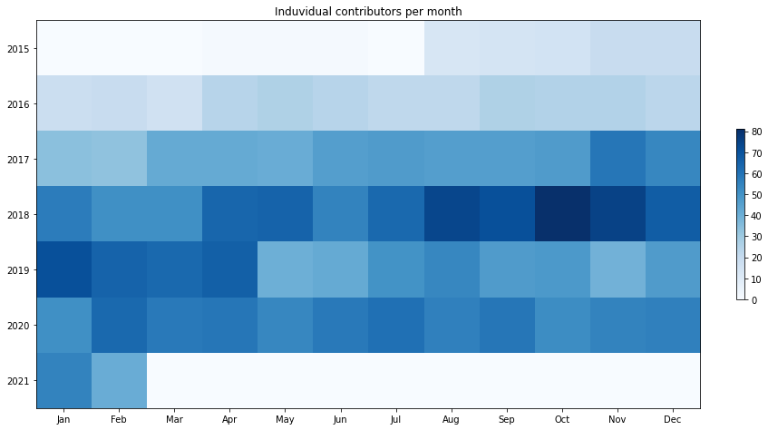

Latest record from the dataset:

<table border="1" class="dataframe">
  <thead>
    <tr style="text-align: right;">
      <th></th>
      <th>org</th>
      <th>repo</th>
      <th>type</th>
      <th>identifier</th>
      <th>subidentifier</th>
      <th>date</th>
      <th>author</th>
      <th>owner</th>
      <th>project</th>
    </tr>
  </thead>
  <tbody>
    <tr>
      <th>20016</th>
      <td>apache</td>
      <td>ignite</td>
      <td>PR_REVIEW_COMMENTED</td>
      <td>8795</td>
      <td>NaN</td>
      <td>2021-02-14 08:26:54+00:00</td>
      <td>nizhikov</td>
      <td>nizhikov</td>
      <td>ignite</td>
    </tr>
  </tbody>
</table>

# Github Contributions per user

<table border="1" class="dataframe">
  <thead>
    <tr style="text-align: right;">
      <th></th>
      <th>contributions</th>
    </tr>
    <tr>
      <th>author</th>
      <th></th>
    </tr>
  </thead>
  <tbody>
    <tr>
      <th>dspavlov</th>
      <td>1192</td>
    </tr>
    <tr>
      <th>nizhikov</th>
      <td>797</td>
    </tr>
    <tr>
      <th>alex-plekhanov</th>
      <td>239</td>
    </tr>
    <tr>
      <th>Mmuzaf</th>
      <td>238</td>
    </tr>
    <tr>
      <th>anton-vinogradov</th>
      <td>234</td>
    </tr>
    <tr>
      <th>AMashenkov</th>
      <td>225</td>
    </tr>
    <tr>
      <th>ivandasch</th>
      <td>223</td>
    </tr>
    <tr>
      <th>NSAmelchev</th>
      <td>220</td>
    </tr>
    <tr>
      <th>dmagda</th>
      <td>202</td>
    </tr>
    <tr>
      <th>ptupitsyn</th>
      <td>200</td>
    </tr>
  </tbody>
</table>

## Contributors per participations in PRs which are not created by self (helping PRs)

<table border="1" class="dataframe">
  <thead>
    <tr style="text-align: right;">
      <th></th>
      <th>identifier</th>
    </tr>
    <tr>
      <th>author</th>
      <th></th>
    </tr>
  </thead>
  <tbody>
    <tr>
      <th>dspavlov</th>
      <td>1071</td>
    </tr>
    <tr>
      <th>dmagda</th>
      <td>137</td>
    </tr>
    <tr>
      <th>nizhikov</th>
      <td>133</td>
    </tr>
    <tr>
      <th>anton-vinogradov</th>
      <td>101</td>
    </tr>
    <tr>
      <th>asfgit</th>
      <td>93</td>
    </tr>
    <tr>
      <th>AMashenkov</th>
      <td>92</td>
    </tr>
    <tr>
      <th>pavlukhin</th>
      <td>90</td>
    </tr>
    <tr>
      <th>alamar</th>
      <td>85</td>
    </tr>
    <tr>
      <th>Mmuzaf</th>
      <td>80</td>
    </tr>
    <tr>
      <th>NSAmelchev</th>
      <td>74</td>
    </tr>
    <tr>
      <th>ptupitsyn</th>
      <td>73</td>
    </tr>
    <tr>
      <th>alex-plekhanov</th>
      <td>65</td>
    </tr>
    <tr>
      <th>ivandasch</th>
      <td>53</td>
    </tr>
    <tr>
      <th>SomeFire</th>
      <td>41</td>
    </tr>
    <tr>
      <th>zaleslaw</th>
      <td>38</td>
    </tr>
    <tr>
      <th>zstan</th>
      <td>31</td>
    </tr>
    <tr>
      <th>isapego</th>
      <td>30</td>
    </tr>
    <tr>
      <th>nva</th>
      <td>29</td>
    </tr>
    <tr>
      <th>akuznetsov-gridgain</th>
      <td>29</td>
    </tr>
    <tr>
      <th>avplatonov</th>
      <td>28</td>
    </tr>
  </tbody>
</table>

## Contributors per participations in any PRs

<table border="1" class="dataframe">
  <thead>
    <tr style="text-align: right;">
      <th></th>
      <th>identifier</th>
    </tr>
    <tr>
      <th>author</th>
      <th></th>
    </tr>
  </thead>
  <tbody>
    <tr>
      <th>dspavlov</th>
      <td>1253</td>
    </tr>
    <tr>
      <th>ptupitsyn</th>
      <td>545</td>
    </tr>
    <tr>
      <th>AMashenkov</th>
      <td>416</td>
    </tr>
    <tr>
      <th>tledkov-gridgain</th>
      <td>327</td>
    </tr>
    <tr>
      <th>isapego</th>
      <td>309</td>
    </tr>
    <tr>
      <th>nizhikov</th>
      <td>287</td>
    </tr>
    <tr>
      <th>alamar</th>
      <td>256</td>
    </tr>
    <tr>
      <th>devozerov</th>
      <td>233</td>
    </tr>
    <tr>
      <th>Mmuzaf</th>
      <td>224</td>
    </tr>
    <tr>
      <th>alex-plekhanov</th>
      <td>219</td>
    </tr>
    <tr>
      <th>pavlukhin</th>
      <td>196</td>
    </tr>
    <tr>
      <th>agura</th>
      <td>184</td>
    </tr>
    <tr>
      <th>zstan</th>
      <td>179</td>
    </tr>
    <tr>
      <th>NSAmelchev</th>
      <td>176</td>
    </tr>
    <tr>
      <th>sergey-chugunov-1985</th>
      <td>174</td>
    </tr>
    <tr>
      <th>dgovorukhin</th>
      <td>163</td>
    </tr>
    <tr>
      <th>zaleslaw</th>
      <td>156</td>
    </tr>
    <tr>
      <th>ivandasch</th>
      <td>153</td>
    </tr>
    <tr>
      <th>anton-vinogradov</th>
      <td>153</td>
    </tr>
    <tr>
      <th>ibessonov</th>
      <td>149</td>
    </tr>
  </tbody>
</table>

# Bus factor (number of contributors responsible for the 50% of the prs) from last half year

## Contributors until the half of the all contributions

<table border="1" class="dataframe">
  <thead>
    <tr style="text-align: right;">
      <th></th>
      <th>author</th>
      <th>identifier</th>
      <th>cs</th>
      <th>ratio</th>
    </tr>
  </thead>
  <tbody>
    <tr>
      <th>0</th>
      <td>Vladsz83</td>
      <td>55</td>
      <td>55</td>
      <td>6.944444</td>
    </tr>
    <tr>
      <th>1</th>
      <td>mstekl</td>
      <td>45</td>
      <td>100</td>
      <td>5.681818</td>
    </tr>
    <tr>
      <th>2</th>
      <td>ptupitsyn</td>
      <td>38</td>
      <td>138</td>
      <td>4.797980</td>
    </tr>
    <tr>
      <th>3</th>
      <td>alex-plekhanov</td>
      <td>34</td>
      <td>172</td>
      <td>4.292929</td>
    </tr>
    <tr>
      <th>4</th>
      <td>ololo3000</td>
      <td>33</td>
      <td>205</td>
      <td>4.166667</td>
    </tr>
    <tr>
      <th>5</th>
      <td>zstan</td>
      <td>31</td>
      <td>236</td>
      <td>3.914141</td>
    </tr>
    <tr>
      <th>6</th>
      <td>nizhikov</td>
      <td>31</td>
      <td>267</td>
      <td>3.914141</td>
    </tr>
    <tr>
      <th>7</th>
      <td>ivandasch</td>
      <td>31</td>
      <td>298</td>
      <td>3.914141</td>
    </tr>
    <tr>
      <th>8</th>
      <td>ibessonov</td>
      <td>27</td>
      <td>325</td>
      <td>3.409091</td>
    </tr>
    <tr>
      <th>9</th>
      <td>isapego</td>
      <td>25</td>
      <td>350</td>
      <td>3.156566</td>
    </tr>
    <tr>
      <th>10</th>
      <td>Sega76</td>
      <td>21</td>
      <td>371</td>
      <td>2.651515</td>
    </tr>
    <tr>
      <th>11</th>
      <td>Mmuzaf</td>
      <td>20</td>
      <td>391</td>
      <td>2.525253</td>
    </tr>
  </tbody>
</table>

## Pony number (bus factor)

    13

## Dev power (All the contributions in the ration of the top contributor)

    14.399999999999995

    

    

## People with created PRs > reviewed/commented PRS

    

    

## Same graph with focusing to the last 6 month

Only contributors with both created pr and helped pr visible

    

    

# Number of individual contributors per month

Number of different Github users who either created PR, commented PR, added review to a PR

Note: only events from apache/hadoop-ozone repository are included. Earlier PRs/comments are not here.

    

    

# Number of PRs closed/created per month

    /usr/lib/python3.9/site-packages/pandas/core/arrays/datetimes.py:1101: UserWarning: Converting to PeriodArray/Index representation will drop timezone information.
      warnings.warn(

    

    

# PR activity heatmap

    

    

