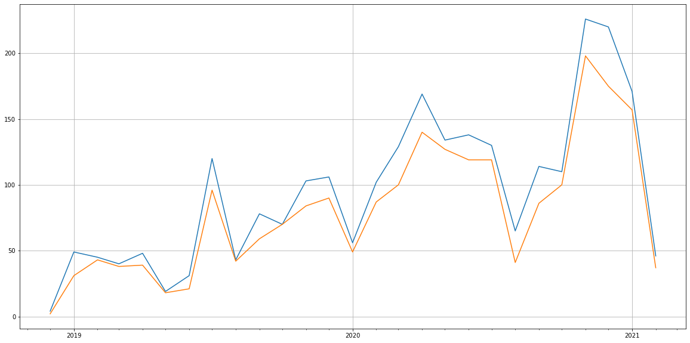

Latest record from the dataset:

<table border="1" class="dataframe">
  <thead>
    <tr style="text-align: right;">
      <th></th>
      <th>org</th>
      <th>repo</th>
      <th>type</th>
      <th>identifier</th>
      <th>subidentifier</th>
      <th>date</th>
      <th>author</th>
      <th>owner</th>
      <th>project</th>
    </tr>
  </thead>
  <tbody>
    <tr>
      <th>8099</th>
      <td>apache</td>
      <td>iotdb</td>
      <td>PR_COMMENTED</td>
      <td>2468</td>
      <td>NaN</td>
      <td>2021-02-14 06:01:30+00:00</td>
      <td>jixuan1989</td>
      <td>weizihan0110</td>
      <td>iotdb</td>
    </tr>
  </tbody>
</table>

# Github Contributions per user

<table border="1" class="dataframe">
  <thead>
    <tr style="text-align: right;">
      <th></th>
      <th>contributions</th>
    </tr>
    <tr>
      <th>author</th>
      <th></th>
    </tr>
  </thead>
  <tbody>
    <tr>
      <th>qiaojialin</th>
      <td>2650</td>
    </tr>
    <tr>
      <th>jixuan1989</th>
      <td>1252</td>
    </tr>
    <tr>
      <th>sonarcloud</th>
      <td>1041</td>
    </tr>
    <tr>
      <th>jt2594838</th>
      <td>782</td>
    </tr>
    <tr>
      <th>HTHou</th>
      <td>570</td>
    </tr>
    <tr>
      <th>samperson1997</th>
      <td>273</td>
    </tr>
    <tr>
      <th>JackieTien97</th>
      <td>242</td>
    </tr>
    <tr>
      <th>LeiRui</th>
      <td>150</td>
    </tr>
    <tr>
      <th>MyXOF</th>
      <td>132</td>
    </tr>
    <tr>
      <th>fanhualta</th>
      <td>122</td>
    </tr>
  </tbody>
</table>

## Contributors per participations in PRs which are not created by self (helping PRs)

<table border="1" class="dataframe">
  <thead>
    <tr style="text-align: right;">
      <th></th>
      <th>identifier</th>
    </tr>
    <tr>
      <th>author</th>
      <th></th>
    </tr>
  </thead>
  <tbody>
    <tr>
      <th>qiaojialin</th>
      <td>1215</td>
    </tr>
    <tr>
      <th>sonarcloud</th>
      <td>1024</td>
    </tr>
    <tr>
      <th>jixuan1989</th>
      <td>516</td>
    </tr>
    <tr>
      <th>jt2594838</th>
      <td>350</td>
    </tr>
    <tr>
      <th>HTHou</th>
      <td>321</td>
    </tr>
    <tr>
      <th>samperson1997</th>
      <td>176</td>
    </tr>
    <tr>
      <th>JackieTien97</th>
      <td>147</td>
    </tr>
    <tr>
      <th>MyXOF</th>
      <td>78</td>
    </tr>
    <tr>
      <th>Alima777</th>
      <td>62</td>
    </tr>
    <tr>
      <th>mychaow</th>
      <td>59</td>
    </tr>
    <tr>
      <th>SilverNarcissus</th>
      <td>57</td>
    </tr>
    <tr>
      <th>LeiRui</th>
      <td>54</td>
    </tr>
    <tr>
      <th>neuyilan</th>
      <td>52</td>
    </tr>
    <tr>
      <th>fanhualta</th>
      <td>44</td>
    </tr>
    <tr>
      <th>LebronAl</th>
      <td>41</td>
    </tr>
    <tr>
      <th>Genius-pig</th>
      <td>32</td>
    </tr>
    <tr>
      <th>liutaohua</th>
      <td>28</td>
    </tr>
    <tr>
      <th>JulianFeinauer</th>
      <td>18</td>
    </tr>
    <tr>
      <th>mdf369</th>
      <td>16</td>
    </tr>
    <tr>
      <th>liukun4515</th>
      <td>15</td>
    </tr>
  </tbody>
</table>

## Contributors per participations in any PRs

<table border="1" class="dataframe">
  <thead>
    <tr style="text-align: right;">
      <th></th>
      <th>identifier</th>
    </tr>
    <tr>
      <th>author</th>
      <th></th>
    </tr>
  </thead>
  <tbody>
    <tr>
      <th>qiaojialin</th>
      <td>1490</td>
    </tr>
    <tr>
      <th>sonarcloud</th>
      <td>1024</td>
    </tr>
    <tr>
      <th>jixuan1989</th>
      <td>719</td>
    </tr>
    <tr>
      <th>HTHou</th>
      <td>459</td>
    </tr>
    <tr>
      <th>jt2594838</th>
      <td>436</td>
    </tr>
    <tr>
      <th>samperson1997</th>
      <td>359</td>
    </tr>
    <tr>
      <th>JackieTien97</th>
      <td>288</td>
    </tr>
    <tr>
      <th>Alima777</th>
      <td>150</td>
    </tr>
    <tr>
      <th>Genius-pig</th>
      <td>136</td>
    </tr>
    <tr>
      <th>zhanglingzhe0820</th>
      <td>134</td>
    </tr>
    <tr>
      <th>neuyilan</th>
      <td>133</td>
    </tr>
    <tr>
      <th>SilverNarcissus</th>
      <td>131</td>
    </tr>
    <tr>
      <th>LeiRui</th>
      <td>123</td>
    </tr>
    <tr>
      <th>mychaow</th>
      <td>112</td>
    </tr>
    <tr>
      <th>MyXOF</th>
      <td>109</td>
    </tr>
    <tr>
      <th>fanhualta</th>
      <td>108</td>
    </tr>
    <tr>
      <th>liutaohua</th>
      <td>99</td>
    </tr>
    <tr>
      <th>LebronAl</th>
      <td>95</td>
    </tr>
    <tr>
      <th>SailVR</th>
      <td>72</td>
    </tr>
    <tr>
      <th>wshao08</th>
      <td>69</td>
    </tr>
  </tbody>
</table>

# Bus factor (number of contributors responsible for the 50% of the prs) from last half year

## Contributors until the half of the all contributions

<table border="1" class="dataframe">
  <thead>
    <tr style="text-align: right;">
      <th></th>
      <th>author</th>
      <th>identifier</th>
      <th>cs</th>
      <th>ratio</th>
    </tr>
  </thead>
  <tbody>
    <tr>
      <th>0</th>
      <td>zhanglingzhe0820</td>
      <td>82</td>
      <td>82</td>
      <td>8.903366</td>
    </tr>
    <tr>
      <th>1</th>
      <td>HTHou</td>
      <td>78</td>
      <td>160</td>
      <td>8.469055</td>
    </tr>
    <tr>
      <th>2</th>
      <td>asdf2014</td>
      <td>61</td>
      <td>221</td>
      <td>6.623236</td>
    </tr>
    <tr>
      <th>3</th>
      <td>neuyilan</td>
      <td>58</td>
      <td>279</td>
      <td>6.297503</td>
    </tr>
    <tr>
      <th>4</th>
      <td>jixuan1989</td>
      <td>57</td>
      <td>336</td>
      <td>6.188925</td>
    </tr>
    <tr>
      <th>5</th>
      <td>JackieTien97</td>
      <td>53</td>
      <td>389</td>
      <td>5.754615</td>
    </tr>
    <tr>
      <th>6</th>
      <td>Alima777</td>
      <td>51</td>
      <td>440</td>
      <td>5.537459</td>
    </tr>
  </tbody>
</table>

## Pony number (bus factor)

    8

## Dev power (All the contributions in the ration of the top contributor)

    11.23170731707317

    

    

## People with created PRs > reviewed/commented PRS

    

    

## Same graph with focusing to the last 6 month

Only contributors with both created pr and helped pr visible

    

    

# Number of individual contributors per month

Number of different Github users who either created PR, commented PR, added review to a PR

Note: only events from apache/hadoop-ozone repository are included. Earlier PRs/comments are not here.

    

    

# Number of PRs closed/created per month

    /usr/lib/python3.9/site-packages/pandas/core/arrays/datetimes.py:1101: UserWarning: Converting to PeriodArray/Index representation will drop timezone information.
      warnings.warn(

    

    

# PR activity heatmap

    

    

