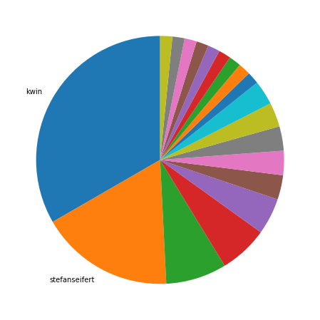
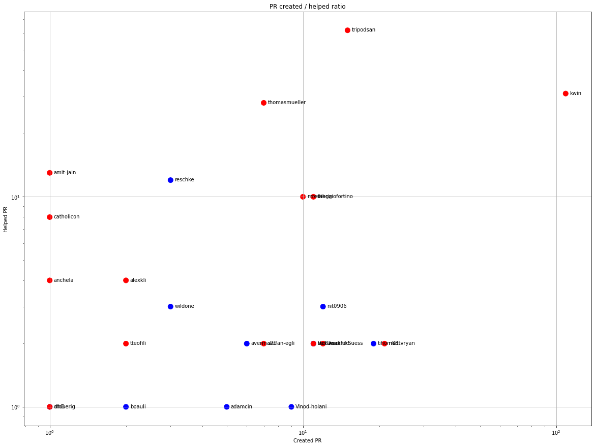
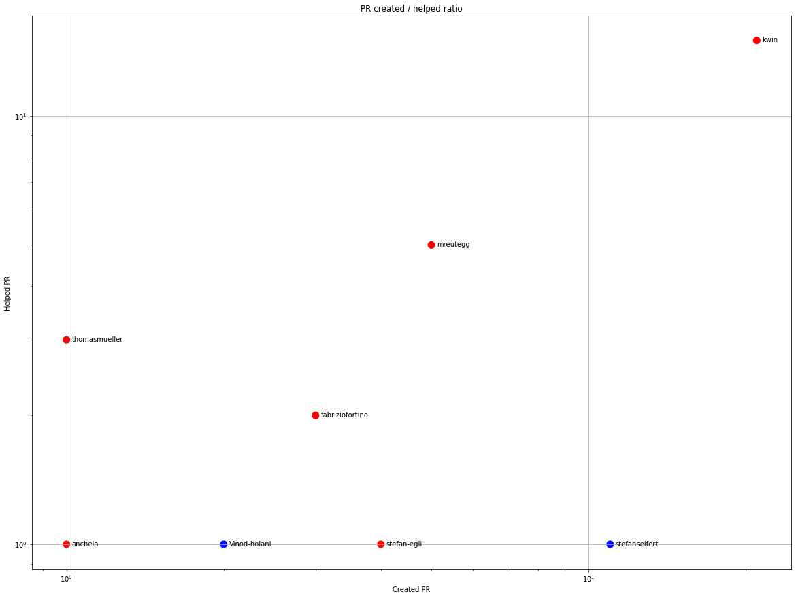
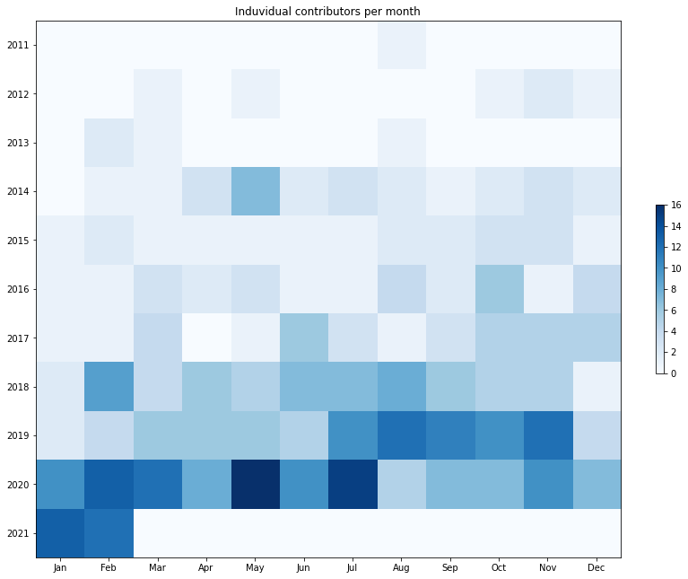
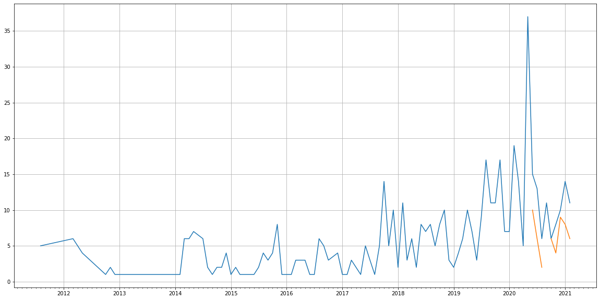
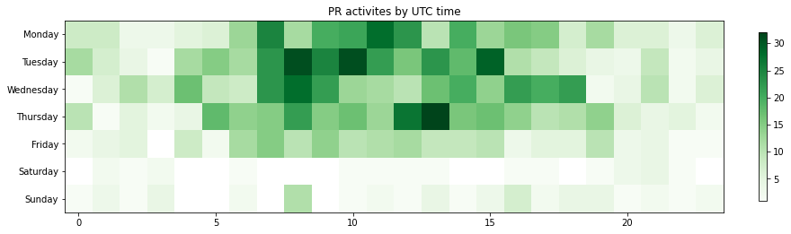

Latest record from the dataset:

<table border="1" class="dataframe">
  <thead>
    <tr style="text-align: right;">
      <th></th>
      <th>org</th>
      <th>repo</th>
      <th>type</th>
      <th>identifier</th>
      <th>subidentifier</th>
      <th>date</th>
      <th>author</th>
      <th>owner</th>
      <th>project</th>
    </tr>
  </thead>
  <tbody>
    <tr>
      <th>689</th>
      <td>apache</td>
      <td>jackrabbit-filevault-package-maven-plugin</td>
      <td>PR_MERGED</td>
      <td>53</td>
      <td>NaN</td>
      <td>2021-02-12 08:52:00+00:00</td>
      <td>kwin</td>
      <td>kwin</td>
      <td>jackrabbit</td>
    </tr>
  </tbody>
</table>

# Github Contributions per user

<table border="1" class="dataframe">
  <thead>
    <tr style="text-align: right;">
      <th></th>
      <th>contributions</th>
    </tr>
    <tr>
      <th>author</th>
      <th></th>
    </tr>
  </thead>
  <tbody>
    <tr>
      <th>tripodsan</th>
      <td>108</td>
    </tr>
    <tr>
      <th>kwin</th>
      <td>71</td>
    </tr>
    <tr>
      <th>amit-jain</th>
      <td>56</td>
    </tr>
    <tr>
      <th>thomasmueller</th>
      <td>52</td>
    </tr>
    <tr>
      <th>reschke</th>
      <td>35</td>
    </tr>
    <tr>
      <th>mreutegg</th>
      <td>34</td>
    </tr>
    <tr>
      <th>catholicon</th>
      <td>23</td>
    </tr>
    <tr>
      <th>sonarcloud</th>
      <td>20</td>
    </tr>
    <tr>
      <th>alexkli</th>
      <td>15</td>
    </tr>
    <tr>
      <th>fabriziofortino</th>
      <td>14</td>
    </tr>
  </tbody>
</table>

## Contributors per participations in PRs which are not created by self (helping PRs)

<table border="1" class="dataframe">
  <thead>
    <tr style="text-align: right;">
      <th></th>
      <th>identifier</th>
    </tr>
    <tr>
      <th>author</th>
      <th></th>
    </tr>
  </thead>
  <tbody>
    <tr>
      <th>tripodsan</th>
      <td>62</td>
    </tr>
    <tr>
      <th>kwin</th>
      <td>31</td>
    </tr>
    <tr>
      <th>thomasmueller</th>
      <td>28</td>
    </tr>
    <tr>
      <th>sonarcloud</th>
      <td>20</td>
    </tr>
    <tr>
      <th>amit-jain</th>
      <td>13</td>
    </tr>
    <tr>
      <th>reschke</th>
      <td>12</td>
    </tr>
    <tr>
      <th>fabriziofortino</th>
      <td>10</td>
    </tr>
    <tr>
      <th>mreutegg</th>
      <td>10</td>
    </tr>
    <tr>
      <th>catholicon</th>
      <td>8</td>
    </tr>
    <tr>
      <th>alexkli</th>
      <td>4</td>
    </tr>
    <tr>
      <th>anchela</th>
      <td>4</td>
    </tr>
    <tr>
      <th>nit0906</th>
      <td>3</td>
    </tr>
    <tr>
      <th>wildone</th>
      <td>3</td>
    </tr>
    <tr>
      <th>stefan-egli</th>
      <td>2</td>
    </tr>
    <tr>
      <th>Joscorbe</th>
      <td>2</td>
    </tr>
    <tr>
      <th>tihom88</th>
      <td>2</td>
    </tr>
    <tr>
      <th>trekawek</th>
      <td>2</td>
    </tr>
    <tr>
      <th>mattvryan</th>
      <td>2</td>
    </tr>
    <tr>
      <th>tteofili</th>
      <td>2</td>
    </tr>
    <tr>
      <th>stefanseifert</th>
      <td>2</td>
    </tr>
  </tbody>
</table>

## Contributors per participations in any PRs

<table border="1" class="dataframe">
  <thead>
    <tr style="text-align: right;">
      <th></th>
      <th>identifier</th>
    </tr>
    <tr>
      <th>author</th>
      <th></th>
    </tr>
  </thead>
  <tbody>
    <tr>
      <th>kwin</th>
      <td>117</td>
    </tr>
    <tr>
      <th>tripodsan</th>
      <td>70</td>
    </tr>
    <tr>
      <th>thomasmueller</th>
      <td>35</td>
    </tr>
    <tr>
      <th>mattvryan</th>
      <td>23</td>
    </tr>
    <tr>
      <th>larsgrefer</th>
      <td>22</td>
    </tr>
    <tr>
      <th>fabriziofortino</th>
      <td>21</td>
    </tr>
    <tr>
      <th>tihom88</th>
      <td>21</td>
    </tr>
    <tr>
      <th>mreutegg</th>
      <td>20</td>
    </tr>
    <tr>
      <th>sonarcloud</th>
      <td>20</td>
    </tr>
    <tr>
      <th>woonsan</th>
      <td>16</td>
    </tr>
    <tr>
      <th>nit0906</th>
      <td>15</td>
    </tr>
    <tr>
      <th>reschke</th>
      <td>15</td>
    </tr>
    <tr>
      <th>DominikSuess</th>
      <td>14</td>
    </tr>
    <tr>
      <th>amit-jain</th>
      <td>14</td>
    </tr>
    <tr>
      <th>davidegiannella</th>
      <td>13</td>
    </tr>
    <tr>
      <th>trekawek</th>
      <td>13</td>
    </tr>
    <tr>
      <th>stefanseifert</th>
      <td>13</td>
    </tr>
    <tr>
      <th>jukka</th>
      <td>11</td>
    </tr>
    <tr>
      <th>ankitaagar</th>
      <td>11</td>
    </tr>
    <tr>
      <th>Vinod-holani</th>
      <td>10</td>
    </tr>
  </tbody>
</table>

# Bus factor (number of contributors responsible for the 50% of the prs) from last half year

## Contributors until the half of the all contributions

<table border="1" class="dataframe">
  <thead>
    <tr style="text-align: right;">
      <th></th>
      <th>author</th>
      <th>identifier</th>
      <th>cs</th>
      <th>ratio</th>
    </tr>
  </thead>
  <tbody>
    <tr>
      <th>0</th>
      <td>kwin</td>
      <td>21</td>
      <td>21</td>
      <td>33.333333</td>
    </tr>
  </tbody>
</table>

## Pony number (bus factor)

    2

## Dev power (All the contributions in the ration of the top contributor)

    2.9999999999999996

    

    

## People with created PRs > reviewed/commented PRS

    

    

## Same graph with focusing to the last 6 month

Only contributors with both created pr and helped pr visible

    

    

# Number of individual contributors per month

Number of different Github users who either created PR, commented PR, added review to a PR

Note: only events from apache/hadoop-ozone repository are included. Earlier PRs/comments are not here.

    

    

# Number of PRs closed/created per month

    /usr/lib/python3.9/site-packages/pandas/core/arrays/datetimes.py:1101: UserWarning: Converting to PeriodArray/Index representation will drop timezone information.
      warnings.warn(

    

    

# PR activity heatmap

    

    

