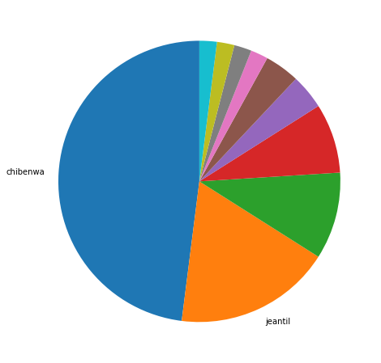
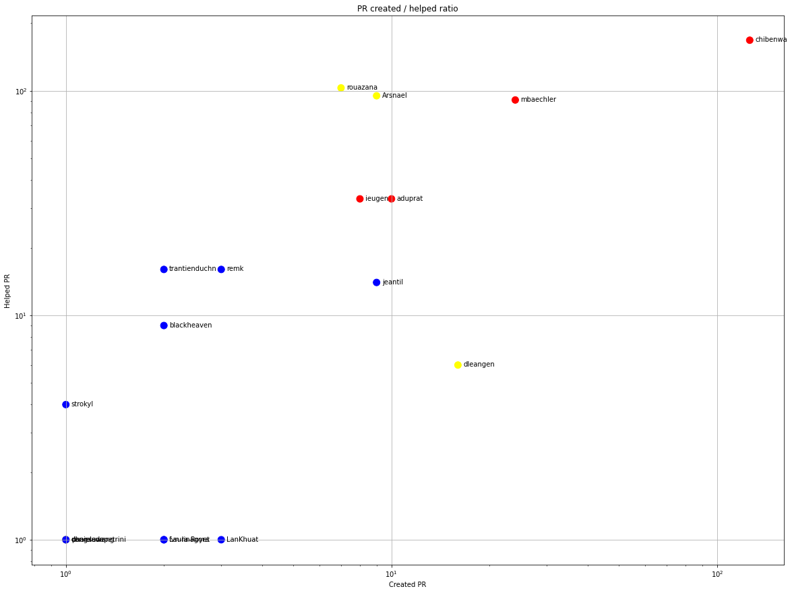
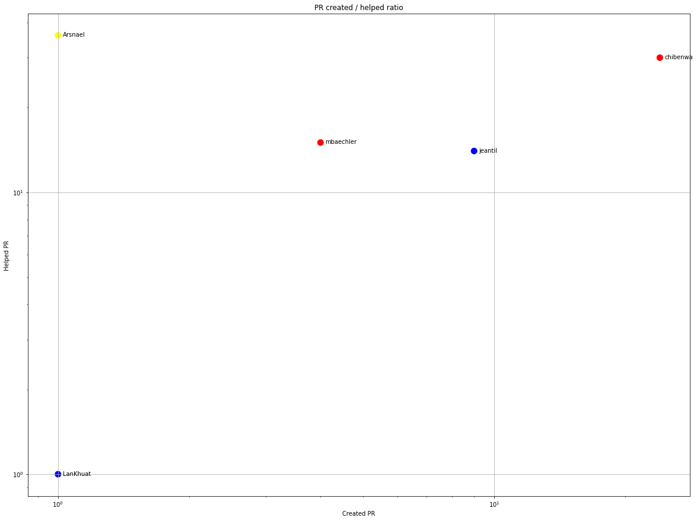
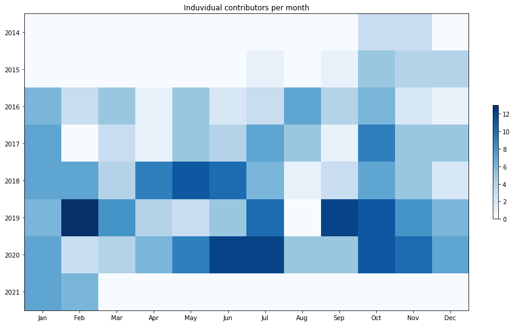
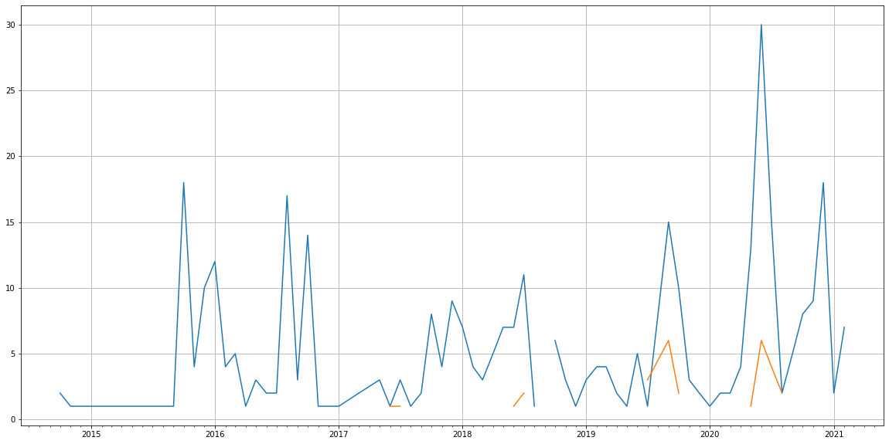
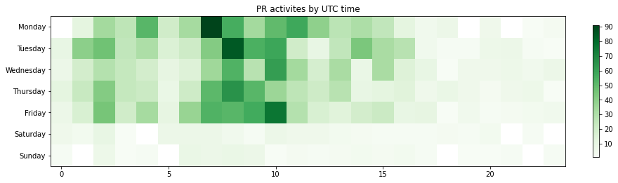

Latest record from the dataset:

<table border="1" class="dataframe">
  <thead>
    <tr style="text-align: right;">
      <th></th>
      <th>org</th>
      <th>repo</th>
      <th>type</th>
      <th>identifier</th>
      <th>subidentifier</th>
      <th>date</th>
      <th>author</th>
      <th>owner</th>
      <th>project</th>
    </tr>
  </thead>
  <tbody>
    <tr>
      <th>2513</th>
      <td>apache</td>
      <td>james-project</td>
      <td>PR_CREATED</td>
      <td>294</td>
      <td>NaN</td>
      <td>2021-02-14 08:42:03+00:00</td>
      <td>chibenwa</td>
      <td>chibenwa</td>
      <td>james</td>
    </tr>
  </tbody>
</table>

# Github Contributions per user

<table border="1" class="dataframe">
  <thead>
    <tr style="text-align: right;">
      <th></th>
      <th>contributions</th>
    </tr>
    <tr>
      <th>author</th>
      <th></th>
    </tr>
  </thead>
  <tbody>
    <tr>
      <th>chibenwa</th>
      <td>627</td>
    </tr>
    <tr>
      <th>mbaechler</th>
      <td>204</td>
    </tr>
    <tr>
      <th>rouazana</th>
      <td>190</td>
    </tr>
    <tr>
      <th>Arsnael</th>
      <td>175</td>
    </tr>
    <tr>
      <th>ieugen</th>
      <td>60</td>
    </tr>
    <tr>
      <th>aduprat</th>
      <td>49</td>
    </tr>
    <tr>
      <th>jeantil</th>
      <td>45</td>
    </tr>
    <tr>
      <th>dleangen</th>
      <td>40</td>
    </tr>
    <tr>
      <th>asfgit</th>
      <td>33</td>
    </tr>
    <tr>
      <th>trantienduchn</th>
      <td>20</td>
    </tr>
  </tbody>
</table>

## Contributors per participations in PRs which are not created by self (helping PRs)

<table border="1" class="dataframe">
  <thead>
    <tr style="text-align: right;">
      <th></th>
      <th>identifier</th>
    </tr>
    <tr>
      <th>author</th>
      <th></th>
    </tr>
  </thead>
  <tbody>
    <tr>
      <th>chibenwa</th>
      <td>168</td>
    </tr>
    <tr>
      <th>rouazana</th>
      <td>103</td>
    </tr>
    <tr>
      <th>Arsnael</th>
      <td>95</td>
    </tr>
    <tr>
      <th>mbaechler</th>
      <td>91</td>
    </tr>
    <tr>
      <th>aduprat</th>
      <td>33</td>
    </tr>
    <tr>
      <th>ieugen</th>
      <td>33</td>
    </tr>
    <tr>
      <th>asfgit</th>
      <td>27</td>
    </tr>
    <tr>
      <th>remk</th>
      <td>16</td>
    </tr>
    <tr>
      <th>trantienduchn</th>
      <td>16</td>
    </tr>
    <tr>
      <th>jeantil</th>
      <td>14</td>
    </tr>
    <tr>
      <th>blackheaven</th>
      <td>9</td>
    </tr>
    <tr>
      <th>chiominto78</th>
      <td>6</td>
    </tr>
    <tr>
      <th>dleangen</th>
      <td>6</td>
    </tr>
    <tr>
      <th>strokyl</th>
      <td>4</td>
    </tr>
    <tr>
      <th>quynhn</th>
      <td>3</td>
    </tr>
    <tr>
      <th>ok2c</th>
      <td>3</td>
    </tr>
    <tr>
      <th>nvduc91</th>
      <td>2</td>
    </tr>
    <tr>
      <th>gmcdonald</th>
      <td>2</td>
    </tr>
    <tr>
      <th>hoangdat</th>
      <td>2</td>
    </tr>
    <tr>
      <th>LanKhuat</th>
      <td>1</td>
    </tr>
  </tbody>
</table>

## Contributors per participations in any PRs

<table border="1" class="dataframe">
  <thead>
    <tr style="text-align: right;">
      <th></th>
      <th>identifier</th>
    </tr>
    <tr>
      <th>author</th>
      <th></th>
    </tr>
  </thead>
  <tbody>
    <tr>
      <th>chibenwa</th>
      <td>254</td>
    </tr>
    <tr>
      <th>rouazana</th>
      <td>110</td>
    </tr>
    <tr>
      <th>mbaechler</th>
      <td>107</td>
    </tr>
    <tr>
      <th>Arsnael</th>
      <td>103</td>
    </tr>
    <tr>
      <th>ieugen</th>
      <td>41</td>
    </tr>
    <tr>
      <th>aduprat</th>
      <td>39</td>
    </tr>
    <tr>
      <th>asfgit</th>
      <td>27</td>
    </tr>
    <tr>
      <th>jeantil</th>
      <td>23</td>
    </tr>
    <tr>
      <th>dleangen</th>
      <td>22</td>
    </tr>
    <tr>
      <th>remk</th>
      <td>19</td>
    </tr>
    <tr>
      <th>trantienduchn</th>
      <td>18</td>
    </tr>
    <tr>
      <th>nstdio</th>
      <td>13</td>
    </tr>
    <tr>
      <th>blackheaven</th>
      <td>11</td>
    </tr>
    <tr>
      <th>provirus</th>
      <td>7</td>
    </tr>
    <tr>
      <th>chiominto78</th>
      <td>6</td>
    </tr>
    <tr>
      <th>apptaro</th>
      <td>6</td>
    </tr>
    <tr>
      <th>strokyl</th>
      <td>5</td>
    </tr>
    <tr>
      <th>aasaru</th>
      <td>5</td>
    </tr>
    <tr>
      <th>jtconsol</th>
      <td>5</td>
    </tr>
    <tr>
      <th>randymo</th>
      <td>4</td>
    </tr>
  </tbody>
</table>

# Bus factor (number of contributors responsible for the 50% of the prs) from last half year

## Contributors until the half of the all contributions

<table border="1" class="dataframe">
  <thead>
    <tr style="text-align: right;">
      <th></th>
      <th>author</th>
      <th>identifier</th>
      <th>cs</th>
      <th>ratio</th>
    </tr>
  </thead>
  <tbody>
    <tr>
      <th>0</th>
      <td>chibenwa</td>
      <td>24</td>
      <td>24</td>
      <td>48.0</td>
    </tr>
  </tbody>
</table>

## Pony number (bus factor)

    2

## Dev power (All the contributions in the ration of the top contributor)

    2.083333333333333

    

    

## People with created PRs > reviewed/commented PRS

    

    

## Same graph with focusing to the last 6 month

Only contributors with both created pr and helped pr visible

    

    

# Number of individual contributors per month

Number of different Github users who either created PR, commented PR, added review to a PR

Note: only events from apache/hadoop-ozone repository are included. Earlier PRs/comments are not here.

    

    

# Number of PRs closed/created per month

    /usr/lib/python3.9/site-packages/pandas/core/arrays/datetimes.py:1101: UserWarning: Converting to PeriodArray/Index representation will drop timezone information.
      warnings.warn(

    

    

# PR activity heatmap

    

    

