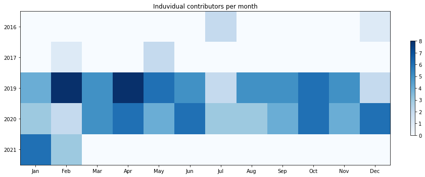

Latest record from the dataset:

<table border="1" class="dataframe">
  <thead>
    <tr style="text-align: right;">
      <th></th>
      <th>org</th>
      <th>repo</th>
      <th>type</th>
      <th>identifier</th>
      <th>subidentifier</th>
      <th>date</th>
      <th>author</th>
      <th>owner</th>
      <th>project</th>
    </tr>
  </thead>
  <tbody>
    <tr>
      <th>526</th>
      <td>apache</td>
      <td>jclouds</td>
      <td>PR_COMMENTED</td>
      <td>91</td>
      <td>NaN</td>
      <td>2021-02-12 14:20:52+00:00</td>
      <td>gurkerl83</td>
      <td>gurkerl83</td>
      <td>jclouds</td>
    </tr>
  </tbody>
</table>

# Github Contributions per user

<table border="1" class="dataframe">
  <thead>
    <tr style="text-align: right;">
      <th></th>
      <th>contributions</th>
    </tr>
    <tr>
      <th>author</th>
      <th></th>
    </tr>
  </thead>
  <tbody>
    <tr>
      <th>nacx</th>
      <td>164</td>
    </tr>
    <tr>
      <th>gaul</th>
      <td>116</td>
    </tr>
    <tr>
      <th>demobox</th>
      <td>21</td>
    </tr>
    <tr>
      <th>jclouds-commentator</th>
      <td>10</td>
    </tr>
    <tr>
      <th>geomacy</th>
      <td>8</td>
    </tr>
    <tr>
      <th>gurkerl83</th>
      <td>4</td>
    </tr>
    <tr>
      <th>yhilem</th>
      <td>3</td>
    </tr>
    <tr>
      <th>ahgittin</th>
      <td>2</td>
    </tr>
    <tr>
      <th>gmcdonald</th>
      <td>2</td>
    </tr>
    <tr>
      <th>asfgit</th>
      <td>1</td>
    </tr>
  </tbody>
</table>

## Contributors per participations in PRs which are not created by self (helping PRs)

<table border="1" class="dataframe">
  <thead>
    <tr style="text-align: right;">
      <th></th>
      <th>identifier</th>
    </tr>
    <tr>
      <th>author</th>
      <th></th>
    </tr>
  </thead>
  <tbody>
    <tr>
      <th>nacx</th>
      <td>61</td>
    </tr>
    <tr>
      <th>gaul</th>
      <td>49</td>
    </tr>
    <tr>
      <th>demobox</th>
      <td>10</td>
    </tr>
    <tr>
      <th>jclouds-commentator</th>
      <td>6</td>
    </tr>
    <tr>
      <th>geomacy</th>
      <td>2</td>
    </tr>
    <tr>
      <th>gurkerl83</th>
      <td>2</td>
    </tr>
    <tr>
      <th>ahgittin</th>
      <td>1</td>
    </tr>
    <tr>
      <th>asfgit</th>
      <td>1</td>
    </tr>
    <tr>
      <th>cdancy</th>
      <td>1</td>
    </tr>
    <tr>
      <th>christ</th>
      <td>1</td>
    </tr>
    <tr>
      <th>gmcdonald</th>
      <td>1</td>
    </tr>
    <tr>
      <th>hubot</th>
      <td>1</td>
    </tr>
    <tr>
      <th>nictas</th>
      <td>1</td>
    </tr>
    <tr>
      <th>pimuzzo</th>
      <td>1</td>
    </tr>
    <tr>
      <th>sergicastro</th>
      <td>1</td>
    </tr>
    <tr>
      <th>yhilem</th>
      <td>1</td>
    </tr>
  </tbody>
</table>

## Contributors per participations in any PRs

<table border="1" class="dataframe">
  <thead>
    <tr style="text-align: right;">
      <th></th>
      <th>identifier</th>
    </tr>
    <tr>
      <th>author</th>
      <th></th>
    </tr>
  </thead>
  <tbody>
    <tr>
      <th>nacx</th>
      <td>72</td>
    </tr>
    <tr>
      <th>gaul</th>
      <td>61</td>
    </tr>
    <tr>
      <th>demobox</th>
      <td>15</td>
    </tr>
    <tr>
      <th>gurkerl83</th>
      <td>11</td>
    </tr>
    <tr>
      <th>roded</th>
      <td>8</td>
    </tr>
    <tr>
      <th>coheigea</th>
      <td>7</td>
    </tr>
    <tr>
      <th>danielestevez</th>
      <td>7</td>
    </tr>
    <tr>
      <th>oflebbe</th>
      <td>6</td>
    </tr>
    <tr>
      <th>jclouds-commentator</th>
      <td>6</td>
    </tr>
    <tr>
      <th>ak58588</th>
      <td>4</td>
    </tr>
    <tr>
      <th>xavierb-amadeus</th>
      <td>4</td>
    </tr>
    <tr>
      <th>JnRouvignac</th>
      <td>4</td>
    </tr>
    <tr>
      <th>pimuzzo</th>
      <td>3</td>
    </tr>
    <tr>
      <th>felfert</th>
      <td>3</td>
    </tr>
    <tr>
      <th>trevorflanagan</th>
      <td>3</td>
    </tr>
    <tr>
      <th>geomacy</th>
      <td>3</td>
    </tr>
    <tr>
      <th>sergicastro</th>
      <td>2</td>
    </tr>
    <tr>
      <th>neonbunny</th>
      <td>2</td>
    </tr>
    <tr>
      <th>trantienduchn</th>
      <td>1</td>
    </tr>
    <tr>
      <th>radito3</th>
      <td>1</td>
    </tr>
  </tbody>
</table>

# Bus factor (number of contributors responsible for the 50% of the prs) from last half year

## Contributors until the half of the all contributions

<table border="1" class="dataframe">
  <thead>
    <tr style="text-align: right;">
      <th></th>
      <th>author</th>
      <th>identifier</th>
      <th>cs</th>
      <th>ratio</th>
    </tr>
  </thead>
  <tbody>
    <tr>
      <th>0</th>
      <td>gurkerl83</td>
      <td>9</td>
      <td>9</td>
      <td>40.909091</td>
    </tr>
  </tbody>
</table>

## Pony number (bus factor)

    2

## Dev power (All the contributions in the ration of the top contributor)

    2.4444444444444446

    

    

## People with created PRs > reviewed/commented PRS

    

    

## Same graph with focusing to the last 6 month

Only contributors with both created pr and helped pr visible

    

    

# Number of individual contributors per month

Number of different Github users who either created PR, commented PR, added review to a PR

Note: only events from apache/hadoop-ozone repository are included. Earlier PRs/comments are not here.

    

    

# Number of PRs closed/created per month

    /usr/lib/python3.9/site-packages/pandas/core/arrays/datetimes.py:1101: UserWarning: Converting to PeriodArray/Index representation will drop timezone information.
      warnings.warn(

    

    

# PR activity heatmap

    

    

