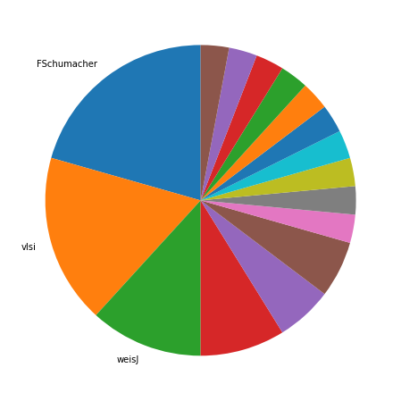
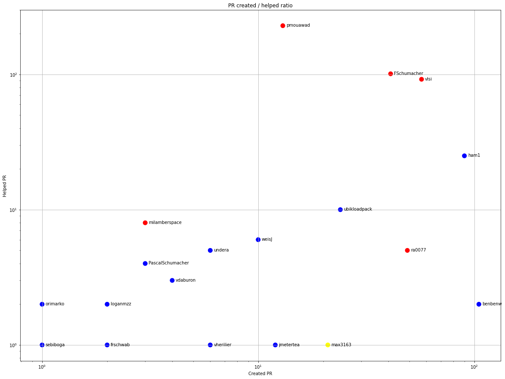
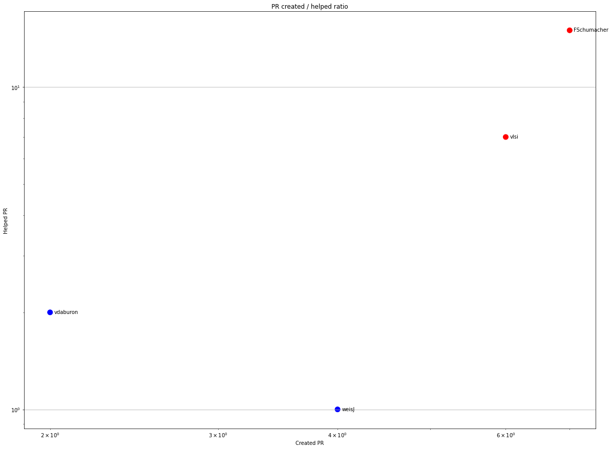
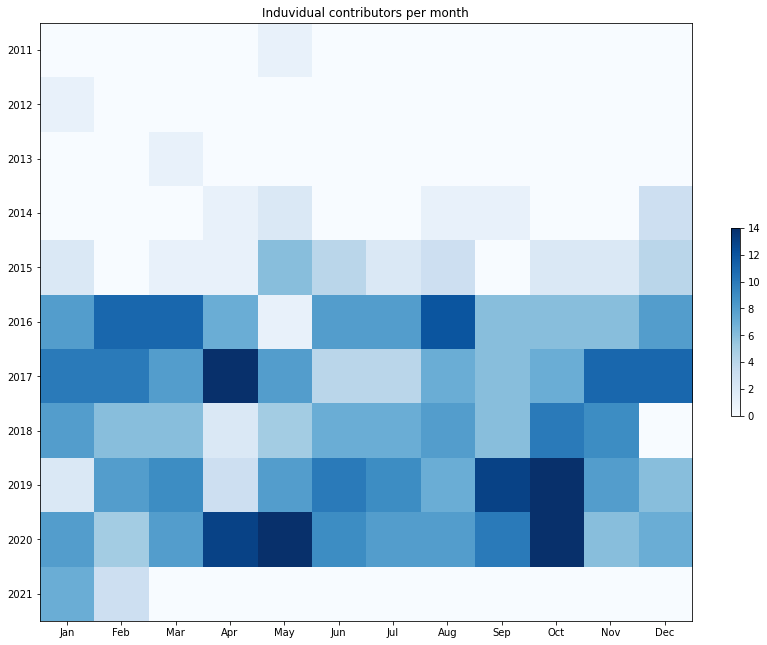
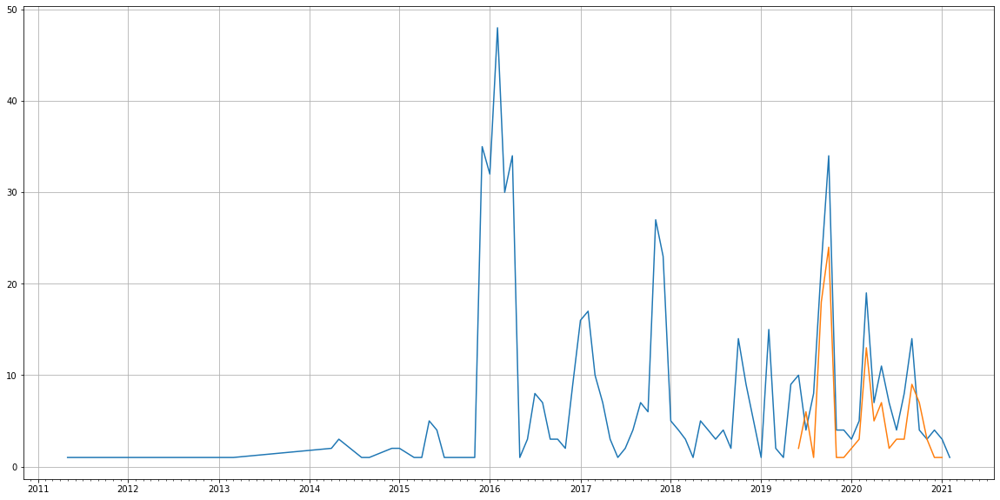
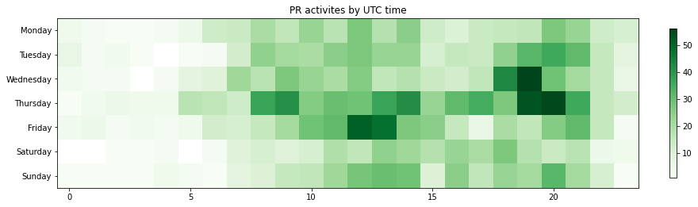

Latest record from the dataset:

<table border="1" class="dataframe">
  <thead>
    <tr style="text-align: right;">
      <th></th>
      <th>org</th>
      <th>repo</th>
      <th>type</th>
      <th>identifier</th>
      <th>subidentifier</th>
      <th>date</th>
      <th>author</th>
      <th>owner</th>
      <th>project</th>
    </tr>
  </thead>
  <tbody>
    <tr>
      <th>2662</th>
      <td>apache</td>
      <td>jmeter</td>
      <td>PR_COMMENTED</td>
      <td>643</td>
      <td>NaN</td>
      <td>2021-02-13 09:35:26+00:00</td>
      <td>FSchumacher</td>
      <td>njkuzas</td>
      <td>jmeter</td>
    </tr>
  </tbody>
</table>

# Github Contributions per user

<table border="1" class="dataframe">
  <thead>
    <tr style="text-align: right;">
      <th></th>
      <th>contributions</th>
    </tr>
    <tr>
      <th>author</th>
      <th></th>
    </tr>
  </thead>
  <tbody>
    <tr>
      <th>pmouawad</th>
      <td>490</td>
    </tr>
    <tr>
      <th>vlsi</th>
      <td>310</td>
    </tr>
    <tr>
      <th>FSchumacher</th>
      <td>154</td>
    </tr>
    <tr>
      <th>codecov-io</th>
      <td>151</td>
    </tr>
    <tr>
      <th>ham1</th>
      <td>45</td>
    </tr>
    <tr>
      <th>ubikloadpack</th>
      <td>17</td>
    </tr>
    <tr>
      <th>weisJ</th>
      <td>16</td>
    </tr>
    <tr>
      <th>milamberspace</th>
      <td>15</td>
    </tr>
    <tr>
      <th>frschwab</th>
      <td>13</td>
    </tr>
    <tr>
      <th>AbhaySinghNec</th>
      <td>13</td>
    </tr>
  </tbody>
</table>

## Contributors per participations in PRs which are not created by self (helping PRs)

<table border="1" class="dataframe">
  <thead>
    <tr style="text-align: right;">
      <th></th>
      <th>identifier</th>
    </tr>
    <tr>
      <th>author</th>
      <th></th>
    </tr>
  </thead>
  <tbody>
    <tr>
      <th>pmouawad</th>
      <td>229</td>
    </tr>
    <tr>
      <th>codecov-io</th>
      <td>151</td>
    </tr>
    <tr>
      <th>FSchumacher</th>
      <td>101</td>
    </tr>
    <tr>
      <th>vlsi</th>
      <td>92</td>
    </tr>
    <tr>
      <th>ham1</th>
      <td>25</td>
    </tr>
    <tr>
      <th>ubikloadpack</th>
      <td>10</td>
    </tr>
    <tr>
      <th>milamberspace</th>
      <td>8</td>
    </tr>
    <tr>
      <th>weisJ</th>
      <td>6</td>
    </tr>
    <tr>
      <th>undera</th>
      <td>5</td>
    </tr>
    <tr>
      <th>ra0077</th>
      <td>5</td>
    </tr>
    <tr>
      <th>PascalSchumacher</th>
      <td>4</td>
    </tr>
    <tr>
      <th>Wyatts</th>
      <td>4</td>
    </tr>
    <tr>
      <th>sebbASF</th>
      <td>3</td>
    </tr>
    <tr>
      <th>ljacqu</th>
      <td>3</td>
    </tr>
    <tr>
      <th>vdaburon</th>
      <td>3</td>
    </tr>
    <tr>
      <th>orimarko</th>
      <td>2</td>
    </tr>
    <tr>
      <th>loganmzz</th>
      <td>2</td>
    </tr>
    <tr>
      <th>AbhaySinghNec</th>
      <td>2</td>
    </tr>
    <tr>
      <th>benbenw</th>
      <td>2</td>
    </tr>
    <tr>
      <th>a-sure</th>
      <td>2</td>
    </tr>
  </tbody>
</table>

## Contributors per participations in any PRs

<table border="1" class="dataframe">
  <thead>
    <tr style="text-align: right;">
      <th></th>
      <th>identifier</th>
    </tr>
    <tr>
      <th>author</th>
      <th></th>
    </tr>
  </thead>
  <tbody>
    <tr>
      <th>pmouawad</th>
      <td>242</td>
    </tr>
    <tr>
      <th>codecov-io</th>
      <td>151</td>
    </tr>
    <tr>
      <th>vlsi</th>
      <td>149</td>
    </tr>
    <tr>
      <th>FSchumacher</th>
      <td>142</td>
    </tr>
    <tr>
      <th>ham1</th>
      <td>115</td>
    </tr>
    <tr>
      <th>benbenw</th>
      <td>107</td>
    </tr>
    <tr>
      <th>ra0077</th>
      <td>54</td>
    </tr>
    <tr>
      <th>ubikloadpack</th>
      <td>34</td>
    </tr>
    <tr>
      <th>max3163</th>
      <td>22</td>
    </tr>
    <tr>
      <th>woonsan</th>
      <td>20</td>
    </tr>
    <tr>
      <th>weisJ</th>
      <td>16</td>
    </tr>
    <tr>
      <th>jmetertea</th>
      <td>13</td>
    </tr>
    <tr>
      <th>artem-fedorov</th>
      <td>11</td>
    </tr>
    <tr>
      <th>milamberspace</th>
      <td>11</td>
    </tr>
    <tr>
      <th>undera</th>
      <td>11</td>
    </tr>
    <tr>
      <th>PascalSchumacher</th>
      <td>7</td>
    </tr>
    <tr>
      <th>vdaburon</th>
      <td>7</td>
    </tr>
    <tr>
      <th>vherilier</th>
      <td>7</td>
    </tr>
    <tr>
      <th>Mithrandir0407</th>
      <td>5</td>
    </tr>
    <tr>
      <th>dzmitrykashlach</th>
      <td>5</td>
    </tr>
  </tbody>
</table>

# Bus factor (number of contributors responsible for the 50% of the prs) from last half year

## Contributors until the half of the all contributions

<table border="1" class="dataframe">
  <thead>
    <tr style="text-align: right;">
      <th></th>
      <th>author</th>
      <th>identifier</th>
      <th>cs</th>
      <th>ratio</th>
    </tr>
  </thead>
  <tbody>
    <tr>
      <th>0</th>
      <td>FSchumacher</td>
      <td>7</td>
      <td>7</td>
      <td>20.588235</td>
    </tr>
    <tr>
      <th>1</th>
      <td>vlsi</td>
      <td>6</td>
      <td>13</td>
      <td>17.647059</td>
    </tr>
  </tbody>
</table>

## Pony number (bus factor)

    3

## Dev power (All the contributions in the ration of the top contributor)

    4.857142857142857

    

    

## People with created PRs > reviewed/commented PRS

    

    

## Same graph with focusing to the last 6 month

Only contributors with both created pr and helped pr visible

    

    

# Number of individual contributors per month

Number of different Github users who either created PR, commented PR, added review to a PR

Note: only events from apache/hadoop-ozone repository are included. Earlier PRs/comments are not here.

    

    

# Number of PRs closed/created per month

    /usr/lib/python3.9/site-packages/pandas/core/arrays/datetimes.py:1101: UserWarning: Converting to PeriodArray/Index representation will drop timezone information.
      warnings.warn(

    

    

# PR activity heatmap

    

    

