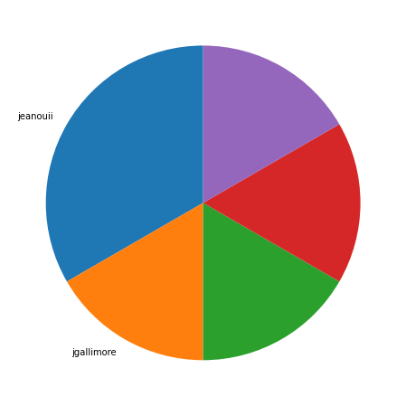
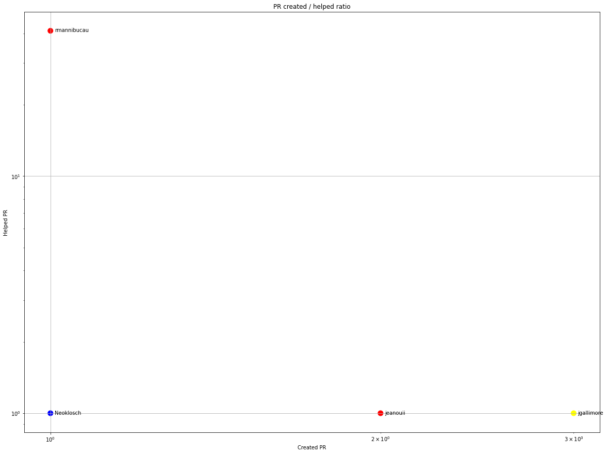
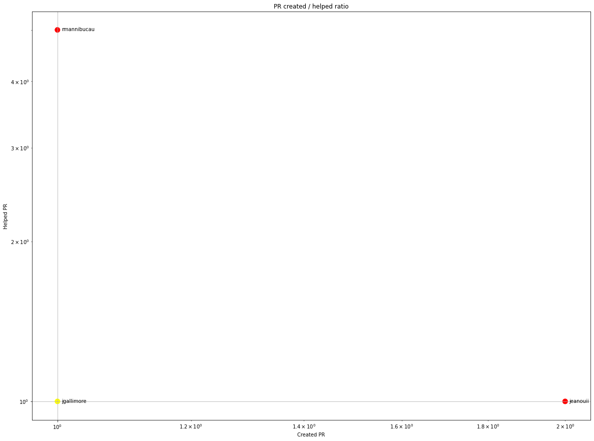
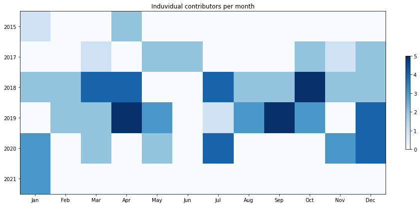
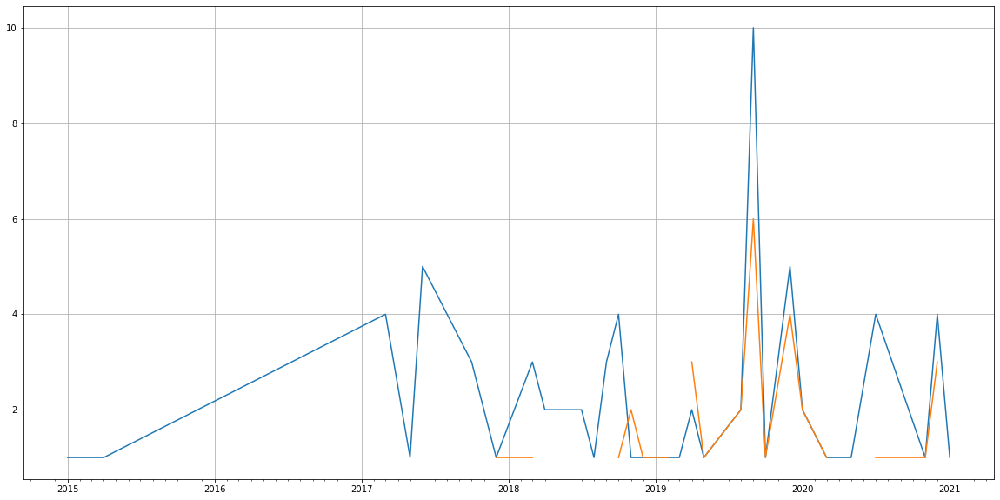
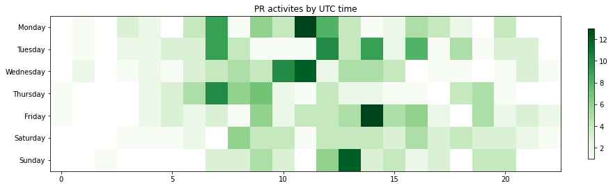

Latest record from the dataset:

<table border="1" class="dataframe">
  <thead>
    <tr style="text-align: right;">
      <th></th>
      <th>org</th>
      <th>repo</th>
      <th>type</th>
      <th>identifier</th>
      <th>subidentifier</th>
      <th>date</th>
      <th>author</th>
      <th>owner</th>
      <th>project</th>
    </tr>
  </thead>
  <tbody>
    <tr>
      <th>438</th>
      <td>apache</td>
      <td>johnzon</td>
      <td>PR_COMMENTED</td>
      <td>73</td>
      <td>NaN</td>
      <td>2021-01-25 12:40:52+00:00</td>
      <td>reta</td>
      <td>reta</td>
      <td>johnzon</td>
    </tr>
  </tbody>
</table>

# Github Contributions per user

<table border="1" class="dataframe">
  <thead>
    <tr style="text-align: right;">
      <th></th>
      <th>contributions</th>
    </tr>
    <tr>
      <th>author</th>
      <th></th>
    </tr>
  </thead>
  <tbody>
    <tr>
      <th>rmannibucau</th>
      <td>158</td>
    </tr>
    <tr>
      <th>asfgit</th>
      <td>16</td>
    </tr>
    <tr>
      <th>struberg</th>
      <td>8</td>
    </tr>
    <tr>
      <th>derekm</th>
      <td>5</td>
    </tr>
    <tr>
      <th>cyberphone</th>
      <td>3</td>
    </tr>
    <tr>
      <th>avermeer</th>
      <td>2</td>
    </tr>
    <tr>
      <th>cesarhernandezgt</th>
      <td>2</td>
    </tr>
    <tr>
      <th>jeanouii</th>
      <td>2</td>
    </tr>
    <tr>
      <th>jgallimore</th>
      <td>2</td>
    </tr>
    <tr>
      <th>salyh</th>
      <td>2</td>
    </tr>
  </tbody>
</table>

## Contributors per participations in PRs which are not created by self (helping PRs)

<table border="1" class="dataframe">
  <thead>
    <tr style="text-align: right;">
      <th></th>
      <th>identifier</th>
    </tr>
    <tr>
      <th>author</th>
      <th></th>
    </tr>
  </thead>
  <tbody>
    <tr>
      <th>rmannibucau</th>
      <td>41</td>
    </tr>
    <tr>
      <th>asfgit</th>
      <td>16</td>
    </tr>
    <tr>
      <th>struberg</th>
      <td>4</td>
    </tr>
    <tr>
      <th>Neoklosch</th>
      <td>1</td>
    </tr>
    <tr>
      <th>avermeer</th>
      <td>1</td>
    </tr>
    <tr>
      <th>cesarhernandezgt</th>
      <td>1</td>
    </tr>
    <tr>
      <th>cyberphone</th>
      <td>1</td>
    </tr>
    <tr>
      <th>derekm</th>
      <td>1</td>
    </tr>
    <tr>
      <th>jeanouii</th>
      <td>1</td>
    </tr>
    <tr>
      <th>jgallimore</th>
      <td>1</td>
    </tr>
    <tr>
      <th>salyh</th>
      <td>1</td>
    </tr>
  </tbody>
</table>

## Contributors per participations in any PRs

<table border="1" class="dataframe">
  <thead>
    <tr style="text-align: right;">
      <th></th>
      <th>identifier</th>
    </tr>
    <tr>
      <th>author</th>
      <th></th>
    </tr>
  </thead>
  <tbody>
    <tr>
      <th>rmannibucau</th>
      <td>42</td>
    </tr>
    <tr>
      <th>asfgit</th>
      <td>16</td>
    </tr>
    <tr>
      <th>mkarg</th>
      <td>12</td>
    </tr>
    <tr>
      <th>rotty3000</th>
      <td>8</td>
    </tr>
    <tr>
      <th>jwcarman</th>
      <td>5</td>
    </tr>
    <tr>
      <th>struberg</th>
      <td>4</td>
    </tr>
    <tr>
      <th>stefanseifert</th>
      <td>4</td>
    </tr>
    <tr>
      <th>jgallimore</th>
      <td>4</td>
    </tr>
    <tr>
      <th>amoscatelli</th>
      <td>4</td>
    </tr>
    <tr>
      <th>jeanouii</th>
      <td>3</td>
    </tr>
    <tr>
      <th>bcluap</th>
      <td>3</td>
    </tr>
    <tr>
      <th>leadpony</th>
      <td>3</td>
    </tr>
    <tr>
      <th>elexx</th>
      <td>3</td>
    </tr>
    <tr>
      <th>danielsoro</th>
      <td>2</td>
    </tr>
    <tr>
      <th>jungm</th>
      <td>2</td>
    </tr>
    <tr>
      <th>Neoklosch</th>
      <td>2</td>
    </tr>
    <tr>
      <th>premsangeeth</th>
      <td>1</td>
    </tr>
    <tr>
      <th>reta</th>
      <td>1</td>
    </tr>
    <tr>
      <th>salyh</th>
      <td>1</td>
    </tr>
    <tr>
      <th>simonetripodi</th>
      <td>1</td>
    </tr>
  </tbody>
</table>

# Bus factor (number of contributors responsible for the 50% of the prs) from last half year

## Contributors until the half of the all contributions

<table border="1" class="dataframe">
  <thead>
    <tr style="text-align: right;">
      <th></th>
      <th>author</th>
      <th>identifier</th>
      <th>cs</th>
      <th>ratio</th>
    </tr>
  </thead>
  <tbody>
    <tr>
      <th>0</th>
      <td>jeanouii</td>
      <td>2</td>
      <td>2</td>
      <td>33.333333</td>
    </tr>
  </tbody>
</table>

## Pony number (bus factor)

    2

## Dev power (All the contributions in the ration of the top contributor)

    3.0

    

    

## People with created PRs > reviewed/commented PRS

    

    

## Same graph with focusing to the last 6 month

Only contributors with both created pr and helped pr visible

    

    

# Number of individual contributors per month

Number of different Github users who either created PR, commented PR, added review to a PR

Note: only events from apache/hadoop-ozone repository are included. Earlier PRs/comments are not here.

    

    

# Number of PRs closed/created per month

    /usr/lib/python3.9/site-packages/pandas/core/arrays/datetimes.py:1101: UserWarning: Converting to PeriodArray/Index representation will drop timezone information.
      warnings.warn(

    

    

# PR activity heatmap

    

    

