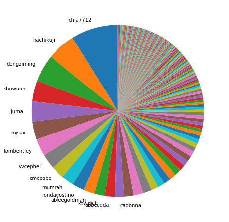
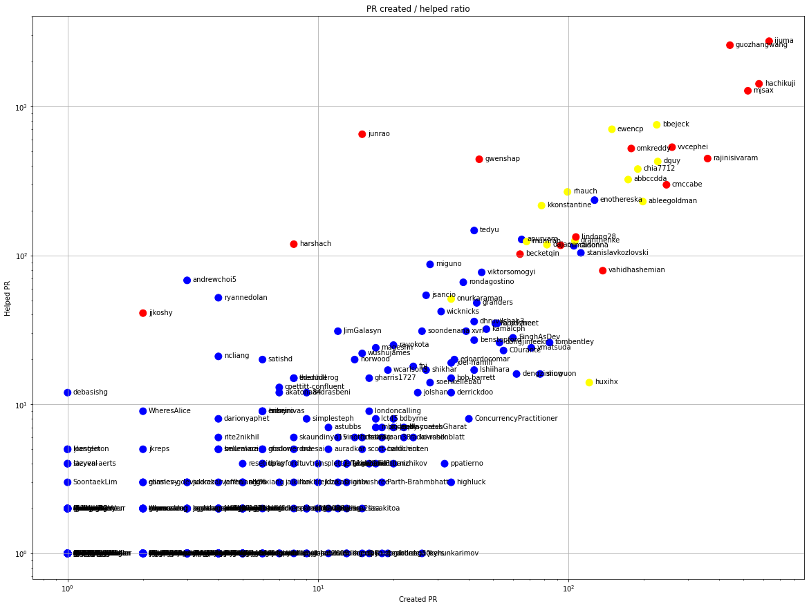
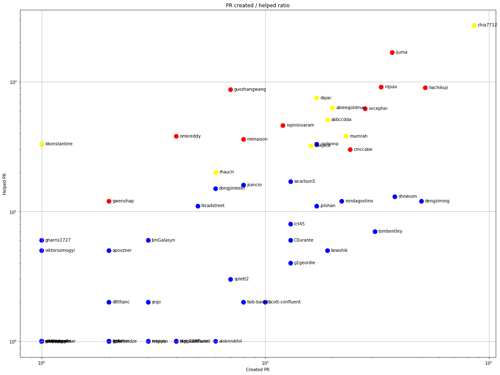
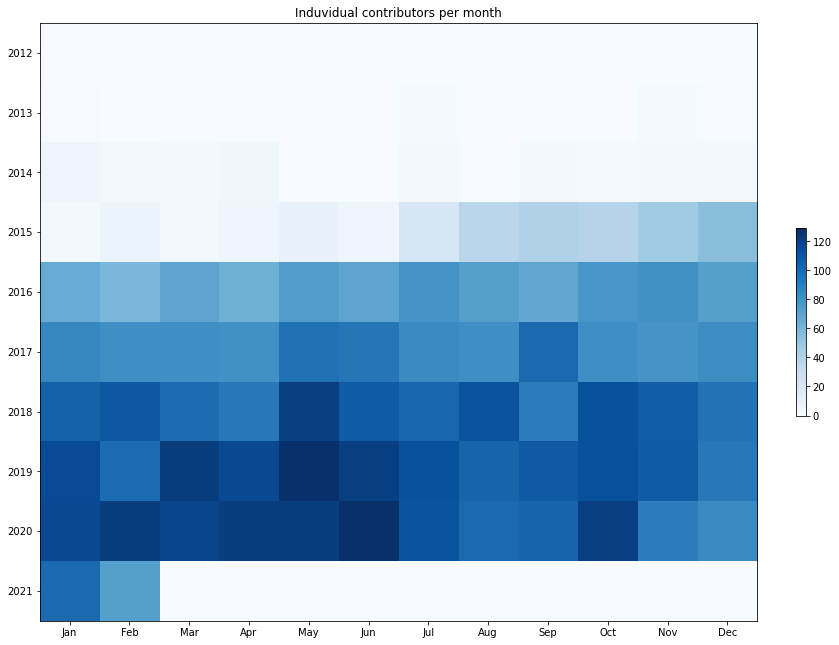
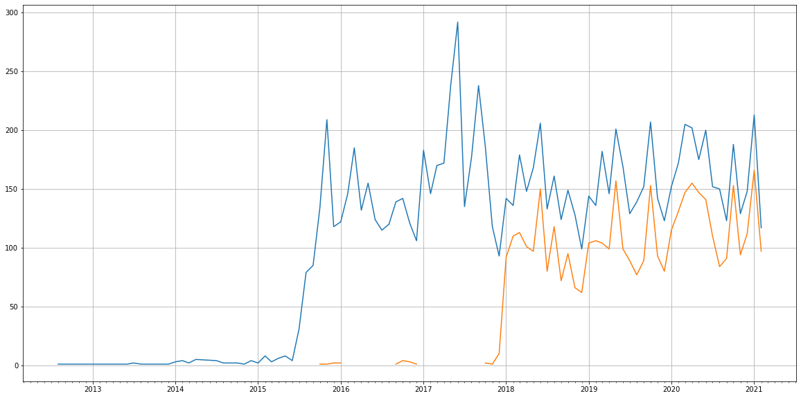
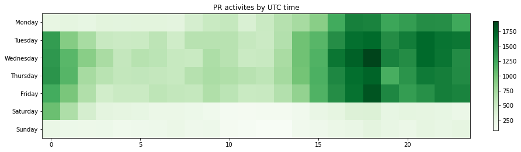

Latest record from the dataset:

<table border="1" class="dataframe">
  <thead>
    <tr style="text-align: right;">
      <th></th>
      <th>org</th>
      <th>repo</th>
      <th>type</th>
      <th>identifier</th>
      <th>subidentifier</th>
      <th>date</th>
      <th>author</th>
      <th>owner</th>
      <th>project</th>
    </tr>
  </thead>
  <tbody>
    <tr>
      <th>977</th>
      <td>apache</td>
      <td>kafka</td>
      <td>PR_REVIEW_APPROVED</td>
      <td>10123</td>
      <td>NaN</td>
      <td>2021-02-14 07:25:40+00:00</td>
      <td>chia7712</td>
      <td>ijuma</td>
      <td>kafka</td>
    </tr>
  </tbody>
</table>

# Github Contributions per user

<table border="1" class="dataframe">
  <thead>
    <tr style="text-align: right;">
      <th></th>
      <th>contributions</th>
    </tr>
    <tr>
      <th>author</th>
      <th></th>
    </tr>
  </thead>
  <tbody>
    <tr>
      <th>asfbot</th>
      <td>12455</td>
    </tr>
    <tr>
      <th>ijuma</th>
      <td>7964</td>
    </tr>
    <tr>
      <th>guozhangwang</th>
      <td>7338</td>
    </tr>
    <tr>
      <th>hachikuji</th>
      <td>5663</td>
    </tr>
    <tr>
      <th>mjsax</th>
      <td>4852</td>
    </tr>
    <tr>
      <th>asfgit</th>
      <td>3529</td>
    </tr>
    <tr>
      <th>bbejeck</th>
      <td>2253</td>
    </tr>
    <tr>
      <th>vvcephei</th>
      <td>2162</td>
    </tr>
    <tr>
      <th>junrao</th>
      <td>2016</td>
    </tr>
    <tr>
      <th>cmccabe</th>
      <td>1418</td>
    </tr>
  </tbody>
</table>

## Contributors per participations in PRs which are not created by self (helping PRs)

<table border="1" class="dataframe">
  <thead>
    <tr style="text-align: right;">
      <th></th>
      <th>identifier</th>
    </tr>
    <tr>
      <th>author</th>
      <th></th>
    </tr>
  </thead>
  <tbody>
    <tr>
      <th>ijuma</th>
      <td>2740</td>
    </tr>
    <tr>
      <th>guozhangwang</th>
      <td>2577</td>
    </tr>
    <tr>
      <th>asfbot</th>
      <td>1440</td>
    </tr>
    <tr>
      <th>hachikuji</th>
      <td>1419</td>
    </tr>
    <tr>
      <th>mjsax</th>
      <td>1274</td>
    </tr>
    <tr>
      <th>bbejeck</th>
      <td>753</td>
    </tr>
    <tr>
      <th>ewencp</th>
      <td>703</td>
    </tr>
    <tr>
      <th>asfgit</th>
      <td>670</td>
    </tr>
    <tr>
      <th>junrao</th>
      <td>651</td>
    </tr>
    <tr>
      <th>vvcephei</th>
      <td>533</td>
    </tr>
    <tr>
      <th>omkreddy</th>
      <td>522</td>
    </tr>
    <tr>
      <th>rajinisivaram</th>
      <td>447</td>
    </tr>
    <tr>
      <th>gwenshap</th>
      <td>442</td>
    </tr>
    <tr>
      <th>dguy</th>
      <td>427</td>
    </tr>
    <tr>
      <th>chia7712</th>
      <td>380</td>
    </tr>
    <tr>
      <th>abbccdda</th>
      <td>323</td>
    </tr>
    <tr>
      <th>cmccabe</th>
      <td>298</td>
    </tr>
    <tr>
      <th>rhauch</th>
      <td>267</td>
    </tr>
    <tr>
      <th>enothereska</th>
      <td>235</td>
    </tr>
    <tr>
      <th>ableegoldman</th>
      <td>230</td>
    </tr>
  </tbody>
</table>

## Contributors per participations in any PRs

<table border="1" class="dataframe">
  <thead>
    <tr style="text-align: right;">
      <th></th>
      <th>identifier</th>
    </tr>
    <tr>
      <th>author</th>
      <th></th>
    </tr>
  </thead>
  <tbody>
    <tr>
      <th>ijuma</th>
      <td>3366</td>
    </tr>
    <tr>
      <th>guozhangwang</th>
      <td>3011</td>
    </tr>
    <tr>
      <th>hachikuji</th>
      <td>1992</td>
    </tr>
    <tr>
      <th>mjsax</th>
      <td>1794</td>
    </tr>
    <tr>
      <th>asfbot</th>
      <td>1440</td>
    </tr>
    <tr>
      <th>bbejeck</th>
      <td>978</td>
    </tr>
    <tr>
      <th>ewencp</th>
      <td>850</td>
    </tr>
    <tr>
      <th>rajinisivaram</th>
      <td>806</td>
    </tr>
    <tr>
      <th>vvcephei</th>
      <td>792</td>
    </tr>
    <tr>
      <th>omkreddy</th>
      <td>698</td>
    </tr>
    <tr>
      <th>asfgit</th>
      <td>670</td>
    </tr>
    <tr>
      <th>junrao</th>
      <td>666</td>
    </tr>
    <tr>
      <th>dguy</th>
      <td>654</td>
    </tr>
    <tr>
      <th>chia7712</th>
      <td>569</td>
    </tr>
    <tr>
      <th>cmccabe</th>
      <td>544</td>
    </tr>
    <tr>
      <th>abbccdda</th>
      <td>496</td>
    </tr>
    <tr>
      <th>gwenshap</th>
      <td>486</td>
    </tr>
    <tr>
      <th>ableegoldman</th>
      <td>428</td>
    </tr>
    <tr>
      <th>rhauch</th>
      <td>366</td>
    </tr>
    <tr>
      <th>enothereska</th>
      <td>362</td>
    </tr>
  </tbody>
</table>

# Bus factor (number of contributors responsible for the 50% of the prs) from last half year

## Contributors until the half of the all contributions

<table border="1" class="dataframe">
  <thead>
    <tr style="text-align: right;">
      <th></th>
      <th>author</th>
      <th>identifier</th>
      <th>cs</th>
      <th>ratio</th>
    </tr>
  </thead>
  <tbody>
    <tr>
      <th>0</th>
      <td>chia7712</td>
      <td>86</td>
      <td>86</td>
      <td>8.829569</td>
    </tr>
    <tr>
      <th>1</th>
      <td>hachikuji</td>
      <td>52</td>
      <td>138</td>
      <td>5.338809</td>
    </tr>
    <tr>
      <th>2</th>
      <td>dengziming</td>
      <td>50</td>
      <td>188</td>
      <td>5.133470</td>
    </tr>
    <tr>
      <th>3</th>
      <td>showuon</td>
      <td>38</td>
      <td>226</td>
      <td>3.901437</td>
    </tr>
    <tr>
      <th>4</th>
      <td>ijuma</td>
      <td>37</td>
      <td>263</td>
      <td>3.798768</td>
    </tr>
    <tr>
      <th>5</th>
      <td>mjsax</td>
      <td>33</td>
      <td>296</td>
      <td>3.388090</td>
    </tr>
    <tr>
      <th>6</th>
      <td>tombentley</td>
      <td>31</td>
      <td>327</td>
      <td>3.182752</td>
    </tr>
    <tr>
      <th>7</th>
      <td>vvcephei</td>
      <td>28</td>
      <td>355</td>
      <td>2.874743</td>
    </tr>
    <tr>
      <th>8</th>
      <td>cmccabe</td>
      <td>24</td>
      <td>379</td>
      <td>2.464066</td>
    </tr>
    <tr>
      <th>9</th>
      <td>mumrah</td>
      <td>23</td>
      <td>402</td>
      <td>2.361396</td>
    </tr>
    <tr>
      <th>10</th>
      <td>rondagostino</td>
      <td>22</td>
      <td>424</td>
      <td>2.258727</td>
    </tr>
    <tr>
      <th>11</th>
      <td>ableegoldman</td>
      <td>20</td>
      <td>444</td>
      <td>2.053388</td>
    </tr>
    <tr>
      <th>12</th>
      <td>kowshik</td>
      <td>19</td>
      <td>463</td>
      <td>1.950719</td>
    </tr>
    <tr>
      <th>13</th>
      <td>abbccdda</td>
      <td>19</td>
      <td>482</td>
      <td>1.950719</td>
    </tr>
  </tbody>
</table>

## Pony number (bus factor)

    15

## Dev power (All the contributions in the ration of the top contributor)

    11.325581395348838

    

    

## People with created PRs > reviewed/commented PRS

    

    

## Same graph with focusing to the last 6 month

Only contributors with both created pr and helped pr visible

    

    

# Number of individual contributors per month

Number of different Github users who either created PR, commented PR, added review to a PR

Note: only events from apache/hadoop-ozone repository are included. Earlier PRs/comments are not here.

    

    

# Number of PRs closed/created per month

    /usr/lib/python3.9/site-packages/pandas/core/arrays/datetimes.py:1101: UserWarning: Converting to PeriodArray/Index representation will drop timezone information.
      warnings.warn(

    

    

# PR activity heatmap

    

    

