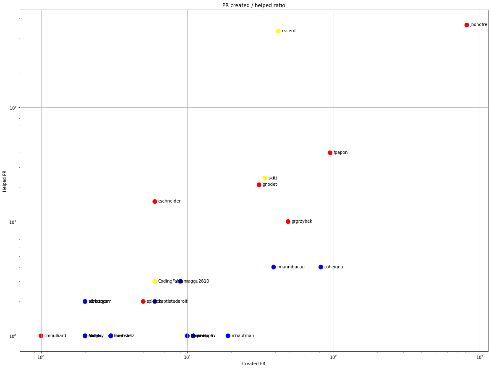

Latest record from the dataset:

<table border="1" class="dataframe">
  <thead>
    <tr style="text-align: right;">
      <th></th>
      <th>org</th>
      <th>repo</th>
      <th>type</th>
      <th>identifier</th>
      <th>subidentifier</th>
      <th>date</th>
      <th>author</th>
      <th>owner</th>
      <th>project</th>
    </tr>
  </thead>
  <tbody>
    <tr>
      <th>1225</th>
      <td>apache</td>
      <td>karaf</td>
      <td>PR_MERGED</td>
      <td>1295</td>
      <td>NaN</td>
      <td>2021-02-12 04:56:23+00:00</td>
      <td>jbonofre</td>
      <td>jbonofre</td>
      <td>karaf</td>
    </tr>
  </tbody>
</table>

# Github Contributions per user

<table border="1" class="dataframe">
  <thead>
    <tr style="text-align: right;">
      <th></th>
      <th>contributions</th>
    </tr>
    <tr>
      <th>author</th>
      <th></th>
    </tr>
  </thead>
  <tbody>
    <tr>
      <th>jbonofre</th>
      <td>1559</td>
    </tr>
    <tr>
      <th>oscerd</th>
      <td>487</td>
    </tr>
    <tr>
      <th>asfgit</th>
      <td>195</td>
    </tr>
    <tr>
      <th>fpapon</th>
      <td>76</td>
    </tr>
    <tr>
      <th>skitt</th>
      <td>41</td>
    </tr>
    <tr>
      <th>gnodet</th>
      <td>40</td>
    </tr>
    <tr>
      <th>cschneider</th>
      <td>38</td>
    </tr>
    <tr>
      <th>grgrzybek</th>
      <td>23</td>
    </tr>
    <tr>
      <th>ffang</th>
      <td>9</td>
    </tr>
    <tr>
      <th>ANierbeck</th>
      <td>9</td>
    </tr>
  </tbody>
</table>

## Contributors per participations in PRs which are not created by self (helping PRs)

<table border="1" class="dataframe">
  <thead>
    <tr style="text-align: right;">
      <th></th>
      <th>identifier</th>
    </tr>
    <tr>
      <th>author</th>
      <th></th>
    </tr>
  </thead>
  <tbody>
    <tr>
      <th>jbonofre</th>
      <td>526</td>
    </tr>
    <tr>
      <th>oscerd</th>
      <td>465</td>
    </tr>
    <tr>
      <th>asfgit</th>
      <td>180</td>
    </tr>
    <tr>
      <th>fpapon</th>
      <td>40</td>
    </tr>
    <tr>
      <th>skitt</th>
      <td>24</td>
    </tr>
    <tr>
      <th>gnodet</th>
      <td>21</td>
    </tr>
    <tr>
      <th>cschneider</th>
      <td>15</td>
    </tr>
    <tr>
      <th>grgrzybek</th>
      <td>10</td>
    </tr>
    <tr>
      <th>ffang</th>
      <td>6</td>
    </tr>
    <tr>
      <th>ANierbeck</th>
      <td>6</td>
    </tr>
    <tr>
      <th>anpieber</th>
      <td>6</td>
    </tr>
    <tr>
      <th>coheigea</th>
      <td>4</td>
    </tr>
    <tr>
      <th>rmannibucau</th>
      <td>4</td>
    </tr>
    <tr>
      <th>CodingFabian</th>
      <td>3</td>
    </tr>
    <tr>
      <th>maggu2810</th>
      <td>3</td>
    </tr>
    <tr>
      <th>albertocsm</th>
      <td>2</td>
    </tr>
    <tr>
      <th>splatch</th>
      <td>2</td>
    </tr>
    <tr>
      <th>baptistedaroit</th>
      <td>2</td>
    </tr>
    <tr>
      <th>jgallimore</th>
      <td>2</td>
    </tr>
    <tr>
      <th>vorburger</th>
      <td>2</td>
    </tr>
  </tbody>
</table>

## Contributors per participations in any PRs

<table border="1" class="dataframe">
  <thead>
    <tr style="text-align: right;">
      <th></th>
      <th>identifier</th>
    </tr>
    <tr>
      <th>author</th>
      <th></th>
    </tr>
  </thead>
  <tbody>
    <tr>
      <th>jbonofre</th>
      <td>1207</td>
    </tr>
    <tr>
      <th>oscerd</th>
      <td>494</td>
    </tr>
    <tr>
      <th>asfgit</th>
      <td>180</td>
    </tr>
    <tr>
      <th>fpapon</th>
      <td>100</td>
    </tr>
    <tr>
      <th>coheigea</th>
      <td>86</td>
    </tr>
    <tr>
      <th>grgrzybek</th>
      <td>59</td>
    </tr>
    <tr>
      <th>skitt</th>
      <td>58</td>
    </tr>
    <tr>
      <th>gnodet</th>
      <td>52</td>
    </tr>
    <tr>
      <th>rmannibucau</th>
      <td>43</td>
    </tr>
    <tr>
      <th>lburgazzoli</th>
      <td>24</td>
    </tr>
    <tr>
      <th>cschneider</th>
      <td>21</td>
    </tr>
    <tr>
      <th>mhautman</th>
      <td>19</td>
    </tr>
    <tr>
      <th>rovarga</th>
      <td>18</td>
    </tr>
    <tr>
      <th>shyrkov</th>
      <td>13</td>
    </tr>
    <tr>
      <th>tdraier</th>
      <td>12</td>
    </tr>
    <tr>
      <th>mattrpav</th>
      <td>12</td>
    </tr>
    <tr>
      <th>johnpoth</th>
      <td>12</td>
    </tr>
    <tr>
      <th>maggu2810</th>
      <td>12</td>
    </tr>
    <tr>
      <th>graben</th>
      <td>11</td>
    </tr>
    <tr>
      <th>lkiesow</th>
      <td>11</td>
    </tr>
  </tbody>
</table>

# Bus factor (number of contributors responsible for the 50% of the prs) from last half year

## Contributors until the half of the all contributions

<table border="1" class="dataframe">
  <thead>
    <tr style="text-align: right;">
      <th></th>
      <th>author</th>
      <th>identifier</th>
      <th>cs</th>
      <th>ratio</th>
    </tr>
  </thead>
  <tbody>
  </tbody>
</table>

## Pony number (bus factor)

    1

## Dev power (All the contributions in the ration of the top contributor)

    1.4836601307189543

    

    

## People with created PRs > reviewed/commented PRS

    

    

## Same graph with focusing to the last 6 month

Only contributors with both created pr and helped pr visible

    

    

# Number of individual contributors per month

Number of different Github users who either created PR, commented PR, added review to a PR

Note: only events from apache/hadoop-ozone repository are included. Earlier PRs/comments are not here.

    

    

# Number of PRs closed/created per month

    /usr/lib/python3.9/site-packages/pandas/core/arrays/datetimes.py:1101: UserWarning: Converting to PeriodArray/Index representation will drop timezone information.
      warnings.warn(

    

    

# PR activity heatmap

    

    

