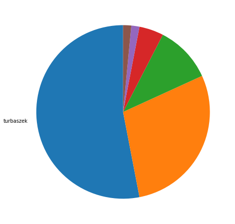
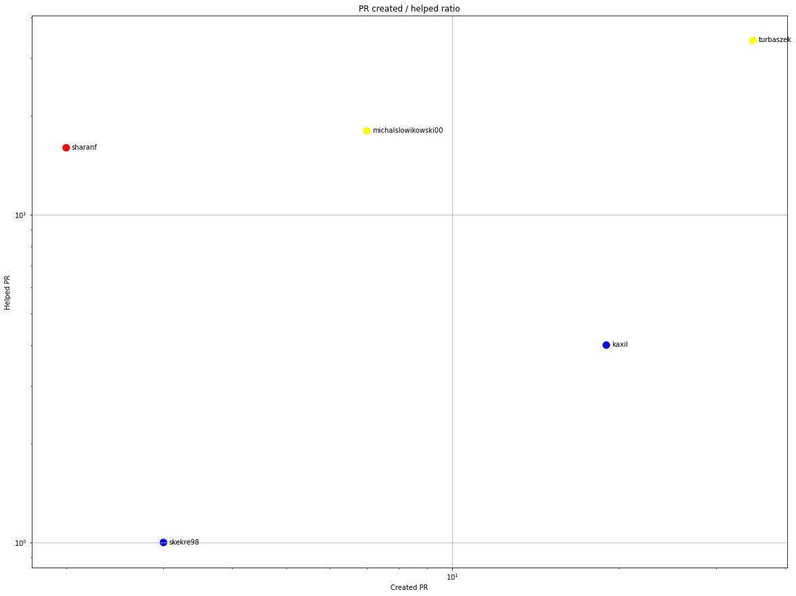
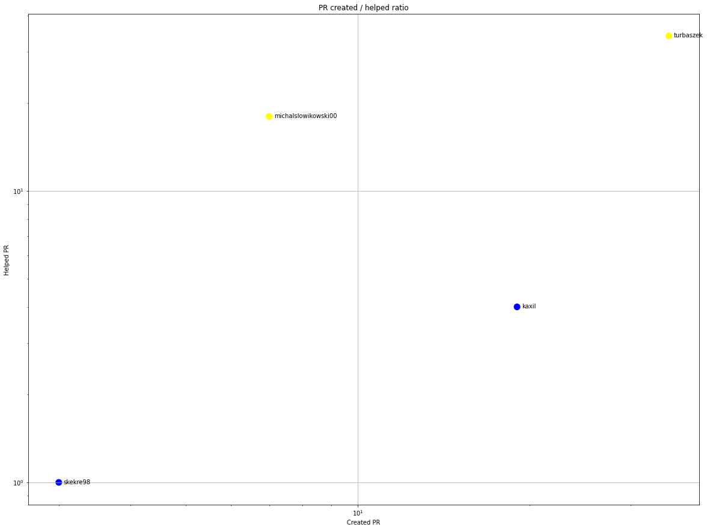
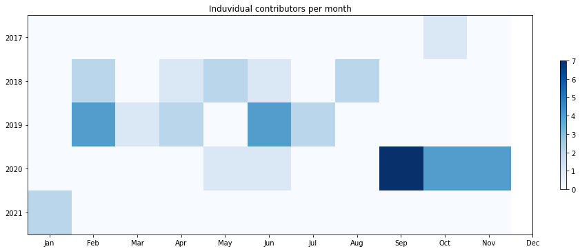
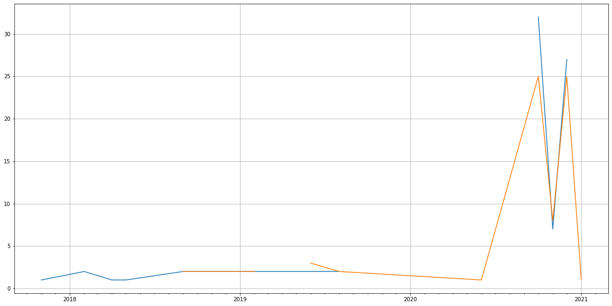
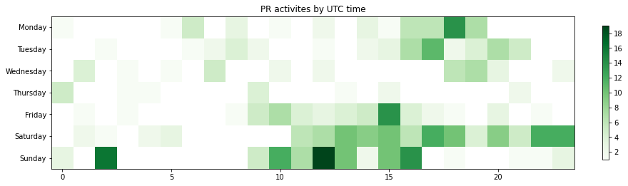

Latest record from the dataset:

<table border="1" class="dataframe">
  <thead>
    <tr style="text-align: right;">
      <th></th>
      <th>org</th>
      <th>repo</th>
      <th>type</th>
      <th>identifier</th>
      <th>subidentifier</th>
      <th>date</th>
      <th>author</th>
      <th>owner</th>
      <th>project</th>
    </tr>
  </thead>
  <tbody>
    <tr>
      <th>429</th>
      <td>apache</td>
      <td>kibble-website</td>
      <td>PR_COMMENTED</td>
      <td>4</td>
      <td>NaN</td>
      <td>2021-01-21 13:59:13+00:00</td>
      <td>Humbedooh</td>
      <td>turbaszek</td>
      <td>kibble</td>
    </tr>
  </tbody>
</table>

# Github Contributions per user

<table border="1" class="dataframe">
  <thead>
    <tr style="text-align: right;">
      <th></th>
      <th>contributions</th>
    </tr>
    <tr>
      <th>author</th>
      <th></th>
    </tr>
  </thead>
  <tbody>
    <tr>
      <th>turbaszek</th>
      <td>108</td>
    </tr>
    <tr>
      <th>sharanf</th>
      <td>42</td>
    </tr>
    <tr>
      <th>Humbedooh</th>
      <td>34</td>
    </tr>
    <tr>
      <th>michalslowikowski00</th>
      <td>29</td>
    </tr>
    <tr>
      <th>kaxil</th>
      <td>8</td>
    </tr>
    <tr>
      <th>GabrielBrascher</th>
      <td>2</td>
    </tr>
    <tr>
      <th>skekre98</th>
      <td>2</td>
    </tr>
    <tr>
      <th>TobKed</th>
      <td>1</td>
    </tr>
    <tr>
      <th>rafaelweingartner</th>
      <td>1</td>
    </tr>
  </tbody>
</table>

## Contributors per participations in PRs which are not created by self (helping PRs)

<table border="1" class="dataframe">
  <thead>
    <tr style="text-align: right;">
      <th></th>
      <th>identifier</th>
    </tr>
    <tr>
      <th>author</th>
      <th></th>
    </tr>
  </thead>
  <tbody>
    <tr>
      <th>turbaszek</th>
      <td>34</td>
    </tr>
    <tr>
      <th>Humbedooh</th>
      <td>20</td>
    </tr>
    <tr>
      <th>michalslowikowski00</th>
      <td>18</td>
    </tr>
    <tr>
      <th>sharanf</th>
      <td>16</td>
    </tr>
    <tr>
      <th>kaxil</th>
      <td>4</td>
    </tr>
    <tr>
      <th>GabrielBrascher</th>
      <td>2</td>
    </tr>
    <tr>
      <th>TobKed</th>
      <td>1</td>
    </tr>
    <tr>
      <th>rafaelweingartner</th>
      <td>1</td>
    </tr>
    <tr>
      <th>skekre98</th>
      <td>1</td>
    </tr>
  </tbody>
</table>

## Contributors per participations in any PRs

<table border="1" class="dataframe">
  <thead>
    <tr style="text-align: right;">
      <th></th>
      <th>identifier</th>
    </tr>
    <tr>
      <th>author</th>
      <th></th>
    </tr>
  </thead>
  <tbody>
    <tr>
      <th>turbaszek</th>
      <td>69</td>
    </tr>
    <tr>
      <th>michalslowikowski00</th>
      <td>25</td>
    </tr>
    <tr>
      <th>kaxil</th>
      <td>23</td>
    </tr>
    <tr>
      <th>Humbedooh</th>
      <td>20</td>
    </tr>
    <tr>
      <th>sharanf</th>
      <td>18</td>
    </tr>
    <tr>
      <th>skekre98</th>
      <td>4</td>
    </tr>
    <tr>
      <th>esrakarakas</th>
      <td>3</td>
    </tr>
    <tr>
      <th>amunz</th>
      <td>2</td>
    </tr>
    <tr>
      <th>jlrifer</th>
      <td>2</td>
    </tr>
    <tr>
      <th>swapnilmmane</th>
      <td>2</td>
    </tr>
    <tr>
      <th>GabrielBrascher</th>
      <td>2</td>
    </tr>
    <tr>
      <th>TreyYi</th>
      <td>1</td>
    </tr>
    <tr>
      <th>aligoren</th>
      <td>1</td>
    </tr>
    <tr>
      <th>jbampton</th>
      <td>1</td>
    </tr>
    <tr>
      <th>TobKed</th>
      <td>1</td>
    </tr>
    <tr>
      <th>midhun1998</th>
      <td>1</td>
    </tr>
    <tr>
      <th>rafaelweingartner</th>
      <td>1</td>
    </tr>
    <tr>
      <th>rbowen</th>
      <td>1</td>
    </tr>
    <tr>
      <th>thadguidry</th>
      <td>1</td>
    </tr>
  </tbody>
</table>

# Bus factor (number of contributors responsible for the 50% of the prs) from last half year

## Contributors until the half of the all contributions

<table border="1" class="dataframe">
  <thead>
    <tr style="text-align: right;">
      <th></th>
      <th>author</th>
      <th>identifier</th>
      <th>cs</th>
      <th>ratio</th>
    </tr>
  </thead>
  <tbody>
  </tbody>
</table>

## Pony number (bus factor)

    1

## Dev power (All the contributions in the ration of the top contributor)

    1.8857142857142852

    

    

## People with created PRs > reviewed/commented PRS

    

    

## Same graph with focusing to the last 6 month

Only contributors with both created pr and helped pr visible

    

    

# Number of individual contributors per month

Number of different Github users who either created PR, commented PR, added review to a PR

Note: only events from apache/hadoop-ozone repository are included. Earlier PRs/comments are not here.

    

    

# Number of PRs closed/created per month

    /usr/lib/python3.9/site-packages/pandas/core/arrays/datetimes.py:1101: UserWarning: Converting to PeriodArray/Index representation will drop timezone information.
      warnings.warn(

    

    

# PR activity heatmap

    

    

