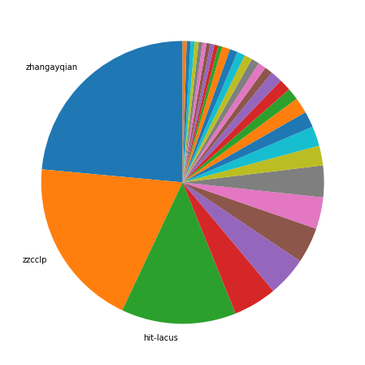
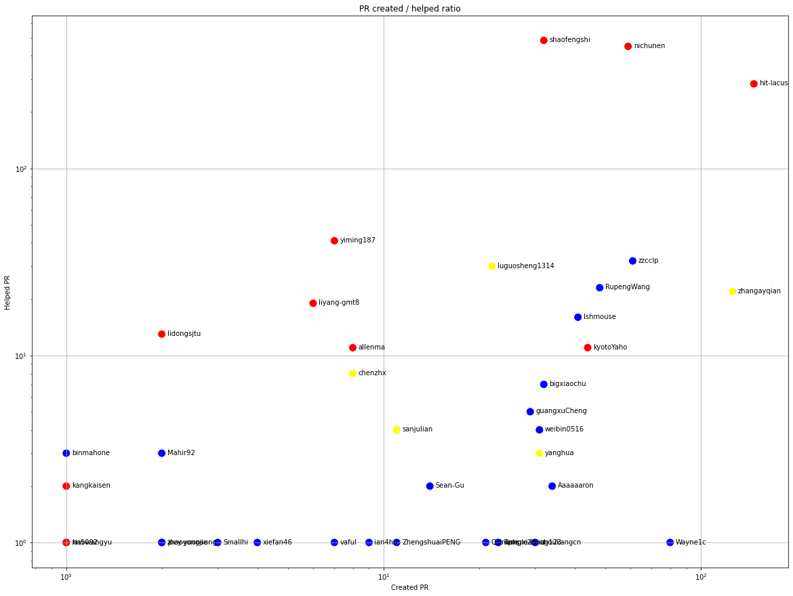
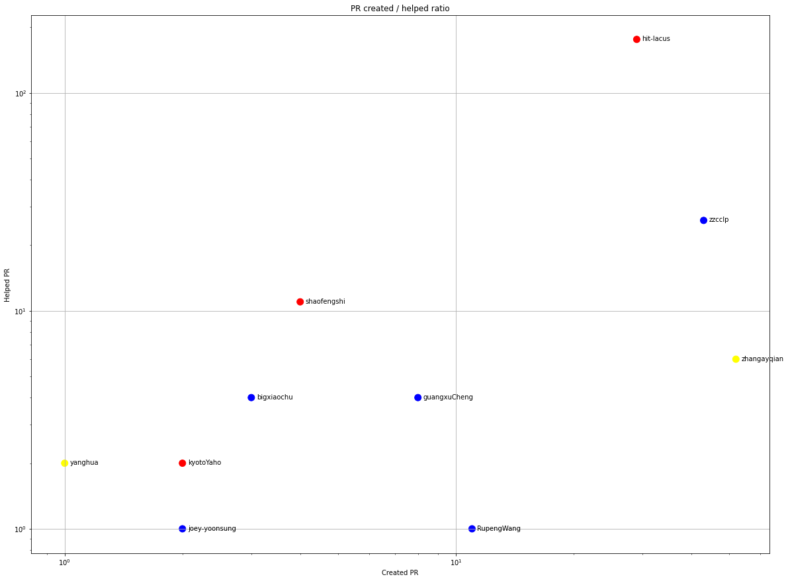
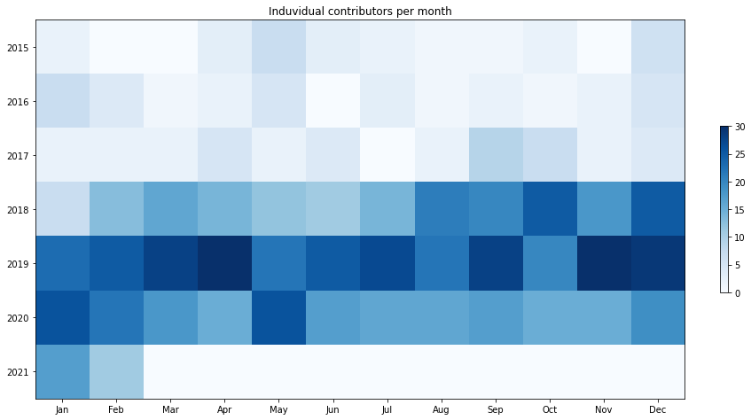
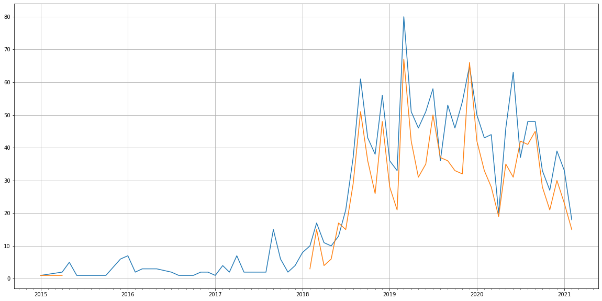
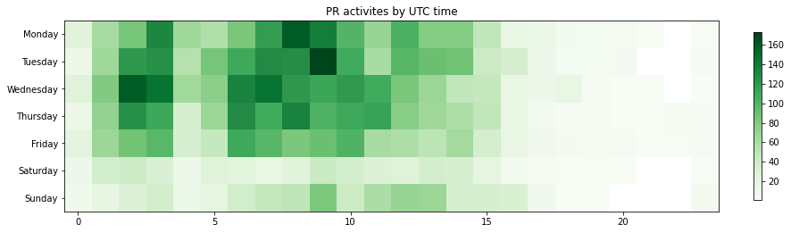

Latest record from the dataset:

<table border="1" class="dataframe">
  <thead>
    <tr style="text-align: right;">
      <th></th>
      <th>org</th>
      <th>repo</th>
      <th>type</th>
      <th>identifier</th>
      <th>subidentifier</th>
      <th>date</th>
      <th>author</th>
      <th>owner</th>
      <th>project</th>
    </tr>
  </thead>
  <tbody>
    <tr>
      <th>3168</th>
      <td>apache</td>
      <td>kylin</td>
      <td>PR_CREATED</td>
      <td>1583</td>
      <td>NaN</td>
      <td>2021-02-10 16:22:40+00:00</td>
      <td>zhengshengjun</td>
      <td>zhengshengjun</td>
      <td>kylin</td>
    </tr>
  </tbody>
</table>

# Github Contributions per user

<table border="1" class="dataframe">
  <thead>
    <tr style="text-align: right;">
      <th></th>
      <th>contributions</th>
    </tr>
    <tr>
      <th>author</th>
      <th></th>
    </tr>
  </thead>
  <tbody>
    <tr>
      <th>shaofengshi</th>
      <td>1009</td>
    </tr>
    <tr>
      <th>nichunen</th>
      <td>926</td>
    </tr>
    <tr>
      <th>asfgit</th>
      <td>897</td>
    </tr>
    <tr>
      <th>coveralls</th>
      <td>717</td>
    </tr>
    <tr>
      <th>hit-lacus</th>
      <td>705</td>
    </tr>
    <tr>
      <th>codecov-io</th>
      <td>640</td>
    </tr>
    <tr>
      <th>asf-ci</th>
      <td>283</td>
    </tr>
    <tr>
      <th>lgtm-com</th>
      <td>92</td>
    </tr>
    <tr>
      <th>zzcclp</th>
      <td>68</td>
    </tr>
    <tr>
      <th>RupengWang</th>
      <td>60</td>
    </tr>
  </tbody>
</table>

## Contributors per participations in PRs which are not created by self (helping PRs)

<table border="1" class="dataframe">
  <thead>
    <tr style="text-align: right;">
      <th></th>
      <th>identifier</th>
    </tr>
    <tr>
      <th>author</th>
      <th></th>
    </tr>
  </thead>
  <tbody>
    <tr>
      <th>coveralls</th>
      <td>716</td>
    </tr>
    <tr>
      <th>asfgit</th>
      <td>664</td>
    </tr>
    <tr>
      <th>codecov-io</th>
      <td>640</td>
    </tr>
    <tr>
      <th>shaofengshi</th>
      <td>483</td>
    </tr>
    <tr>
      <th>nichunen</th>
      <td>449</td>
    </tr>
    <tr>
      <th>hit-lacus</th>
      <td>283</td>
    </tr>
    <tr>
      <th>asf-ci</th>
      <td>211</td>
    </tr>
    <tr>
      <th>codecov-commenter</th>
      <td>46</td>
    </tr>
    <tr>
      <th>lgtm-com</th>
      <td>42</td>
    </tr>
    <tr>
      <th>yiming187</th>
      <td>41</td>
    </tr>
    <tr>
      <th>zzcclp</th>
      <td>32</td>
    </tr>
    <tr>
      <th>luguosheng1314</th>
      <td>30</td>
    </tr>
    <tr>
      <th>RupengWang</th>
      <td>23</td>
    </tr>
    <tr>
      <th>zhangayqian</th>
      <td>22</td>
    </tr>
    <tr>
      <th>liyang-gmt8</th>
      <td>19</td>
    </tr>
    <tr>
      <th>lshmouse</th>
      <td>16</td>
    </tr>
    <tr>
      <th>lidongsjtu</th>
      <td>13</td>
    </tr>
    <tr>
      <th>allenma</th>
      <td>11</td>
    </tr>
    <tr>
      <th>kyotoYaho</th>
      <td>11</td>
    </tr>
    <tr>
      <th>lukehan</th>
      <td>8</td>
    </tr>
  </tbody>
</table>

## Contributors per participations in any PRs

<table border="1" class="dataframe">
  <thead>
    <tr style="text-align: right;">
      <th></th>
      <th>identifier</th>
    </tr>
    <tr>
      <th>author</th>
      <th></th>
    </tr>
  </thead>
  <tbody>
    <tr>
      <th>coveralls</th>
      <td>716</td>
    </tr>
    <tr>
      <th>asfgit</th>
      <td>664</td>
    </tr>
    <tr>
      <th>codecov-io</th>
      <td>640</td>
    </tr>
    <tr>
      <th>shaofengshi</th>
      <td>515</td>
    </tr>
    <tr>
      <th>nichunen</th>
      <td>508</td>
    </tr>
    <tr>
      <th>hit-lacus</th>
      <td>430</td>
    </tr>
    <tr>
      <th>asf-ci</th>
      <td>211</td>
    </tr>
    <tr>
      <th>zhangayqian</th>
      <td>148</td>
    </tr>
    <tr>
      <th>zzcclp</th>
      <td>93</td>
    </tr>
    <tr>
      <th>Wayne1c</th>
      <td>81</td>
    </tr>
    <tr>
      <th>RupengWang</th>
      <td>71</td>
    </tr>
    <tr>
      <th>lshmouse</th>
      <td>57</td>
    </tr>
    <tr>
      <th>kyotoYaho</th>
      <td>55</td>
    </tr>
    <tr>
      <th>luguosheng1314</th>
      <td>52</td>
    </tr>
    <tr>
      <th>GinaZhai</th>
      <td>51</td>
    </tr>
    <tr>
      <th>yiming187</th>
      <td>48</td>
    </tr>
    <tr>
      <th>codecov-commenter</th>
      <td>46</td>
    </tr>
    <tr>
      <th>lgtm-com</th>
      <td>42</td>
    </tr>
    <tr>
      <th>bigxiaochu</th>
      <td>39</td>
    </tr>
    <tr>
      <th>Aaaaaaron</th>
      <td>36</td>
    </tr>
  </tbody>
</table>

# Bus factor (number of contributors responsible for the 50% of the prs) from last half year

## Contributors until the half of the all contributions

<table border="1" class="dataframe">
  <thead>
    <tr style="text-align: right;">
      <th></th>
      <th>author</th>
      <th>identifier</th>
      <th>cs</th>
      <th>ratio</th>
    </tr>
  </thead>
  <tbody>
    <tr>
      <th>0</th>
      <td>zhangayqian</td>
      <td>52</td>
      <td>52</td>
      <td>23.529412</td>
    </tr>
    <tr>
      <th>1</th>
      <td>zzcclp</td>
      <td>43</td>
      <td>95</td>
      <td>19.457014</td>
    </tr>
  </tbody>
</table>

## Pony number (bus factor)

    3

## Dev power (All the contributions in the ration of the top contributor)

    4.25

    

    

## People with created PRs > reviewed/commented PRS

    

    

## Same graph with focusing to the last 6 month

Only contributors with both created pr and helped pr visible

    

    

# Number of individual contributors per month

Number of different Github users who either created PR, commented PR, added review to a PR

Note: only events from apache/hadoop-ozone repository are included. Earlier PRs/comments are not here.

    

    

# Number of PRs closed/created per month

    /usr/lib/python3.9/site-packages/pandas/core/arrays/datetimes.py:1101: UserWarning: Converting to PeriodArray/Index representation will drop timezone information.
      warnings.warn(

    

    

# PR activity heatmap

    

    

