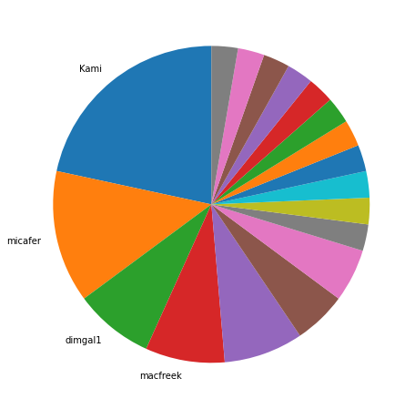
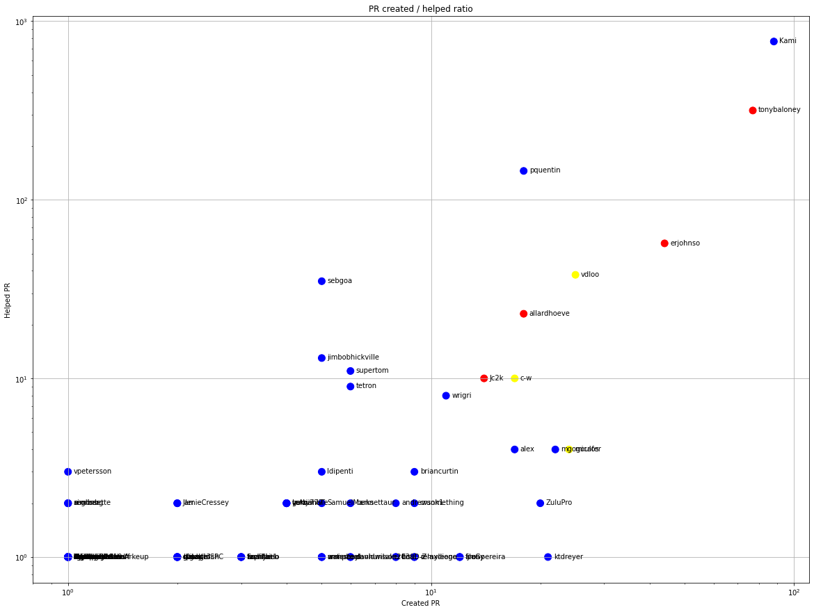
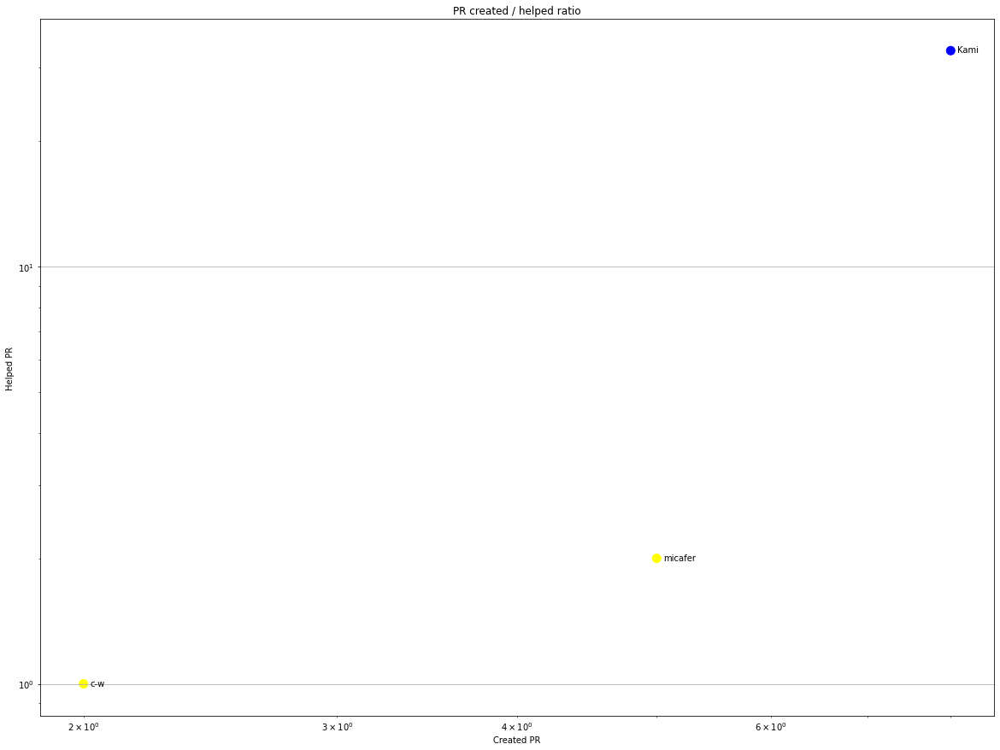
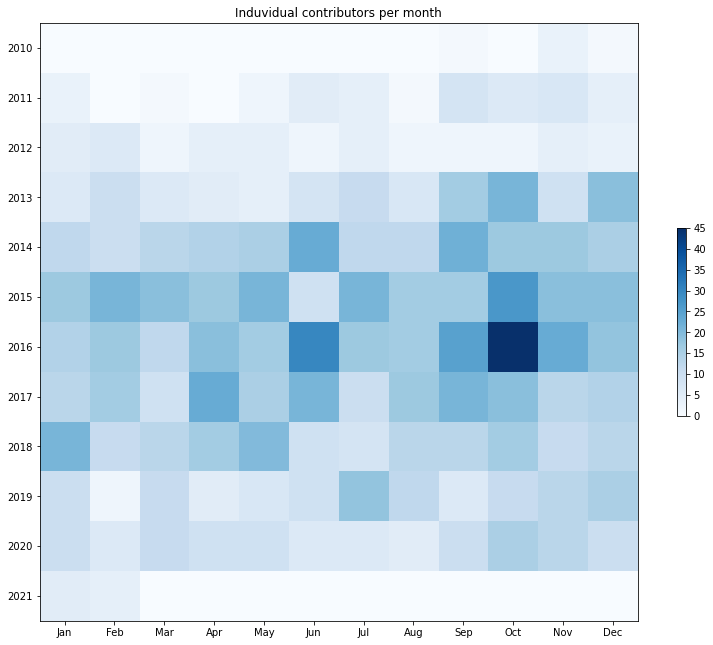
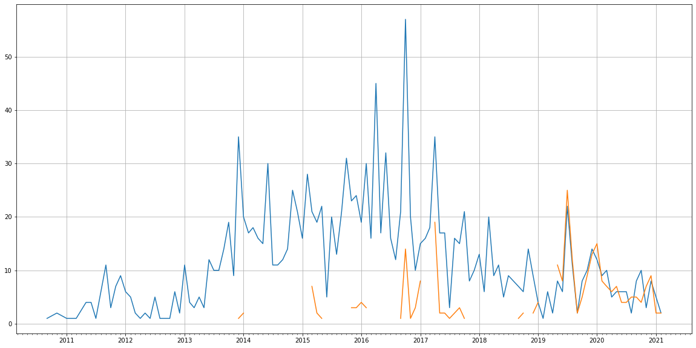
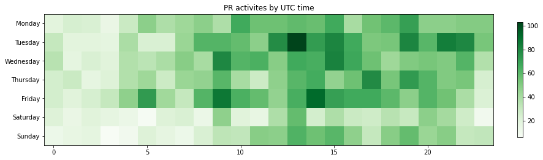

Latest record from the dataset:

<table border="1" class="dataframe">
  <thead>
    <tr style="text-align: right;">
      <th></th>
      <th>org</th>
      <th>repo</th>
      <th>type</th>
      <th>identifier</th>
      <th>subidentifier</th>
      <th>date</th>
      <th>author</th>
      <th>owner</th>
      <th>project</th>
    </tr>
  </thead>
  <tbody>
    <tr>
      <th>3352</th>
      <td>apache</td>
      <td>libcloud</td>
      <td>PR_COMMENTED</td>
      <td>1549</td>
      <td>NaN</td>
      <td>2021-02-12 14:02:34+00:00</td>
      <td>outscale-fne</td>
      <td>outscale-fne</td>
      <td>libcloud</td>
    </tr>
  </tbody>
</table>

# Github Contributions per user

<table border="1" class="dataframe">
  <thead>
    <tr style="text-align: right;">
      <th></th>
      <th>contributions</th>
    </tr>
    <tr>
      <th>author</th>
      <th></th>
    </tr>
  </thead>
  <tbody>
    <tr>
      <th>Kami</th>
      <td>1796</td>
    </tr>
    <tr>
      <th>tonybaloney</th>
      <td>534</td>
    </tr>
    <tr>
      <th>pquentin</th>
      <td>375</td>
    </tr>
    <tr>
      <th>codecov-io</th>
      <td>247</td>
    </tr>
    <tr>
      <th>coveralls</th>
      <td>176</td>
    </tr>
    <tr>
      <th>asfgit</th>
      <td>160</td>
    </tr>
    <tr>
      <th>vdloo</th>
      <td>86</td>
    </tr>
    <tr>
      <th>erjohnso</th>
      <td>84</td>
    </tr>
    <tr>
      <th>allardhoeve</th>
      <td>57</td>
    </tr>
    <tr>
      <th>stale</th>
      <td>55</td>
    </tr>
  </tbody>
</table>

## Contributors per participations in PRs which are not created by self (helping PRs)

<table border="1" class="dataframe">
  <thead>
    <tr style="text-align: right;">
      <th></th>
      <th>identifier</th>
    </tr>
    <tr>
      <th>author</th>
      <th></th>
    </tr>
  </thead>
  <tbody>
    <tr>
      <th>Kami</th>
      <td>769</td>
    </tr>
    <tr>
      <th>tonybaloney</th>
      <td>316</td>
    </tr>
    <tr>
      <th>codecov-io</th>
      <td>248</td>
    </tr>
    <tr>
      <th>asfgit</th>
      <td>161</td>
    </tr>
    <tr>
      <th>pquentin</th>
      <td>145</td>
    </tr>
    <tr>
      <th>coveralls</th>
      <td>82</td>
    </tr>
    <tr>
      <th>erjohnso</th>
      <td>57</td>
    </tr>
    <tr>
      <th>stale</th>
      <td>46</td>
    </tr>
    <tr>
      <th>vdloo</th>
      <td>38</td>
    </tr>
    <tr>
      <th>sebgoa</th>
      <td>35</td>
    </tr>
    <tr>
      <th>allardhoeve</th>
      <td>23</td>
    </tr>
    <tr>
      <th>jimbobhickville</th>
      <td>13</td>
    </tr>
    <tr>
      <th>supertom</th>
      <td>11</td>
    </tr>
    <tr>
      <th>Jc2k</th>
      <td>10</td>
    </tr>
    <tr>
      <th>c-w</th>
      <td>10</td>
    </tr>
    <tr>
      <th>tetron</th>
      <td>9</td>
    </tr>
    <tr>
      <th>wrigri</th>
      <td>8</td>
    </tr>
    <tr>
      <th>jcsalterego</th>
      <td>6</td>
    </tr>
    <tr>
      <th>alex</th>
      <td>4</td>
    </tr>
    <tr>
      <th>micafer</th>
      <td>4</td>
    </tr>
  </tbody>
</table>

## Contributors per participations in any PRs

<table border="1" class="dataframe">
  <thead>
    <tr style="text-align: right;">
      <th></th>
      <th>identifier</th>
    </tr>
    <tr>
      <th>author</th>
      <th></th>
    </tr>
  </thead>
  <tbody>
    <tr>
      <th>Kami</th>
      <td>857</td>
    </tr>
    <tr>
      <th>tonybaloney</th>
      <td>393</td>
    </tr>
    <tr>
      <th>codecov-io</th>
      <td>248</td>
    </tr>
    <tr>
      <th>pquentin</th>
      <td>163</td>
    </tr>
    <tr>
      <th>asfgit</th>
      <td>161</td>
    </tr>
    <tr>
      <th>erjohnso</th>
      <td>101</td>
    </tr>
    <tr>
      <th>coveralls</th>
      <td>82</td>
    </tr>
    <tr>
      <th>vdloo</th>
      <td>63</td>
    </tr>
    <tr>
      <th>stale</th>
      <td>46</td>
    </tr>
    <tr>
      <th>allardhoeve</th>
      <td>41</td>
    </tr>
    <tr>
      <th>sebgoa</th>
      <td>40</td>
    </tr>
    <tr>
      <th>cderamus</th>
      <td>35</td>
    </tr>
    <tr>
      <th>micafer</th>
      <td>28</td>
    </tr>
    <tr>
      <th>c-w</th>
      <td>27</td>
    </tr>
    <tr>
      <th>mgogoulos</th>
      <td>26</td>
    </tr>
    <tr>
      <th>Jc2k</th>
      <td>24</td>
    </tr>
    <tr>
      <th>ZuluPro</th>
      <td>22</td>
    </tr>
    <tr>
      <th>ktdreyer</th>
      <td>22</td>
    </tr>
    <tr>
      <th>alex</th>
      <td>21</td>
    </tr>
    <tr>
      <th>wido</th>
      <td>21</td>
    </tr>
  </tbody>
</table>

# Bus factor (number of contributors responsible for the 50% of the prs) from last half year

## Contributors until the half of the all contributions

<table border="1" class="dataframe">
  <thead>
    <tr style="text-align: right;">
      <th></th>
      <th>author</th>
      <th>identifier</th>
      <th>cs</th>
      <th>ratio</th>
    </tr>
  </thead>
  <tbody>
    <tr>
      <th>0</th>
      <td>Kami</td>
      <td>8</td>
      <td>8</td>
      <td>21.621622</td>
    </tr>
    <tr>
      <th>1</th>
      <td>micafer</td>
      <td>5</td>
      <td>13</td>
      <td>13.513514</td>
    </tr>
    <tr>
      <th>2</th>
      <td>dimgal1</td>
      <td>3</td>
      <td>16</td>
      <td>8.108108</td>
    </tr>
  </tbody>
</table>

## Pony number (bus factor)

    4

## Dev power (All the contributions in the ration of the top contributor)

    4.625

    

    

## People with created PRs > reviewed/commented PRS

    

    

## Same graph with focusing to the last 6 month

Only contributors with both created pr and helped pr visible

    

    

# Number of individual contributors per month

Number of different Github users who either created PR, commented PR, added review to a PR

Note: only events from apache/hadoop-ozone repository are included. Earlier PRs/comments are not here.

    

    

# Number of PRs closed/created per month

    /usr/lib/python3.9/site-packages/pandas/core/arrays/datetimes.py:1101: UserWarning: Converting to PeriodArray/Index representation will drop timezone information.
      warnings.warn(

    

    

# PR activity heatmap

    

    

