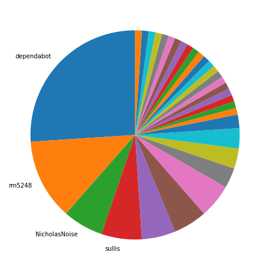
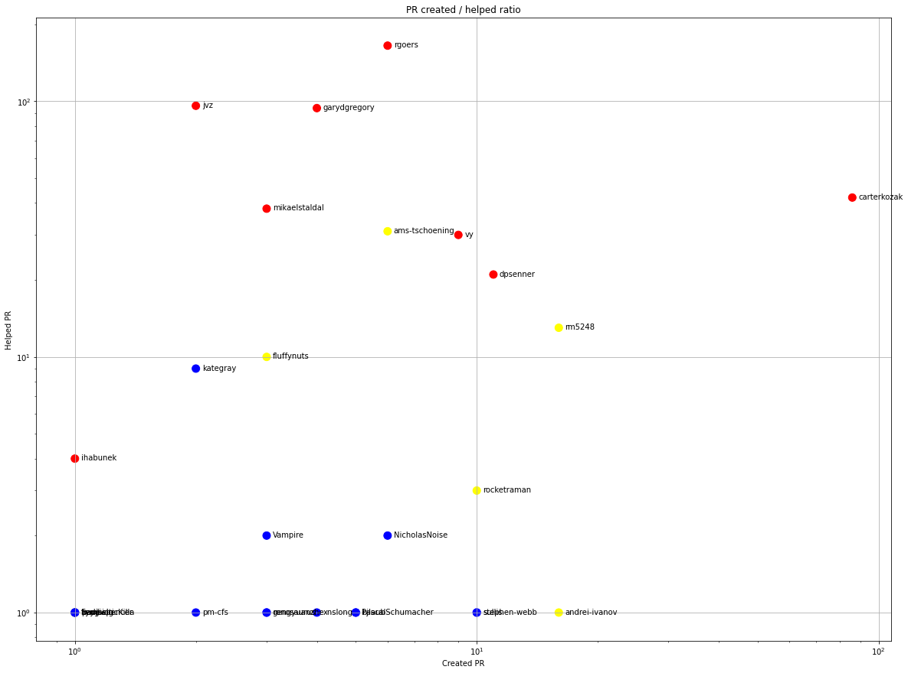
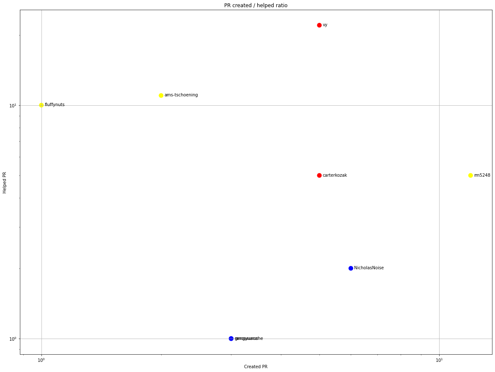
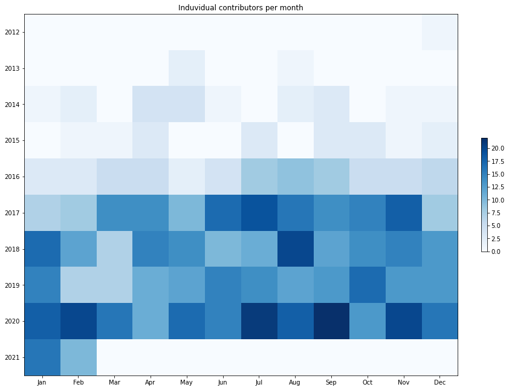
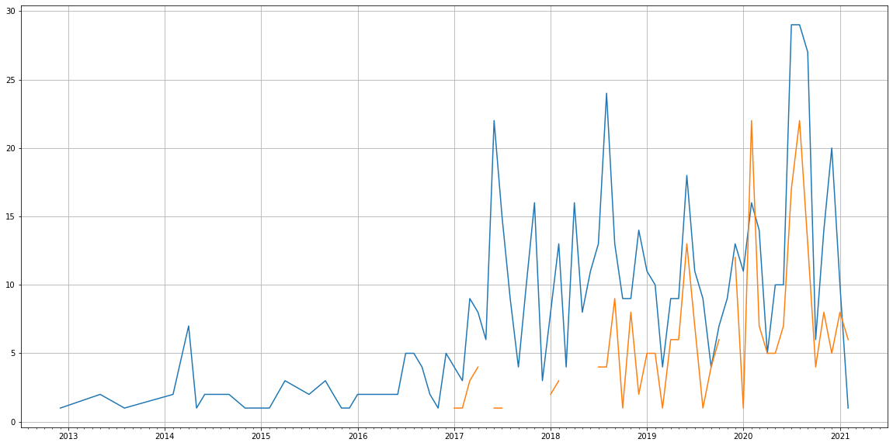
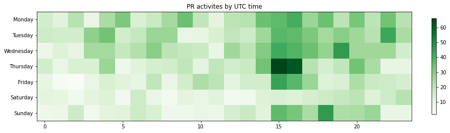

Latest record from the dataset:

<table border="1" class="dataframe">
  <thead>
    <tr style="text-align: right;">
      <th></th>
      <th>org</th>
      <th>repo</th>
      <th>type</th>
      <th>identifier</th>
      <th>subidentifier</th>
      <th>date</th>
      <th>author</th>
      <th>owner</th>
      <th>project</th>
    </tr>
  </thead>
  <tbody>
    <tr>
      <th>439</th>
      <td>apache</td>
      <td>logging-log4j-kotlin</td>
      <td>PR_COMMENTED</td>
      <td>14</td>
      <td>NaN</td>
      <td>2021-02-11 14:53:45+00:00</td>
      <td>mikaello</td>
      <td>mikaello</td>
      <td>logging</td>
    </tr>
  </tbody>
</table>

# Github Contributions per user

<table border="1" class="dataframe">
  <thead>
    <tr style="text-align: right;">
      <th></th>
      <th>contributions</th>
    </tr>
    <tr>
      <th>author</th>
      <th></th>
    </tr>
  </thead>
  <tbody>
    <tr>
      <th>rgoers</th>
      <td>327</td>
    </tr>
    <tr>
      <th>jvz</th>
      <td>272</td>
    </tr>
    <tr>
      <th>garydgregory</th>
      <td>181</td>
    </tr>
    <tr>
      <th>remkop</th>
      <td>144</td>
    </tr>
    <tr>
      <th>carterkozak</th>
      <td>137</td>
    </tr>
    <tr>
      <th>ams-tschoening</th>
      <td>98</td>
    </tr>
    <tr>
      <th>mikaelstaldal</th>
      <td>72</td>
    </tr>
    <tr>
      <th>dpsenner</th>
      <td>63</td>
    </tr>
    <tr>
      <th>vy</th>
      <td>53</td>
    </tr>
    <tr>
      <th>asfgit</th>
      <td>51</td>
    </tr>
  </tbody>
</table>

## Contributors per participations in PRs which are not created by self (helping PRs)

<table border="1" class="dataframe">
  <thead>
    <tr style="text-align: right;">
      <th></th>
      <th>identifier</th>
    </tr>
    <tr>
      <th>author</th>
      <th></th>
    </tr>
  </thead>
  <tbody>
    <tr>
      <th>rgoers</th>
      <td>165</td>
    </tr>
    <tr>
      <th>jvz</th>
      <td>96</td>
    </tr>
    <tr>
      <th>garydgregory</th>
      <td>94</td>
    </tr>
    <tr>
      <th>remkop</th>
      <td>60</td>
    </tr>
    <tr>
      <th>carterkozak</th>
      <td>42</td>
    </tr>
    <tr>
      <th>asfgit</th>
      <td>40</td>
    </tr>
    <tr>
      <th>mikaelstaldal</th>
      <td>38</td>
    </tr>
    <tr>
      <th>ams-tschoening</th>
      <td>31</td>
    </tr>
    <tr>
      <th>vy</th>
      <td>30</td>
    </tr>
    <tr>
      <th>dpsenner</th>
      <td>21</td>
    </tr>
    <tr>
      <th>rm5248</th>
      <td>13</td>
    </tr>
    <tr>
      <th>asfbot</th>
      <td>10</td>
    </tr>
    <tr>
      <th>fluffynuts</th>
      <td>10</td>
    </tr>
    <tr>
      <th>kategray</th>
      <td>9</td>
    </tr>
    <tr>
      <th>cremor</th>
      <td>6</td>
    </tr>
    <tr>
      <th>ihabunek</th>
      <td>4</td>
    </tr>
    <tr>
      <th>rocketraman</th>
      <td>3</td>
    </tr>
    <tr>
      <th>aaabramov</th>
      <td>3</td>
    </tr>
    <tr>
      <th>peter279k</th>
      <td>2</td>
    </tr>
    <tr>
      <th>NicholasNoise</th>
      <td>2</td>
    </tr>
  </tbody>
</table>

## Contributors per participations in any PRs

<table border="1" class="dataframe">
  <thead>
    <tr style="text-align: right;">
      <th></th>
      <th>identifier</th>
    </tr>
    <tr>
      <th>author</th>
      <th></th>
    </tr>
  </thead>
  <tbody>
    <tr>
      <th>rgoers</th>
      <td>171</td>
    </tr>
    <tr>
      <th>carterkozak</th>
      <td>128</td>
    </tr>
    <tr>
      <th>jvz</th>
      <td>98</td>
    </tr>
    <tr>
      <th>garydgregory</th>
      <td>98</td>
    </tr>
    <tr>
      <th>remkop</th>
      <td>60</td>
    </tr>
    <tr>
      <th>dependabot</th>
      <td>45</td>
    </tr>
    <tr>
      <th>mikaelstaldal</th>
      <td>41</td>
    </tr>
    <tr>
      <th>asfgit</th>
      <td>40</td>
    </tr>
    <tr>
      <th>vy</th>
      <td>39</td>
    </tr>
    <tr>
      <th>ams-tschoening</th>
      <td>37</td>
    </tr>
    <tr>
      <th>dpsenner</th>
      <td>32</td>
    </tr>
    <tr>
      <th>rm5248</th>
      <td>29</td>
    </tr>
    <tr>
      <th>andrei-ivanov</th>
      <td>17</td>
    </tr>
    <tr>
      <th>rocketraman</th>
      <td>13</td>
    </tr>
    <tr>
      <th>fluffynuts</th>
      <td>13</td>
    </tr>
    <tr>
      <th>kpm1985</th>
      <td>12</td>
    </tr>
    <tr>
      <th>sullis</th>
      <td>11</td>
    </tr>
    <tr>
      <th>stephen-webb</th>
      <td>11</td>
    </tr>
    <tr>
      <th>kategray</th>
      <td>11</td>
    </tr>
    <tr>
      <th>asfbot</th>
      <td>10</td>
    </tr>
  </tbody>
</table>

# Bus factor (number of contributors responsible for the 50% of the prs) from last half year

## Contributors until the half of the all contributions

<table border="1" class="dataframe">
  <thead>
    <tr style="text-align: right;">
      <th></th>
      <th>author</th>
      <th>identifier</th>
      <th>cs</th>
      <th>ratio</th>
    </tr>
  </thead>
  <tbody>
    <tr>
      <th>0</th>
      <td>dependabot</td>
      <td>25</td>
      <td>25</td>
      <td>26.041667</td>
    </tr>
    <tr>
      <th>1</th>
      <td>rm5248</td>
      <td>12</td>
      <td>37</td>
      <td>12.500000</td>
    </tr>
    <tr>
      <th>2</th>
      <td>NicholasNoise</td>
      <td>6</td>
      <td>43</td>
      <td>6.250000</td>
    </tr>
  </tbody>
</table>

## Pony number (bus factor)

    4

## Dev power (All the contributions in the ration of the top contributor)

    3.8400000000000003

    

    

## People with created PRs > reviewed/commented PRS

    

    

## Same graph with focusing to the last 6 month

Only contributors with both created pr and helped pr visible

    

    

# Number of individual contributors per month

Number of different Github users who either created PR, commented PR, added review to a PR

Note: only events from apache/hadoop-ozone repository are included. Earlier PRs/comments are not here.

    

    

# Number of PRs closed/created per month

    /usr/lib/python3.9/site-packages/pandas/core/arrays/datetimes.py:1101: UserWarning: Converting to PeriodArray/Index representation will drop timezone information.
      warnings.warn(

    

    

# PR activity heatmap

    

    

