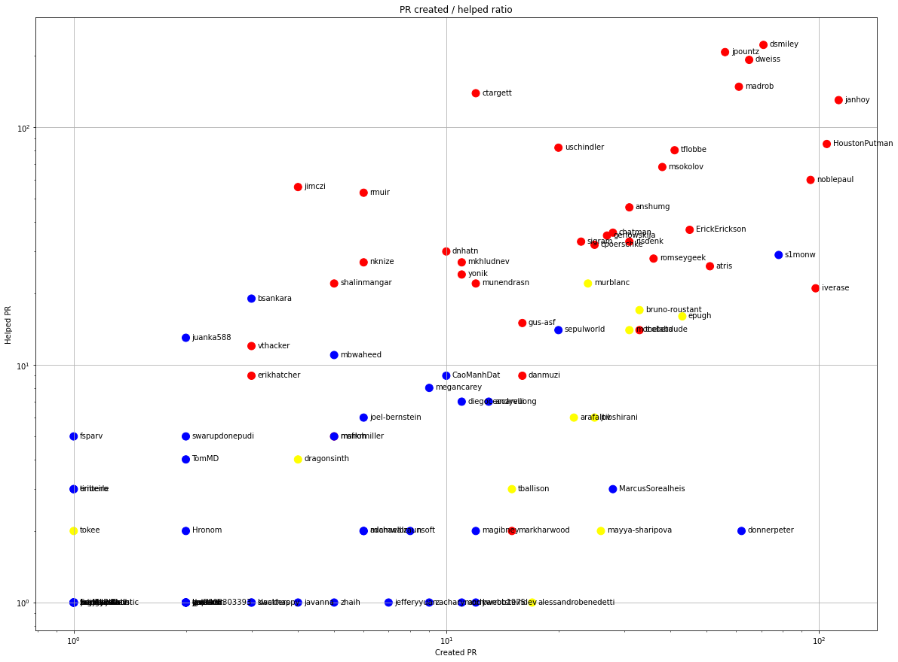

Latest record from the dataset:

<table border="1" class="dataframe">
  <thead>
    <tr style="text-align: right;">
      <th></th>
      <th>org</th>
      <th>repo</th>
      <th>type</th>
      <th>identifier</th>
      <th>subidentifier</th>
      <th>date</th>
      <th>author</th>
      <th>owner</th>
      <th>project</th>
    </tr>
  </thead>
  <tbody>
    <tr>
      <th>10288</th>
      <td>apache</td>
      <td>lucene-solr</td>
      <td>PR_COMMENTED</td>
      <td>2358</td>
      <td>NaN</td>
      <td>2021-02-14 06:34:29+00:00</td>
      <td>dsmiley</td>
      <td>dsmiley</td>
      <td>lucene</td>
    </tr>
  </tbody>
</table>

# Github Contributions per user

<table border="1" class="dataframe">
  <thead>
    <tr style="text-align: right;">
      <th></th>
      <th>contributions</th>
    </tr>
    <tr>
      <th>author</th>
      <th></th>
    </tr>
  </thead>
  <tbody>
    <tr>
      <th>dsmiley</th>
      <td>751</td>
    </tr>
    <tr>
      <th>dweiss</th>
      <td>630</td>
    </tr>
    <tr>
      <th>jpountz</th>
      <td>541</td>
    </tr>
    <tr>
      <th>mikemccand</th>
      <td>389</td>
    </tr>
    <tr>
      <th>uschindler</th>
      <td>347</td>
    </tr>
    <tr>
      <th>madrob</th>
      <td>295</td>
    </tr>
    <tr>
      <th>janhoy</th>
      <td>245</td>
    </tr>
    <tr>
      <th>ctargett</th>
      <td>226</td>
    </tr>
    <tr>
      <th>HoustonPutman</th>
      <td>220</td>
    </tr>
    <tr>
      <th>murblanc</th>
      <td>219</td>
    </tr>
  </tbody>
</table>

## Contributors per participations in PRs which are not created by self (helping PRs)

<table border="1" class="dataframe">
  <thead>
    <tr style="text-align: right;">
      <th></th>
      <th>identifier</th>
    </tr>
    <tr>
      <th>author</th>
      <th></th>
    </tr>
  </thead>
  <tbody>
    <tr>
      <th>dsmiley</th>
      <td>222</td>
    </tr>
    <tr>
      <th>jpountz</th>
      <td>207</td>
    </tr>
    <tr>
      <th>dweiss</th>
      <td>192</td>
    </tr>
    <tr>
      <th>madrob</th>
      <td>148</td>
    </tr>
    <tr>
      <th>mikemccand</th>
      <td>140</td>
    </tr>
    <tr>
      <th>ctargett</th>
      <td>139</td>
    </tr>
    <tr>
      <th>janhoy</th>
      <td>130</td>
    </tr>
    <tr>
      <th>HoustonPutman</th>
      <td>85</td>
    </tr>
    <tr>
      <th>uschindler</th>
      <td>82</td>
    </tr>
    <tr>
      <th>tflobbe</th>
      <td>80</td>
    </tr>
    <tr>
      <th>msokolov</th>
      <td>68</td>
    </tr>
    <tr>
      <th>noblepaul</th>
      <td>60</td>
    </tr>
    <tr>
      <th>jimczi</th>
      <td>56</td>
    </tr>
    <tr>
      <th>rmuir</th>
      <td>53</td>
    </tr>
    <tr>
      <th>anshumg</th>
      <td>46</td>
    </tr>
    <tr>
      <th>muse-dev</th>
      <td>46</td>
    </tr>
    <tr>
      <th>asfgit</th>
      <td>41</td>
    </tr>
    <tr>
      <th>ErickErickson</th>
      <td>37</td>
    </tr>
    <tr>
      <th>chatman</th>
      <td>36</td>
    </tr>
    <tr>
      <th>gerlowskija</th>
      <td>35</td>
    </tr>
  </tbody>
</table>

## Contributors per participations in any PRs

<table border="1" class="dataframe">
  <thead>
    <tr style="text-align: right;">
      <th></th>
      <th>identifier</th>
    </tr>
    <tr>
      <th>author</th>
      <th></th>
    </tr>
  </thead>
  <tbody>
    <tr>
      <th>dsmiley</th>
      <td>293</td>
    </tr>
    <tr>
      <th>jpountz</th>
      <td>263</td>
    </tr>
    <tr>
      <th>dweiss</th>
      <td>257</td>
    </tr>
    <tr>
      <th>janhoy</th>
      <td>240</td>
    </tr>
    <tr>
      <th>madrob</th>
      <td>209</td>
    </tr>
    <tr>
      <th>HoustonPutman</th>
      <td>190</td>
    </tr>
    <tr>
      <th>noblepaul</th>
      <td>155</td>
    </tr>
    <tr>
      <th>ctargett</th>
      <td>151</td>
    </tr>
    <tr>
      <th>mikemccand</th>
      <td>140</td>
    </tr>
    <tr>
      <th>tflobbe</th>
      <td>121</td>
    </tr>
    <tr>
      <th>iverase</th>
      <td>119</td>
    </tr>
    <tr>
      <th>s1monw</th>
      <td>107</td>
    </tr>
    <tr>
      <th>msokolov</th>
      <td>106</td>
    </tr>
    <tr>
      <th>uschindler</th>
      <td>102</td>
    </tr>
    <tr>
      <th>ErickErickson</th>
      <td>82</td>
    </tr>
    <tr>
      <th>anshumg</th>
      <td>77</td>
    </tr>
    <tr>
      <th>atris</th>
      <td>77</td>
    </tr>
    <tr>
      <th>chatman</th>
      <td>64</td>
    </tr>
    <tr>
      <th>donnerpeter</th>
      <td>64</td>
    </tr>
    <tr>
      <th>romseygeek</th>
      <td>64</td>
    </tr>
  </tbody>
</table>

# Bus factor (number of contributors responsible for the 50% of the prs) from last half year

## Contributors until the half of the all contributions

<table border="1" class="dataframe">
  <thead>
    <tr style="text-align: right;">
      <th></th>
      <th>author</th>
      <th>identifier</th>
      <th>cs</th>
      <th>ratio</th>
    </tr>
  </thead>
  <tbody>
    <tr>
      <th>0</th>
      <td>donnerpeter</td>
      <td>62</td>
      <td>62</td>
      <td>9.198813</td>
    </tr>
    <tr>
      <th>1</th>
      <td>HoustonPutman</td>
      <td>49</td>
      <td>111</td>
      <td>7.270030</td>
    </tr>
    <tr>
      <th>2</th>
      <td>dweiss</td>
      <td>45</td>
      <td>156</td>
      <td>6.676558</td>
    </tr>
    <tr>
      <th>3</th>
      <td>thelabdude</td>
      <td>32</td>
      <td>188</td>
      <td>4.747774</td>
    </tr>
    <tr>
      <th>4</th>
      <td>noblepaul</td>
      <td>26</td>
      <td>214</td>
      <td>3.857567</td>
    </tr>
    <tr>
      <th>5</th>
      <td>madrob</td>
      <td>22</td>
      <td>236</td>
      <td>3.264095</td>
    </tr>
    <tr>
      <th>6</th>
      <td>dsmiley</td>
      <td>21</td>
      <td>257</td>
      <td>3.115727</td>
    </tr>
    <tr>
      <th>7</th>
      <td>iverase</td>
      <td>21</td>
      <td>278</td>
      <td>3.115727</td>
    </tr>
    <tr>
      <th>8</th>
      <td>s1monw</td>
      <td>19</td>
      <td>297</td>
      <td>2.818991</td>
    </tr>
    <tr>
      <th>9</th>
      <td>jtibshirani</td>
      <td>17</td>
      <td>314</td>
      <td>2.522255</td>
    </tr>
    <tr>
      <th>10</th>
      <td>epugh</td>
      <td>17</td>
      <td>331</td>
      <td>2.522255</td>
    </tr>
  </tbody>
</table>

## Pony number (bus factor)

    12

## Dev power (All the contributions in the ration of the top contributor)

    10.870967741935479

    

    

## People with created PRs > reviewed/commented PRS

    

    

## Same graph with focusing to the last 6 month

Only contributors with both created pr and helped pr visible

    

    

# Number of individual contributors per month

Number of different Github users who either created PR, commented PR, added review to a PR

Note: only events from apache/hadoop-ozone repository are included. Earlier PRs/comments are not here.

    

    

# Number of PRs closed/created per month

    /usr/lib/python3.9/site-packages/pandas/core/arrays/datetimes.py:1101: UserWarning: Converting to PeriodArray/Index representation will drop timezone information.
      warnings.warn(

    

    

# PR activity heatmap

    

    

