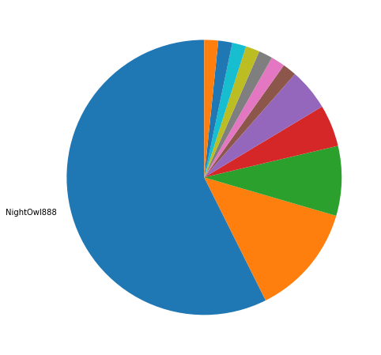
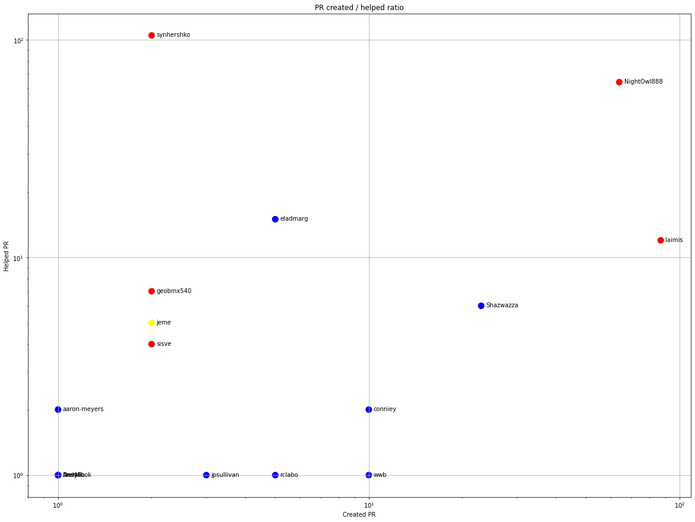
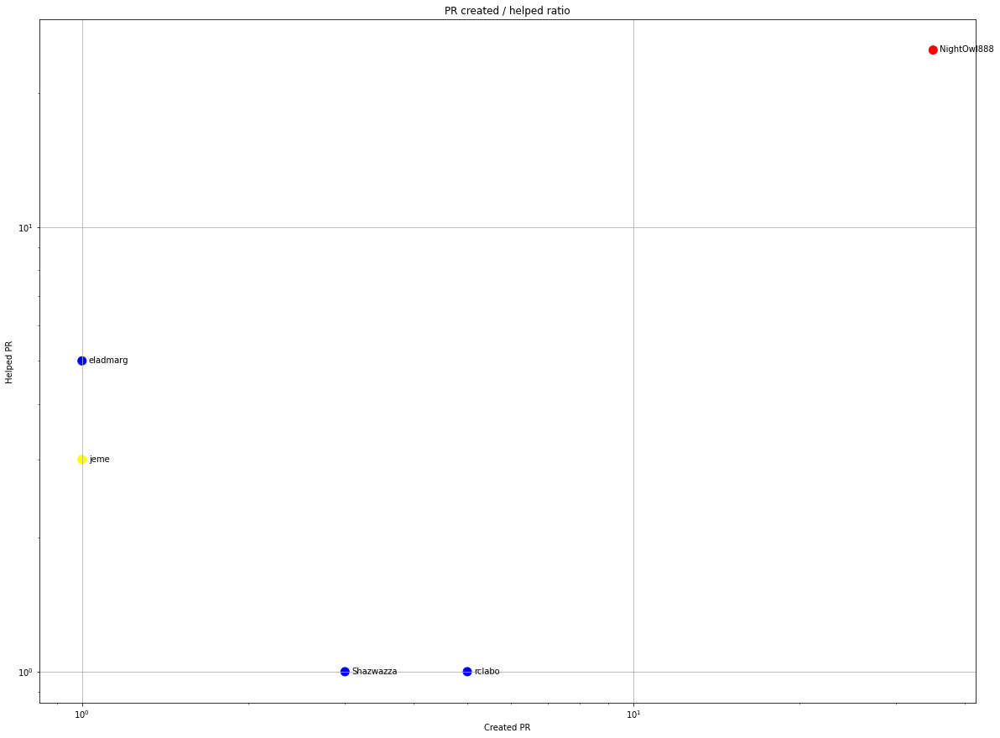
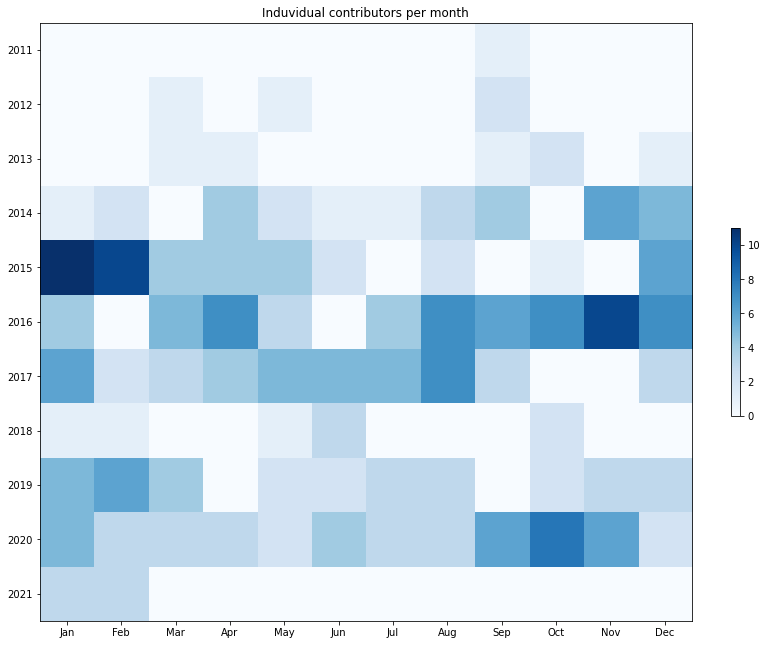
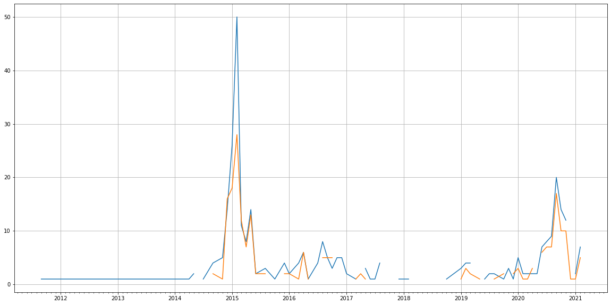
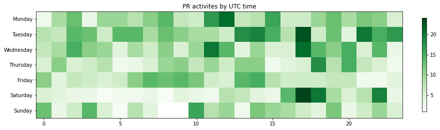

Latest record from the dataset:

<table border="1" class="dataframe">
  <thead>
    <tr style="text-align: right;">
      <th></th>
      <th>org</th>
      <th>repo</th>
      <th>type</th>
      <th>identifier</th>
      <th>subidentifier</th>
      <th>date</th>
      <th>author</th>
      <th>owner</th>
      <th>project</th>
    </tr>
  </thead>
  <tbody>
    <tr>
      <th>1188</th>
      <td>apache</td>
      <td>lucenenet</td>
      <td>PR_CREATED</td>
      <td>421</td>
      <td>NaN</td>
      <td>2021-02-13 00:32:57+00:00</td>
      <td>rclabo</td>
      <td>rclabo</td>
      <td>lucenenet</td>
    </tr>
  </tbody>
</table>

# Github Contributions per user

<table border="1" class="dataframe">
  <thead>
    <tr style="text-align: right;">
      <th></th>
      <th>contributions</th>
    </tr>
    <tr>
      <th>author</th>
      <th></th>
    </tr>
  </thead>
  <tbody>
    <tr>
      <th>NightOwl888</th>
      <td>236</td>
    </tr>
    <tr>
      <th>synhershko</th>
      <td>192</td>
    </tr>
    <tr>
      <th>asfgit</th>
      <td>143</td>
    </tr>
    <tr>
      <th>eladmarg</th>
      <td>29</td>
    </tr>
    <tr>
      <th>Shazwazza</th>
      <td>23</td>
    </tr>
    <tr>
      <th>laimis</th>
      <td>18</td>
    </tr>
    <tr>
      <th>jeme</th>
      <td>14</td>
    </tr>
    <tr>
      <th>geobmx540</th>
      <td>13</td>
    </tr>
    <tr>
      <th>uschindler</th>
      <td>11</td>
    </tr>
    <tr>
      <th>sisve</th>
      <td>6</td>
    </tr>
  </tbody>
</table>

## Contributors per participations in PRs which are not created by self (helping PRs)

<table border="1" class="dataframe">
  <thead>
    <tr style="text-align: right;">
      <th></th>
      <th>identifier</th>
    </tr>
    <tr>
      <th>author</th>
      <th></th>
    </tr>
  </thead>
  <tbody>
    <tr>
      <th>asfgit</th>
      <td>143</td>
    </tr>
    <tr>
      <th>synhershko</th>
      <td>105</td>
    </tr>
    <tr>
      <th>NightOwl888</th>
      <td>64</td>
    </tr>
    <tr>
      <th>eladmarg</th>
      <td>15</td>
    </tr>
    <tr>
      <th>laimis</th>
      <td>12</td>
    </tr>
    <tr>
      <th>geobmx540</th>
      <td>7</td>
    </tr>
    <tr>
      <th>Shazwazza</th>
      <td>6</td>
    </tr>
    <tr>
      <th>jeme</th>
      <td>5</td>
    </tr>
    <tr>
      <th>sisve</th>
      <td>4</td>
    </tr>
    <tr>
      <th>uschindler</th>
      <td>3</td>
    </tr>
    <tr>
      <th>conniey</th>
      <td>2</td>
    </tr>
    <tr>
      <th>aaron-meyers</th>
      <td>2</td>
    </tr>
    <tr>
      <th>lmnash</th>
      <td>1</td>
    </tr>
    <tr>
      <th>jpsullivan</th>
      <td>1</td>
    </tr>
    <tr>
      <th>rclabo</th>
      <td>1</td>
    </tr>
    <tr>
      <th>lahma</th>
      <td>1</td>
    </tr>
    <tr>
      <th>kapitanov</th>
      <td>1</td>
    </tr>
    <tr>
      <th>rmarinho</th>
      <td>1</td>
    </tr>
    <tr>
      <th>tezli</th>
      <td>1</td>
    </tr>
    <tr>
      <th>AndyPook</th>
      <td>1</td>
    </tr>
  </tbody>
</table>

## Contributors per participations in any PRs

<table border="1" class="dataframe">
  <thead>
    <tr style="text-align: right;">
      <th></th>
      <th>identifier</th>
    </tr>
    <tr>
      <th>author</th>
      <th></th>
    </tr>
  </thead>
  <tbody>
    <tr>
      <th>asfgit</th>
      <td>143</td>
    </tr>
    <tr>
      <th>NightOwl888</th>
      <td>127</td>
    </tr>
    <tr>
      <th>synhershko</th>
      <td>107</td>
    </tr>
    <tr>
      <th>laimis</th>
      <td>99</td>
    </tr>
    <tr>
      <th>Shazwazza</th>
      <td>29</td>
    </tr>
    <tr>
      <th>eladmarg</th>
      <td>20</td>
    </tr>
    <tr>
      <th>Chand2048</th>
      <td>18</td>
    </tr>
    <tr>
      <th>conniey</th>
      <td>12</td>
    </tr>
    <tr>
      <th>wwb</th>
      <td>11</td>
    </tr>
    <tr>
      <th>guidotag</th>
      <td>10</td>
    </tr>
    <tr>
      <th>geobmx540</th>
      <td>9</td>
    </tr>
    <tr>
      <th>theolivenbaum</th>
      <td>8</td>
    </tr>
    <tr>
      <th>jeme</th>
      <td>7</td>
    </tr>
    <tr>
      <th>bongohrtech</th>
      <td>6</td>
    </tr>
    <tr>
      <th>rclabo</th>
      <td>6</td>
    </tr>
    <tr>
      <th>sisve</th>
      <td>6</td>
    </tr>
    <tr>
      <th>jpsullivan</th>
      <td>4</td>
    </tr>
    <tr>
      <th>pradn</th>
      <td>3</td>
    </tr>
    <tr>
      <th>EMaher</th>
      <td>3</td>
    </tr>
    <tr>
      <th>joneskj55</th>
      <td>3</td>
    </tr>
  </tbody>
</table>

# Bus factor (number of contributors responsible for the 50% of the prs) from last half year

## Contributors until the half of the all contributions

<table border="1" class="dataframe">
  <thead>
    <tr style="text-align: right;">
      <th></th>
      <th>author</th>
      <th>identifier</th>
      <th>cs</th>
      <th>ratio</th>
    </tr>
  </thead>
  <tbody>
  </tbody>
</table>

## Pony number (bus factor)

    1

## Dev power (All the contributions in the ration of the top contributor)

    1.7428571428571427

    

    

## People with created PRs > reviewed/commented PRS

    

    

## Same graph with focusing to the last 6 month

Only contributors with both created pr and helped pr visible

    

    

# Number of individual contributors per month

Number of different Github users who either created PR, commented PR, added review to a PR

Note: only events from apache/hadoop-ozone repository are included. Earlier PRs/comments are not here.

    

    

# Number of PRs closed/created per month

    /usr/lib/python3.9/site-packages/pandas/core/arrays/datetimes.py:1101: UserWarning: Converting to PeriodArray/Index representation will drop timezone information.
      warnings.warn(

    

    

# PR activity heatmap

    

    

