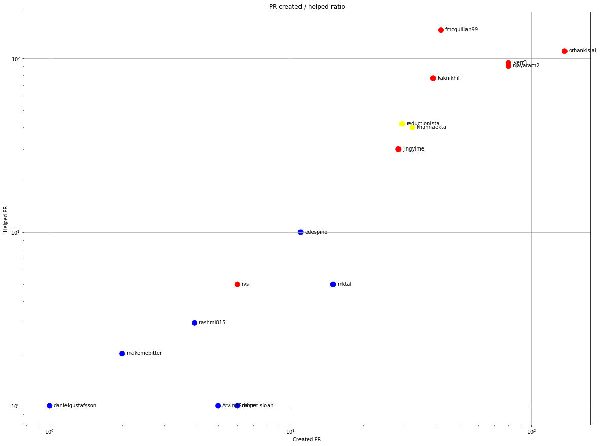
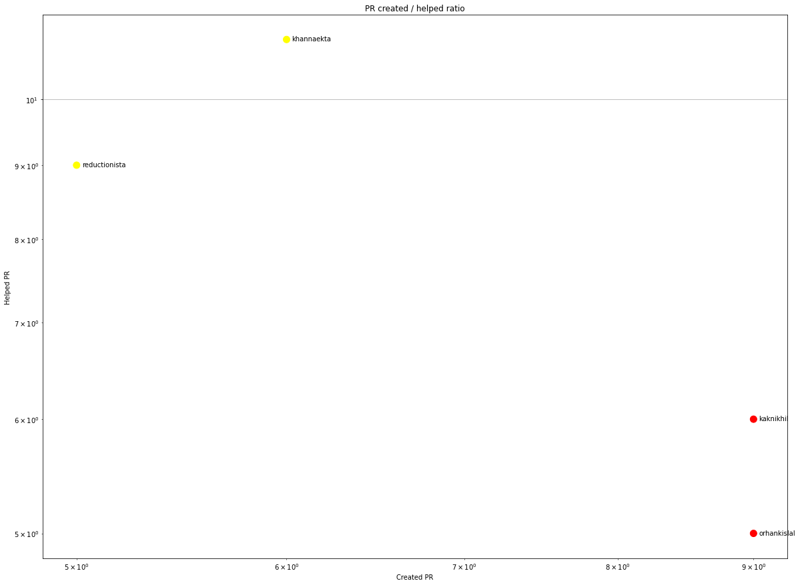
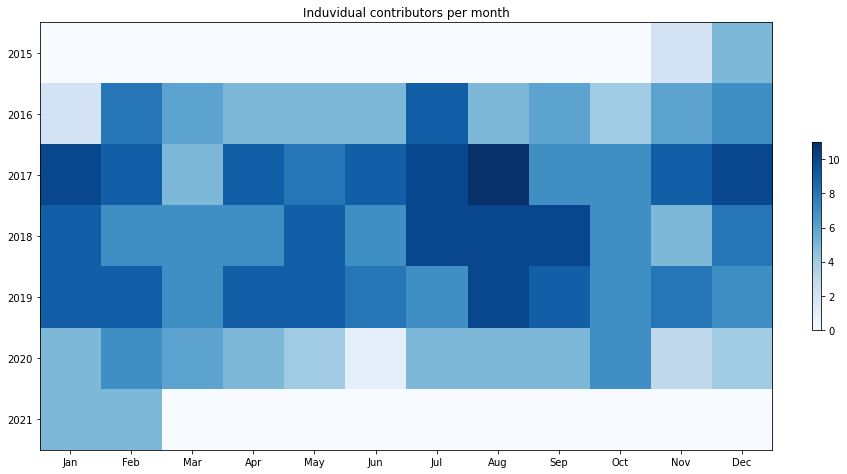
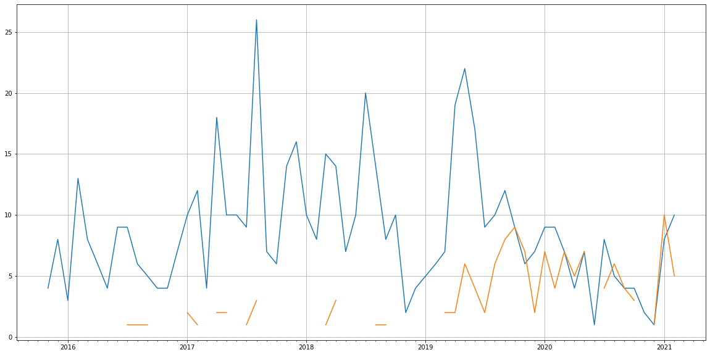
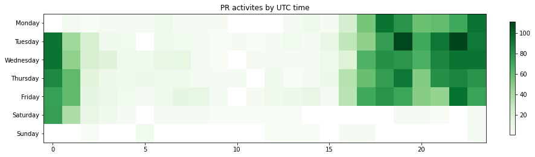

Latest record from the dataset:

<table border="1" class="dataframe">
  <thead>
    <tr style="text-align: right;">
      <th></th>
      <th>org</th>
      <th>repo</th>
      <th>type</th>
      <th>identifier</th>
      <th>subidentifier</th>
      <th>date</th>
      <th>author</th>
      <th>owner</th>
      <th>project</th>
    </tr>
  </thead>
  <tbody>
    <tr>
      <th>3511</th>
      <td>apache</td>
      <td>madlib</td>
      <td>PR_REVIEW_COMMENTED</td>
      <td>524</td>
      <td>NaN</td>
      <td>2021-02-11 19:25:34+00:00</td>
      <td>reductionista</td>
      <td>reductionista</td>
      <td>madlib</td>
    </tr>
  </tbody>
</table>

# Github Contributions per user

<table border="1" class="dataframe">
  <thead>
    <tr style="text-align: right;">
      <th></th>
      <th>contributions</th>
    </tr>
    <tr>
      <th>author</th>
      <th></th>
    </tr>
  </thead>
  <tbody>
    <tr>
      <th>asfgit</th>
      <td>988</td>
    </tr>
    <tr>
      <th>fmcquillan99</th>
      <td>308</td>
    </tr>
    <tr>
      <th>orhankislal</th>
      <td>190</td>
    </tr>
    <tr>
      <th>kaknikhil</th>
      <td>181</td>
    </tr>
    <tr>
      <th>njayaram2</th>
      <td>177</td>
    </tr>
    <tr>
      <th>iyerr3</th>
      <td>169</td>
    </tr>
    <tr>
      <th>asf-ci</th>
      <td>154</td>
    </tr>
    <tr>
      <th>reductionista</th>
      <td>106</td>
    </tr>
    <tr>
      <th>asfbot</th>
      <td>81</td>
    </tr>
    <tr>
      <th>khannaekta</th>
      <td>76</td>
    </tr>
  </tbody>
</table>

## Contributors per participations in PRs which are not created by self (helping PRs)

<table border="1" class="dataframe">
  <thead>
    <tr style="text-align: right;">
      <th></th>
      <th>identifier</th>
    </tr>
    <tr>
      <th>author</th>
      <th></th>
    </tr>
  </thead>
  <tbody>
    <tr>
      <th>asfgit</th>
      <td>306</td>
    </tr>
    <tr>
      <th>fmcquillan99</th>
      <td>145</td>
    </tr>
    <tr>
      <th>orhankislal</th>
      <td>110</td>
    </tr>
    <tr>
      <th>iyerr3</th>
      <td>94</td>
    </tr>
    <tr>
      <th>njayaram2</th>
      <td>90</td>
    </tr>
    <tr>
      <th>kaknikhil</th>
      <td>77</td>
    </tr>
    <tr>
      <th>reductionista</th>
      <td>42</td>
    </tr>
    <tr>
      <th>khannaekta</th>
      <td>40</td>
    </tr>
    <tr>
      <th>asf-ci</th>
      <td>38</td>
    </tr>
    <tr>
      <th>asfbot</th>
      <td>35</td>
    </tr>
    <tr>
      <th>jingyimei</th>
      <td>30</td>
    </tr>
    <tr>
      <th>edespino</th>
      <td>10</td>
    </tr>
    <tr>
      <th>mktal</th>
      <td>5</td>
    </tr>
    <tr>
      <th>rvs</th>
      <td>5</td>
    </tr>
    <tr>
      <th>ivannovick</th>
      <td>4</td>
    </tr>
    <tr>
      <th>decibel</th>
      <td>4</td>
    </tr>
    <tr>
      <th>rahiyer</th>
      <td>3</td>
    </tr>
    <tr>
      <th>haying</th>
      <td>3</td>
    </tr>
    <tr>
      <th>rashmi815</th>
      <td>3</td>
    </tr>
    <tr>
      <th>makemebitter</th>
      <td>2</td>
    </tr>
  </tbody>
</table>

## Contributors per participations in any PRs

<table border="1" class="dataframe">
  <thead>
    <tr style="text-align: right;">
      <th></th>
      <th>identifier</th>
    </tr>
    <tr>
      <th>author</th>
      <th></th>
    </tr>
  </thead>
  <tbody>
    <tr>
      <th>asfgit</th>
      <td>306</td>
    </tr>
    <tr>
      <th>orhankislal</th>
      <td>245</td>
    </tr>
    <tr>
      <th>fmcquillan99</th>
      <td>185</td>
    </tr>
    <tr>
      <th>iyerr3</th>
      <td>174</td>
    </tr>
    <tr>
      <th>njayaram2</th>
      <td>170</td>
    </tr>
    <tr>
      <th>kaknikhil</th>
      <td>116</td>
    </tr>
    <tr>
      <th>khannaekta</th>
      <td>72</td>
    </tr>
    <tr>
      <th>reductionista</th>
      <td>71</td>
    </tr>
    <tr>
      <th>jingyimei</th>
      <td>58</td>
    </tr>
    <tr>
      <th>asf-ci</th>
      <td>38</td>
    </tr>
    <tr>
      <th>asfbot</th>
      <td>35</td>
    </tr>
    <tr>
      <th>edespino</th>
      <td>21</td>
    </tr>
    <tr>
      <th>mktal</th>
      <td>19</td>
    </tr>
    <tr>
      <th>hpandeycodeit</th>
      <td>18</td>
    </tr>
    <tr>
      <th>rvs</th>
      <td>11</td>
    </tr>
    <tr>
      <th>rashmi815</th>
      <td>7</td>
    </tr>
    <tr>
      <th>cooper-sloan</th>
      <td>7</td>
    </tr>
    <tr>
      <th>ArvindSridhar</th>
      <td>6</td>
    </tr>
    <tr>
      <th>snaga</th>
      <td>5</td>
    </tr>
    <tr>
      <th>makemebitter</th>
      <td>4</td>
    </tr>
  </tbody>
</table>

# Bus factor (number of contributors responsible for the 50% of the prs) from last half year

## Contributors until the half of the all contributions

<table border="1" class="dataframe">
  <thead>
    <tr style="text-align: right;">
      <th></th>
      <th>author</th>
      <th>identifier</th>
      <th>cs</th>
      <th>ratio</th>
    </tr>
  </thead>
  <tbody>
    <tr>
      <th>0</th>
      <td>kaknikhil</td>
      <td>9</td>
      <td>9</td>
      <td>28.125</td>
    </tr>
  </tbody>
</table>

## Pony number (bus factor)

    2

## Dev power (All the contributions in the ration of the top contributor)

    3.555555555555556

    

    

## People with created PRs > reviewed/commented PRS

    

    

## Same graph with focusing to the last 6 month

Only contributors with both created pr and helped pr visible

    

    

# Number of individual contributors per month

Number of different Github users who either created PR, commented PR, added review to a PR

Note: only events from apache/hadoop-ozone repository are included. Earlier PRs/comments are not here.

    

    

# Number of PRs closed/created per month

    /usr/lib/python3.9/site-packages/pandas/core/arrays/datetimes.py:1101: UserWarning: Converting to PeriodArray/Index representation will drop timezone information.
      warnings.warn(

    

    

# PR activity heatmap

    

    

