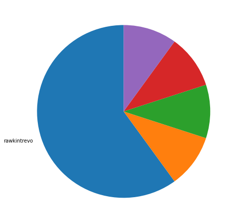
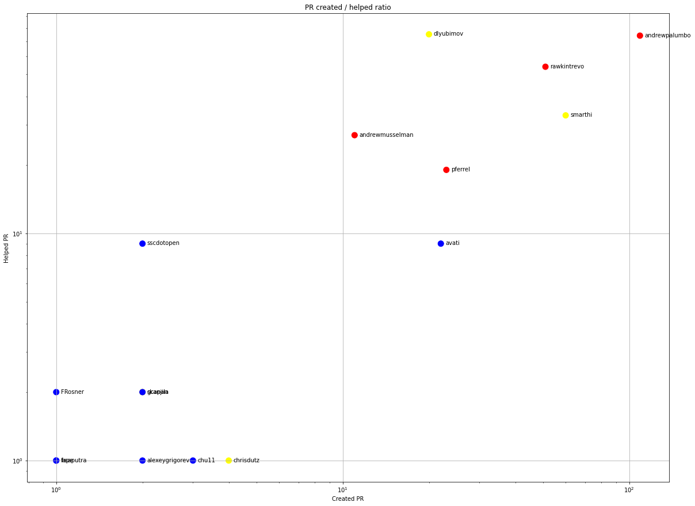
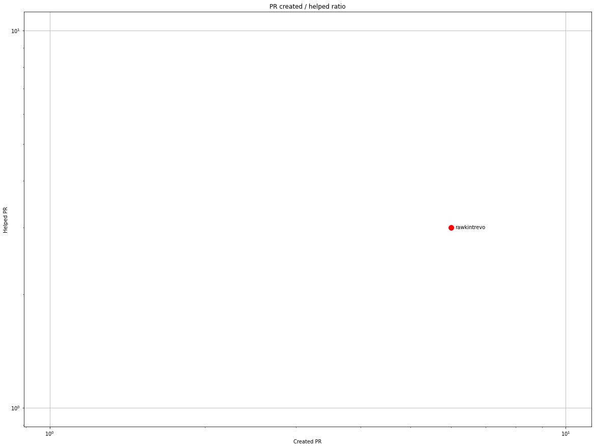
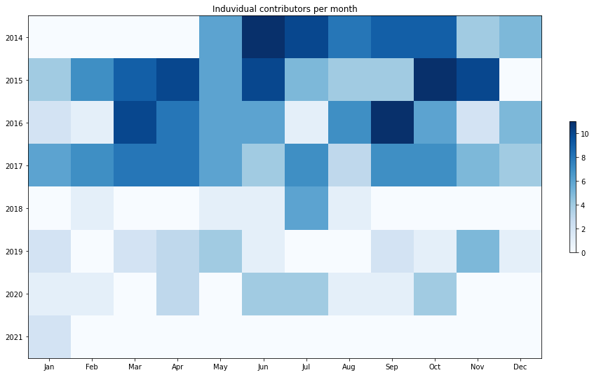
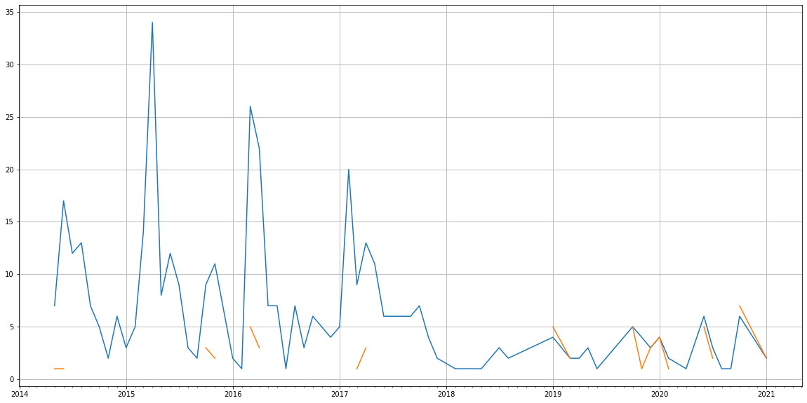
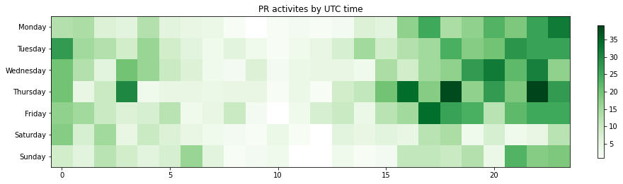

Latest record from the dataset:

<table border="1" class="dataframe">
  <thead>
    <tr style="text-align: right;">
      <th></th>
      <th>org</th>
      <th>repo</th>
      <th>type</th>
      <th>identifier</th>
      <th>subidentifier</th>
      <th>date</th>
      <th>author</th>
      <th>owner</th>
      <th>project</th>
    </tr>
  </thead>
  <tbody>
    <tr>
      <th>1478</th>
      <td>apache</td>
      <td>mahout</td>
      <td>PR_MERGED</td>
      <td>413</td>
      <td>NaN</td>
      <td>2021-01-28 14:42:05+00:00</td>
      <td>rawkintrevo</td>
      <td>josehernandezsc</td>
      <td>mahout</td>
    </tr>
  </tbody>
</table>

# Github Contributions per user

<table border="1" class="dataframe">
  <thead>
    <tr style="text-align: right;">
      <th></th>
      <th>contributions</th>
    </tr>
    <tr>
      <th>author</th>
      <th></th>
    </tr>
  </thead>
  <tbody>
    <tr>
      <th>andrewpalumbo</th>
      <td>220</td>
    </tr>
    <tr>
      <th>dlyubimov</th>
      <td>207</td>
    </tr>
    <tr>
      <th>rawkintrevo</th>
      <td>146</td>
    </tr>
    <tr>
      <th>pferrel</th>
      <td>79</td>
    </tr>
    <tr>
      <th>smarthi</th>
      <td>67</td>
    </tr>
    <tr>
      <th>avati</th>
      <td>46</td>
    </tr>
    <tr>
      <th>andrewmusselman</th>
      <td>36</td>
    </tr>
    <tr>
      <th>asfgit</th>
      <td>28</td>
    </tr>
    <tr>
      <th>tdunning</th>
      <td>17</td>
    </tr>
    <tr>
      <th>sscdotopen</th>
      <td>11</td>
    </tr>
  </tbody>
</table>

## Contributors per participations in PRs which are not created by self (helping PRs)

<table border="1" class="dataframe">
  <thead>
    <tr style="text-align: right;">
      <th></th>
      <th>identifier</th>
    </tr>
    <tr>
      <th>author</th>
      <th></th>
    </tr>
  </thead>
  <tbody>
    <tr>
      <th>dlyubimov</th>
      <td>75</td>
    </tr>
    <tr>
      <th>andrewpalumbo</th>
      <td>74</td>
    </tr>
    <tr>
      <th>rawkintrevo</th>
      <td>54</td>
    </tr>
    <tr>
      <th>smarthi</th>
      <td>33</td>
    </tr>
    <tr>
      <th>asfgit</th>
      <td>28</td>
    </tr>
    <tr>
      <th>andrewmusselman</th>
      <td>27</td>
    </tr>
    <tr>
      <th>pferrel</th>
      <td>19</td>
    </tr>
    <tr>
      <th>avati</th>
      <td>9</td>
    </tr>
    <tr>
      <th>sscdotopen</th>
      <td>9</td>
    </tr>
    <tr>
      <th>tdunning</th>
      <td>6</td>
    </tr>
    <tr>
      <th>skanjila</th>
      <td>2</td>
    </tr>
    <tr>
      <th>FRosner</th>
      <td>2</td>
    </tr>
    <tr>
      <th>gcapan</th>
      <td>2</td>
    </tr>
    <tr>
      <th>mariusmuja</th>
      <td>1</td>
    </tr>
    <tr>
      <th>sslavic</th>
      <td>1</td>
    </tr>
    <tr>
      <th>svidovich</th>
      <td>1</td>
    </tr>
    <tr>
      <th>rmetzger</th>
      <td>1</td>
    </tr>
    <tr>
      <th>r-tock</th>
      <td>1</td>
    </tr>
    <tr>
      <th>AddictedCS</th>
      <td>1</td>
    </tr>
    <tr>
      <th>jinspark-lab</th>
      <td>1</td>
    </tr>
  </tbody>
</table>

## Contributors per participations in any PRs

<table border="1" class="dataframe">
  <thead>
    <tr style="text-align: right;">
      <th></th>
      <th>identifier</th>
    </tr>
    <tr>
      <th>author</th>
      <th></th>
    </tr>
  </thead>
  <tbody>
    <tr>
      <th>andrewpalumbo</th>
      <td>183</td>
    </tr>
    <tr>
      <th>rawkintrevo</th>
      <td>105</td>
    </tr>
    <tr>
      <th>dlyubimov</th>
      <td>95</td>
    </tr>
    <tr>
      <th>smarthi</th>
      <td>93</td>
    </tr>
    <tr>
      <th>pferrel</th>
      <td>42</td>
    </tr>
    <tr>
      <th>andrewmusselman</th>
      <td>38</td>
    </tr>
    <tr>
      <th>avati</th>
      <td>31</td>
    </tr>
    <tr>
      <th>asfgit</th>
      <td>28</td>
    </tr>
    <tr>
      <th>sscdotopen</th>
      <td>11</td>
    </tr>
    <tr>
      <th>tdunning</th>
      <td>6</td>
    </tr>
    <tr>
      <th>chrisdutz</th>
      <td>5</td>
    </tr>
    <tr>
      <th>chu11</th>
      <td>4</td>
    </tr>
    <tr>
      <th>dustinvanstee</th>
      <td>4</td>
    </tr>
    <tr>
      <th>skanjila</th>
      <td>4</td>
    </tr>
    <tr>
      <th>gcapan</th>
      <td>4</td>
    </tr>
    <tr>
      <th>AdityaAS</th>
      <td>4</td>
    </tr>
    <tr>
      <th>magsol</th>
      <td>4</td>
    </tr>
    <tr>
      <th>BruceKuiLiu</th>
      <td>4</td>
    </tr>
    <tr>
      <th>alexeygrigorev</th>
      <td>3</td>
    </tr>
    <tr>
      <th>krichter722</th>
      <td>3</td>
    </tr>
  </tbody>
</table>

# Bus factor (number of contributors responsible for the 50% of the prs) from last half year

## Contributors until the half of the all contributions

<table border="1" class="dataframe">
  <thead>
    <tr style="text-align: right;">
      <th></th>
      <th>author</th>
      <th>identifier</th>
      <th>cs</th>
      <th>ratio</th>
    </tr>
  </thead>
  <tbody>
  </tbody>
</table>

## Pony number (bus factor)

    1

## Dev power (All the contributions in the ration of the top contributor)

    1.666666666666667

    

    

## People with created PRs > reviewed/commented PRS

    

    

## Same graph with focusing to the last 6 month

Only contributors with both created pr and helped pr visible

    

    

# Number of individual contributors per month

Number of different Github users who either created PR, commented PR, added review to a PR

Note: only events from apache/hadoop-ozone repository are included. Earlier PRs/comments are not here.

    

    

# Number of PRs closed/created per month

    /usr/lib/python3.9/site-packages/pandas/core/arrays/datetimes.py:1101: UserWarning: Converting to PeriodArray/Index representation will drop timezone information.
      warnings.warn(

    

    

# PR activity heatmap

    

    

