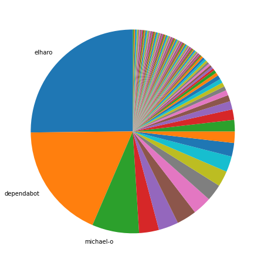
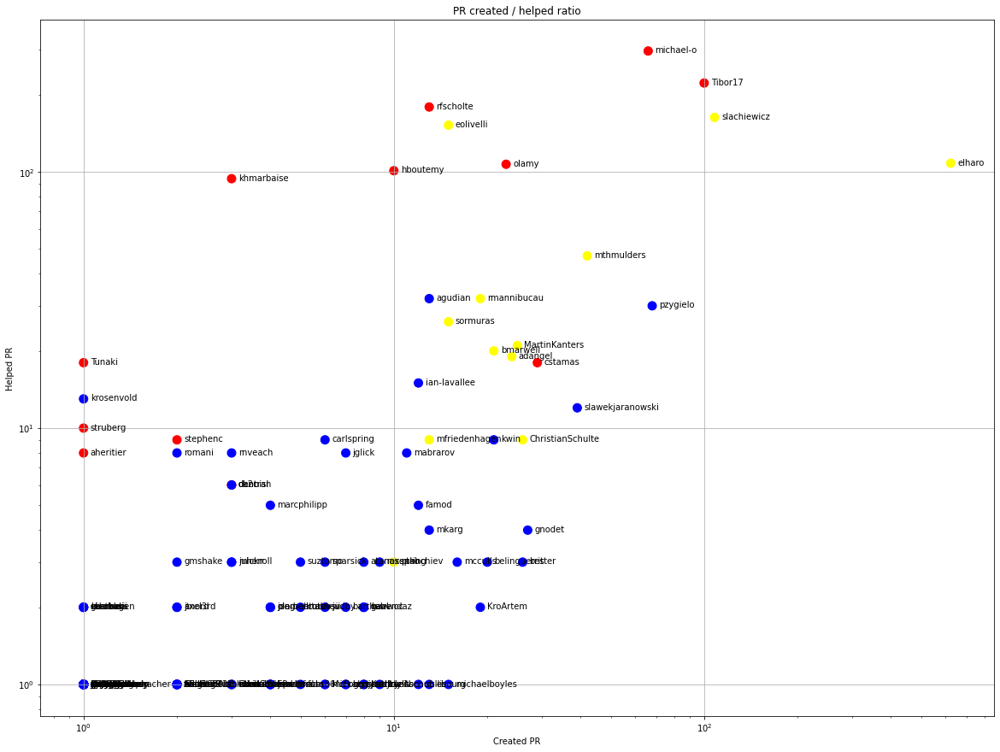
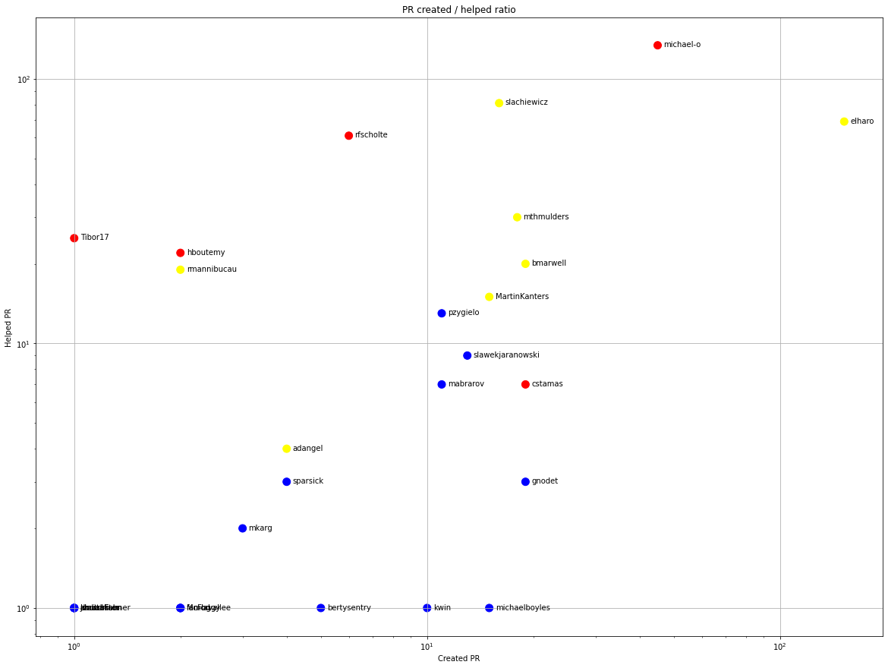
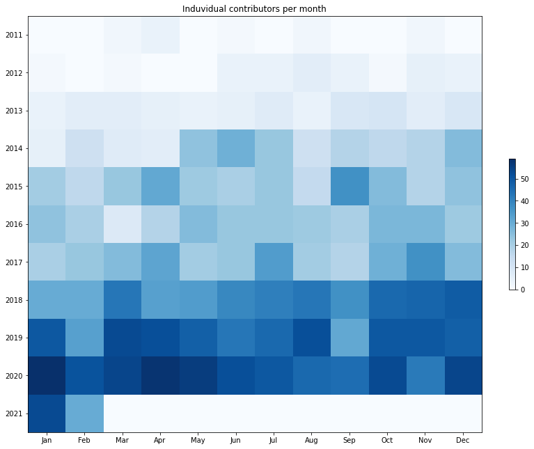
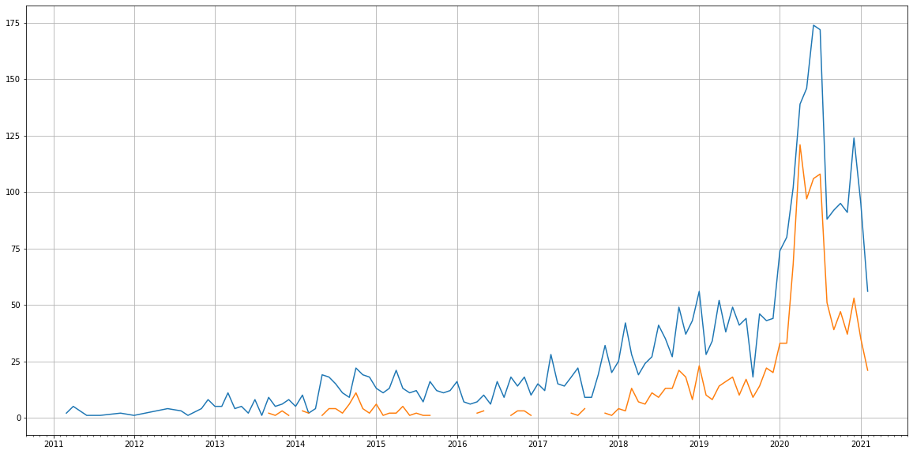
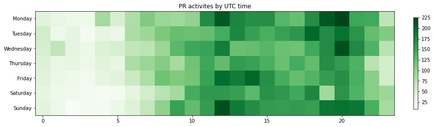

Latest record from the dataset:

<table border="1" class="dataframe">
  <thead>
    <tr style="text-align: right;">
      <th></th>
      <th>org</th>
      <th>repo</th>
      <th>type</th>
      <th>identifier</th>
      <th>subidentifier</th>
      <th>date</th>
      <th>author</th>
      <th>owner</th>
      <th>project</th>
    </tr>
  </thead>
  <tbody>
    <tr>
      <th>7646</th>
      <td>apache</td>
      <td>maven-integration-testing</td>
      <td>PR_REVIEW_CHANGES_REQUESTED</td>
      <td>100</td>
      <td>NaN</td>
      <td>2021-02-13 19:33:03+00:00</td>
      <td>michael-o</td>
      <td>MartinKanters</td>
      <td>maven</td>
    </tr>
  </tbody>
</table>

# Github Contributions per user

<table border="1" class="dataframe">
  <thead>
    <tr style="text-align: right;">
      <th></th>
      <th>contributions</th>
    </tr>
    <tr>
      <th>author</th>
      <th></th>
    </tr>
  </thead>
  <tbody>
    <tr>
      <th>michael-o</th>
      <td>2145</td>
    </tr>
    <tr>
      <th>Tibor17</th>
      <td>1463</td>
    </tr>
    <tr>
      <th>rfscholte</th>
      <td>779</td>
    </tr>
    <tr>
      <th>eolivelli</th>
      <td>624</td>
    </tr>
    <tr>
      <th>elharo</th>
      <td>550</td>
    </tr>
    <tr>
      <th>slachiewicz</th>
      <td>433</td>
    </tr>
    <tr>
      <th>hboutemy</th>
      <td>365</td>
    </tr>
    <tr>
      <th>khmarbaise</th>
      <td>337</td>
    </tr>
    <tr>
      <th>olamy</th>
      <td>310</td>
    </tr>
    <tr>
      <th>asfgit</th>
      <td>177</td>
    </tr>
  </tbody>
</table>

## Contributors per participations in PRs which are not created by self (helping PRs)

<table border="1" class="dataframe">
  <thead>
    <tr style="text-align: right;">
      <th></th>
      <th>identifier</th>
    </tr>
    <tr>
      <th>author</th>
      <th></th>
    </tr>
  </thead>
  <tbody>
    <tr>
      <th>michael-o</th>
      <td>296</td>
    </tr>
    <tr>
      <th>Tibor17</th>
      <td>222</td>
    </tr>
    <tr>
      <th>rfscholte</th>
      <td>179</td>
    </tr>
    <tr>
      <th>slachiewicz</th>
      <td>163</td>
    </tr>
    <tr>
      <th>eolivelli</th>
      <td>152</td>
    </tr>
    <tr>
      <th>asfgit</th>
      <td>130</td>
    </tr>
    <tr>
      <th>elharo</th>
      <td>108</td>
    </tr>
    <tr>
      <th>olamy</th>
      <td>107</td>
    </tr>
    <tr>
      <th>hboutemy</th>
      <td>101</td>
    </tr>
    <tr>
      <th>khmarbaise</th>
      <td>94</td>
    </tr>
    <tr>
      <th>mthmulders</th>
      <td>47</td>
    </tr>
    <tr>
      <th>jvanzyl</th>
      <td>47</td>
    </tr>
    <tr>
      <th>agudian</th>
      <td>32</td>
    </tr>
    <tr>
      <th>rmannibucau</th>
      <td>32</td>
    </tr>
    <tr>
      <th>pzygielo</th>
      <td>30</td>
    </tr>
    <tr>
      <th>asfbot</th>
      <td>28</td>
    </tr>
    <tr>
      <th>sormuras</th>
      <td>26</td>
    </tr>
    <tr>
      <th>MartinKanters</th>
      <td>21</td>
    </tr>
    <tr>
      <th>bmarwell</th>
      <td>20</td>
    </tr>
    <tr>
      <th>adangel</th>
      <td>19</td>
    </tr>
  </tbody>
</table>

## Contributors per participations in any PRs

<table border="1" class="dataframe">
  <thead>
    <tr style="text-align: right;">
      <th></th>
      <th>identifier</th>
    </tr>
    <tr>
      <th>author</th>
      <th></th>
    </tr>
  </thead>
  <tbody>
    <tr>
      <th>michael-o</th>
      <td>323</td>
    </tr>
    <tr>
      <th>Tibor17</th>
      <td>301</td>
    </tr>
    <tr>
      <th>elharo</th>
      <td>212</td>
    </tr>
    <tr>
      <th>slachiewicz</th>
      <td>203</td>
    </tr>
    <tr>
      <th>rfscholte</th>
      <td>190</td>
    </tr>
    <tr>
      <th>eolivelli</th>
      <td>160</td>
    </tr>
    <tr>
      <th>asfgit</th>
      <td>130</td>
    </tr>
    <tr>
      <th>olamy</th>
      <td>112</td>
    </tr>
    <tr>
      <th>hboutemy</th>
      <td>107</td>
    </tr>
    <tr>
      <th>dependabot</th>
      <td>104</td>
    </tr>
    <tr>
      <th>khmarbaise</th>
      <td>94</td>
    </tr>
    <tr>
      <th>mthmulders</th>
      <td>86</td>
    </tr>
    <tr>
      <th>pzygielo</th>
      <td>66</td>
    </tr>
    <tr>
      <th>rmannibucau</th>
      <td>48</td>
    </tr>
    <tr>
      <th>jvanzyl</th>
      <td>47</td>
    </tr>
    <tr>
      <th>MartinKanters</th>
      <td>46</td>
    </tr>
    <tr>
      <th>agudian</th>
      <td>45</td>
    </tr>
    <tr>
      <th>cstamas</th>
      <td>43</td>
    </tr>
    <tr>
      <th>slawekjaranowski</th>
      <td>38</td>
    </tr>
    <tr>
      <th>sormuras</th>
      <td>37</td>
    </tr>
  </tbody>
</table>

# Bus factor (number of contributors responsible for the 50% of the prs) from last half year

## Contributors until the half of the all contributions

<table border="1" class="dataframe">
  <thead>
    <tr style="text-align: right;">
      <th></th>
      <th>author</th>
      <th>identifier</th>
      <th>cs</th>
      <th>ratio</th>
    </tr>
  </thead>
  <tbody>
    <tr>
      <th>0</th>
      <td>elharo</td>
      <td>152</td>
      <td>152</td>
      <td>25.165563</td>
    </tr>
    <tr>
      <th>1</th>
      <td>dependabot</td>
      <td>111</td>
      <td>263</td>
      <td>18.377483</td>
    </tr>
  </tbody>
</table>

## Pony number (bus factor)

    3

## Dev power (All the contributions in the ration of the top contributor)

    3.9736842105263164

    

    

## People with created PRs > reviewed/commented PRS

    

    

## Same graph with focusing to the last 6 month

Only contributors with both created pr and helped pr visible

    

    

# Number of individual contributors per month

Number of different Github users who either created PR, commented PR, added review to a PR

Note: only events from apache/hadoop-ozone repository are included. Earlier PRs/comments are not here.

    

    

# Number of PRs closed/created per month

    /usr/lib/python3.9/site-packages/pandas/core/arrays/datetimes.py:1101: UserWarning: Converting to PeriodArray/Index representation will drop timezone information.
      warnings.warn(

    

    

# PR activity heatmap

    

    

