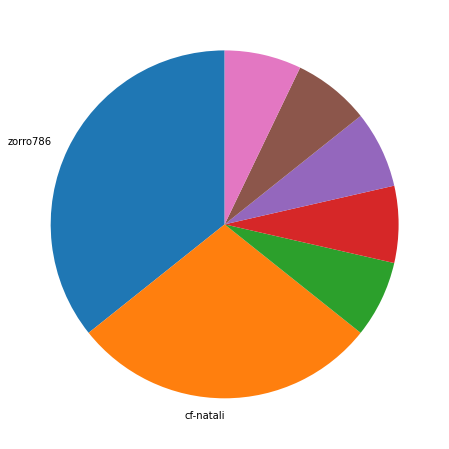
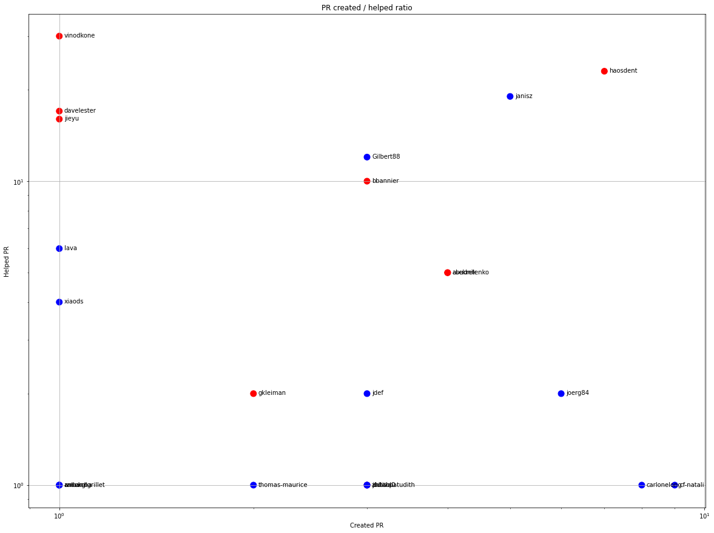
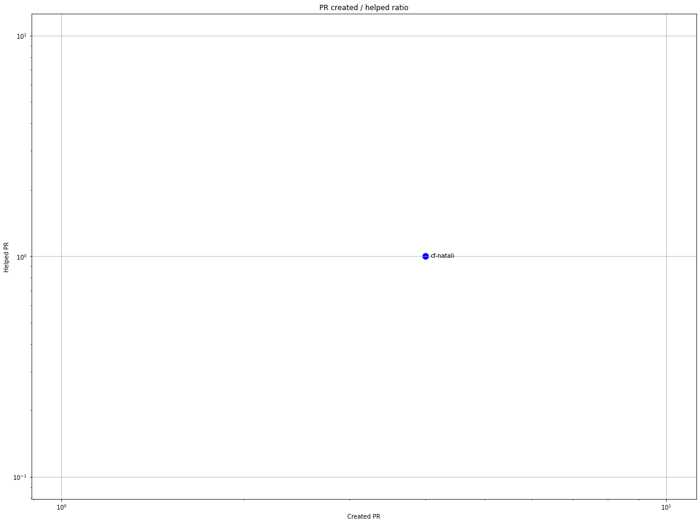
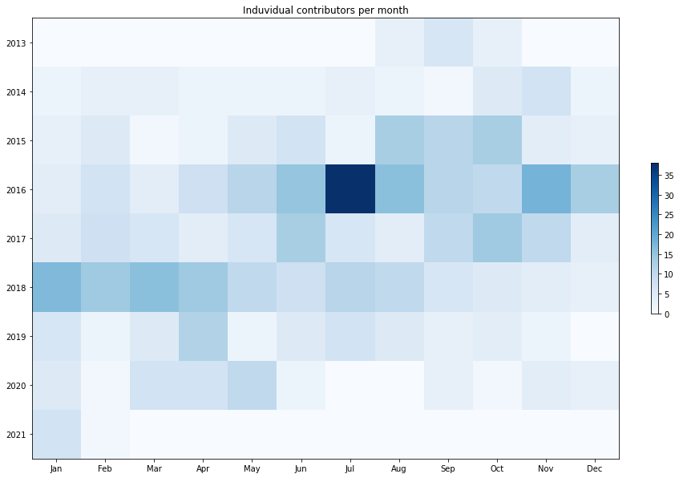
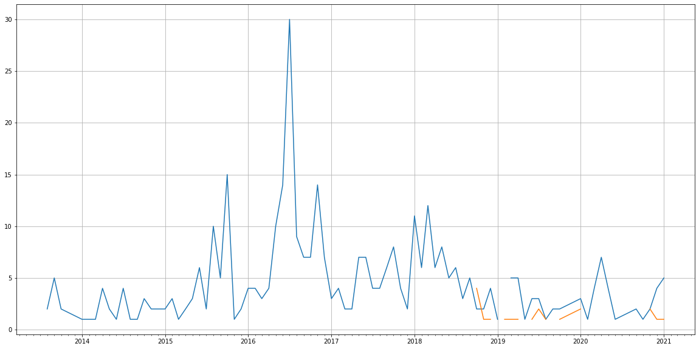
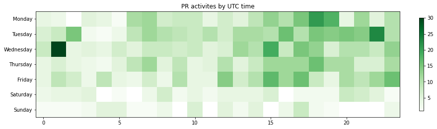

Latest record from the dataset:

<table border="1" class="dataframe">
  <thead>
    <tr style="text-align: right;">
      <th></th>
      <th>org</th>
      <th>repo</th>
      <th>type</th>
      <th>identifier</th>
      <th>subidentifier</th>
      <th>date</th>
      <th>author</th>
      <th>owner</th>
      <th>project</th>
    </tr>
  </thead>
  <tbody>
    <tr>
      <th>1013</th>
      <td>apache</td>
      <td>mesos</td>
      <td>PR_COMMENTED</td>
      <td>380</td>
      <td>NaN</td>
      <td>2021-02-04 20:49:28+00:00</td>
      <td>cf-natali</td>
      <td>cf-natali</td>
      <td>mesos</td>
    </tr>
  </tbody>
</table>

# Github Contributions per user

<table border="1" class="dataframe">
  <thead>
    <tr style="text-align: right;">
      <th></th>
      <th>contributions</th>
    </tr>
    <tr>
      <th>author</th>
      <th></th>
    </tr>
  </thead>
  <tbody>
    <tr>
      <th>bmahler</th>
      <td>58</td>
    </tr>
    <tr>
      <th>vinodkone</th>
      <td>51</td>
    </tr>
    <tr>
      <th>haosdent</th>
      <td>43</td>
    </tr>
    <tr>
      <th>jfarrell</th>
      <td>34</td>
    </tr>
    <tr>
      <th>jieyu</th>
      <td>27</td>
    </tr>
    <tr>
      <th>greggomann</th>
      <td>27</td>
    </tr>
    <tr>
      <th>janisz</th>
      <td>21</td>
    </tr>
    <tr>
      <th>jpeach</th>
      <td>19</td>
    </tr>
    <tr>
      <th>davelester</th>
      <td>18</td>
    </tr>
    <tr>
      <th>bbannier</th>
      <td>16</td>
    </tr>
  </tbody>
</table>

## Contributors per participations in PRs which are not created by self (helping PRs)

<table border="1" class="dataframe">
  <thead>
    <tr style="text-align: right;">
      <th></th>
      <th>identifier</th>
    </tr>
    <tr>
      <th>author</th>
      <th></th>
    </tr>
  </thead>
  <tbody>
    <tr>
      <th>bmahler</th>
      <td>35</td>
    </tr>
    <tr>
      <th>jfarrell</th>
      <td>34</td>
    </tr>
    <tr>
      <th>vinodkone</th>
      <td>30</td>
    </tr>
    <tr>
      <th>haosdent</th>
      <td>23</td>
    </tr>
    <tr>
      <th>greggomann</th>
      <td>20</td>
    </tr>
    <tr>
      <th>janisz</th>
      <td>19</td>
    </tr>
    <tr>
      <th>davelester</th>
      <td>17</td>
    </tr>
    <tr>
      <th>jieyu</th>
      <td>16</td>
    </tr>
    <tr>
      <th>kaysoky</th>
      <td>12</td>
    </tr>
    <tr>
      <th>jpeach</th>
      <td>12</td>
    </tr>
    <tr>
      <th>Gilbert88</th>
      <td>12</td>
    </tr>
    <tr>
      <th>rukletsov</th>
      <td>11</td>
    </tr>
    <tr>
      <th>bbannier</th>
      <td>10</td>
    </tr>
    <tr>
      <th>tillt</th>
      <td>7</td>
    </tr>
    <tr>
      <th>lava</th>
      <td>6</td>
    </tr>
    <tr>
      <th>asfgit</th>
      <td>6</td>
    </tr>
    <tr>
      <th>qianzhangxa</th>
      <td>6</td>
    </tr>
    <tr>
      <th>abudnik</th>
      <td>5</td>
    </tr>
    <tr>
      <th>mpark</th>
      <td>5</td>
    </tr>
    <tr>
      <th>asekretenko</th>
      <td>5</td>
    </tr>
  </tbody>
</table>

## Contributors per participations in any PRs

<table border="1" class="dataframe">
  <thead>
    <tr style="text-align: right;">
      <th></th>
      <th>identifier</th>
    </tr>
    <tr>
      <th>author</th>
      <th></th>
    </tr>
  </thead>
  <tbody>
    <tr>
      <th>bmahler</th>
      <td>35</td>
    </tr>
    <tr>
      <th>jfarrell</th>
      <td>34</td>
    </tr>
    <tr>
      <th>vinodkone</th>
      <td>31</td>
    </tr>
    <tr>
      <th>haosdent</th>
      <td>30</td>
    </tr>
    <tr>
      <th>janisz</th>
      <td>24</td>
    </tr>
    <tr>
      <th>greggomann</th>
      <td>20</td>
    </tr>
    <tr>
      <th>davelester</th>
      <td>18</td>
    </tr>
    <tr>
      <th>jieyu</th>
      <td>17</td>
    </tr>
    <tr>
      <th>Gilbert88</th>
      <td>15</td>
    </tr>
    <tr>
      <th>bbannier</th>
      <td>13</td>
    </tr>
    <tr>
      <th>kaysoky</th>
      <td>12</td>
    </tr>
    <tr>
      <th>jpeach</th>
      <td>12</td>
    </tr>
    <tr>
      <th>rukletsov</th>
      <td>11</td>
    </tr>
    <tr>
      <th>cf-natali</th>
      <td>10</td>
    </tr>
    <tr>
      <th>asekretenko</th>
      <td>9</td>
    </tr>
    <tr>
      <th>carlonelong</th>
      <td>9</td>
    </tr>
    <tr>
      <th>abudnik</th>
      <td>9</td>
    </tr>
    <tr>
      <th>joerg84</th>
      <td>8</td>
    </tr>
    <tr>
      <th>lava</th>
      <td>7</td>
    </tr>
    <tr>
      <th>tillt</th>
      <td>7</td>
    </tr>
  </tbody>
</table>

# Bus factor (number of contributors responsible for the 50% of the prs) from last half year

## Contributors until the half of the all contributions

<table border="1" class="dataframe">
  <thead>
    <tr style="text-align: right;">
      <th></th>
      <th>author</th>
      <th>identifier</th>
      <th>cs</th>
      <th>ratio</th>
    </tr>
  </thead>
  <tbody>
    <tr>
      <th>0</th>
      <td>zorro786</td>
      <td>5</td>
      <td>5</td>
      <td>35.714286</td>
    </tr>
  </tbody>
</table>

## Pony number (bus factor)

    2

## Dev power (All the contributions in the ration of the top contributor)

    2.8000000000000007

    

    

## People with created PRs > reviewed/commented PRS

    

    

## Same graph with focusing to the last 6 month

Only contributors with both created pr and helped pr visible

    

    

# Number of individual contributors per month

Number of different Github users who either created PR, commented PR, added review to a PR

Note: only events from apache/hadoop-ozone repository are included. Earlier PRs/comments are not here.

    

    

# Number of PRs closed/created per month

    /usr/lib/python3.9/site-packages/pandas/core/arrays/datetimes.py:1101: UserWarning: Converting to PeriodArray/Index representation will drop timezone information.
      warnings.warn(

    

    

# PR activity heatmap

    

    

