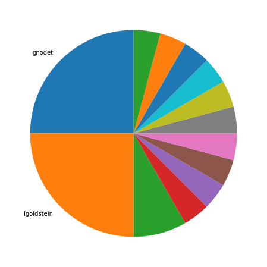
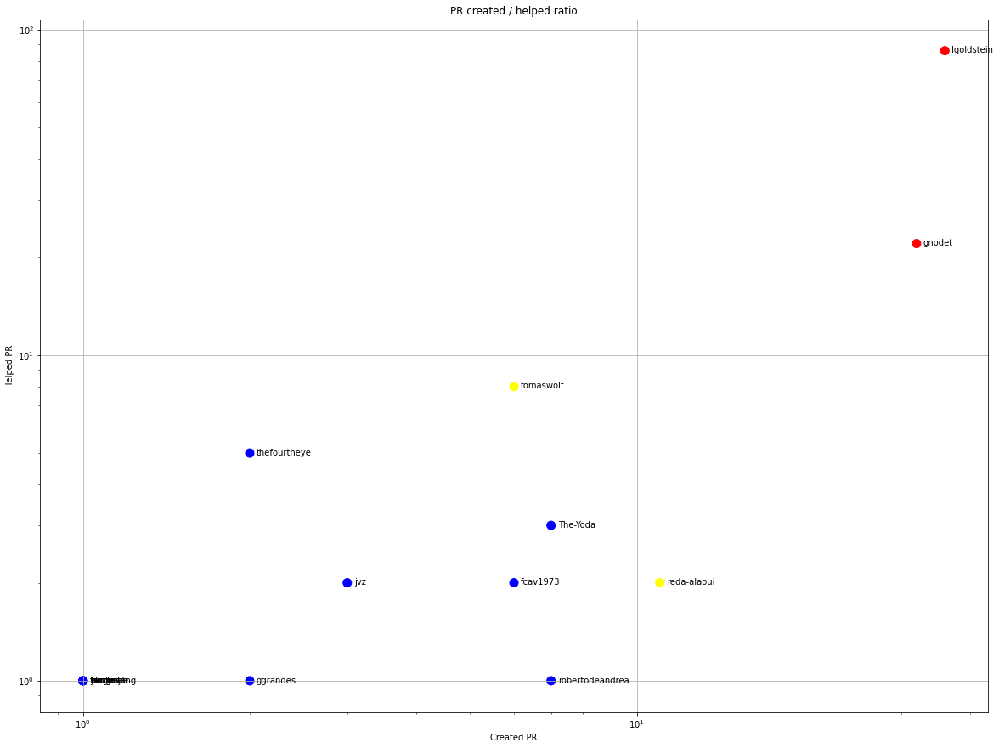
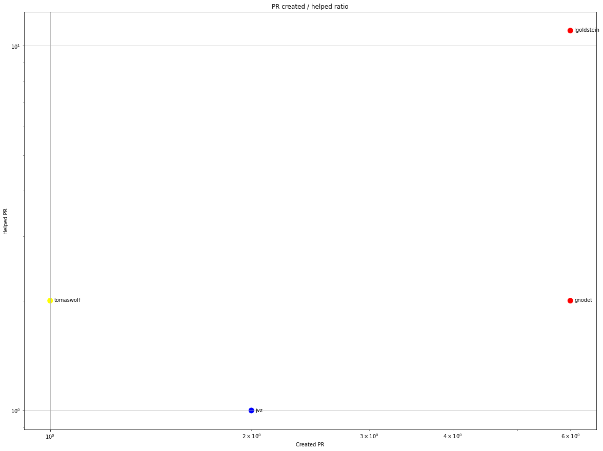
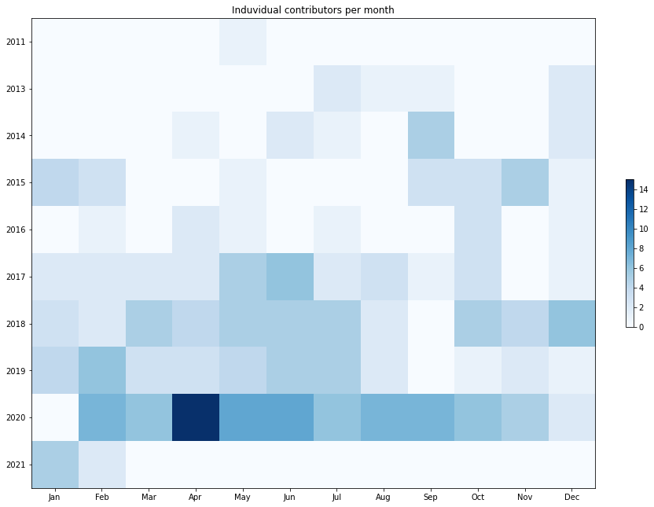
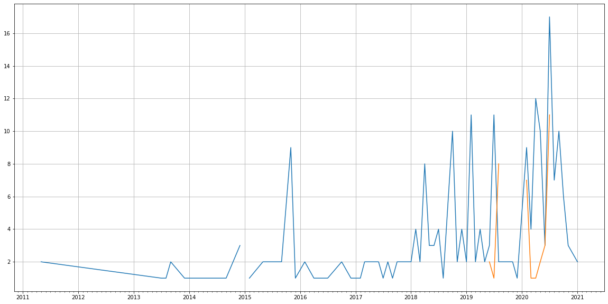
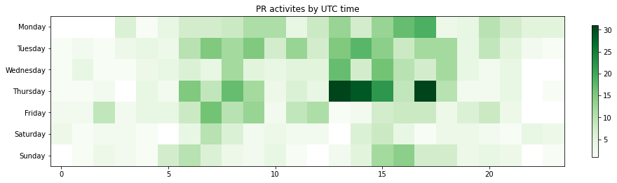

Latest record from the dataset:

<table border="1" class="dataframe">
  <thead>
    <tr style="text-align: right;">
      <th></th>
      <th>org</th>
      <th>repo</th>
      <th>type</th>
      <th>identifier</th>
      <th>subidentifier</th>
      <th>date</th>
      <th>author</th>
      <th>owner</th>
      <th>project</th>
    </tr>
  </thead>
  <tbody>
    <tr>
      <th>576</th>
      <td>apache</td>
      <td>mina-sshd</td>
      <td>PR_COMMENTED</td>
      <td>174</td>
      <td>NaN</td>
      <td>2021-02-05 08:56:15+00:00</td>
      <td>lgoldstein</td>
      <td>TrackerSB</td>
      <td>mina</td>
    </tr>
  </tbody>
</table>

# Github Contributions per user

<table border="1" class="dataframe">
  <thead>
    <tr style="text-align: right;">
      <th></th>
      <th>contributions</th>
    </tr>
    <tr>
      <th>author</th>
      <th></th>
    </tr>
  </thead>
  <tbody>
    <tr>
      <th>lgoldstein</th>
      <td>297</td>
    </tr>
    <tr>
      <th>gnodet</th>
      <td>40</td>
    </tr>
    <tr>
      <th>elecharny</th>
      <td>29</td>
    </tr>
    <tr>
      <th>tomaswolf</th>
      <td>19</td>
    </tr>
    <tr>
      <th>jon-valliere</th>
      <td>7</td>
    </tr>
    <tr>
      <th>thefourtheye</th>
      <td>7</td>
    </tr>
    <tr>
      <th>The-Yoda</th>
      <td>6</td>
    </tr>
    <tr>
      <th>fcav1973</th>
      <td>5</td>
    </tr>
    <tr>
      <th>asfgit</th>
      <td>4</td>
    </tr>
    <tr>
      <th>fengjiajie</th>
      <td>4</td>
    </tr>
  </tbody>
</table>

## Contributors per participations in PRs which are not created by self (helping PRs)

<table border="1" class="dataframe">
  <thead>
    <tr style="text-align: right;">
      <th></th>
      <th>identifier</th>
    </tr>
    <tr>
      <th>author</th>
      <th></th>
    </tr>
  </thead>
  <tbody>
    <tr>
      <th>lgoldstein</th>
      <td>86</td>
    </tr>
    <tr>
      <th>gnodet</th>
      <td>22</td>
    </tr>
    <tr>
      <th>elecharny</th>
      <td>15</td>
    </tr>
    <tr>
      <th>tomaswolf</th>
      <td>8</td>
    </tr>
    <tr>
      <th>thefourtheye</th>
      <td>5</td>
    </tr>
    <tr>
      <th>asfgit</th>
      <td>4</td>
    </tr>
    <tr>
      <th>The-Yoda</th>
      <td>3</td>
    </tr>
    <tr>
      <th>babofil</th>
      <td>3</td>
    </tr>
    <tr>
      <th>jon-valliere</th>
      <td>3</td>
    </tr>
    <tr>
      <th>reda-alaoui</th>
      <td>2</td>
    </tr>
    <tr>
      <th>jvermillard</th>
      <td>2</td>
    </tr>
    <tr>
      <th>jcs090218</th>
      <td>2</td>
    </tr>
    <tr>
      <th>fcav1973</th>
      <td>2</td>
    </tr>
    <tr>
      <th>jvz</th>
      <td>2</td>
    </tr>
    <tr>
      <th>randolf</th>
      <td>1</td>
    </tr>
    <tr>
      <th>robertodeandrea</th>
      <td>1</td>
    </tr>
    <tr>
      <th>pkufranky</th>
      <td>1</td>
    </tr>
    <tr>
      <th>panmengyun</th>
      <td>1</td>
    </tr>
    <tr>
      <th>oleg-nenashev</th>
      <td>1</td>
    </tr>
    <tr>
      <th>sramki</th>
      <td>1</td>
    </tr>
  </tbody>
</table>

## Contributors per participations in any PRs

<table border="1" class="dataframe">
  <thead>
    <tr style="text-align: right;">
      <th></th>
      <th>identifier</th>
    </tr>
    <tr>
      <th>author</th>
      <th></th>
    </tr>
  </thead>
  <tbody>
    <tr>
      <th>lgoldstein</th>
      <td>122</td>
    </tr>
    <tr>
      <th>gnodet</th>
      <td>54</td>
    </tr>
    <tr>
      <th>elecharny</th>
      <td>15</td>
    </tr>
    <tr>
      <th>tomaswolf</th>
      <td>14</td>
    </tr>
    <tr>
      <th>reda-alaoui</th>
      <td>13</td>
    </tr>
    <tr>
      <th>The-Yoda</th>
      <td>10</td>
    </tr>
    <tr>
      <th>robertodeandrea</th>
      <td>8</td>
    </tr>
    <tr>
      <th>fcav1973</th>
      <td>8</td>
    </tr>
    <tr>
      <th>thefourtheye</th>
      <td>7</td>
    </tr>
    <tr>
      <th>alonbl</th>
      <td>7</td>
    </tr>
    <tr>
      <th>FliegenKLATSCH</th>
      <td>6</td>
    </tr>
    <tr>
      <th>wh0</th>
      <td>5</td>
    </tr>
    <tr>
      <th>jvz</th>
      <td>5</td>
    </tr>
    <tr>
      <th>rlenferink</th>
      <td>4</td>
    </tr>
    <tr>
      <th>rovarga</th>
      <td>4</td>
    </tr>
    <tr>
      <th>asfgit</th>
      <td>4</td>
    </tr>
    <tr>
      <th>jon-valliere</th>
      <td>3</td>
    </tr>
    <tr>
      <th>mheemskerk</th>
      <td>3</td>
    </tr>
    <tr>
      <th>davido</th>
      <td>3</td>
    </tr>
    <tr>
      <th>ggrandes</th>
      <td>3</td>
    </tr>
  </tbody>
</table>

# Bus factor (number of contributors responsible for the 50% of the prs) from last half year

## Contributors until the half of the all contributions

<table border="1" class="dataframe">
  <thead>
    <tr style="text-align: right;">
      <th></th>
      <th>author</th>
      <th>identifier</th>
      <th>cs</th>
      <th>ratio</th>
    </tr>
  </thead>
  <tbody>
    <tr>
      <th>0</th>
      <td>gnodet</td>
      <td>6</td>
      <td>6</td>
      <td>25.0</td>
    </tr>
  </tbody>
</table>

## Pony number (bus factor)

    2

## Dev power (All the contributions in the ration of the top contributor)

    3.999999999999999

    

    

## People with created PRs > reviewed/commented PRS

    

    

## Same graph with focusing to the last 6 month

Only contributors with both created pr and helped pr visible

    

    

# Number of individual contributors per month

Number of different Github users who either created PR, commented PR, added review to a PR

Note: only events from apache/hadoop-ozone repository are included. Earlier PRs/comments are not here.

    

    

# Number of PRs closed/created per month

    /usr/lib/python3.9/site-packages/pandas/core/arrays/datetimes.py:1101: UserWarning: Converting to PeriodArray/Index representation will drop timezone information.
      warnings.warn(

    

    

# PR activity heatmap

    

    

