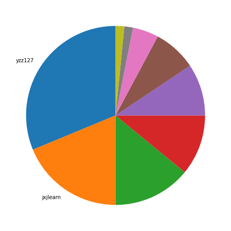
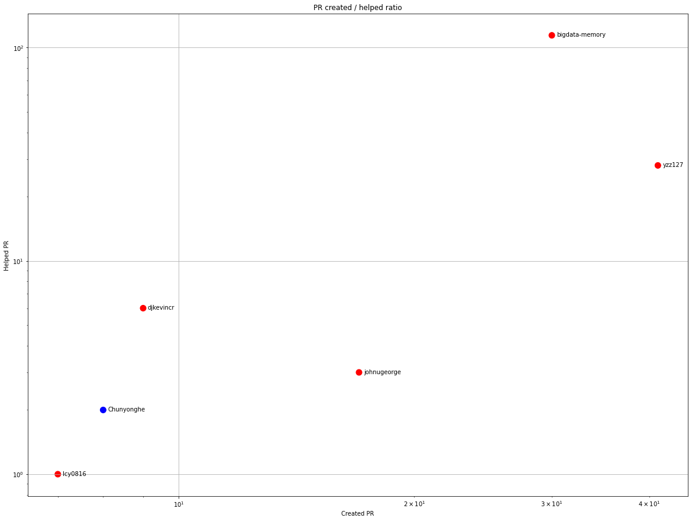
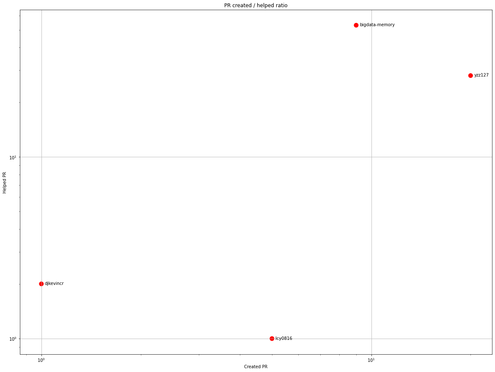
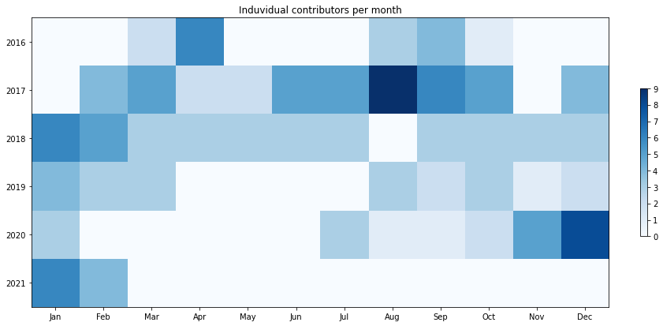
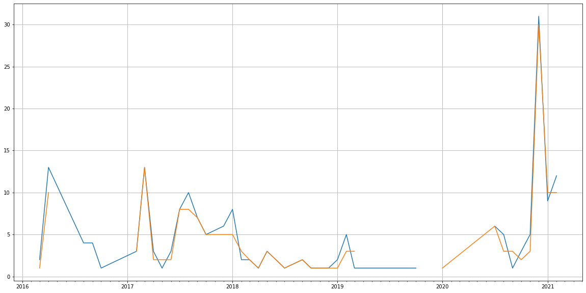
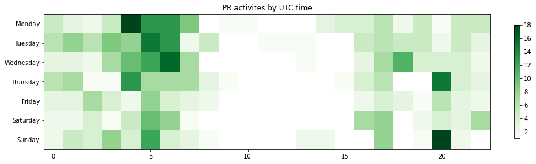

Latest record from the dataset:

<table border="1" class="dataframe">
  <thead>
    <tr style="text-align: right;">
      <th></th>
      <th>org</th>
      <th>repo</th>
      <th>type</th>
      <th>identifier</th>
      <th>subidentifier</th>
      <th>date</th>
      <th>author</th>
      <th>owner</th>
      <th>project</th>
    </tr>
  </thead>
  <tbody>
    <tr>
      <th>589</th>
      <td>apache</td>
      <td>mnemonic-site</td>
      <td>PR_REVIEW_APPROVED</td>
      <td>7</td>
      <td>NaN</td>
      <td>2021-02-14 06:34:27+00:00</td>
      <td>yzz127</td>
      <td>rhythmwind</td>
      <td>mnemonic</td>
    </tr>
  </tbody>
</table>

# Github Contributions per user

<table border="1" class="dataframe">
  <thead>
    <tr style="text-align: right;">
      <th></th>
      <th>contributions</th>
    </tr>
    <tr>
      <th>author</th>
      <th></th>
    </tr>
  </thead>
  <tbody>
    <tr>
      <th>bigdata-memory</th>
      <td>192</td>
    </tr>
    <tr>
      <th>asfgit</th>
      <td>97</td>
    </tr>
    <tr>
      <th>yzz127</th>
      <td>40</td>
    </tr>
    <tr>
      <th>djkevincr</th>
      <td>11</td>
    </tr>
    <tr>
      <th>Chunyonghe</th>
      <td>4</td>
    </tr>
    <tr>
      <th>johnugeorge</th>
      <td>3</td>
    </tr>
    <tr>
      <th>lcy0816</th>
      <td>2</td>
    </tr>
    <tr>
      <th>hsaputra</th>
      <td>1</td>
    </tr>
  </tbody>
</table>

## Contributors per participations in PRs which are not created by self (helping PRs)

<table border="1" class="dataframe">
  <thead>
    <tr style="text-align: right;">
      <th></th>
      <th>identifier</th>
    </tr>
    <tr>
      <th>author</th>
      <th></th>
    </tr>
  </thead>
  <tbody>
    <tr>
      <th>bigdata-memory</th>
      <td>114</td>
    </tr>
    <tr>
      <th>asfgit</th>
      <td>96</td>
    </tr>
    <tr>
      <th>yzz127</th>
      <td>28</td>
    </tr>
    <tr>
      <th>djkevincr</th>
      <td>6</td>
    </tr>
    <tr>
      <th>johnugeorge</th>
      <td>3</td>
    </tr>
    <tr>
      <th>Chunyonghe</th>
      <td>2</td>
    </tr>
    <tr>
      <th>hsaputra</th>
      <td>1</td>
    </tr>
    <tr>
      <th>lcy0816</th>
      <td>1</td>
    </tr>
  </tbody>
</table>

## Contributors per participations in any PRs

<table border="1" class="dataframe">
  <thead>
    <tr style="text-align: right;">
      <th></th>
      <th>identifier</th>
    </tr>
    <tr>
      <th>author</th>
      <th></th>
    </tr>
  </thead>
  <tbody>
    <tr>
      <th>bigdata-memory</th>
      <td>140</td>
    </tr>
    <tr>
      <th>asfgit</th>
      <td>96</td>
    </tr>
    <tr>
      <th>yzz127</th>
      <td>69</td>
    </tr>
    <tr>
      <th>johnugeorge</th>
      <td>20</td>
    </tr>
    <tr>
      <th>paleyss</th>
      <td>16</td>
    </tr>
    <tr>
      <th>djkevincr</th>
      <td>15</td>
    </tr>
    <tr>
      <th>jerryZh65</th>
      <td>14</td>
    </tr>
    <tr>
      <th>jxjlearn</th>
      <td>12</td>
    </tr>
    <tr>
      <th>Chunyonghe</th>
      <td>10</td>
    </tr>
    <tr>
      <th>lcy0816</th>
      <td>8</td>
    </tr>
    <tr>
      <th>lql5083psu</th>
      <td>8</td>
    </tr>
    <tr>
      <th>rhythmwind</th>
      <td>6</td>
    </tr>
    <tr>
      <th>ddutta</th>
      <td>4</td>
    </tr>
    <tr>
      <th>lishen-nt</th>
      <td>4</td>
    </tr>
    <tr>
      <th>taojieterry</th>
      <td>2</td>
    </tr>
    <tr>
      <th>weiho1122</th>
      <td>2</td>
    </tr>
    <tr>
      <th>weili1988</th>
      <td>2</td>
    </tr>
    <tr>
      <th>hsaputra</th>
      <td>1</td>
    </tr>
    <tr>
      <th>lexholden</th>
      <td>1</td>
    </tr>
    <tr>
      <th>afrinjamanbd</th>
      <td>1</td>
    </tr>
  </tbody>
</table>

# Bus factor (number of contributors responsible for the 50% of the prs) from last half year

## Contributors until the half of the all contributions

<table border="1" class="dataframe">
  <thead>
    <tr style="text-align: right;">
      <th></th>
      <th>author</th>
      <th>identifier</th>
      <th>cs</th>
      <th>ratio</th>
    </tr>
  </thead>
  <tbody>
    <tr>
      <th>0</th>
      <td>yzz127</td>
      <td>20</td>
      <td>20</td>
      <td>31.25</td>
    </tr>
  </tbody>
</table>

## Pony number (bus factor)

    2

## Dev power (All the contributions in the ration of the top contributor)

    3.2

    

    

## People with created PRs > reviewed/commented PRS

    

    

## Same graph with focusing to the last 6 month

Only contributors with both created pr and helped pr visible

    

    

# Number of individual contributors per month

Number of different Github users who either created PR, commented PR, added review to a PR

Note: only events from apache/hadoop-ozone repository are included. Earlier PRs/comments are not here.

    

    

# Number of PRs closed/created per month

    /usr/lib/python3.9/site-packages/pandas/core/arrays/datetimes.py:1101: UserWarning: Converting to PeriodArray/Index representation will drop timezone information.
      warnings.warn(

    

    

# PR activity heatmap

    

    

