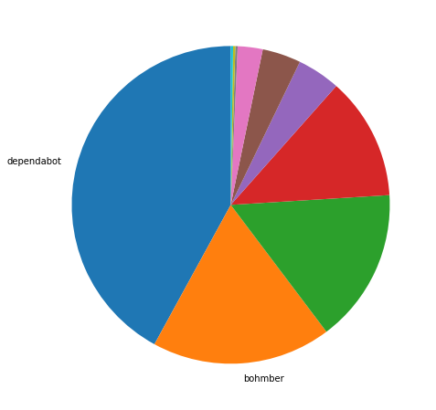
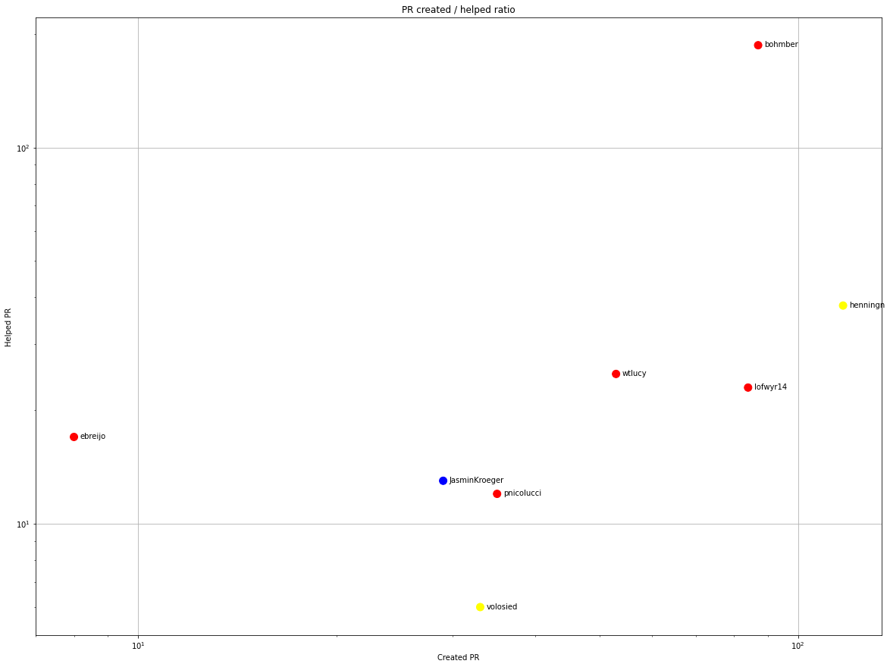
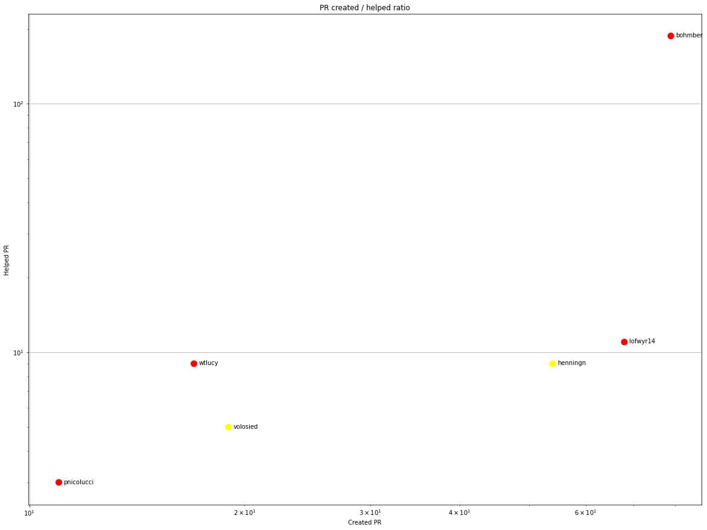
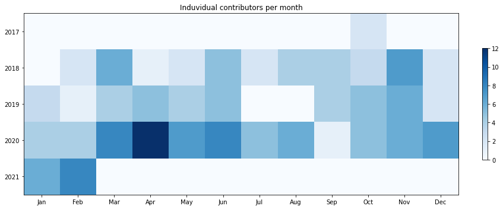
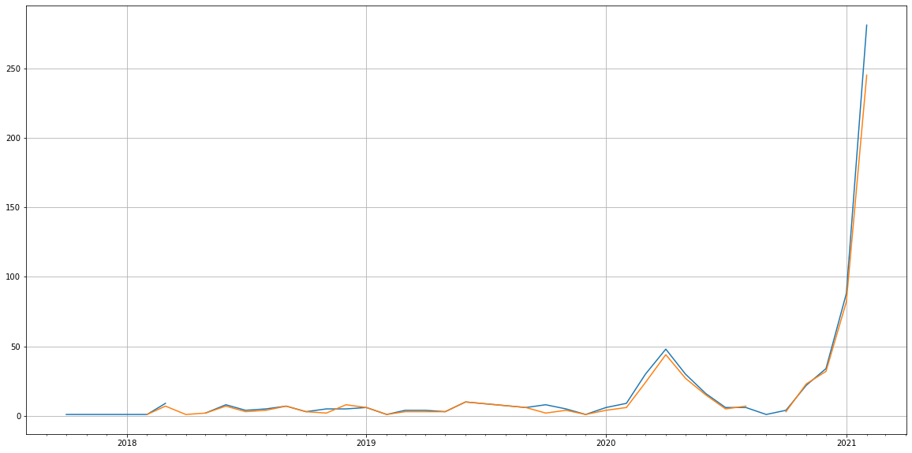
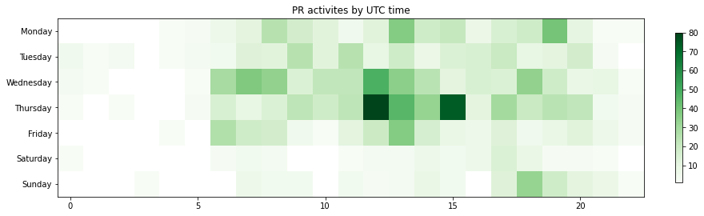

Latest record from the dataset:

<table border="1" class="dataframe">
  <thead>
    <tr style="text-align: right;">
      <th></th>
      <th>org</th>
      <th>repo</th>
      <th>type</th>
      <th>identifier</th>
      <th>subidentifier</th>
      <th>date</th>
      <th>author</th>
      <th>owner</th>
      <th>project</th>
    </tr>
  </thead>
  <tbody>
    <tr>
      <th>1556</th>
      <td>apache</td>
      <td>myfaces-tobago</td>
      <td>PR_COMMENTED</td>
      <td>464</td>
      <td>NaN</td>
      <td>2021-02-12 22:35:27+00:00</td>
      <td>henningn</td>
      <td>henningn</td>
      <td>myfaces</td>
    </tr>
  </tbody>
</table>

# Github Contributions per user

<table border="1" class="dataframe">
  <thead>
    <tr style="text-align: right;">
      <th></th>
      <th>contributions</th>
    </tr>
    <tr>
      <th>author</th>
      <th></th>
    </tr>
  </thead>
  <tbody>
    <tr>
      <th>bohmber</th>
      <td>223</td>
    </tr>
    <tr>
      <th>tandraschko</th>
      <td>167</td>
    </tr>
    <tr>
      <th>henningn</th>
      <td>61</td>
    </tr>
    <tr>
      <th>lofwyr14</th>
      <td>36</td>
    </tr>
    <tr>
      <th>wtlucy</th>
      <td>28</td>
    </tr>
    <tr>
      <th>ebreijo</th>
      <td>17</td>
    </tr>
    <tr>
      <th>deki</th>
      <td>14</td>
    </tr>
    <tr>
      <th>pnicolucci</th>
      <td>14</td>
    </tr>
    <tr>
      <th>JasminKroeger</th>
      <td>13</td>
    </tr>
    <tr>
      <th>volosied</th>
      <td>7</td>
    </tr>
  </tbody>
</table>

## Contributors per participations in PRs which are not created by self (helping PRs)

<table border="1" class="dataframe">
  <thead>
    <tr style="text-align: right;">
      <th></th>
      <th>identifier</th>
    </tr>
    <tr>
      <th>author</th>
      <th></th>
    </tr>
  </thead>
  <tbody>
    <tr>
      <th>bohmber</th>
      <td>187</td>
    </tr>
    <tr>
      <th>tandraschko</th>
      <td>84</td>
    </tr>
    <tr>
      <th>henningn</th>
      <td>38</td>
    </tr>
    <tr>
      <th>wtlucy</th>
      <td>25</td>
    </tr>
    <tr>
      <th>lofwyr14</th>
      <td>23</td>
    </tr>
    <tr>
      <th>ebreijo</th>
      <td>17</td>
    </tr>
    <tr>
      <th>JasminKroeger</th>
      <td>13</td>
    </tr>
    <tr>
      <th>pnicolucci</th>
      <td>12</td>
    </tr>
    <tr>
      <th>deki</th>
      <td>9</td>
    </tr>
    <tr>
      <th>volosied</th>
      <td>6</td>
    </tr>
    <tr>
      <th>aloubyansky</th>
      <td>1</td>
    </tr>
    <tr>
      <th>asfgit</th>
      <td>1</td>
    </tr>
    <tr>
      <th>melloware</th>
      <td>1</td>
    </tr>
    <tr>
      <th>werpu</th>
      <td>1</td>
    </tr>
  </tbody>
</table>

## Contributors per participations in any PRs

<table border="1" class="dataframe">
  <thead>
    <tr style="text-align: right;">
      <th></th>
      <th>identifier</th>
    </tr>
    <tr>
      <th>author</th>
      <th></th>
    </tr>
  </thead>
  <tbody>
    <tr>
      <th>bohmber</th>
      <td>251</td>
    </tr>
    <tr>
      <th>dependabot</th>
      <td>189</td>
    </tr>
    <tr>
      <th>henningn</th>
      <td>155</td>
    </tr>
    <tr>
      <th>lofwyr14</th>
      <td>107</td>
    </tr>
    <tr>
      <th>tandraschko</th>
      <td>84</td>
    </tr>
    <tr>
      <th>wtlucy</th>
      <td>78</td>
    </tr>
    <tr>
      <th>JasminKroeger</th>
      <td>42</td>
    </tr>
    <tr>
      <th>pnicolucci</th>
      <td>39</td>
    </tr>
    <tr>
      <th>volosied</th>
      <td>38</td>
    </tr>
    <tr>
      <th>ebreijo</th>
      <td>25</td>
    </tr>
    <tr>
      <th>deki</th>
      <td>9</td>
    </tr>
    <tr>
      <th>rmpestano</th>
      <td>7</td>
    </tr>
    <tr>
      <th>astappiev</th>
      <td>6</td>
    </tr>
    <tr>
      <th>trettstadtnlb</th>
      <td>5</td>
    </tr>
    <tr>
      <th>JLLeitschuh</th>
      <td>5</td>
    </tr>
    <tr>
      <th>cnsgithub</th>
      <td>4</td>
    </tr>
    <tr>
      <th>cadimmek</th>
      <td>2</td>
    </tr>
    <tr>
      <th>adrianfiedler</th>
      <td>2</td>
    </tr>
    <tr>
      <th>struberg</th>
      <td>1</td>
    </tr>
    <tr>
      <th>werpu</th>
      <td>1</td>
    </tr>
  </tbody>
</table>

# Bus factor (number of contributors responsible for the 50% of the prs) from last half year

## Contributors until the half of the all contributions

<table border="1" class="dataframe">
  <thead>
    <tr style="text-align: right;">
      <th></th>
      <th>author</th>
      <th>identifier</th>
      <th>cs</th>
      <th>ratio</th>
    </tr>
  </thead>
  <tbody>
    <tr>
      <th>0</th>
      <td>dependabot</td>
      <td>182</td>
      <td>182</td>
      <td>42.032333</td>
    </tr>
  </tbody>
</table>

## Pony number (bus factor)

    2

## Dev power (All the contributions in the ration of the top contributor)

    2.379120879120879

    

    

## People with created PRs > reviewed/commented PRS

    

    

## Same graph with focusing to the last 6 month

Only contributors with both created pr and helped pr visible

    

    

# Number of individual contributors per month

Number of different Github users who either created PR, commented PR, added review to a PR

Note: only events from apache/hadoop-ozone repository are included. Earlier PRs/comments are not here.

    

    

# Number of PRs closed/created per month

    /usr/lib/python3.9/site-packages/pandas/core/arrays/datetimes.py:1101: UserWarning: Converting to PeriodArray/Index representation will drop timezone information.
      warnings.warn(

    

    

# PR activity heatmap

    

    

