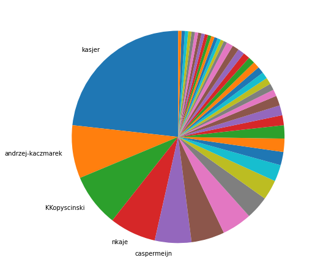

Latest record from the dataset:

<table border="1" class="dataframe">
  <thead>
    <tr style="text-align: right;">
      <th></th>
      <th>org</th>
      <th>repo</th>
      <th>type</th>
      <th>identifier</th>
      <th>subidentifier</th>
      <th>date</th>
      <th>author</th>
      <th>owner</th>
      <th>project</th>
    </tr>
  </thead>
  <tbody>
    <tr>
      <th>7275</th>
      <td>apache</td>
      <td>mynewt-core</td>
      <td>PR_MERGED</td>
      <td>2461</td>
      <td>NaN</td>
      <td>2021-02-12 15:07:03+00:00</td>
      <td>kasjer</td>
      <td>kasjer</td>
      <td>mynewt</td>
    </tr>
  </tbody>
</table>

# Github Contributions per user

<table border="1" class="dataframe">
  <thead>
    <tr style="text-align: right;">
      <th></th>
      <th>contributions</th>
    </tr>
    <tr>
      <th>author</th>
      <th></th>
    </tr>
  </thead>
  <tbody>
    <tr>
      <th>andrzej-kaczmarek</th>
      <td>932</td>
    </tr>
    <tr>
      <th>utzig</th>
      <td>872</td>
    </tr>
    <tr>
      <th>ccollins476ad</th>
      <td>855</td>
    </tr>
    <tr>
      <th>vrahane</th>
      <td>765</td>
    </tr>
    <tr>
      <th>sjanc</th>
      <td>723</td>
    </tr>
    <tr>
      <th>mkiiskila</th>
      <td>700</td>
    </tr>
    <tr>
      <th>rymanluk</th>
      <td>647</td>
    </tr>
    <tr>
      <th>aditihilbert</th>
      <td>469</td>
    </tr>
    <tr>
      <th>apache-mynewt-bot</th>
      <td>445</td>
    </tr>
    <tr>
      <th>wes3</th>
      <td>378</td>
    </tr>
  </tbody>
</table>

## Contributors per participations in PRs which are not created by self (helping PRs)

<table border="1" class="dataframe">
  <thead>
    <tr style="text-align: right;">
      <th></th>
      <th>identifier</th>
    </tr>
    <tr>
      <th>author</th>
      <th></th>
    </tr>
  </thead>
  <tbody>
    <tr>
      <th>andrzej-kaczmarek</th>
      <td>559</td>
    </tr>
    <tr>
      <th>ccollins476ad</th>
      <td>536</td>
    </tr>
    <tr>
      <th>mkiiskila</th>
      <td>491</td>
    </tr>
    <tr>
      <th>sjanc</th>
      <td>473</td>
    </tr>
    <tr>
      <th>utzig</th>
      <td>448</td>
    </tr>
    <tr>
      <th>apache-mynewt-bot</th>
      <td>427</td>
    </tr>
    <tr>
      <th>vrahane</th>
      <td>404</td>
    </tr>
    <tr>
      <th>aditihilbert</th>
      <td>379</td>
    </tr>
    <tr>
      <th>rymanluk</th>
      <td>357</td>
    </tr>
    <tr>
      <th>wes3</th>
      <td>250</td>
    </tr>
    <tr>
      <th>asfgit</th>
      <td>243</td>
    </tr>
    <tr>
      <th>kasjer</th>
      <td>208</td>
    </tr>
    <tr>
      <th>sterlinghughes</th>
      <td>120</td>
    </tr>
    <tr>
      <th>michal-narajowski</th>
      <td>102</td>
    </tr>
    <tr>
      <th>mlaz</th>
      <td>68</td>
    </tr>
    <tr>
      <th>jacobrosenthal</th>
      <td>50</td>
    </tr>
    <tr>
      <th>carlescufi</th>
      <td>21</td>
    </tr>
    <tr>
      <th>nvlsianpu</th>
      <td>20</td>
    </tr>
    <tr>
      <th>benmccrea</th>
      <td>18</td>
    </tr>
    <tr>
      <th>IMGJulian</th>
      <td>16</td>
    </tr>
  </tbody>
</table>

## Contributors per participations in any PRs

<table border="1" class="dataframe">
  <thead>
    <tr style="text-align: right;">
      <th></th>
      <th>identifier</th>
    </tr>
    <tr>
      <th>author</th>
      <th></th>
    </tr>
  </thead>
  <tbody>
    <tr>
      <th>andrzej-kaczmarek</th>
      <td>955</td>
    </tr>
    <tr>
      <th>ccollins476ad</th>
      <td>874</td>
    </tr>
    <tr>
      <th>sjanc</th>
      <td>691</td>
    </tr>
    <tr>
      <th>utzig</th>
      <td>681</td>
    </tr>
    <tr>
      <th>mkiiskila</th>
      <td>664</td>
    </tr>
    <tr>
      <th>rymanluk</th>
      <td>539</td>
    </tr>
    <tr>
      <th>vrahane</th>
      <td>538</td>
    </tr>
    <tr>
      <th>kasjer</th>
      <td>458</td>
    </tr>
    <tr>
      <th>apache-mynewt-bot</th>
      <td>428</td>
    </tr>
    <tr>
      <th>aditihilbert</th>
      <td>407</td>
    </tr>
    <tr>
      <th>wes3</th>
      <td>337</td>
    </tr>
    <tr>
      <th>michal-narajowski</th>
      <td>315</td>
    </tr>
    <tr>
      <th>asfgit</th>
      <td>243</td>
    </tr>
    <tr>
      <th>runtime-bot</th>
      <td>156</td>
    </tr>
    <tr>
      <th>sterlinghughes</th>
      <td>135</td>
    </tr>
    <tr>
      <th>cwanda</th>
      <td>124</td>
    </tr>
    <tr>
      <th>mlaz</th>
      <td>110</td>
    </tr>
    <tr>
      <th>jacobrosenthal</th>
      <td>99</td>
    </tr>
    <tr>
      <th>gj262</th>
      <td>81</td>
    </tr>
    <tr>
      <th>nkaje</th>
      <td>61</td>
    </tr>
  </tbody>
</table>

# Bus factor (number of contributors responsible for the 50% of the prs) from last half year

## Contributors until the half of the all contributions

<table border="1" class="dataframe">
  <thead>
    <tr style="text-align: right;">
      <th></th>
      <th>author</th>
      <th>identifier</th>
      <th>cs</th>
      <th>ratio</th>
    </tr>
  </thead>
  <tbody>
    <tr>
      <th>0</th>
      <td>kasjer</td>
      <td>46</td>
      <td>46</td>
      <td>23.232323</td>
    </tr>
    <tr>
      <th>1</th>
      <td>andrzej-kaczmarek</td>
      <td>16</td>
      <td>62</td>
      <td>8.080808</td>
    </tr>
    <tr>
      <th>2</th>
      <td>KKopyscinski</td>
      <td>16</td>
      <td>78</td>
      <td>8.080808</td>
    </tr>
    <tr>
      <th>3</th>
      <td>nkaje</td>
      <td>14</td>
      <td>92</td>
      <td>7.070707</td>
    </tr>
  </tbody>
</table>

## Pony number (bus factor)

    5

## Dev power (All the contributions in the ration of the top contributor)

    4.304347826086956

    

    

## People with created PRs > reviewed/commented PRS

    

    

## Same graph with focusing to the last 6 month

Only contributors with both created pr and helped pr visible

    

    

# Number of individual contributors per month

Number of different Github users who either created PR, commented PR, added review to a PR

Note: only events from apache/hadoop-ozone repository are included. Earlier PRs/comments are not here.

    

    

# Number of PRs closed/created per month

    /usr/lib/python3.9/site-packages/pandas/core/arrays/datetimes.py:1101: UserWarning: Converting to PeriodArray/Index representation will drop timezone information.
      warnings.warn(

    

    

# PR activity heatmap

    

    

