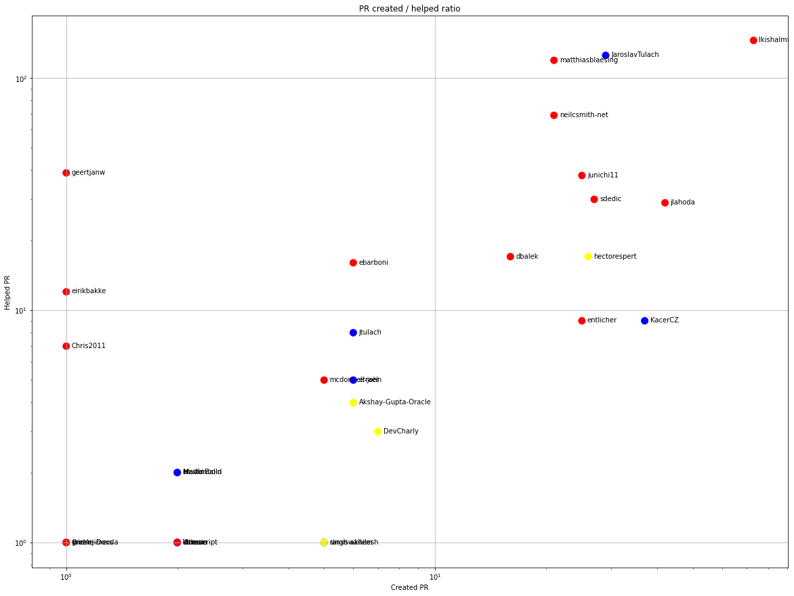

Latest record from the dataset:

<table border="1" class="dataframe">
  <thead>
    <tr style="text-align: right;">
      <th></th>
      <th>org</th>
      <th>repo</th>
      <th>type</th>
      <th>identifier</th>
      <th>subidentifier</th>
      <th>date</th>
      <th>author</th>
      <th>owner</th>
      <th>project</th>
    </tr>
  </thead>
  <tbody>
    <tr>
      <th>12284</th>
      <td>apache</td>
      <td>netbeans</td>
      <td>PR_CREATED</td>
      <td>2761</td>
      <td>NaN</td>
      <td>2021-02-14 07:21:36+00:00</td>
      <td>jtulach</td>
      <td>jtulach</td>
      <td>netbeans</td>
    </tr>
  </tbody>
</table>

# Github Contributions per user

<table border="1" class="dataframe">
  <thead>
    <tr style="text-align: right;">
      <th></th>
      <th>contributions</th>
    </tr>
    <tr>
      <th>author</th>
      <th></th>
    </tr>
  </thead>
  <tbody>
    <tr>
      <th>matthiasblaesing</th>
      <td>1859</td>
    </tr>
    <tr>
      <th>geertjanw</th>
      <td>1569</td>
    </tr>
    <tr>
      <th>junichi11</th>
      <td>804</td>
    </tr>
    <tr>
      <th>neilcsmith-net</th>
      <td>758</td>
    </tr>
    <tr>
      <th>lkishalmi</th>
      <td>724</td>
    </tr>
    <tr>
      <th>JaroslavTulach</th>
      <td>646</td>
    </tr>
    <tr>
      <th>tmysik</th>
      <td>529</td>
    </tr>
    <tr>
      <th>ebarboni</th>
      <td>393</td>
    </tr>
    <tr>
      <th>jlahoda</th>
      <td>377</td>
    </tr>
    <tr>
      <th>sdedic</th>
      <td>279</td>
    </tr>
  </tbody>
</table>

## Contributors per participations in PRs which are not created by self (helping PRs)

<table border="1" class="dataframe">
  <thead>
    <tr style="text-align: right;">
      <th></th>
      <th>identifier</th>
    </tr>
    <tr>
      <th>author</th>
      <th></th>
    </tr>
  </thead>
  <tbody>
    <tr>
      <th>matthiasblaesing</th>
      <td>867</td>
    </tr>
    <tr>
      <th>geertjanw</th>
      <td>754</td>
    </tr>
    <tr>
      <th>lkishalmi</th>
      <td>364</td>
    </tr>
    <tr>
      <th>JaroslavTulach</th>
      <td>359</td>
    </tr>
    <tr>
      <th>neilcsmith-net</th>
      <td>342</td>
    </tr>
    <tr>
      <th>junichi11</th>
      <td>331</td>
    </tr>
    <tr>
      <th>jlahoda</th>
      <td>252</td>
    </tr>
    <tr>
      <th>ebarboni</th>
      <td>217</td>
    </tr>
    <tr>
      <th>sdedic</th>
      <td>157</td>
    </tr>
    <tr>
      <th>tmysik</th>
      <td>144</td>
    </tr>
    <tr>
      <th>asfgit</th>
      <td>116</td>
    </tr>
    <tr>
      <th>vieiro</th>
      <td>104</td>
    </tr>
    <tr>
      <th>emilianbold</th>
      <td>92</td>
    </tr>
    <tr>
      <th>eirikbakke</th>
      <td>71</td>
    </tr>
    <tr>
      <th>jtulach</th>
      <td>69</td>
    </tr>
    <tr>
      <th>Chris2011</th>
      <td>48</td>
    </tr>
    <tr>
      <th>hectorespert</th>
      <td>47</td>
    </tr>
    <tr>
      <th>arvindaprameya</th>
      <td>46</td>
    </tr>
    <tr>
      <th>svenreimers</th>
      <td>44</td>
    </tr>
    <tr>
      <th>jkovalsky</th>
      <td>39</td>
    </tr>
  </tbody>
</table>

## Contributors per participations in any PRs

<table border="1" class="dataframe">
  <thead>
    <tr style="text-align: right;">
      <th></th>
      <th>identifier</th>
    </tr>
    <tr>
      <th>author</th>
      <th></th>
    </tr>
  </thead>
  <tbody>
    <tr>
      <th>matthiasblaesing</th>
      <td>1011</td>
    </tr>
    <tr>
      <th>geertjanw</th>
      <td>978</td>
    </tr>
    <tr>
      <th>lkishalmi</th>
      <td>616</td>
    </tr>
    <tr>
      <th>jlahoda</th>
      <td>564</td>
    </tr>
    <tr>
      <th>junichi11</th>
      <td>551</td>
    </tr>
    <tr>
      <th>JaroslavTulach</th>
      <td>459</td>
    </tr>
    <tr>
      <th>neilcsmith-net</th>
      <td>420</td>
    </tr>
    <tr>
      <th>ebarboni</th>
      <td>303</td>
    </tr>
    <tr>
      <th>sdedic</th>
      <td>252</td>
    </tr>
    <tr>
      <th>vieiro</th>
      <td>222</td>
    </tr>
    <tr>
      <th>hectorespert</th>
      <td>188</td>
    </tr>
    <tr>
      <th>tmysik</th>
      <td>147</td>
    </tr>
    <tr>
      <th>emilianbold</th>
      <td>128</td>
    </tr>
    <tr>
      <th>asfgit</th>
      <td>116</td>
    </tr>
    <tr>
      <th>eirikbakke</th>
      <td>105</td>
    </tr>
    <tr>
      <th>jtulach</th>
      <td>105</td>
    </tr>
    <tr>
      <th>arusinha-zz</th>
      <td>88</td>
    </tr>
    <tr>
      <th>rtaneja1</th>
      <td>85</td>
    </tr>
    <tr>
      <th>KacerCZ</th>
      <td>79</td>
    </tr>
    <tr>
      <th>BradWalker</th>
      <td>78</td>
    </tr>
  </tbody>
</table>

# Bus factor (number of contributors responsible for the 50% of the prs) from last half year

## Contributors until the half of the all contributions

<table border="1" class="dataframe">
  <thead>
    <tr style="text-align: right;">
      <th></th>
      <th>author</th>
      <th>identifier</th>
      <th>cs</th>
      <th>ratio</th>
    </tr>
  </thead>
  <tbody>
    <tr>
      <th>0</th>
      <td>lkishalmi</td>
      <td>73</td>
      <td>73</td>
      <td>14.174757</td>
    </tr>
    <tr>
      <th>1</th>
      <td>jlahoda</td>
      <td>42</td>
      <td>115</td>
      <td>8.155340</td>
    </tr>
    <tr>
      <th>2</th>
      <td>KacerCZ</td>
      <td>37</td>
      <td>152</td>
      <td>7.184466</td>
    </tr>
    <tr>
      <th>3</th>
      <td>JaroslavTulach</td>
      <td>29</td>
      <td>181</td>
      <td>5.631068</td>
    </tr>
    <tr>
      <th>4</th>
      <td>sdedic</td>
      <td>27</td>
      <td>208</td>
      <td>5.242718</td>
    </tr>
    <tr>
      <th>5</th>
      <td>hectorespert</td>
      <td>26</td>
      <td>234</td>
      <td>5.048544</td>
    </tr>
  </tbody>
</table>

## Pony number (bus factor)

    7

## Dev power (All the contributions in the ration of the top contributor)

    7.054794520547947

    

    

## People with created PRs > reviewed/commented PRS

    

    

## Same graph with focusing to the last 6 month

Only contributors with both created pr and helped pr visible

    

    

# Number of individual contributors per month

Number of different Github users who either created PR, commented PR, added review to a PR

Note: only events from apache/hadoop-ozone repository are included. Earlier PRs/comments are not here.

    

    

# Number of PRs closed/created per month

    /usr/lib/python3.9/site-packages/pandas/core/arrays/datetimes.py:1101: UserWarning: Converting to PeriodArray/Index representation will drop timezone information.
      warnings.warn(

    

    

# PR activity heatmap

    

    

