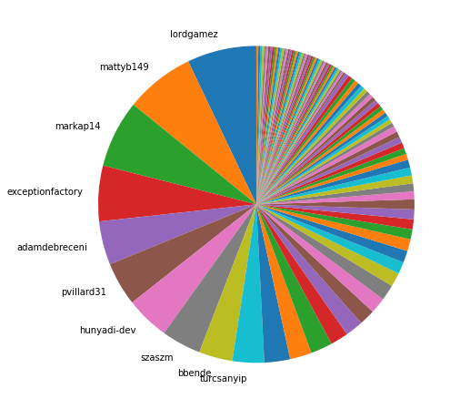
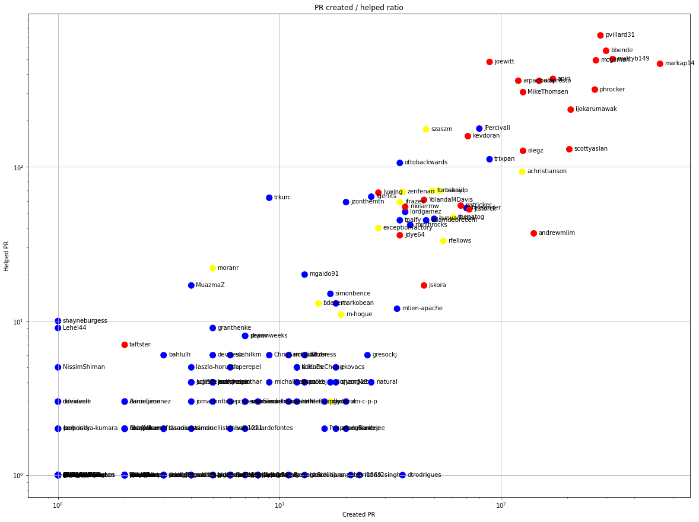
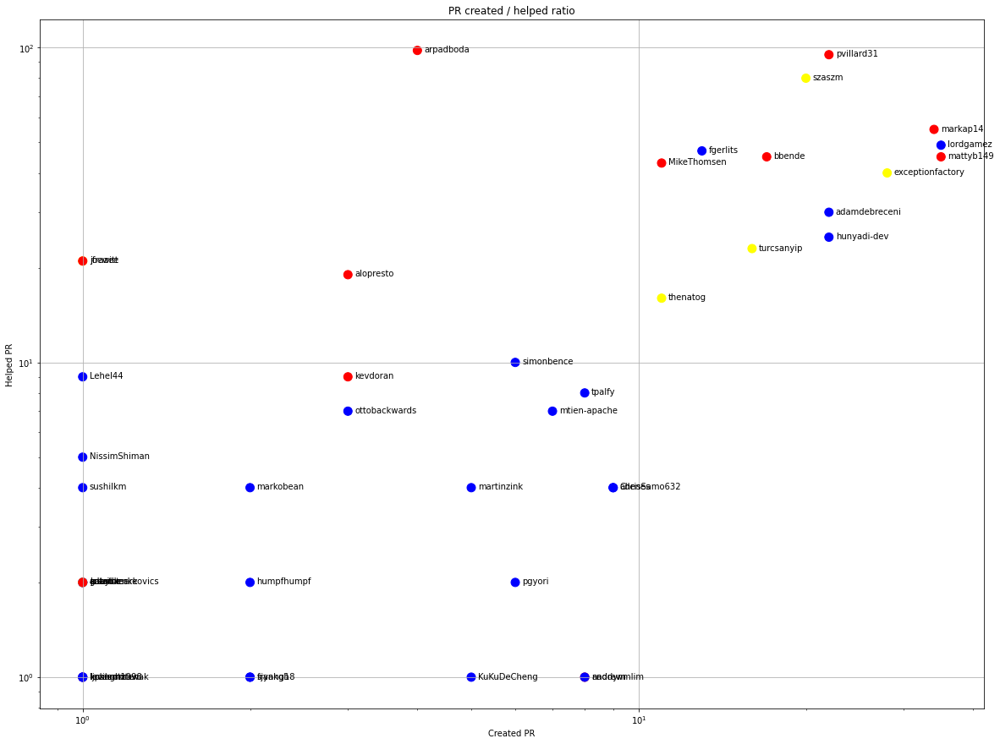
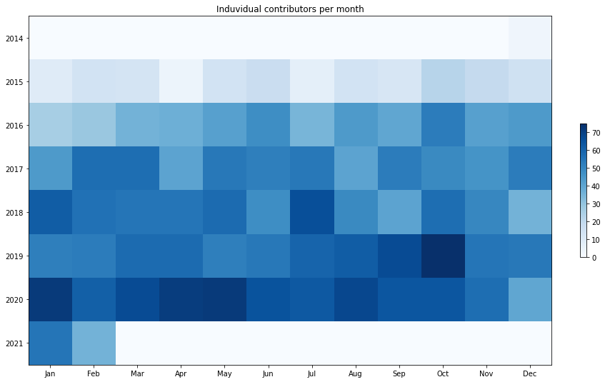
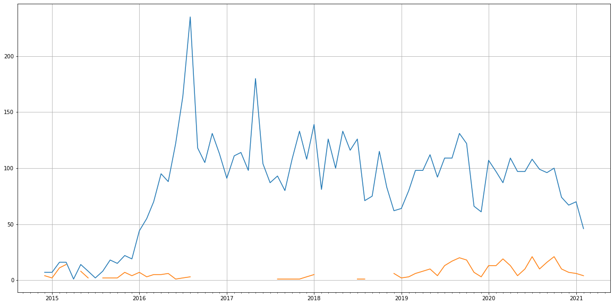
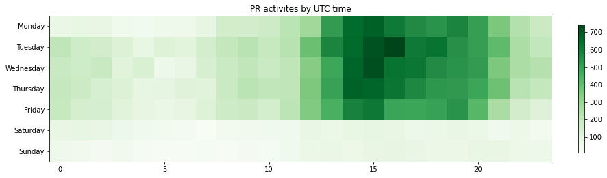

Latest record from the dataset:

<table border="1" class="dataframe">
  <thead>
    <tr style="text-align: right;">
      <th></th>
      <th>org</th>
      <th>repo</th>
      <th>type</th>
      <th>identifier</th>
      <th>subidentifier</th>
      <th>date</th>
      <th>author</th>
      <th>owner</th>
      <th>project</th>
    </tr>
  </thead>
  <tbody>
    <tr>
      <th>18364</th>
      <td>apache</td>
      <td>nifi</td>
      <td>PR_COMMENTED</td>
      <td>3582</td>
      <td>NaN</td>
      <td>2021-02-13 08:43:00+00:00</td>
      <td>ChrisSamo632</td>
      <td>udaykale</td>
      <td>nifi</td>
    </tr>
  </tbody>
</table>

# Github Contributions per user

<table border="1" class="dataframe">
  <thead>
    <tr style="text-align: right;">
      <th></th>
      <th>contributions</th>
    </tr>
    <tr>
      <th>author</th>
      <th></th>
    </tr>
  </thead>
  <tbody>
    <tr>
      <th>pvillard31</th>
      <td>1406</td>
    </tr>
    <tr>
      <th>alopresto</th>
      <td>1300</td>
    </tr>
    <tr>
      <th>mattyb149</th>
      <td>1168</td>
    </tr>
    <tr>
      <th>mcgilman</th>
      <td>1157</td>
    </tr>
    <tr>
      <th>apiri</th>
      <td>1090</td>
    </tr>
    <tr>
      <th>bbende</th>
      <td>1049</td>
    </tr>
    <tr>
      <th>joewitt</th>
      <td>1029</td>
    </tr>
    <tr>
      <th>phrocker</th>
      <td>1023</td>
    </tr>
    <tr>
      <th>markap14</th>
      <td>911</td>
    </tr>
    <tr>
      <th>MikeThomsen</th>
      <td>874</td>
    </tr>
  </tbody>
</table>

## Contributors per participations in PRs which are not created by self (helping PRs)

<table border="1" class="dataframe">
  <thead>
    <tr style="text-align: right;">
      <th></th>
      <th>identifier</th>
    </tr>
    <tr>
      <th>author</th>
      <th></th>
    </tr>
  </thead>
  <tbody>
    <tr>
      <th>pvillard31</th>
      <td>712</td>
    </tr>
    <tr>
      <th>bbende</th>
      <td>566</td>
    </tr>
    <tr>
      <th>mattyb149</th>
      <td>500</td>
    </tr>
    <tr>
      <th>mcgilman</th>
      <td>491</td>
    </tr>
    <tr>
      <th>joewitt</th>
      <td>479</td>
    </tr>
    <tr>
      <th>markap14</th>
      <td>466</td>
    </tr>
    <tr>
      <th>apiri</th>
      <td>372</td>
    </tr>
    <tr>
      <th>arpadboda</th>
      <td>362</td>
    </tr>
    <tr>
      <th>alopresto</th>
      <td>361</td>
    </tr>
    <tr>
      <th>phrocker</th>
      <td>317</td>
    </tr>
    <tr>
      <th>MikeThomsen</th>
      <td>305</td>
    </tr>
    <tr>
      <th>ijokarumawak</th>
      <td>235</td>
    </tr>
    <tr>
      <th>JPercivall</th>
      <td>177</td>
    </tr>
    <tr>
      <th>szaszm</th>
      <td>175</td>
    </tr>
    <tr>
      <th>kevdoran</th>
      <td>158</td>
    </tr>
    <tr>
      <th>scottyaslan</th>
      <td>130</td>
    </tr>
    <tr>
      <th>olegz</th>
      <td>127</td>
    </tr>
    <tr>
      <th>asfgit</th>
      <td>114</td>
    </tr>
    <tr>
      <th>trixpan</th>
      <td>112</td>
    </tr>
    <tr>
      <th>ottobackwards</th>
      <td>106</td>
    </tr>
  </tbody>
</table>

## Contributors per participations in any PRs

<table border="1" class="dataframe">
  <thead>
    <tr style="text-align: right;">
      <th></th>
      <th>identifier</th>
    </tr>
    <tr>
      <th>author</th>
      <th></th>
    </tr>
  </thead>
  <tbody>
    <tr>
      <th>pvillard31</th>
      <td>993</td>
    </tr>
    <tr>
      <th>markap14</th>
      <td>989</td>
    </tr>
    <tr>
      <th>bbende</th>
      <td>835</td>
    </tr>
    <tr>
      <th>mattyb149</th>
      <td>820</td>
    </tr>
    <tr>
      <th>mcgilman</th>
      <td>758</td>
    </tr>
    <tr>
      <th>phrocker</th>
      <td>579</td>
    </tr>
    <tr>
      <th>joewitt</th>
      <td>567</td>
    </tr>
    <tr>
      <th>alopresto</th>
      <td>509</td>
    </tr>
    <tr>
      <th>arpadboda</th>
      <td>482</td>
    </tr>
    <tr>
      <th>apiri</th>
      <td>456</td>
    </tr>
    <tr>
      <th>ijokarumawak</th>
      <td>442</td>
    </tr>
    <tr>
      <th>MikeThomsen</th>
      <td>431</td>
    </tr>
    <tr>
      <th>scottyaslan</th>
      <td>324</td>
    </tr>
    <tr>
      <th>JPercivall</th>
      <td>256</td>
    </tr>
    <tr>
      <th>olegz</th>
      <td>253</td>
    </tr>
    <tr>
      <th>szaszm</th>
      <td>221</td>
    </tr>
    <tr>
      <th>achristianson</th>
      <td>218</td>
    </tr>
    <tr>
      <th>kevdoran</th>
      <td>216</td>
    </tr>
    <tr>
      <th>trixpan</th>
      <td>201</td>
    </tr>
    <tr>
      <th>andrewmlim</th>
      <td>177</td>
    </tr>
  </tbody>
</table>

# Bus factor (number of contributors responsible for the 50% of the prs) from last half year

## Contributors until the half of the all contributions

<table border="1" class="dataframe">
  <thead>
    <tr style="text-align: right;">
      <th></th>
      <th>author</th>
      <th>identifier</th>
      <th>cs</th>
      <th>ratio</th>
    </tr>
  </thead>
  <tbody>
    <tr>
      <th>0</th>
      <td>lordgamez</td>
      <td>35</td>
      <td>35</td>
      <td>7.085020</td>
    </tr>
    <tr>
      <th>1</th>
      <td>mattyb149</td>
      <td>35</td>
      <td>70</td>
      <td>7.085020</td>
    </tr>
    <tr>
      <th>2</th>
      <td>markap14</td>
      <td>34</td>
      <td>104</td>
      <td>6.882591</td>
    </tr>
    <tr>
      <th>3</th>
      <td>exceptionfactory</td>
      <td>28</td>
      <td>132</td>
      <td>5.668016</td>
    </tr>
    <tr>
      <th>4</th>
      <td>adamdebreceni</td>
      <td>22</td>
      <td>154</td>
      <td>4.453441</td>
    </tr>
    <tr>
      <th>5</th>
      <td>pvillard31</td>
      <td>22</td>
      <td>176</td>
      <td>4.453441</td>
    </tr>
    <tr>
      <th>6</th>
      <td>hunyadi-dev</td>
      <td>22</td>
      <td>198</td>
      <td>4.453441</td>
    </tr>
    <tr>
      <th>7</th>
      <td>szaszm</td>
      <td>20</td>
      <td>218</td>
      <td>4.048583</td>
    </tr>
    <tr>
      <th>8</th>
      <td>bbende</td>
      <td>17</td>
      <td>235</td>
      <td>3.441296</td>
    </tr>
  </tbody>
</table>

## Pony number (bus factor)

    10

## Dev power (All the contributions in the ration of the top contributor)

    14.11428571428571

    

    

## People with created PRs > reviewed/commented PRS

    

    

## Same graph with focusing to the last 6 month

Only contributors with both created pr and helped pr visible

    

    

# Number of individual contributors per month

Number of different Github users who either created PR, commented PR, added review to a PR

Note: only events from apache/hadoop-ozone repository are included. Earlier PRs/comments are not here.

    

    

# Number of PRs closed/created per month

    /usr/lib/python3.9/site-packages/pandas/core/arrays/datetimes.py:1101: UserWarning: Converting to PeriodArray/Index representation will drop timezone information.
      warnings.warn(

    

    

# PR activity heatmap

    

    

