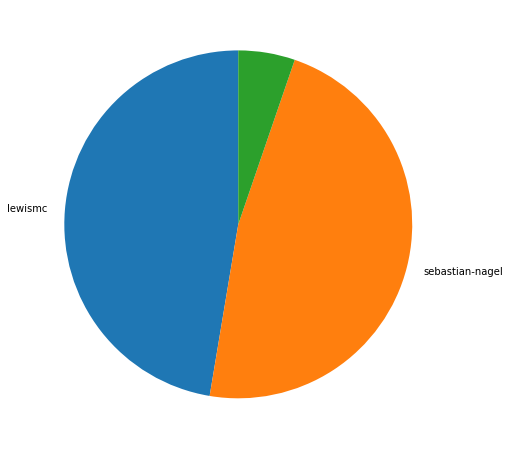
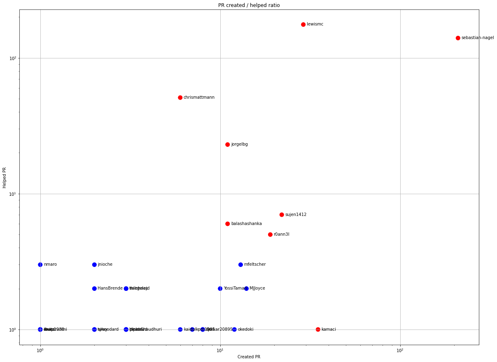
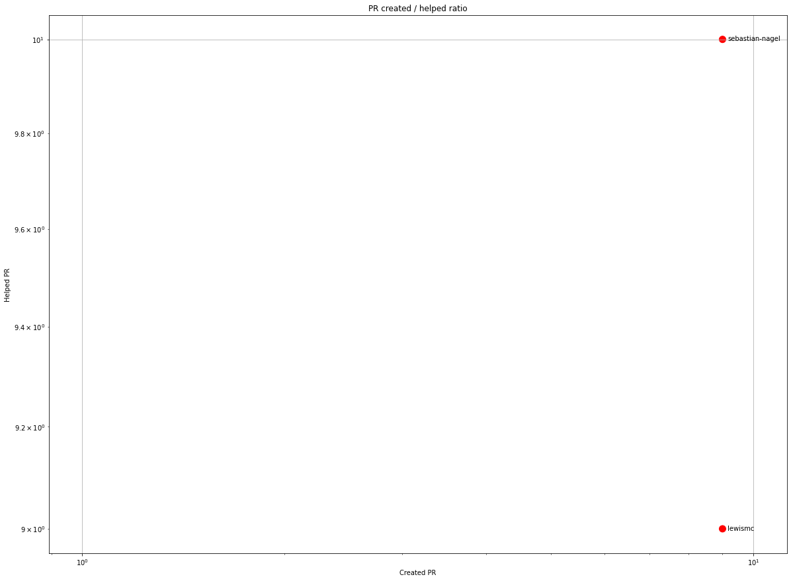
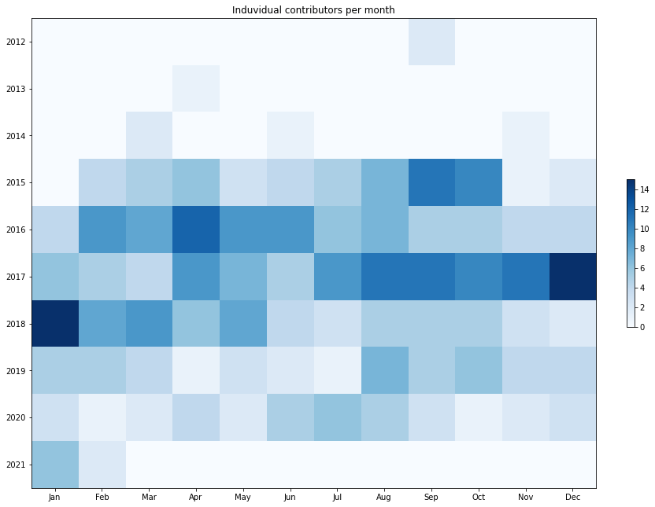
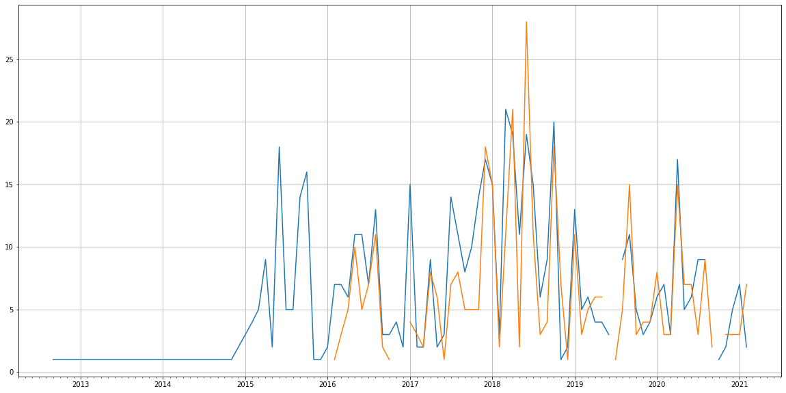
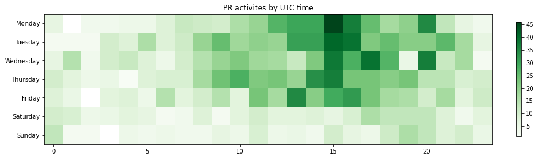

Latest record from the dataset:

<table border="1" class="dataframe">
  <thead>
    <tr style="text-align: right;">
      <th></th>
      <th>org</th>
      <th>repo</th>
      <th>type</th>
      <th>identifier</th>
      <th>subidentifier</th>
      <th>date</th>
      <th>author</th>
      <th>owner</th>
      <th>project</th>
    </tr>
  </thead>
  <tbody>
    <tr>
      <th>2109</th>
      <td>apache</td>
      <td>nutch</td>
      <td>PR_CREATED</td>
      <td>569</td>
      <td>NaN</td>
      <td>2021-02-12 05:01:53+00:00</td>
      <td>lewismc</td>
      <td>lewismc</td>
      <td>nutch</td>
    </tr>
  </tbody>
</table>

# Github Contributions per user

<table border="1" class="dataframe">
  <thead>
    <tr style="text-align: right;">
      <th></th>
      <th>contributions</th>
    </tr>
    <tr>
      <th>author</th>
      <th></th>
    </tr>
  </thead>
  <tbody>
    <tr>
      <th>lewismc</th>
      <td>391</td>
    </tr>
    <tr>
      <th>sebastian-nagel</th>
      <td>308</td>
    </tr>
    <tr>
      <th>chrismattmann</th>
      <td>99</td>
    </tr>
    <tr>
      <th>asfgit</th>
      <td>49</td>
    </tr>
    <tr>
      <th>jorgelbg</th>
      <td>41</td>
    </tr>
    <tr>
      <th>jnioche</th>
      <td>26</td>
    </tr>
    <tr>
      <th>r0ann3l</th>
      <td>19</td>
    </tr>
    <tr>
      <th>nmaro</th>
      <td>11</td>
    </tr>
    <tr>
      <th>sujen1412</th>
      <td>11</td>
    </tr>
    <tr>
      <th>balashashanka</th>
      <td>11</td>
    </tr>
  </tbody>
</table>

## Contributors per participations in PRs which are not created by self (helping PRs)

<table border="1" class="dataframe">
  <thead>
    <tr style="text-align: right;">
      <th></th>
      <th>identifier</th>
    </tr>
    <tr>
      <th>author</th>
      <th></th>
    </tr>
  </thead>
  <tbody>
    <tr>
      <th>lewismc</th>
      <td>176</td>
    </tr>
    <tr>
      <th>sebastian-nagel</th>
      <td>140</td>
    </tr>
    <tr>
      <th>chrismattmann</th>
      <td>51</td>
    </tr>
    <tr>
      <th>asfgit</th>
      <td>51</td>
    </tr>
    <tr>
      <th>jorgelbg</th>
      <td>23</td>
    </tr>
    <tr>
      <th>sujen1412</th>
      <td>7</td>
    </tr>
    <tr>
      <th>balashashanka</th>
      <td>6</td>
    </tr>
    <tr>
      <th>r0ann3l</th>
      <td>5</td>
    </tr>
    <tr>
      <th>mfeltscher</th>
      <td>3</td>
    </tr>
    <tr>
      <th>nmaro</th>
      <td>3</td>
    </tr>
    <tr>
      <th>jnioche</th>
      <td>3</td>
    </tr>
    <tr>
      <th>naegelejd</th>
      <td>2</td>
    </tr>
    <tr>
      <th>HansBrende</th>
      <td>2</td>
    </tr>
    <tr>
      <th>YossiTamari</th>
      <td>2</td>
    </tr>
    <tr>
      <th>marconett</th>
      <td>2</td>
    </tr>
    <tr>
      <th>thilohaas</th>
      <td>2</td>
    </tr>
    <tr>
      <th>MJJoyce</th>
      <td>2</td>
    </tr>
    <tr>
      <th>okedoki</th>
      <td>1</td>
    </tr>
    <tr>
      <th>pipldev</th>
      <td>1</td>
    </tr>
    <tr>
      <th>GerardBouchar</th>
      <td>1</td>
    </tr>
  </tbody>
</table>

## Contributors per participations in any PRs

<table border="1" class="dataframe">
  <thead>
    <tr style="text-align: right;">
      <th></th>
      <th>identifier</th>
    </tr>
    <tr>
      <th>author</th>
      <th></th>
    </tr>
  </thead>
  <tbody>
    <tr>
      <th>sebastian-nagel</th>
      <td>350</td>
    </tr>
    <tr>
      <th>lewismc</th>
      <td>205</td>
    </tr>
    <tr>
      <th>chrismattmann</th>
      <td>57</td>
    </tr>
    <tr>
      <th>asfgit</th>
      <td>51</td>
    </tr>
    <tr>
      <th>kamaci</th>
      <td>36</td>
    </tr>
    <tr>
      <th>jorgelbg</th>
      <td>34</td>
    </tr>
    <tr>
      <th>sujen1412</th>
      <td>29</td>
    </tr>
    <tr>
      <th>r0ann3l</th>
      <td>24</td>
    </tr>
    <tr>
      <th>asitang</th>
      <td>19</td>
    </tr>
    <tr>
      <th>balashashanka</th>
      <td>17</td>
    </tr>
    <tr>
      <th>mfeltscher</th>
      <td>16</td>
    </tr>
    <tr>
      <th>MJJoyce</th>
      <td>16</td>
    </tr>
    <tr>
      <th>okedoki</th>
      <td>13</td>
    </tr>
    <tr>
      <th>YossiTamari</th>
      <td>12</td>
    </tr>
    <tr>
      <th>Omkar20895</th>
      <td>9</td>
    </tr>
    <tr>
      <th>sju</th>
      <td>9</td>
    </tr>
    <tr>
      <th>kpm1985</th>
      <td>8</td>
    </tr>
    <tr>
      <th>kaidul</th>
      <td>7</td>
    </tr>
    <tr>
      <th>thilohaas</th>
      <td>5</td>
    </tr>
    <tr>
      <th>jnioche</th>
      <td>5</td>
    </tr>
  </tbody>
</table>

# Bus factor (number of contributors responsible for the 50% of the prs) from last half year

## Contributors until the half of the all contributions

<table border="1" class="dataframe">
  <thead>
    <tr style="text-align: right;">
      <th></th>
      <th>author</th>
      <th>identifier</th>
      <th>cs</th>
      <th>ratio</th>
    </tr>
  </thead>
  <tbody>
    <tr>
      <th>0</th>
      <td>lewismc</td>
      <td>9</td>
      <td>9</td>
      <td>47.368421</td>
    </tr>
  </tbody>
</table>

## Pony number (bus factor)

    2

## Dev power (All the contributions in the ration of the top contributor)

    2.111111111111111

    

    

## People with created PRs > reviewed/commented PRS

    

    

## Same graph with focusing to the last 6 month

Only contributors with both created pr and helped pr visible

    

    

# Number of individual contributors per month

Number of different Github users who either created PR, commented PR, added review to a PR

Note: only events from apache/hadoop-ozone repository are included. Earlier PRs/comments are not here.

    

    

# Number of PRs closed/created per month

    /usr/lib/python3.9/site-packages/pandas/core/arrays/datetimes.py:1101: UserWarning: Converting to PeriodArray/Index representation will drop timezone information.
      warnings.warn(

    

    

# PR activity heatmap

    

    

