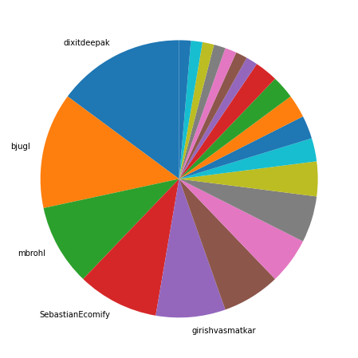
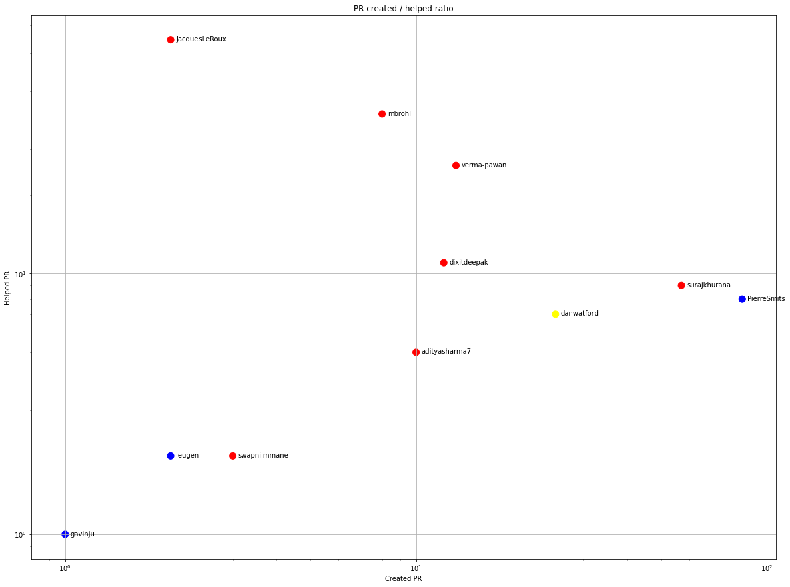
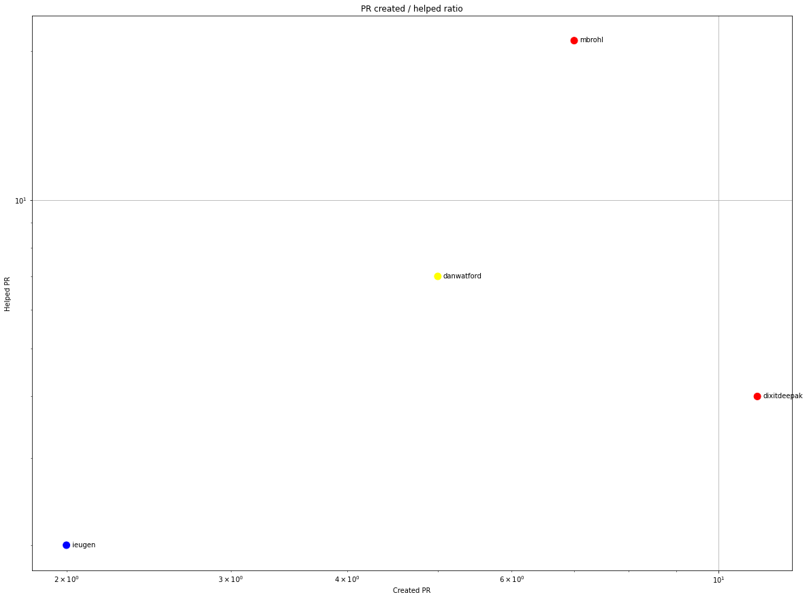
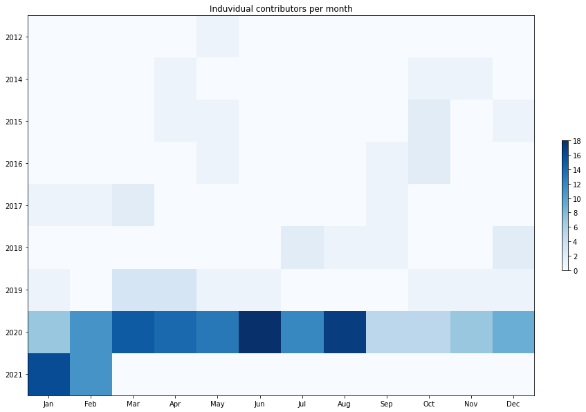
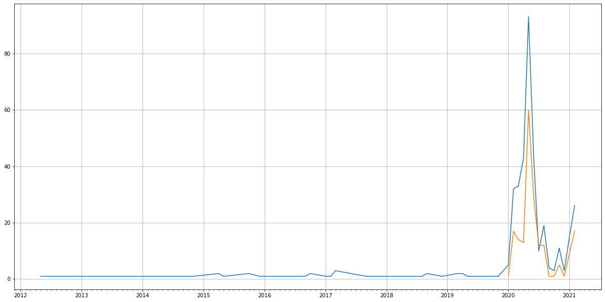
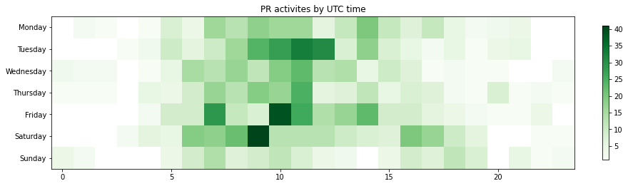

Latest record from the dataset:

<table border="1" class="dataframe">
  <thead>
    <tr style="text-align: right;">
      <th></th>
      <th>org</th>
      <th>repo</th>
      <th>type</th>
      <th>identifier</th>
      <th>subidentifier</th>
      <th>date</th>
      <th>author</th>
      <th>owner</th>
      <th>project</th>
    </tr>
  </thead>
  <tbody>
    <tr>
      <th>427</th>
      <td>apache</td>
      <td>ofbiz-framework</td>
      <td>PR_COMMENTED</td>
      <td>204</td>
      <td>NaN</td>
      <td>2021-02-14 07:03:18+00:00</td>
      <td>JacquesLeRoux</td>
      <td>alexbodn</td>
      <td>ofbiz</td>
    </tr>
  </tbody>
</table>

# Github Contributions per user

<table border="1" class="dataframe">
  <thead>
    <tr style="text-align: right;">
      <th></th>
      <th>contributions</th>
    </tr>
    <tr>
      <th>author</th>
      <th></th>
    </tr>
  </thead>
  <tbody>
    <tr>
      <th>sonarcloud</th>
      <td>331</td>
    </tr>
    <tr>
      <th>JacquesLeRoux</th>
      <td>177</td>
    </tr>
    <tr>
      <th>mbrohl</th>
      <td>57</td>
    </tr>
    <tr>
      <th>verma-pawan</th>
      <td>44</td>
    </tr>
    <tr>
      <th>dixitdeepak</th>
      <td>21</td>
    </tr>
    <tr>
      <th>danwatford</th>
      <td>17</td>
    </tr>
    <tr>
      <th>jacopoc</th>
      <td>11</td>
    </tr>
    <tr>
      <th>PierreSmits</th>
      <td>9</td>
    </tr>
    <tr>
      <th>nmalin</th>
      <td>9</td>
    </tr>
    <tr>
      <th>surajkhurana</th>
      <td>9</td>
    </tr>
  </tbody>
</table>

## Contributors per participations in PRs which are not created by self (helping PRs)

<table border="1" class="dataframe">
  <thead>
    <tr style="text-align: right;">
      <th></th>
      <th>identifier</th>
    </tr>
    <tr>
      <th>author</th>
      <th></th>
    </tr>
  </thead>
  <tbody>
    <tr>
      <th>sonarcloud</th>
      <td>255</td>
    </tr>
    <tr>
      <th>JacquesLeRoux</th>
      <td>79</td>
    </tr>
    <tr>
      <th>mbrohl</th>
      <td>41</td>
    </tr>
    <tr>
      <th>verma-pawan</th>
      <td>26</td>
    </tr>
    <tr>
      <th>dixitdeepak</th>
      <td>11</td>
    </tr>
    <tr>
      <th>nmalin</th>
      <td>9</td>
    </tr>
    <tr>
      <th>surajkhurana</th>
      <td>9</td>
    </tr>
    <tr>
      <th>PierreSmits</th>
      <td>8</td>
    </tr>
    <tr>
      <th>danwatford</th>
      <td>7</td>
    </tr>
    <tr>
      <th>adityasharma7</th>
      <td>5</td>
    </tr>
    <tr>
      <th>jacopoc</th>
      <td>4</td>
    </tr>
    <tr>
      <th>ieugen</th>
      <td>2</td>
    </tr>
    <tr>
      <th>asfgit</th>
      <td>2</td>
    </tr>
    <tr>
      <th>swapnilmmane</th>
      <td>2</td>
    </tr>
    <tr>
      <th>gavinju</th>
      <td>1</td>
    </tr>
    <tr>
      <th>hg-stolle</th>
      <td>1</td>
    </tr>
    <tr>
      <th>lektran</th>
      <td>1</td>
    </tr>
    <tr>
      <th>martnaum</th>
      <td>1</td>
    </tr>
  </tbody>
</table>

## Contributors per participations in any PRs

<table border="1" class="dataframe">
  <thead>
    <tr style="text-align: right;">
      <th></th>
      <th>identifier</th>
    </tr>
    <tr>
      <th>author</th>
      <th></th>
    </tr>
  </thead>
  <tbody>
    <tr>
      <th>sonarcloud</th>
      <td>255</td>
    </tr>
    <tr>
      <th>PierreSmits</th>
      <td>85</td>
    </tr>
    <tr>
      <th>JacquesLeRoux</th>
      <td>80</td>
    </tr>
    <tr>
      <th>surajkhurana</th>
      <td>66</td>
    </tr>
    <tr>
      <th>mbrohl</th>
      <td>49</td>
    </tr>
    <tr>
      <th>verma-pawan</th>
      <td>38</td>
    </tr>
    <tr>
      <th>danwatford</th>
      <td>32</td>
    </tr>
    <tr>
      <th>dixitdeepak</th>
      <td>23</td>
    </tr>
    <tr>
      <th>priyasharma1</th>
      <td>22</td>
    </tr>
    <tr>
      <th>Olivier-Heintz</th>
      <td>17</td>
    </tr>
    <tr>
      <th>adityasharma7</th>
      <td>14</td>
    </tr>
    <tr>
      <th>SebastianEcomify</th>
      <td>14</td>
    </tr>
    <tr>
      <th>bjugl</th>
      <td>10</td>
    </tr>
    <tr>
      <th>nmalin</th>
      <td>9</td>
    </tr>
    <tr>
      <th>girishvasmatkar</th>
      <td>8</td>
    </tr>
    <tr>
      <th>wpaetzold</th>
      <td>7</td>
    </tr>
    <tr>
      <th>yashwantdhakad</th>
      <td>5</td>
    </tr>
    <tr>
      <th>alexbodn</th>
      <td>5</td>
    </tr>
    <tr>
      <th>lodhiravi</th>
      <td>5</td>
    </tr>
    <tr>
      <th>dbalkir</th>
      <td>5</td>
    </tr>
  </tbody>
</table>

# Bus factor (number of contributors responsible for the 50% of the prs) from last half year

## Contributors until the half of the all contributions

<table border="1" class="dataframe">
  <thead>
    <tr style="text-align: right;">
      <th></th>
      <th>author</th>
      <th>identifier</th>
      <th>cs</th>
      <th>ratio</th>
    </tr>
  </thead>
  <tbody>
    <tr>
      <th>0</th>
      <td>dixitdeepak</td>
      <td>11</td>
      <td>11</td>
      <td>14.864865</td>
    </tr>
    <tr>
      <th>1</th>
      <td>bjugl</td>
      <td>10</td>
      <td>21</td>
      <td>13.513514</td>
    </tr>
    <tr>
      <th>2</th>
      <td>mbrohl</td>
      <td>7</td>
      <td>28</td>
      <td>9.459459</td>
    </tr>
    <tr>
      <th>3</th>
      <td>SebastianEcomify</td>
      <td>7</td>
      <td>35</td>
      <td>9.459459</td>
    </tr>
  </tbody>
</table>

## Pony number (bus factor)

    5

## Dev power (All the contributions in the ration of the top contributor)

    6.727272727272727

    

    

## People with created PRs > reviewed/commented PRS

    

    

## Same graph with focusing to the last 6 month

Only contributors with both created pr and helped pr visible

    

    

# Number of individual contributors per month

Number of different Github users who either created PR, commented PR, added review to a PR

Note: only events from apache/hadoop-ozone repository are included. Earlier PRs/comments are not here.

    

    

# Number of PRs closed/created per month

    /usr/lib/python3.9/site-packages/pandas/core/arrays/datetimes.py:1101: UserWarning: Converting to PeriodArray/Index representation will drop timezone information.
      warnings.warn(

    

    

# PR activity heatmap

    

    

