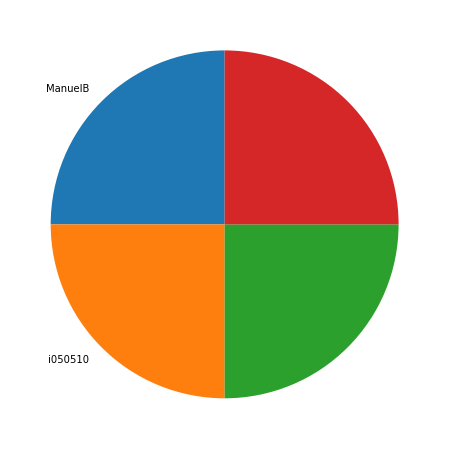
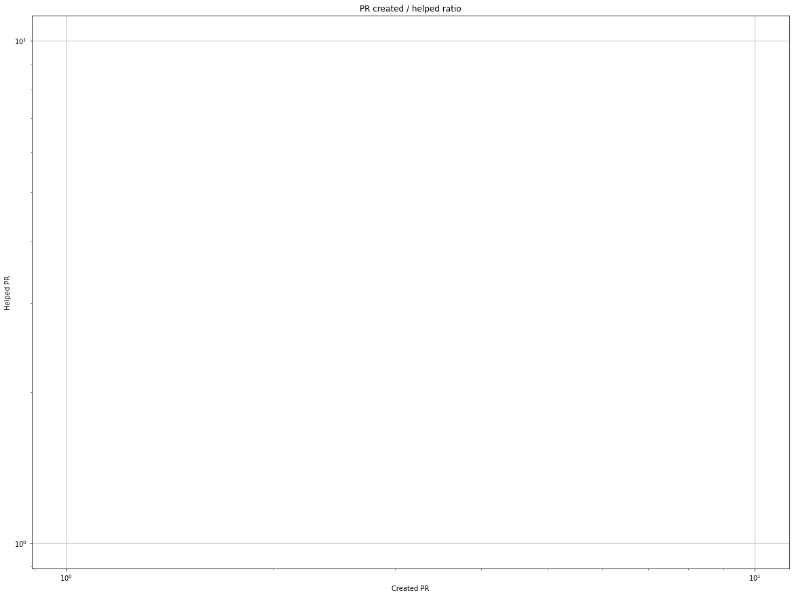

Latest record from the dataset:

<table border="1" class="dataframe">
  <thead>
    <tr style="text-align: right;">
      <th></th>
      <th>org</th>
      <th>repo</th>
      <th>type</th>
      <th>identifier</th>
      <th>subidentifier</th>
      <th>date</th>
      <th>author</th>
      <th>owner</th>
      <th>project</th>
    </tr>
  </thead>
  <tbody>
    <tr>
      <th>191</th>
      <td>apache</td>
      <td>olingo-odata4</td>
      <td>PR_MERGED</td>
      <td>67</td>
      <td>NaN</td>
      <td>2020-12-14 14:56:25+00:00</td>
      <td>mibo</td>
      <td>uujava</td>
      <td>olingo</td>
    </tr>
  </tbody>
</table>

# Github Contributions per user

<table border="1" class="dataframe">
  <thead>
    <tr style="text-align: right;">
      <th></th>
      <th>contributions</th>
    </tr>
    <tr>
      <th>author</th>
      <th></th>
    </tr>
  </thead>
  <tbody>
    <tr>
      <th>mibo</th>
      <td>34</td>
    </tr>
    <tr>
      <th>i050510</th>
      <td>12</td>
    </tr>
    <tr>
      <th>deki</th>
      <td>8</td>
    </tr>
    <tr>
      <th>rareddy</th>
      <td>8</td>
    </tr>
    <tr>
      <th>asfgit</th>
      <td>6</td>
    </tr>
    <tr>
      <th>archanarai2211</th>
      <td>2</td>
    </tr>
    <tr>
      <th>MPottabathini</th>
      <td>1</td>
    </tr>
    <tr>
      <th>alexanderparr</th>
      <td>1</td>
    </tr>
    <tr>
      <th>andriy-f</th>
      <td>1</td>
    </tr>
    <tr>
      <th>codegusto</th>
      <td>1</td>
    </tr>
  </tbody>
</table>

## Contributors per participations in PRs which are not created by self (helping PRs)

<table border="1" class="dataframe">
  <thead>
    <tr style="text-align: right;">
      <th></th>
      <th>identifier</th>
    </tr>
    <tr>
      <th>author</th>
      <th></th>
    </tr>
  </thead>
  <tbody>
    <tr>
      <th>mibo</th>
      <td>19</td>
    </tr>
    <tr>
      <th>asfgit</th>
      <td>6</td>
    </tr>
    <tr>
      <th>rareddy</th>
      <td>6</td>
    </tr>
    <tr>
      <th>deki</th>
      <td>5</td>
    </tr>
    <tr>
      <th>archanarai2211</th>
      <td>2</td>
    </tr>
    <tr>
      <th>i050510</th>
      <td>2</td>
    </tr>
    <tr>
      <th>MPottabathini</th>
      <td>1</td>
    </tr>
    <tr>
      <th>alexanderparr</th>
      <td>1</td>
    </tr>
    <tr>
      <th>andriy-f</th>
      <td>1</td>
    </tr>
    <tr>
      <th>codegusto</th>
      <td>1</td>
    </tr>
    <tr>
      <th>davsclaus</th>
      <td>1</td>
    </tr>
    <tr>
      <th>m-van-tilburg</th>
      <td>1</td>
    </tr>
    <tr>
      <th>narsi-nallamilli</th>
      <td>1</td>
    </tr>
    <tr>
      <th>rbrainey</th>
      <td>1</td>
    </tr>
    <tr>
      <th>shivasaxena</th>
      <td>1</td>
    </tr>
  </tbody>
</table>

## Contributors per participations in any PRs

<table border="1" class="dataframe">
  <thead>
    <tr style="text-align: right;">
      <th></th>
      <th>identifier</th>
    </tr>
    <tr>
      <th>author</th>
      <th></th>
    </tr>
  </thead>
  <tbody>
    <tr>
      <th>mibo</th>
      <td>22</td>
    </tr>
    <tr>
      <th>shawkins</th>
      <td>9</td>
    </tr>
    <tr>
      <th>rareddy</th>
      <td>6</td>
    </tr>
    <tr>
      <th>deki</th>
      <td>6</td>
    </tr>
    <tr>
      <th>asfgit</th>
      <td>6</td>
    </tr>
    <tr>
      <th>ManuelB</th>
      <td>5</td>
    </tr>
    <tr>
      <th>artem-smotrakov</th>
      <td>4</td>
    </tr>
    <tr>
      <th>dvilaverde</th>
      <td>4</td>
    </tr>
    <tr>
      <th>i050510</th>
      <td>3</td>
    </tr>
    <tr>
      <th>dtretyakov</th>
      <td>3</td>
    </tr>
    <tr>
      <th>archanarai2211</th>
      <td>2</td>
    </tr>
    <tr>
      <th>jzhao-talend</th>
      <td>2</td>
    </tr>
    <tr>
      <th>anthonye2007</th>
      <td>2</td>
    </tr>
    <tr>
      <th>aclemons</th>
      <td>2</td>
    </tr>
    <tr>
      <th>tschettler</th>
      <td>2</td>
    </tr>
    <tr>
      <th>perc-jseikh</th>
      <td>2</td>
    </tr>
    <tr>
      <th>madhawa-gunasekara</th>
      <td>2</td>
    </tr>
    <tr>
      <th>msgroi</th>
      <td>1</td>
    </tr>
    <tr>
      <th>rbrainey</th>
      <td>1</td>
    </tr>
    <tr>
      <th>ninckblokje</th>
      <td>1</td>
    </tr>
  </tbody>
</table>

# Bus factor (number of contributors responsible for the 50% of the prs) from last half year

## Contributors until the half of the all contributions

<table border="1" class="dataframe">
  <thead>
    <tr style="text-align: right;">
      <th></th>
      <th>author</th>
      <th>identifier</th>
      <th>cs</th>
      <th>ratio</th>
    </tr>
  </thead>
  <tbody>
    <tr>
      <th>0</th>
      <td>ManuelB</td>
      <td>1</td>
      <td>1</td>
      <td>25.0</td>
    </tr>
  </tbody>
</table>

## Pony number (bus factor)

    2

## Dev power (All the contributions in the ration of the top contributor)

    4.0

    

    

## People with created PRs > reviewed/commented PRS

    

    

## Same graph with focusing to the last 6 month

Only contributors with both created pr and helped pr visible

    

    

# Number of individual contributors per month

Number of different Github users who either created PR, commented PR, added review to a PR

Note: only events from apache/hadoop-ozone repository are included. Earlier PRs/comments are not here.

    

    

# Number of PRs closed/created per month

    /usr/lib/python3.9/site-packages/pandas/core/arrays/datetimes.py:1101: UserWarning: Converting to PeriodArray/Index representation will drop timezone information.
      warnings.warn(

    

    

# PR activity heatmap

    

    

