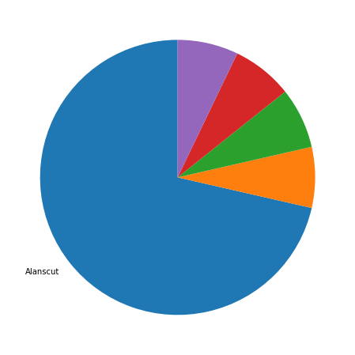
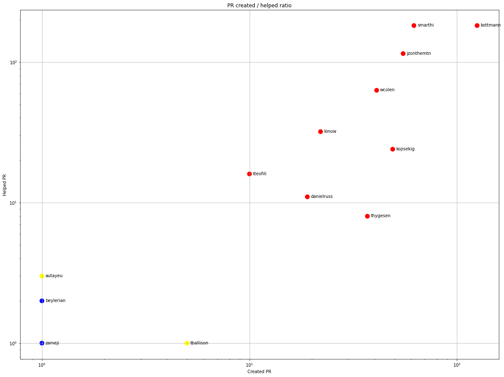
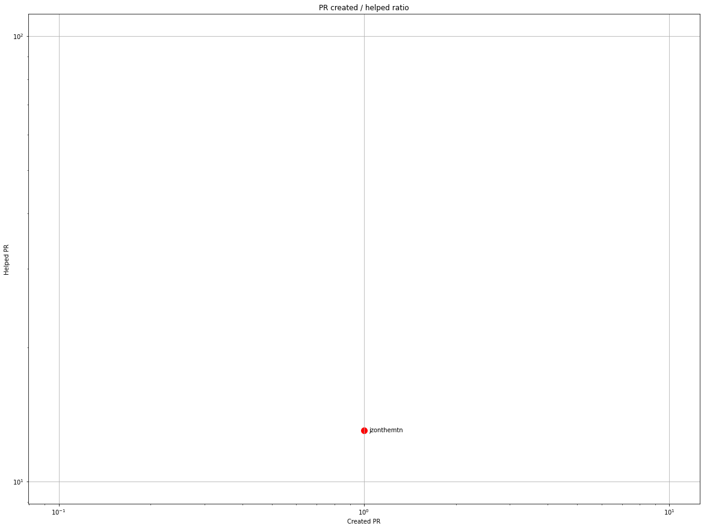
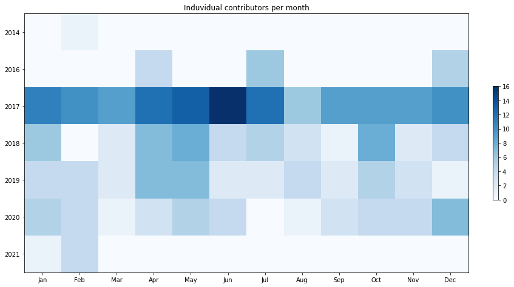
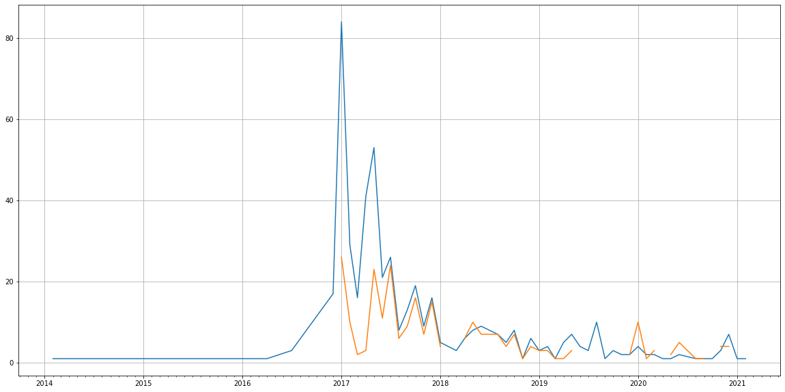
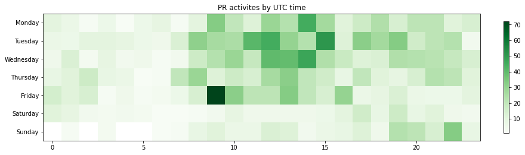

Latest record from the dataset:

<table border="1" class="dataframe">
  <thead>
    <tr style="text-align: right;">
      <th></th>
      <th>org</th>
      <th>repo</th>
      <th>type</th>
      <th>identifier</th>
      <th>subidentifier</th>
      <th>date</th>
      <th>author</th>
      <th>owner</th>
      <th>project</th>
    </tr>
  </thead>
  <tbody>
    <tr>
      <th>1749</th>
      <td>apache</td>
      <td>opennlp</td>
      <td>PR_COMMENTED</td>
      <td>390</td>
      <td>NaN</td>
      <td>2021-02-07 14:04:30+00:00</td>
      <td>jzonthemtn</td>
      <td>Alanscut</td>
      <td>opennlp</td>
    </tr>
  </tbody>
</table>

# Github Contributions per user

<table border="1" class="dataframe">
  <thead>
    <tr style="text-align: right;">
      <th></th>
      <th>contributions</th>
    </tr>
    <tr>
      <th>author</th>
      <th></th>
    </tr>
  </thead>
  <tbody>
    <tr>
      <th>kottmann</th>
      <td>451</td>
    </tr>
    <tr>
      <th>smarthi</th>
      <td>303</td>
    </tr>
    <tr>
      <th>coveralls</th>
      <td>197</td>
    </tr>
    <tr>
      <th>jzonthemtn</th>
      <td>171</td>
    </tr>
    <tr>
      <th>wcolen</th>
      <td>78</td>
    </tr>
    <tr>
      <th>asfgit</th>
      <td>75</td>
    </tr>
    <tr>
      <th>kinow</th>
      <td>44</td>
    </tr>
    <tr>
      <th>kojisekig</th>
      <td>30</td>
    </tr>
    <tr>
      <th>tteofili</th>
      <td>19</td>
    </tr>
    <tr>
      <th>chrismattmann</th>
      <td>17</td>
    </tr>
  </tbody>
</table>

## Contributors per participations in PRs which are not created by self (helping PRs)

<table border="1" class="dataframe">
  <thead>
    <tr style="text-align: right;">
      <th></th>
      <th>identifier</th>
    </tr>
    <tr>
      <th>author</th>
      <th></th>
    </tr>
  </thead>
  <tbody>
    <tr>
      <th>kottmann</th>
      <td>182</td>
    </tr>
    <tr>
      <th>smarthi</th>
      <td>182</td>
    </tr>
    <tr>
      <th>jzonthemtn</th>
      <td>115</td>
    </tr>
    <tr>
      <th>coveralls</th>
      <td>95</td>
    </tr>
    <tr>
      <th>asfgit</th>
      <td>75</td>
    </tr>
    <tr>
      <th>wcolen</th>
      <td>63</td>
    </tr>
    <tr>
      <th>kinow</th>
      <td>32</td>
    </tr>
    <tr>
      <th>kojisekig</th>
      <td>24</td>
    </tr>
    <tr>
      <th>tteofili</th>
      <td>16</td>
    </tr>
    <tr>
      <th>danielruss</th>
      <td>11</td>
    </tr>
    <tr>
      <th>thygesen</th>
      <td>8</td>
    </tr>
    <tr>
      <th>chrismattmann</th>
      <td>5</td>
    </tr>
    <tr>
      <th>autayeu</th>
      <td>3</td>
    </tr>
    <tr>
      <th>beylerian</th>
      <td>2</td>
    </tr>
    <tr>
      <th>agibsonccc</th>
      <td>1</td>
    </tr>
    <tr>
      <th>tballison</th>
      <td>1</td>
    </tr>
    <tr>
      <th>reckart</th>
      <td>1</td>
    </tr>
    <tr>
      <th>sarowe</th>
      <td>1</td>
    </tr>
    <tr>
      <th>partomrider1</th>
      <td>1</td>
    </tr>
    <tr>
      <th>priyankanmehta</th>
      <td>1</td>
    </tr>
  </tbody>
</table>

## Contributors per participations in any PRs

<table border="1" class="dataframe">
  <thead>
    <tr style="text-align: right;">
      <th></th>
      <th>identifier</th>
    </tr>
    <tr>
      <th>author</th>
      <th></th>
    </tr>
  </thead>
  <tbody>
    <tr>
      <th>kottmann</th>
      <td>290</td>
    </tr>
    <tr>
      <th>smarthi</th>
      <td>227</td>
    </tr>
    <tr>
      <th>jzonthemtn</th>
      <td>165</td>
    </tr>
    <tr>
      <th>wcolen</th>
      <td>101</td>
    </tr>
    <tr>
      <th>coveralls</th>
      <td>95</td>
    </tr>
    <tr>
      <th>asfgit</th>
      <td>75</td>
    </tr>
    <tr>
      <th>kojisekig</th>
      <td>73</td>
    </tr>
    <tr>
      <th>kinow</th>
      <td>53</td>
    </tr>
    <tr>
      <th>thygesen</th>
      <td>44</td>
    </tr>
    <tr>
      <th>danielruss</th>
      <td>30</td>
    </tr>
    <tr>
      <th>tteofili</th>
      <td>26</td>
    </tr>
    <tr>
      <th>Alanscut</th>
      <td>10</td>
    </tr>
    <tr>
      <th>tballison</th>
      <td>6</td>
    </tr>
    <tr>
      <th>jimregan</th>
      <td>5</td>
    </tr>
    <tr>
      <th>chrismattmann</th>
      <td>5</td>
    </tr>
    <tr>
      <th>madhawa-gunasekara</th>
      <td>4</td>
    </tr>
    <tr>
      <th>ragerri</th>
      <td>4</td>
    </tr>
    <tr>
      <th>amensiko</th>
      <td>4</td>
    </tr>
    <tr>
      <th>autayeu</th>
      <td>4</td>
    </tr>
    <tr>
      <th>dependabot</th>
      <td>3</td>
    </tr>
  </tbody>
</table>

# Bus factor (number of contributors responsible for the 50% of the prs) from last half year

## Contributors until the half of the all contributions

<table border="1" class="dataframe">
  <thead>
    <tr style="text-align: right;">
      <th></th>
      <th>author</th>
      <th>identifier</th>
      <th>cs</th>
      <th>ratio</th>
    </tr>
  </thead>
  <tbody>
  </tbody>
</table>

## Pony number (bus factor)

    1

## Dev power (All the contributions in the ration of the top contributor)

    1.4000000000000004

    

    

## People with created PRs > reviewed/commented PRS

    

    

## Same graph with focusing to the last 6 month

Only contributors with both created pr and helped pr visible

    

    

# Number of individual contributors per month

Number of different Github users who either created PR, commented PR, added review to a PR

Note: only events from apache/hadoop-ozone repository are included. Earlier PRs/comments are not here.

    

    

# Number of PRs closed/created per month

    /usr/lib/python3.9/site-packages/pandas/core/arrays/datetimes.py:1101: UserWarning: Converting to PeriodArray/Index representation will drop timezone information.
      warnings.warn(

    

    

# PR activity heatmap

    

    

