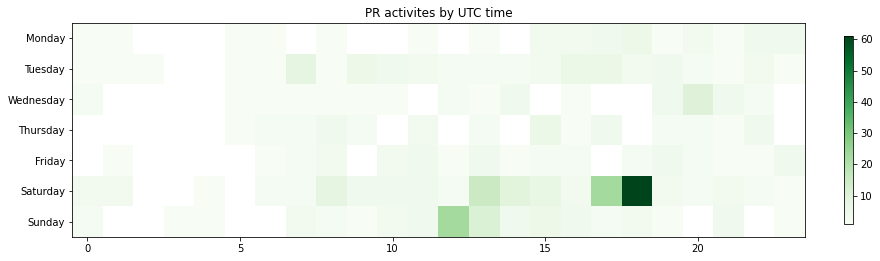

Latest record from the dataset:

<table border="1" class="dataframe">
  <thead>
    <tr style="text-align: right;">
      <th></th>
      <th>org</th>
      <th>repo</th>
      <th>type</th>
      <th>identifier</th>
      <th>subidentifier</th>
      <th>date</th>
      <th>author</th>
      <th>owner</th>
      <th>project</th>
    </tr>
  </thead>
  <tbody>
    <tr>
      <th>426</th>
      <td>apache</td>
      <td>openoffice-docs</td>
      <td>PR_MERGED</td>
      <td>1</td>
      <td>NaN</td>
      <td>2021-02-09 19:16:37+00:00</td>
      <td>knmc</td>
      <td>FJCC</td>
      <td>openoffice</td>
    </tr>
  </tbody>
</table>

# Github Contributions per user

<table border="1" class="dataframe">
  <thead>
    <tr style="text-align: right;">
      <th></th>
      <th>contributions</th>
    </tr>
    <tr>
      <th>author</th>
      <th></th>
    </tr>
  </thead>
  <tbody>
    <tr>
      <th>Pilot-Pirx</th>
      <td>81</td>
    </tr>
    <tr>
      <th>cbmarcum</th>
      <td>32</td>
    </tr>
    <tr>
      <th>leginee</th>
      <td>29</td>
    </tr>
    <tr>
      <th>Mechtilde</th>
      <td>15</td>
    </tr>
    <tr>
      <th>ardovm</th>
      <td>11</td>
    </tr>
    <tr>
      <th>knmc</th>
      <td>5</td>
    </tr>
    <tr>
      <th>DamjanJovanovic</th>
      <td>4</td>
    </tr>
    <tr>
      <th>jimjag</th>
      <td>4</td>
    </tr>
    <tr>
      <th>orcmid</th>
      <td>3</td>
    </tr>
    <tr>
      <th>dev-hyeondnl</th>
      <td>3</td>
    </tr>
  </tbody>
</table>

## Contributors per participations in PRs which are not created by self (helping PRs)

<table border="1" class="dataframe">
  <thead>
    <tr style="text-align: right;">
      <th></th>
      <th>identifier</th>
    </tr>
    <tr>
      <th>author</th>
      <th></th>
    </tr>
  </thead>
  <tbody>
    <tr>
      <th>Pilot-Pirx</th>
      <td>35</td>
    </tr>
    <tr>
      <th>cbmarcum</th>
      <td>20</td>
    </tr>
    <tr>
      <th>leginee</th>
      <td>17</td>
    </tr>
    <tr>
      <th>Mechtilde</th>
      <td>7</td>
    </tr>
    <tr>
      <th>jimjag</th>
      <td>4</td>
    </tr>
    <tr>
      <th>DamjanJovanovic</th>
      <td>3</td>
    </tr>
    <tr>
      <th>ardovm</th>
      <td>3</td>
    </tr>
    <tr>
      <th>DonLewisFreeBSD</th>
      <td>2</td>
    </tr>
    <tr>
      <th>pescetti</th>
      <td>2</td>
    </tr>
    <tr>
      <th>dev-hyeondnl</th>
      <td>1</td>
    </tr>
    <tr>
      <th>fitojb</th>
      <td>1</td>
    </tr>
    <tr>
      <th>PatriciaShanahan</th>
      <td>1</td>
    </tr>
    <tr>
      <th>knmc</th>
      <td>1</td>
    </tr>
    <tr>
      <th>JohnRDOrazio</th>
      <td>1</td>
    </tr>
    <tr>
      <th>orcmid</th>
      <td>1</td>
    </tr>
    <tr>
      <th>pedlino</th>
      <td>1</td>
    </tr>
    <tr>
      <th>dave2wave</th>
      <td>1</td>
    </tr>
  </tbody>
</table>

## Contributors per participations in any PRs

<table border="1" class="dataframe">
  <thead>
    <tr style="text-align: right;">
      <th></th>
      <th>identifier</th>
    </tr>
    <tr>
      <th>author</th>
      <th></th>
    </tr>
  </thead>
  <tbody>
    <tr>
      <th>DiGro</th>
      <td>61</td>
    </tr>
    <tr>
      <th>Pilot-Pirx</th>
      <td>37</td>
    </tr>
    <tr>
      <th>cbmarcum</th>
      <td>26</td>
    </tr>
    <tr>
      <th>leginee</th>
      <td>24</td>
    </tr>
    <tr>
      <th>oooforum</th>
      <td>14</td>
    </tr>
    <tr>
      <th>ardovm</th>
      <td>11</td>
    </tr>
    <tr>
      <th>DonLewisFreeBSD</th>
      <td>11</td>
    </tr>
    <tr>
      <th>Mechtilde</th>
      <td>7</td>
    </tr>
    <tr>
      <th>jimjag</th>
      <td>4</td>
    </tr>
    <tr>
      <th>pedlino</th>
      <td>3</td>
    </tr>
    <tr>
      <th>DamjanJovanovic</th>
      <td>3</td>
    </tr>
    <tr>
      <th>pgiffuni</th>
      <td>2</td>
    </tr>
    <tr>
      <th>pescetti</th>
      <td>2</td>
    </tr>
    <tr>
      <th>orcmid</th>
      <td>1</td>
    </tr>
    <tr>
      <th>knmc</th>
      <td>1</td>
    </tr>
    <tr>
      <th>samuel100u</th>
      <td>1</td>
    </tr>
    <tr>
      <th>nikolovmiroslav</th>
      <td>1</td>
    </tr>
    <tr>
      <th>ne-oss</th>
      <td>1</td>
    </tr>
    <tr>
      <th>marcus-aoo</th>
      <td>1</td>
    </tr>
    <tr>
      <th>luankevinferreira</th>
      <td>1</td>
    </tr>
  </tbody>
</table>

# Bus factor (number of contributors responsible for the 50% of the prs) from last half year

## Contributors until the half of the all contributions

<table border="1" class="dataframe">
  <thead>
    <tr style="text-align: right;">
      <th></th>
      <th>author</th>
      <th>identifier</th>
      <th>cs</th>
      <th>ratio</th>
    </tr>
  </thead>
  <tbody>
    <tr>
      <th>0</th>
      <td>DonLewisFreeBSD</td>
      <td>9</td>
      <td>9</td>
      <td>23.684211</td>
    </tr>
    <tr>
      <th>1</th>
      <td>ardovm</td>
      <td>7</td>
      <td>16</td>
      <td>18.421053</td>
    </tr>
  </tbody>
</table>

## Pony number (bus factor)

    3

## Dev power (All the contributions in the ration of the top contributor)

    4.222222222222221

    

    

## People with created PRs > reviewed/commented PRS

    

    

## Same graph with focusing to the last 6 month

Only contributors with both created pr and helped pr visible

    

    

# Number of individual contributors per month

Number of different Github users who either created PR, commented PR, added review to a PR

Note: only events from apache/hadoop-ozone repository are included. Earlier PRs/comments are not here.

    

    

# Number of PRs closed/created per month

    /usr/lib/python3.9/site-packages/pandas/core/arrays/datetimes.py:1101: UserWarning: Converting to PeriodArray/Index representation will drop timezone information.
      warnings.warn(

    

    

# PR activity heatmap

    

    

