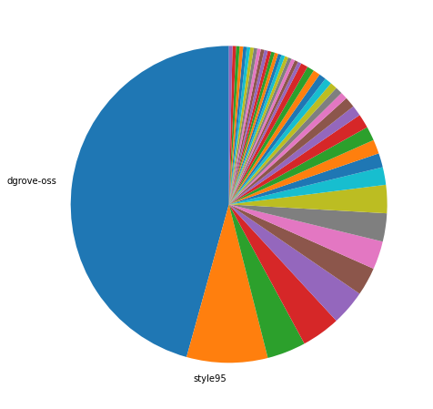
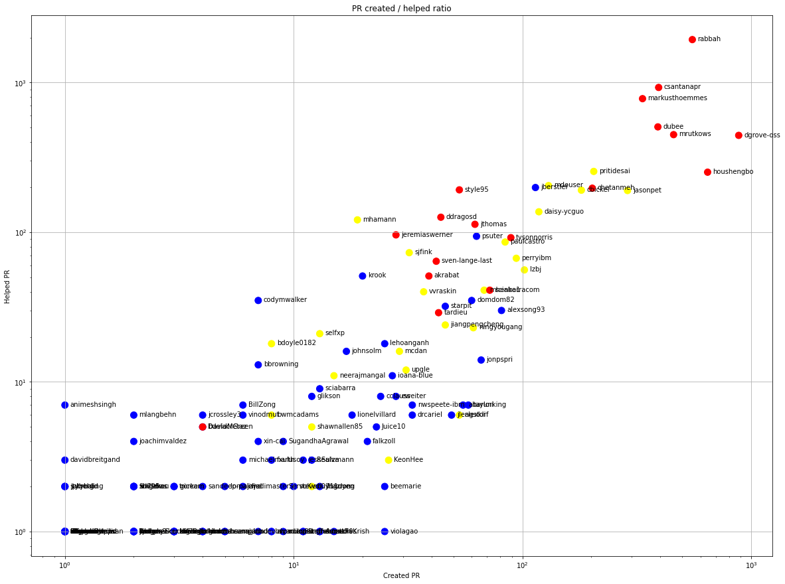
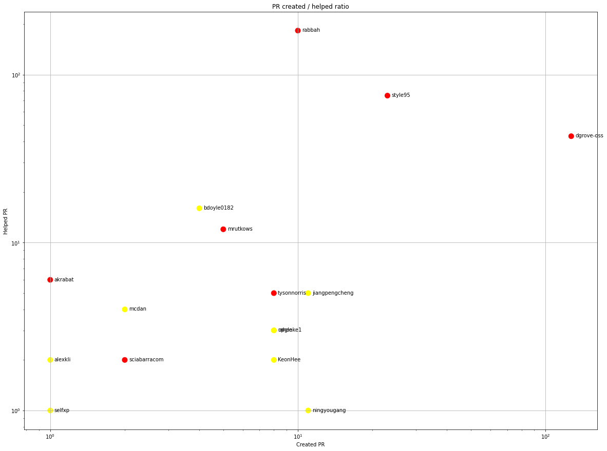
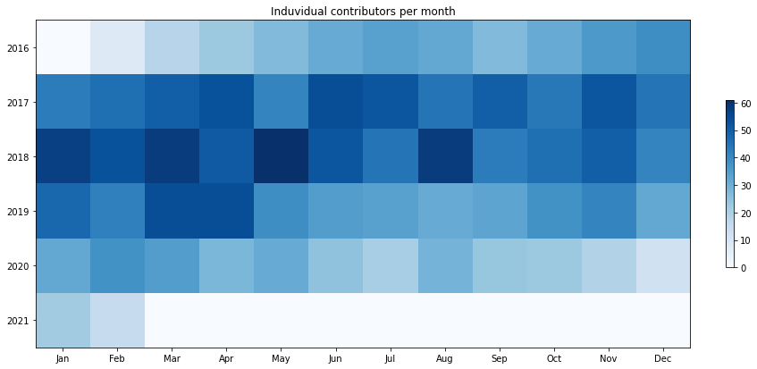
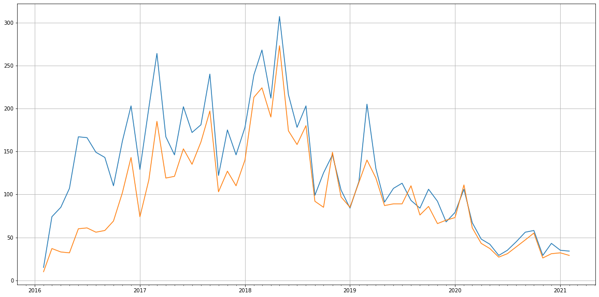
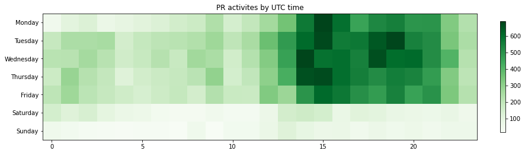

Latest record from the dataset:

<table border="1" class="dataframe">
  <thead>
    <tr style="text-align: right;">
      <th></th>
      <th>org</th>
      <th>repo</th>
      <th>type</th>
      <th>identifier</th>
      <th>subidentifier</th>
      <th>date</th>
      <th>author</th>
      <th>owner</th>
      <th>project</th>
    </tr>
  </thead>
  <tbody>
    <tr>
      <th>24078</th>
      <td>apache</td>
      <td>openwhisk</td>
      <td>PR_COMMENTED</td>
      <td>5066</td>
      <td>NaN</td>
      <td>2021-02-13 22:53:28+00:00</td>
      <td>codecov-io</td>
      <td>dgrove-oss</td>
      <td>openwhisk</td>
    </tr>
  </tbody>
</table>

# Github Contributions per user

<table border="1" class="dataframe">
  <thead>
    <tr style="text-align: right;">
      <th></th>
      <th>contributions</th>
    </tr>
    <tr>
      <th>author</th>
      <th></th>
    </tr>
  </thead>
  <tbody>
    <tr>
      <th>rabbah</th>
      <td>6666</td>
    </tr>
    <tr>
      <th>csantanapr</th>
      <td>3020</td>
    </tr>
    <tr>
      <th>markusthoemmes</th>
      <td>2196</td>
    </tr>
    <tr>
      <th>dubee</th>
      <td>1527</td>
    </tr>
    <tr>
      <th>mrutkows</th>
      <td>1131</td>
    </tr>
    <tr>
      <th>dgrove-oss</th>
      <td>1025</td>
    </tr>
    <tr>
      <th>codecov-io</th>
      <td>874</td>
    </tr>
    <tr>
      <th>houshengbo</th>
      <td>660</td>
    </tr>
    <tr>
      <th>mdeuser</th>
      <td>562</td>
    </tr>
    <tr>
      <th>pritidesai</th>
      <td>553</td>
    </tr>
  </tbody>
</table>

## Contributors per participations in PRs which are not created by self (helping PRs)

<table border="1" class="dataframe">
  <thead>
    <tr style="text-align: right;">
      <th></th>
      <th>identifier</th>
    </tr>
    <tr>
      <th>author</th>
      <th></th>
    </tr>
  </thead>
  <tbody>
    <tr>
      <th>rabbah</th>
      <td>1938</td>
    </tr>
    <tr>
      <th>csantanapr</th>
      <td>928</td>
    </tr>
    <tr>
      <th>codecov-io</th>
      <td>871</td>
    </tr>
    <tr>
      <th>markusthoemmes</th>
      <td>781</td>
    </tr>
    <tr>
      <th>dubee</th>
      <td>506</td>
    </tr>
    <tr>
      <th>mrutkows</th>
      <td>449</td>
    </tr>
    <tr>
      <th>dgrove-oss</th>
      <td>444</td>
    </tr>
    <tr>
      <th>pritidesai</th>
      <td>255</td>
    </tr>
    <tr>
      <th>houshengbo</th>
      <td>252</td>
    </tr>
    <tr>
      <th>mdeuser</th>
      <td>205</td>
    </tr>
    <tr>
      <th>jberstler</th>
      <td>199</td>
    </tr>
    <tr>
      <th>chetanmeh</th>
      <td>197</td>
    </tr>
    <tr>
      <th>style95</th>
      <td>192</td>
    </tr>
    <tr>
      <th>cbickel</th>
      <td>191</td>
    </tr>
    <tr>
      <th>jasonpet</th>
      <td>190</td>
    </tr>
    <tr>
      <th>daisy-ycguo</th>
      <td>137</td>
    </tr>
    <tr>
      <th>ddragosd</th>
      <td>126</td>
    </tr>
    <tr>
      <th>mhamann</th>
      <td>121</td>
    </tr>
    <tr>
      <th>jthomas</th>
      <td>113</td>
    </tr>
    <tr>
      <th>jeremiaswerner</th>
      <td>96</td>
    </tr>
  </tbody>
</table>

## Contributors per participations in any PRs

<table border="1" class="dataframe">
  <thead>
    <tr style="text-align: right;">
      <th></th>
      <th>identifier</th>
    </tr>
    <tr>
      <th>author</th>
      <th></th>
    </tr>
  </thead>
  <tbody>
    <tr>
      <th>rabbah</th>
      <td>2303</td>
    </tr>
    <tr>
      <th>csantanapr</th>
      <td>1117</td>
    </tr>
    <tr>
      <th>markusthoemmes</th>
      <td>1108</td>
    </tr>
    <tr>
      <th>codecov-io</th>
      <td>871</td>
    </tr>
    <tr>
      <th>dgrove-oss</th>
      <td>845</td>
    </tr>
    <tr>
      <th>dubee</th>
      <td>838</td>
    </tr>
    <tr>
      <th>mrutkows</th>
      <td>680</td>
    </tr>
    <tr>
      <th>houshengbo</th>
      <td>602</td>
    </tr>
    <tr>
      <th>pritidesai</th>
      <td>433</td>
    </tr>
    <tr>
      <th>chetanmeh</th>
      <td>396</td>
    </tr>
    <tr>
      <th>cbickel</th>
      <td>372</td>
    </tr>
    <tr>
      <th>mdeuser</th>
      <td>335</td>
    </tr>
    <tr>
      <th>jasonpet</th>
      <td>319</td>
    </tr>
    <tr>
      <th>jberstler</th>
      <td>293</td>
    </tr>
    <tr>
      <th>style95</th>
      <td>244</td>
    </tr>
    <tr>
      <th>daisy-ycguo</th>
      <td>221</td>
    </tr>
    <tr>
      <th>tysonnorris</th>
      <td>181</td>
    </tr>
    <tr>
      <th>ddragosd</th>
      <td>162</td>
    </tr>
    <tr>
      <th>perryibm</th>
      <td>161</td>
    </tr>
    <tr>
      <th>jthomas</th>
      <td>158</td>
    </tr>
  </tbody>
</table>

# Bus factor (number of contributors responsible for the 50% of the prs) from last half year

## Contributors until the half of the all contributions

<table border="1" class="dataframe">
  <thead>
    <tr style="text-align: right;">
      <th></th>
      <th>author</th>
      <th>identifier</th>
      <th>cs</th>
      <th>ratio</th>
    </tr>
  </thead>
  <tbody>
    <tr>
      <th>0</th>
      <td>dgrove-oss</td>
      <td>127</td>
      <td>127</td>
      <td>45.683453</td>
    </tr>
  </tbody>
</table>

## Pony number (bus factor)

    2

## Dev power (All the contributions in the ration of the top contributor)

    2.1889763779527556

    

    

## People with created PRs > reviewed/commented PRS

    

    

## Same graph with focusing to the last 6 month

Only contributors with both created pr and helped pr visible

    

    

# Number of individual contributors per month

Number of different Github users who either created PR, commented PR, added review to a PR

Note: only events from apache/hadoop-ozone repository are included. Earlier PRs/comments are not here.

    

    

# Number of PRs closed/created per month

    /usr/lib/python3.9/site-packages/pandas/core/arrays/datetimes.py:1101: UserWarning: Converting to PeriodArray/Index representation will drop timezone information.
      warnings.warn(

    

    

# PR activity heatmap

    

    

