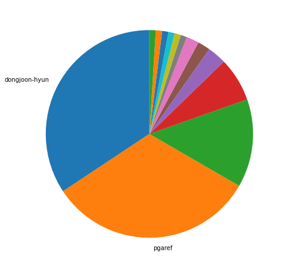
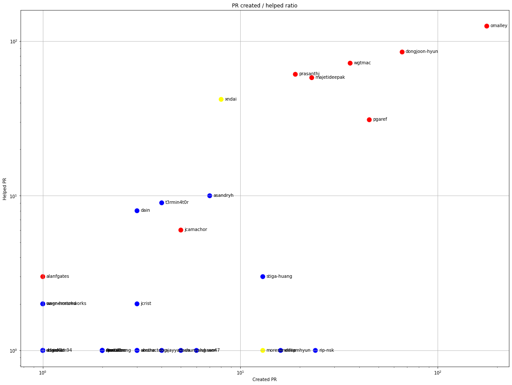
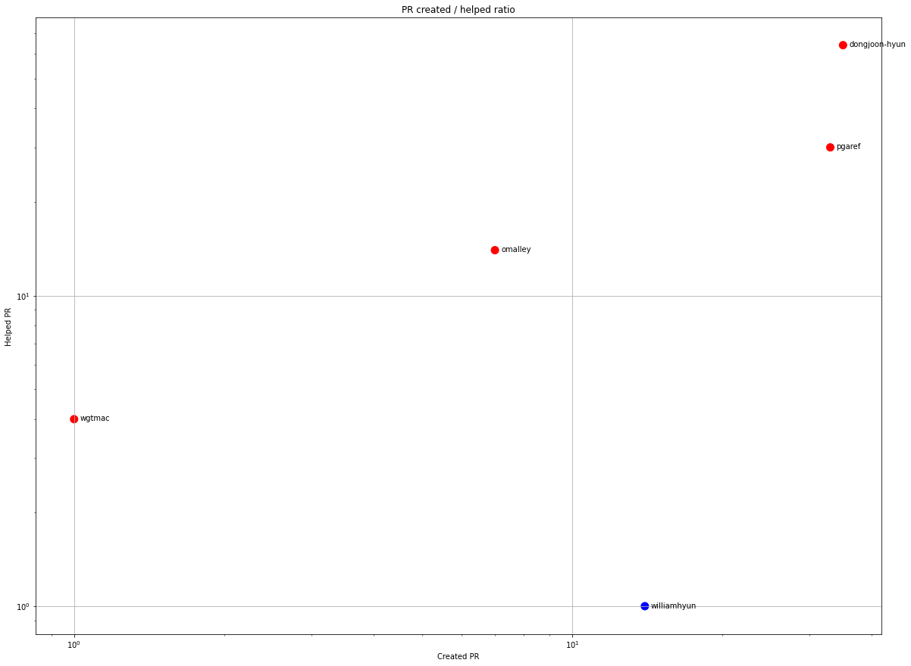
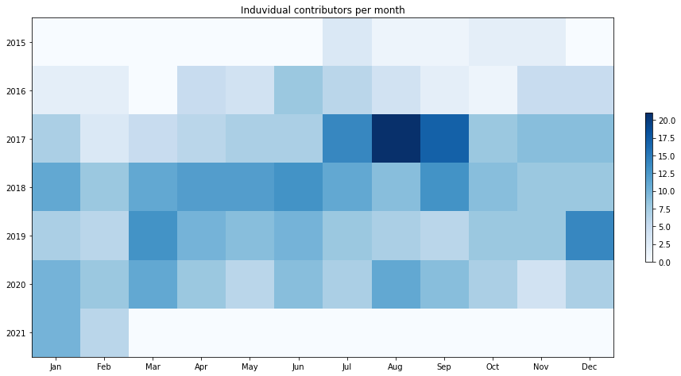
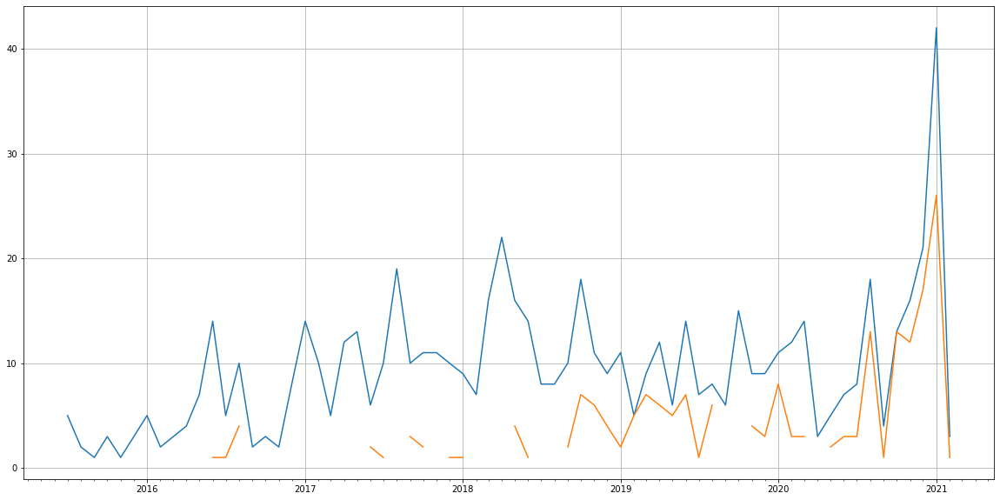
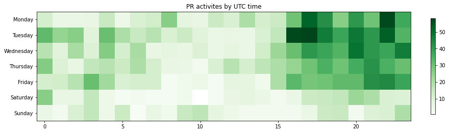

Latest record from the dataset:

<table border="1" class="dataframe">
  <thead>
    <tr style="text-align: right;">
      <th></th>
      <th>org</th>
      <th>repo</th>
      <th>type</th>
      <th>identifier</th>
      <th>subidentifier</th>
      <th>date</th>
      <th>author</th>
      <th>owner</th>
      <th>project</th>
    </tr>
  </thead>
  <tbody>
    <tr>
      <th>2838</th>
      <td>apache</td>
      <td>orc</td>
      <td>PR_COMMENTED</td>
      <td>635</td>
      <td>NaN</td>
      <td>2021-02-13 00:31:44+00:00</td>
      <td>dongjoon-hyun</td>
      <td>pavibhai</td>
      <td>orc</td>
    </tr>
  </tbody>
</table>

# Github Contributions per user

<table border="1" class="dataframe">
  <thead>
    <tr style="text-align: right;">
      <th></th>
      <th>contributions</th>
    </tr>
    <tr>
      <th>author</th>
      <th></th>
    </tr>
  </thead>
  <tbody>
    <tr>
      <th>dongjoon-hyun</th>
      <td>366</td>
    </tr>
    <tr>
      <th>omalley</th>
      <td>223</td>
    </tr>
    <tr>
      <th>majetideepak</th>
      <td>177</td>
    </tr>
    <tr>
      <th>wgtmac</th>
      <td>154</td>
    </tr>
    <tr>
      <th>prasanthj</th>
      <td>97</td>
    </tr>
    <tr>
      <th>xndai</th>
      <td>96</td>
    </tr>
    <tr>
      <th>pgaref</th>
      <td>58</td>
    </tr>
    <tr>
      <th>asfgit</th>
      <td>28</td>
    </tr>
    <tr>
      <th>t3rmin4t0r</th>
      <td>17</td>
    </tr>
    <tr>
      <th>dain</th>
      <td>13</td>
    </tr>
  </tbody>
</table>

## Contributors per participations in PRs which are not created by self (helping PRs)

<table border="1" class="dataframe">
  <thead>
    <tr style="text-align: right;">
      <th></th>
      <th>identifier</th>
    </tr>
    <tr>
      <th>author</th>
      <th></th>
    </tr>
  </thead>
  <tbody>
    <tr>
      <th>omalley</th>
      <td>125</td>
    </tr>
    <tr>
      <th>dongjoon-hyun</th>
      <td>85</td>
    </tr>
    <tr>
      <th>wgtmac</th>
      <td>72</td>
    </tr>
    <tr>
      <th>prasanthj</th>
      <td>61</td>
    </tr>
    <tr>
      <th>majetideepak</th>
      <td>58</td>
    </tr>
    <tr>
      <th>xndai</th>
      <td>42</td>
    </tr>
    <tr>
      <th>pgaref</th>
      <td>31</td>
    </tr>
    <tr>
      <th>asfgit</th>
      <td>28</td>
    </tr>
    <tr>
      <th>asandryh</th>
      <td>10</td>
    </tr>
    <tr>
      <th>t3rmin4t0r</th>
      <td>9</td>
    </tr>
    <tr>
      <th>dain</th>
      <td>8</td>
    </tr>
    <tr>
      <th>jcamachor</th>
      <td>6</td>
    </tr>
    <tr>
      <th>jamesclampffer</th>
      <td>5</td>
    </tr>
    <tr>
      <th>csringhofer</th>
      <td>3</td>
    </tr>
    <tr>
      <th>stiga-huang</th>
      <td>3</td>
    </tr>
    <tr>
      <th>alanfgates</th>
      <td>3</td>
    </tr>
    <tr>
      <th>owen-hortonworks</th>
      <td>2</td>
    </tr>
    <tr>
      <th>wagnermarkd</th>
      <td>2</td>
    </tr>
    <tr>
      <th>jcrist</th>
      <td>2</td>
    </tr>
    <tr>
      <th>rip-nsk</th>
      <td>1</td>
    </tr>
  </tbody>
</table>

## Contributors per participations in any PRs

<table border="1" class="dataframe">
  <thead>
    <tr style="text-align: right;">
      <th></th>
      <th>identifier</th>
    </tr>
    <tr>
      <th>author</th>
      <th></th>
    </tr>
  </thead>
  <tbody>
    <tr>
      <th>omalley</th>
      <td>302</td>
    </tr>
    <tr>
      <th>dongjoon-hyun</th>
      <td>151</td>
    </tr>
    <tr>
      <th>wgtmac</th>
      <td>108</td>
    </tr>
    <tr>
      <th>majetideepak</th>
      <td>81</td>
    </tr>
    <tr>
      <th>prasanthj</th>
      <td>80</td>
    </tr>
    <tr>
      <th>pgaref</th>
      <td>76</td>
    </tr>
    <tr>
      <th>xndai</th>
      <td>50</td>
    </tr>
    <tr>
      <th>asfgit</th>
      <td>28</td>
    </tr>
    <tr>
      <th>rip-nsk</th>
      <td>25</td>
    </tr>
    <tr>
      <th>williamhyun</th>
      <td>17</td>
    </tr>
    <tr>
      <th>asandryh</th>
      <td>17</td>
    </tr>
    <tr>
      <th>stiga-huang</th>
      <td>16</td>
    </tr>
    <tr>
      <th>moresandeep</th>
      <td>14</td>
    </tr>
    <tr>
      <th>t3rmin4t0r</th>
      <td>13</td>
    </tr>
    <tr>
      <th>fangzheng</th>
      <td>12</td>
    </tr>
    <tr>
      <th>jcamachor</th>
      <td>11</td>
    </tr>
    <tr>
      <th>dain</th>
      <td>11</td>
    </tr>
    <tr>
      <th>yuokada</th>
      <td>8</td>
    </tr>
    <tr>
      <th>luksan47</th>
      <td>7</td>
    </tr>
    <tr>
      <th>chunyang-wen</th>
      <td>6</td>
    </tr>
  </tbody>
</table>

# Bus factor (number of contributors responsible for the 50% of the prs) from last half year

## Contributors until the half of the all contributions

<table border="1" class="dataframe">
  <thead>
    <tr style="text-align: right;">
      <th></th>
      <th>author</th>
      <th>identifier</th>
      <th>cs</th>
      <th>ratio</th>
    </tr>
  </thead>
  <tbody>
    <tr>
      <th>0</th>
      <td>dongjoon-hyun</td>
      <td>35</td>
      <td>35</td>
      <td>34.313725</td>
    </tr>
  </tbody>
</table>

## Pony number (bus factor)

    2

## Dev power (All the contributions in the ration of the top contributor)

    2.9142857142857137

    

    

## People with created PRs > reviewed/commented PRS

    

    

## Same graph with focusing to the last 6 month

Only contributors with both created pr and helped pr visible

    

    

# Number of individual contributors per month

Number of different Github users who either created PR, commented PR, added review to a PR

Note: only events from apache/hadoop-ozone repository are included. Earlier PRs/comments are not here.

    

    

# Number of PRs closed/created per month

    /usr/lib/python3.9/site-packages/pandas/core/arrays/datetimes.py:1101: UserWarning: Converting to PeriodArray/Index representation will drop timezone information.
      warnings.warn(

    

    

# PR activity heatmap

    

    

