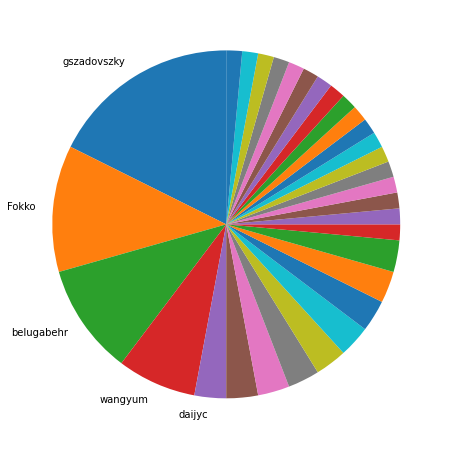
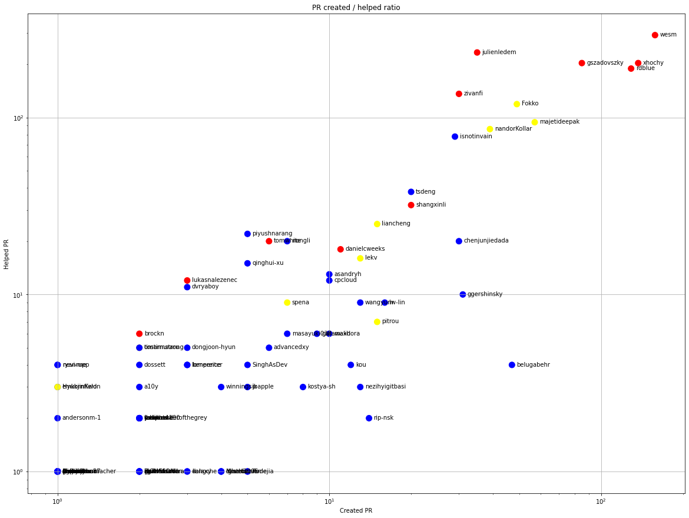
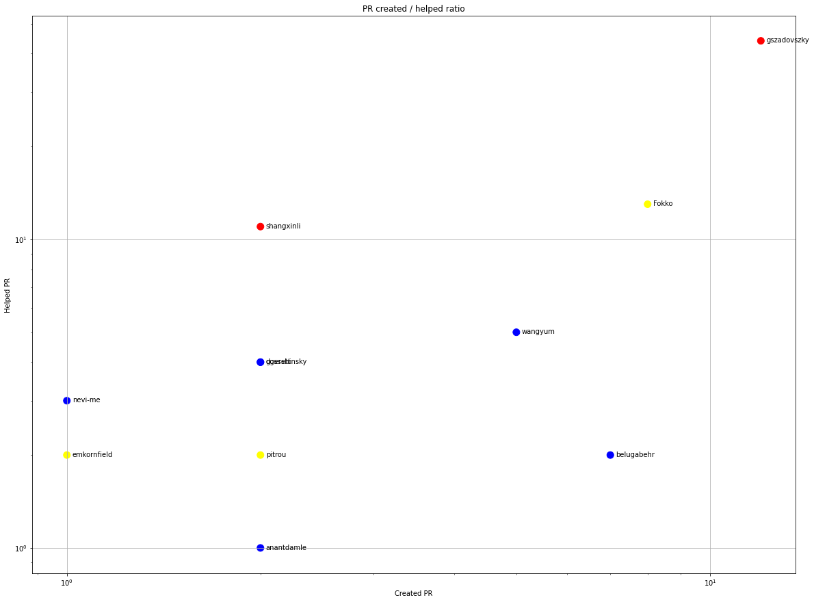
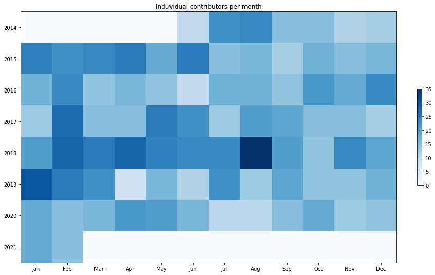
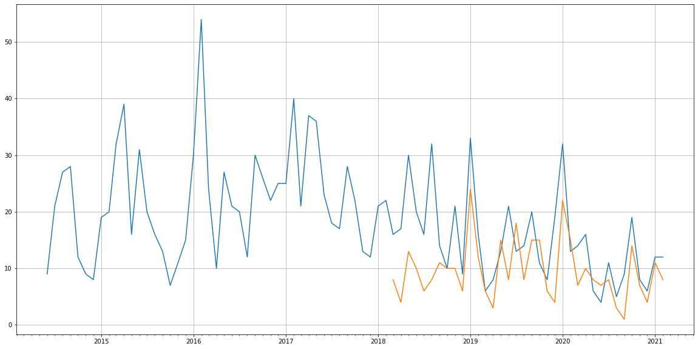
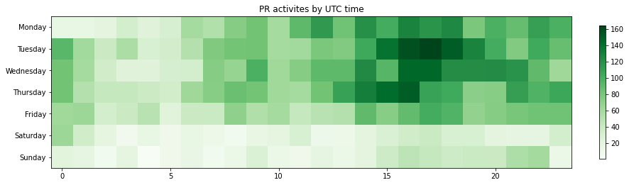

Latest record from the dataset:

<table border="1" class="dataframe">
  <thead>
    <tr style="text-align: right;">
      <th></th>
      <th>org</th>
      <th>repo</th>
      <th>type</th>
      <th>identifier</th>
      <th>subidentifier</th>
      <th>date</th>
      <th>author</th>
      <th>owner</th>
      <th>project</th>
    </tr>
  </thead>
  <tbody>
    <tr>
      <th>3808</th>
      <td>apache</td>
      <td>parquet-format</td>
      <td>PR_REVIEW_COMMENTED</td>
      <td>164</td>
      <td>NaN</td>
      <td>2021-02-12 23:49:26+00:00</td>
      <td>timarmstrong</td>
      <td>gszadovszky</td>
      <td>parquet</td>
    </tr>
  </tbody>
</table>

# Github Contributions per user

<table border="1" class="dataframe">
  <thead>
    <tr style="text-align: right;">
      <th></th>
      <th>contributions</th>
    </tr>
    <tr>
      <th>author</th>
      <th></th>
    </tr>
  </thead>
  <tbody>
    <tr>
      <th>wesm</th>
      <td>844</td>
    </tr>
    <tr>
      <th>rdblue</th>
      <td>630</td>
    </tr>
    <tr>
      <th>gszadovszky</th>
      <td>599</td>
    </tr>
    <tr>
      <th>julienledem</th>
      <td>541</td>
    </tr>
    <tr>
      <th>zivanfi</th>
      <td>365</td>
    </tr>
    <tr>
      <th>xhochy</th>
      <td>327</td>
    </tr>
    <tr>
      <th>Fokko</th>
      <td>239</td>
    </tr>
    <tr>
      <th>isnotinvain</th>
      <td>226</td>
    </tr>
    <tr>
      <th>majetideepak</th>
      <td>196</td>
    </tr>
    <tr>
      <th>nandorKollar</th>
      <td>166</td>
    </tr>
  </tbody>
</table>

## Contributors per participations in PRs which are not created by self (helping PRs)

<table border="1" class="dataframe">
  <thead>
    <tr style="text-align: right;">
      <th></th>
      <th>identifier</th>
    </tr>
    <tr>
      <th>author</th>
      <th></th>
    </tr>
  </thead>
  <tbody>
    <tr>
      <th>wesm</th>
      <td>292</td>
    </tr>
    <tr>
      <th>julienledem</th>
      <td>233</td>
    </tr>
    <tr>
      <th>gszadovszky</th>
      <td>203</td>
    </tr>
    <tr>
      <th>xhochy</th>
      <td>203</td>
    </tr>
    <tr>
      <th>rdblue</th>
      <td>189</td>
    </tr>
    <tr>
      <th>zivanfi</th>
      <td>136</td>
    </tr>
    <tr>
      <th>Fokko</th>
      <td>119</td>
    </tr>
    <tr>
      <th>majetideepak</th>
      <td>94</td>
    </tr>
    <tr>
      <th>nandorKollar</th>
      <td>86</td>
    </tr>
    <tr>
      <th>isnotinvain</th>
      <td>78</td>
    </tr>
    <tr>
      <th>tsdeng</th>
      <td>38</td>
    </tr>
    <tr>
      <th>shangxinli</th>
      <td>32</td>
    </tr>
    <tr>
      <th>liancheng</th>
      <td>25</td>
    </tr>
    <tr>
      <th>piyushnarang</th>
      <td>22</td>
    </tr>
    <tr>
      <th>nongli</th>
      <td>20</td>
    </tr>
    <tr>
      <th>chenjunjiedada</th>
      <td>20</td>
    </tr>
    <tr>
      <th>tomwhite</th>
      <td>20</td>
    </tr>
    <tr>
      <th>danielcweeks</th>
      <td>18</td>
    </tr>
    <tr>
      <th>lekv</th>
      <td>16</td>
    </tr>
    <tr>
      <th>qinghui-xu</th>
      <td>15</td>
    </tr>
  </tbody>
</table>

## Contributors per participations in any PRs

<table border="1" class="dataframe">
  <thead>
    <tr style="text-align: right;">
      <th></th>
      <th>identifier</th>
    </tr>
    <tr>
      <th>author</th>
      <th></th>
    </tr>
  </thead>
  <tbody>
    <tr>
      <th>wesm</th>
      <td>442</td>
    </tr>
    <tr>
      <th>xhochy</th>
      <td>333</td>
    </tr>
    <tr>
      <th>rdblue</th>
      <td>307</td>
    </tr>
    <tr>
      <th>gszadovszky</th>
      <td>288</td>
    </tr>
    <tr>
      <th>julienledem</th>
      <td>255</td>
    </tr>
    <tr>
      <th>Fokko</th>
      <td>168</td>
    </tr>
    <tr>
      <th>zivanfi</th>
      <td>166</td>
    </tr>
    <tr>
      <th>majetideepak</th>
      <td>148</td>
    </tr>
    <tr>
      <th>nandorKollar</th>
      <td>124</td>
    </tr>
    <tr>
      <th>isnotinvain</th>
      <td>106</td>
    </tr>
    <tr>
      <th>tsdeng</th>
      <td>58</td>
    </tr>
    <tr>
      <th>shangxinli</th>
      <td>52</td>
    </tr>
    <tr>
      <th>belugabehr</th>
      <td>51</td>
    </tr>
    <tr>
      <th>chenjunjiedada</th>
      <td>50</td>
    </tr>
    <tr>
      <th>ggershinsky</th>
      <td>41</td>
    </tr>
    <tr>
      <th>liancheng</th>
      <td>40</td>
    </tr>
    <tr>
      <th>lekv</th>
      <td>29</td>
    </tr>
    <tr>
      <th>danielcweeks</th>
      <td>28</td>
    </tr>
    <tr>
      <th>piyushnarang</th>
      <td>27</td>
    </tr>
    <tr>
      <th>nongli</th>
      <td>26</td>
    </tr>
  </tbody>
</table>

# Bus factor (number of contributors responsible for the 50% of the prs) from last half year

## Contributors until the half of the all contributions

<table border="1" class="dataframe">
  <thead>
    <tr style="text-align: right;">
      <th></th>
      <th>author</th>
      <th>identifier</th>
      <th>cs</th>
      <th>ratio</th>
    </tr>
  </thead>
  <tbody>
    <tr>
      <th>0</th>
      <td>gszadovszky</td>
      <td>12</td>
      <td>12</td>
      <td>17.647059</td>
    </tr>
    <tr>
      <th>1</th>
      <td>Fokko</td>
      <td>8</td>
      <td>20</td>
      <td>11.764706</td>
    </tr>
    <tr>
      <th>2</th>
      <td>belugabehr</td>
      <td>7</td>
      <td>27</td>
      <td>10.294118</td>
    </tr>
    <tr>
      <th>3</th>
      <td>wangyum</td>
      <td>5</td>
      <td>32</td>
      <td>7.352941</td>
    </tr>
  </tbody>
</table>

## Pony number (bus factor)

    5

## Dev power (All the contributions in the ration of the top contributor)

    5.666666666666664

    

    

## People with created PRs > reviewed/commented PRS

    

    

## Same graph with focusing to the last 6 month

Only contributors with both created pr and helped pr visible

    

    

# Number of individual contributors per month

Number of different Github users who either created PR, commented PR, added review to a PR

Note: only events from apache/hadoop-ozone repository are included. Earlier PRs/comments are not here.

    

    

# Number of PRs closed/created per month

    /usr/lib/python3.9/site-packages/pandas/core/arrays/datetimes.py:1101: UserWarning: Converting to PeriodArray/Index representation will drop timezone information.
      warnings.warn(

    

    

# PR activity heatmap

    

    

