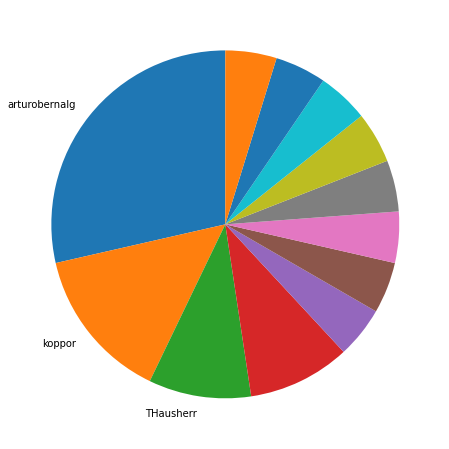
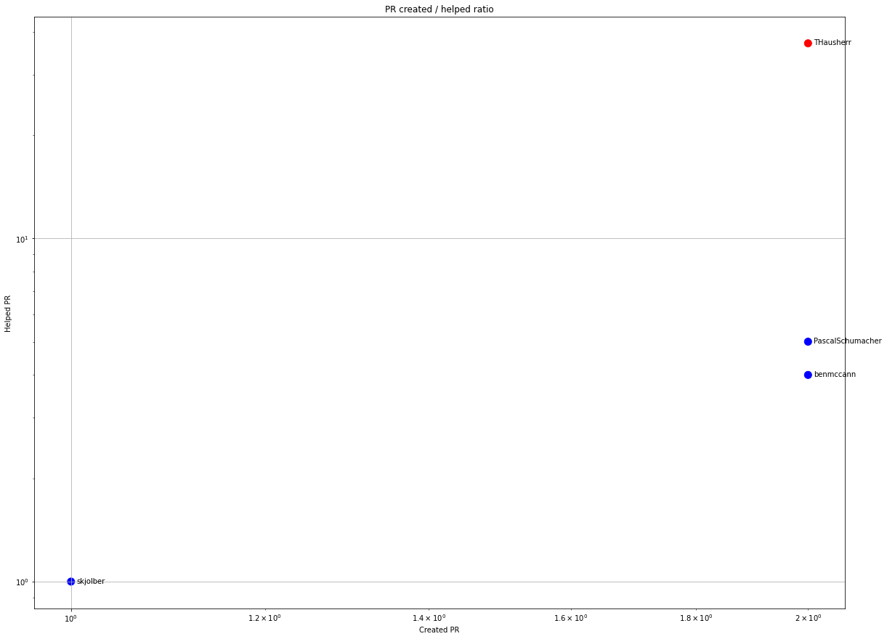
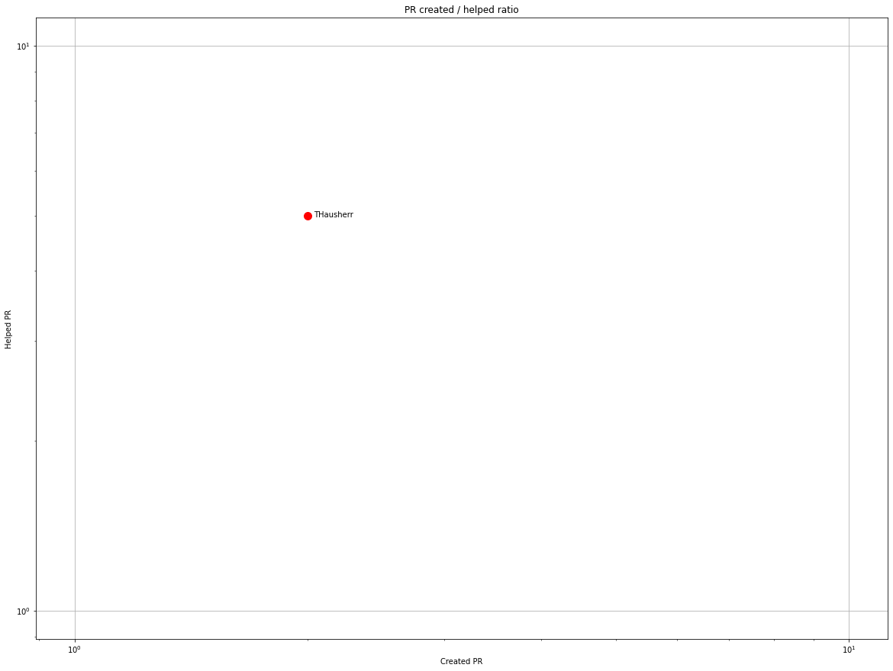
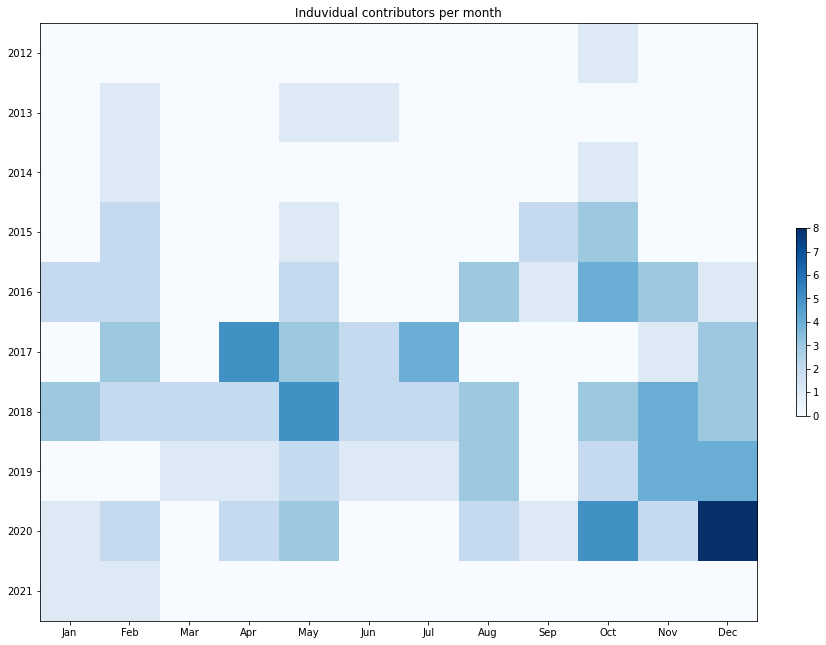
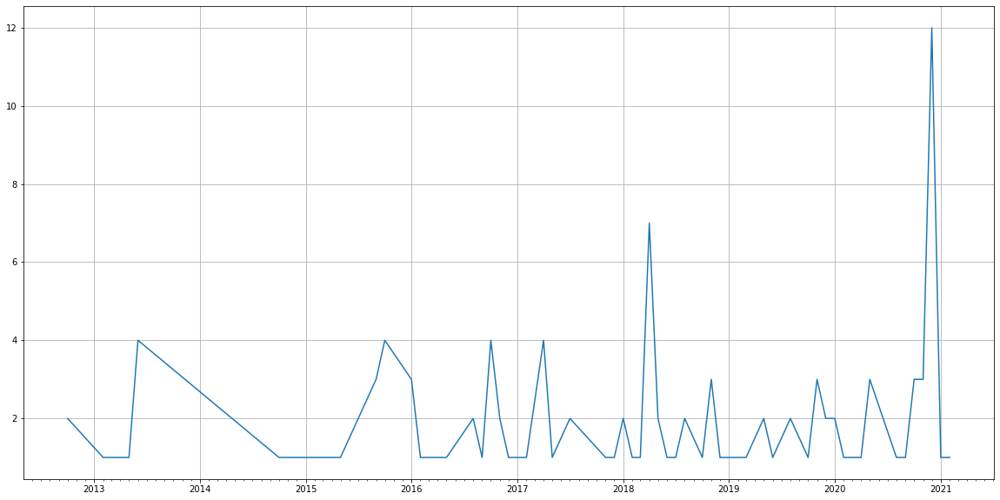
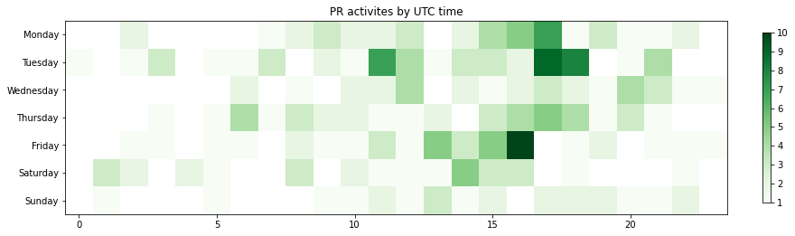

Latest record from the dataset:

<table border="1" class="dataframe">
  <thead>
    <tr style="text-align: right;">
      <th></th>
      <th>org</th>
      <th>repo</th>
      <th>type</th>
      <th>identifier</th>
      <th>subidentifier</th>
      <th>date</th>
      <th>author</th>
      <th>owner</th>
      <th>project</th>
    </tr>
  </thead>
  <tbody>
    <tr>
      <th>14</th>
      <td>apache</td>
      <td>pdfbox</td>
      <td>PR_CREATED</td>
      <td>104</td>
      <td>NaN</td>
      <td>2021-02-05 02:43:29+00:00</td>
      <td>zengquan</td>
      <td>zengquan</td>
      <td>pdfbox</td>
    </tr>
  </tbody>
</table>

# Github Contributions per user

<table border="1" class="dataframe">
  <thead>
    <tr style="text-align: right;">
      <th></th>
      <th>contributions</th>
    </tr>
    <tr>
      <th>author</th>
      <th></th>
    </tr>
  </thead>
  <tbody>
    <tr>
      <th>THausherr</th>
      <td>55</td>
    </tr>
    <tr>
      <th>jahewson</th>
      <td>13</td>
    </tr>
    <tr>
      <th>msahyoun</th>
      <td>7</td>
    </tr>
    <tr>
      <th>lehmi</th>
      <td>6</td>
    </tr>
    <tr>
      <th>PascalSchumacher</th>
      <td>5</td>
    </tr>
    <tr>
      <th>benmccann</th>
      <td>4</td>
    </tr>
    <tr>
      <th>asfgit</th>
      <td>2</td>
    </tr>
    <tr>
      <th>hennejg</th>
      <td>2</td>
    </tr>
    <tr>
      <th>skjolber</th>
      <td>2</td>
    </tr>
    <tr>
      <th>brueno</th>
      <td>1</td>
    </tr>
  </tbody>
</table>

## Contributors per participations in PRs which are not created by self (helping PRs)

<table border="1" class="dataframe">
  <thead>
    <tr style="text-align: right;">
      <th></th>
      <th>identifier</th>
    </tr>
    <tr>
      <th>author</th>
      <th></th>
    </tr>
  </thead>
  <tbody>
    <tr>
      <th>THausherr</th>
      <td>37</td>
    </tr>
    <tr>
      <th>jahewson</th>
      <td>11</td>
    </tr>
    <tr>
      <th>msahyoun</th>
      <td>6</td>
    </tr>
    <tr>
      <th>PascalSchumacher</th>
      <td>5</td>
    </tr>
    <tr>
      <th>lehmi</th>
      <td>5</td>
    </tr>
    <tr>
      <th>benmccann</th>
      <td>4</td>
    </tr>
    <tr>
      <th>asfgit</th>
      <td>2</td>
    </tr>
    <tr>
      <th>hennejg</th>
      <td>2</td>
    </tr>
    <tr>
      <th>brueno</th>
      <td>1</td>
    </tr>
    <tr>
      <th>marktanner1331</th>
      <td>1</td>
    </tr>
    <tr>
      <th>rototor</th>
      <td>1</td>
    </tr>
    <tr>
      <th>skjolber</th>
      <td>1</td>
    </tr>
    <tr>
      <th>srbala</th>
      <td>1</td>
    </tr>
  </tbody>
</table>

## Contributors per participations in any PRs

<table border="1" class="dataframe">
  <thead>
    <tr style="text-align: right;">
      <th></th>
      <th>identifier</th>
    </tr>
    <tr>
      <th>author</th>
      <th></th>
    </tr>
  </thead>
  <tbody>
    <tr>
      <th>THausherr</th>
      <td>38</td>
    </tr>
    <tr>
      <th>jahewson</th>
      <td>11</td>
    </tr>
    <tr>
      <th>paawak</th>
      <td>8</td>
    </tr>
    <tr>
      <th>PascalSchumacher</th>
      <td>7</td>
    </tr>
    <tr>
      <th>benmccann</th>
      <td>6</td>
    </tr>
    <tr>
      <th>msahyoun</th>
      <td>6</td>
    </tr>
    <tr>
      <th>arturobernalg</th>
      <td>6</td>
    </tr>
    <tr>
      <th>lehmi</th>
      <td>5</td>
    </tr>
    <tr>
      <th>scotty1024</th>
      <td>4</td>
    </tr>
    <tr>
      <th>kalaspuffar</th>
      <td>3</td>
    </tr>
    <tr>
      <th>rsby</th>
      <td>3</td>
    </tr>
    <tr>
      <th>koppor</th>
      <td>3</td>
    </tr>
    <tr>
      <th>SchwingSK</th>
      <td>2</td>
    </tr>
    <tr>
      <th>asfgit</th>
      <td>2</td>
    </tr>
    <tr>
      <th>bsanchezb</th>
      <td>2</td>
    </tr>
    <tr>
      <th>grigoriy</th>
      <td>2</td>
    </tr>
    <tr>
      <th>gustavo-moreira</th>
      <td>2</td>
    </tr>
    <tr>
      <th>royguo</th>
      <td>2</td>
    </tr>
    <tr>
      <th>unityclay</th>
      <td>2</td>
    </tr>
    <tr>
      <th>vsadokhin</th>
      <td>2</td>
    </tr>
  </tbody>
</table>

# Bus factor (number of contributors responsible for the 50% of the prs) from last half year

## Contributors until the half of the all contributions

<table border="1" class="dataframe">
  <thead>
    <tr style="text-align: right;">
      <th></th>
      <th>author</th>
      <th>identifier</th>
      <th>cs</th>
      <th>ratio</th>
    </tr>
  </thead>
  <tbody>
    <tr>
      <th>0</th>
      <td>arturobernalg</td>
      <td>6</td>
      <td>6</td>
      <td>28.571429</td>
    </tr>
    <tr>
      <th>1</th>
      <td>koppor</td>
      <td>3</td>
      <td>9</td>
      <td>14.285714</td>
    </tr>
  </tbody>
</table>

## Pony number (bus factor)

    3

## Dev power (All the contributions in the ration of the top contributor)

    3.499999999999999

    

    

## People with created PRs > reviewed/commented PRS

    

    

## Same graph with focusing to the last 6 month

Only contributors with both created pr and helped pr visible

    

    

# Number of individual contributors per month

Number of different Github users who either created PR, commented PR, added review to a PR

Note: only events from apache/hadoop-ozone repository are included. Earlier PRs/comments are not here.

    

    

# Number of PRs closed/created per month

    /usr/lib/python3.9/site-packages/pandas/core/arrays/datetimes.py:1101: UserWarning: Converting to PeriodArray/Index representation will drop timezone information.
      warnings.warn(

    

    

# PR activity heatmap

    

    

