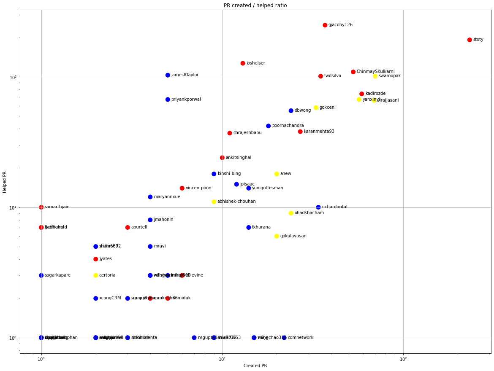

Latest record from the dataset:

<table border="1" class="dataframe">
  <thead>
    <tr style="text-align: right;">
      <th></th>
      <th>org</th>
      <th>repo</th>
      <th>type</th>
      <th>identifier</th>
      <th>subidentifier</th>
      <th>date</th>
      <th>author</th>
      <th>owner</th>
      <th>project</th>
    </tr>
  </thead>
  <tbody>
    <tr>
      <th>952</th>
      <td>apache</td>
      <td>phoenix</td>
      <td>PR_MERGED</td>
      <td>1118</td>
      <td>NaN</td>
      <td>2021-02-14 07:18:00+00:00</td>
      <td>virajjasani</td>
      <td>virajjasani</td>
      <td>phoenix</td>
    </tr>
  </tbody>
</table>

# Github Contributions per user

<table border="1" class="dataframe">
  <thead>
    <tr style="text-align: right;">
      <th></th>
      <th>contributions</th>
    </tr>
    <tr>
      <th>author</th>
      <th></th>
    </tr>
  </thead>
  <tbody>
    <tr>
      <th>stoty</th>
      <td>662</td>
    </tr>
    <tr>
      <th>gjacoby126</th>
      <td>523</td>
    </tr>
    <tr>
      <th>ChinmaySKulkarni</th>
      <td>353</td>
    </tr>
    <tr>
      <th>joshelser</th>
      <td>339</td>
    </tr>
    <tr>
      <th>JamesRTaylor</th>
      <td>330</td>
    </tr>
    <tr>
      <th>swaroopak</th>
      <td>313</td>
    </tr>
    <tr>
      <th>karanmehta93</th>
      <td>231</td>
    </tr>
    <tr>
      <th>twdsilva</th>
      <td>226</td>
    </tr>
    <tr>
      <th>yanxinyi</th>
      <td>207</td>
    </tr>
    <tr>
      <th>priyankporwal</th>
      <td>203</td>
    </tr>
  </tbody>
</table>

## Contributors per participations in PRs which are not created by self (helping PRs)

<table border="1" class="dataframe">
  <thead>
    <tr style="text-align: right;">
      <th></th>
      <th>identifier</th>
    </tr>
    <tr>
      <th>author</th>
      <th></th>
    </tr>
  </thead>
  <tbody>
    <tr>
      <th>gjacoby126</th>
      <td>249</td>
    </tr>
    <tr>
      <th>stoty</th>
      <td>192</td>
    </tr>
    <tr>
      <th>joshelser</th>
      <td>127</td>
    </tr>
    <tr>
      <th>ChinmaySKulkarni</th>
      <td>109</td>
    </tr>
    <tr>
      <th>JamesRTaylor</th>
      <td>103</td>
    </tr>
    <tr>
      <th>swaroopak</th>
      <td>101</td>
    </tr>
    <tr>
      <th>twdsilva</th>
      <td>101</td>
    </tr>
    <tr>
      <th>kadirozde</th>
      <td>74</td>
    </tr>
    <tr>
      <th>priyankporwal</th>
      <td>67</td>
    </tr>
    <tr>
      <th>yanxinyi</th>
      <td>67</td>
    </tr>
    <tr>
      <th>virajjasani</th>
      <td>66</td>
    </tr>
    <tr>
      <th>gokceni</th>
      <td>58</td>
    </tr>
    <tr>
      <th>dbwong</th>
      <td>55</td>
    </tr>
    <tr>
      <th>poornachandra</th>
      <td>42</td>
    </tr>
    <tr>
      <th>karanmehta93</th>
      <td>38</td>
    </tr>
    <tr>
      <th>chrajeshbabu</th>
      <td>37</td>
    </tr>
    <tr>
      <th>ankitsinghal</th>
      <td>24</td>
    </tr>
    <tr>
      <th>asfgit</th>
      <td>22</td>
    </tr>
    <tr>
      <th>binshi-bing</th>
      <td>18</td>
    </tr>
    <tr>
      <th>anew</th>
      <td>18</td>
    </tr>
  </tbody>
</table>

## Contributors per participations in any PRs

<table border="1" class="dataframe">
  <thead>
    <tr style="text-align: right;">
      <th></th>
      <th>identifier</th>
    </tr>
    <tr>
      <th>author</th>
      <th></th>
    </tr>
  </thead>
  <tbody>
    <tr>
      <th>stoty</th>
      <td>404</td>
    </tr>
    <tr>
      <th>gjacoby126</th>
      <td>286</td>
    </tr>
    <tr>
      <th>swaroopak</th>
      <td>171</td>
    </tr>
    <tr>
      <th>ChinmaySKulkarni</th>
      <td>162</td>
    </tr>
    <tr>
      <th>joshelser</th>
      <td>136</td>
    </tr>
    <tr>
      <th>virajjasani</th>
      <td>135</td>
    </tr>
    <tr>
      <th>twdsilva</th>
      <td>135</td>
    </tr>
    <tr>
      <th>kadirozde</th>
      <td>133</td>
    </tr>
    <tr>
      <th>yanxinyi</th>
      <td>124</td>
    </tr>
    <tr>
      <th>JamesRTaylor</th>
      <td>107</td>
    </tr>
    <tr>
      <th>gokceni</th>
      <td>91</td>
    </tr>
    <tr>
      <th>dbwong</th>
      <td>79</td>
    </tr>
    <tr>
      <th>priyankporwal</th>
      <td>72</td>
    </tr>
    <tr>
      <th>karanmehta93</th>
      <td>65</td>
    </tr>
    <tr>
      <th>poornachandra</th>
      <td>60</td>
    </tr>
    <tr>
      <th>chrajeshbabu</th>
      <td>48</td>
    </tr>
    <tr>
      <th>richardantal</th>
      <td>43</td>
    </tr>
    <tr>
      <th>anew</th>
      <td>38</td>
    </tr>
    <tr>
      <th>ankitsinghal</th>
      <td>34</td>
    </tr>
    <tr>
      <th>ohadshacham</th>
      <td>33</td>
    </tr>
  </tbody>
</table>

# Bus factor (number of contributors responsible for the 50% of the prs) from last half year

## Contributors until the half of the all contributions

<table border="1" class="dataframe">
  <thead>
    <tr style="text-align: right;">
      <th></th>
      <th>author</th>
      <th>identifier</th>
      <th>cs</th>
      <th>ratio</th>
    </tr>
  </thead>
  <tbody>
    <tr>
      <th>0</th>
      <td>stoty</td>
      <td>134</td>
      <td>134</td>
      <td>38.395415</td>
    </tr>
  </tbody>
</table>

## Pony number (bus factor)

    2

## Dev power (All the contributions in the ration of the top contributor)

    2.6044776119402986

    

    

## People with created PRs > reviewed/commented PRS

    

    

## Same graph with focusing to the last 6 month

Only contributors with both created pr and helped pr visible

    

    

# Number of individual contributors per month

Number of different Github users who either created PR, commented PR, added review to a PR

Note: only events from apache/hadoop-ozone repository are included. Earlier PRs/comments are not here.

    

    

# Number of PRs closed/created per month

    /usr/lib/python3.9/site-packages/pandas/core/arrays/datetimes.py:1101: UserWarning: Converting to PeriodArray/Index representation will drop timezone information.
      warnings.warn(

    

    

# PR activity heatmap

    

    

