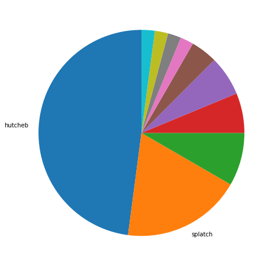
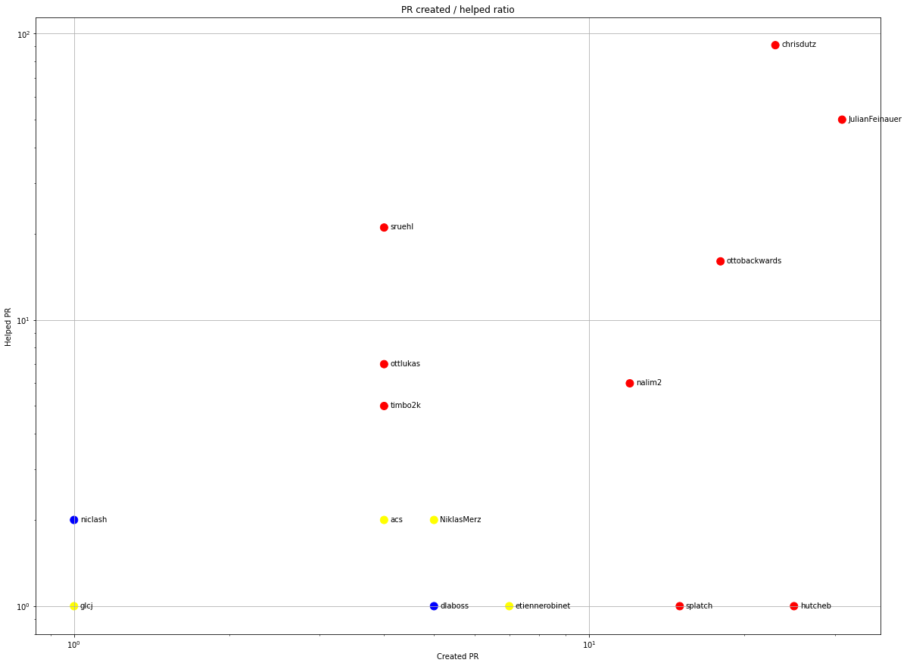
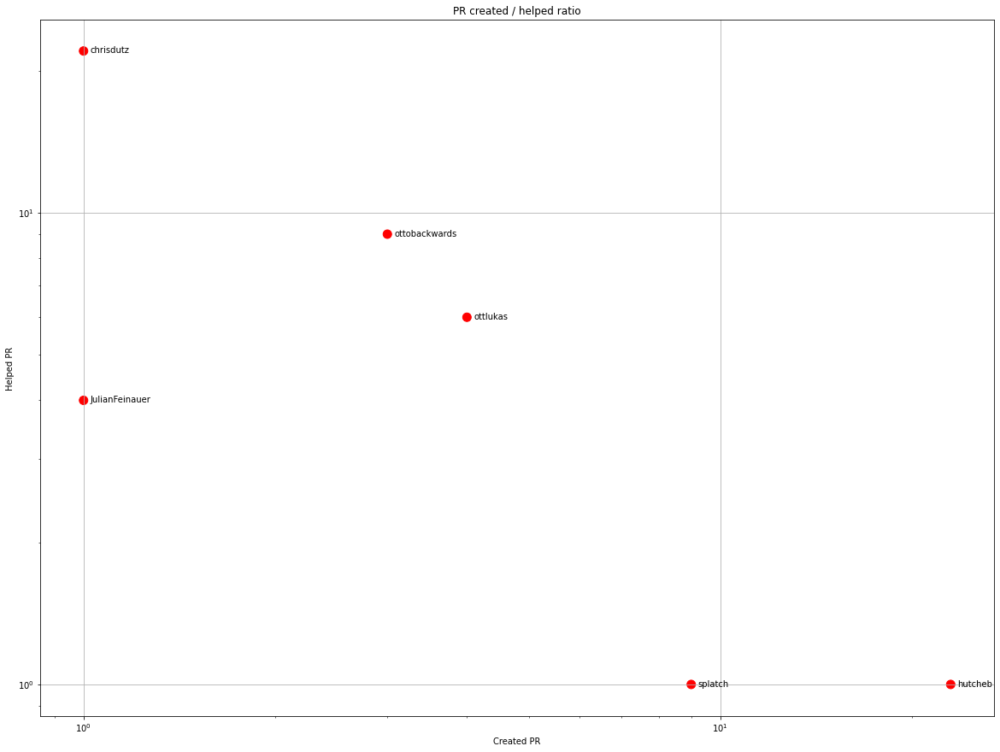
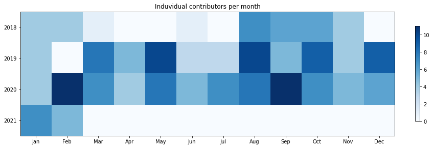
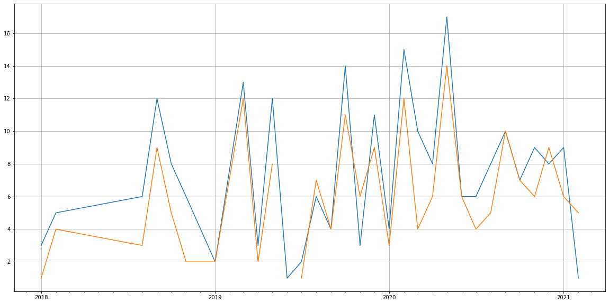
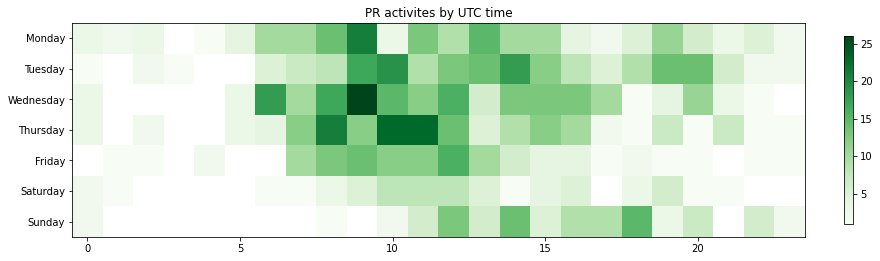

Latest record from the dataset:

<table border="1" class="dataframe">
  <thead>
    <tr style="text-align: right;">
      <th></th>
      <th>org</th>
      <th>repo</th>
      <th>type</th>
      <th>identifier</th>
      <th>subidentifier</th>
      <th>date</th>
      <th>author</th>
      <th>owner</th>
      <th>project</th>
    </tr>
  </thead>
  <tbody>
    <tr>
      <th>617</th>
      <td>apache</td>
      <td>plc4x</td>
      <td>PR_COMMENTED</td>
      <td>226</td>
      <td>NaN</td>
      <td>2021-02-08 09:25:09+00:00</td>
      <td>hutcheb</td>
      <td>doctorwho-123</td>
      <td>plc4x</td>
    </tr>
  </tbody>
</table>

# Github Contributions per user

<table border="1" class="dataframe">
  <thead>
    <tr style="text-align: right;">
      <th></th>
      <th>contributions</th>
    </tr>
    <tr>
      <th>author</th>
      <th></th>
    </tr>
  </thead>
  <tbody>
    <tr>
      <th>chrisdutz</th>
      <td>188</td>
    </tr>
    <tr>
      <th>JulianFeinauer</th>
      <td>112</td>
    </tr>
    <tr>
      <th>ottobackwards</th>
      <td>56</td>
    </tr>
    <tr>
      <th>sruehl</th>
      <td>55</td>
    </tr>
    <tr>
      <th>asfgit</th>
      <td>20</td>
    </tr>
    <tr>
      <th>nalim2</th>
      <td>10</td>
    </tr>
    <tr>
      <th>ottlukas</th>
      <td>9</td>
    </tr>
    <tr>
      <th>timbo2k</th>
      <td>8</td>
    </tr>
    <tr>
      <th>splatch</th>
      <td>6</td>
    </tr>
    <tr>
      <th>NiklasMerz</th>
      <td>4</td>
    </tr>
  </tbody>
</table>

## Contributors per participations in PRs which are not created by self (helping PRs)

<table border="1" class="dataframe">
  <thead>
    <tr style="text-align: right;">
      <th></th>
      <th>identifier</th>
    </tr>
    <tr>
      <th>author</th>
      <th></th>
    </tr>
  </thead>
  <tbody>
    <tr>
      <th>chrisdutz</th>
      <td>91</td>
    </tr>
    <tr>
      <th>JulianFeinauer</th>
      <td>50</td>
    </tr>
    <tr>
      <th>sruehl</th>
      <td>21</td>
    </tr>
    <tr>
      <th>asfgit</th>
      <td>20</td>
    </tr>
    <tr>
      <th>ottobackwards</th>
      <td>16</td>
    </tr>
    <tr>
      <th>ottlukas</th>
      <td>7</td>
    </tr>
    <tr>
      <th>nalim2</th>
      <td>6</td>
    </tr>
    <tr>
      <th>timbo2k</th>
      <td>5</td>
    </tr>
    <tr>
      <th>NiklasMerz</th>
      <td>2</td>
    </tr>
    <tr>
      <th>justinmclean</th>
      <td>2</td>
    </tr>
    <tr>
      <th>niclash</th>
      <td>2</td>
    </tr>
    <tr>
      <th>acs</th>
      <td>2</td>
    </tr>
    <tr>
      <th>glcj</th>
      <td>1</td>
    </tr>
    <tr>
      <th>hutcheb</th>
      <td>1</td>
    </tr>
    <tr>
      <th>mahendra-korat</th>
      <td>1</td>
    </tr>
    <tr>
      <th>etiennerobinet</th>
      <td>1</td>
    </tr>
    <tr>
      <th>dlaboss</th>
      <td>1</td>
    </tr>
    <tr>
      <th>anup-km</th>
      <td>1</td>
    </tr>
    <tr>
      <th>splatch</th>
      <td>1</td>
    </tr>
    <tr>
      <th>jbonofre</th>
      <td>1</td>
    </tr>
  </tbody>
</table>

## Contributors per participations in any PRs

<table border="1" class="dataframe">
  <thead>
    <tr style="text-align: right;">
      <th></th>
      <th>identifier</th>
    </tr>
    <tr>
      <th>author</th>
      <th></th>
    </tr>
  </thead>
  <tbody>
    <tr>
      <th>chrisdutz</th>
      <td>113</td>
    </tr>
    <tr>
      <th>JulianFeinauer</th>
      <td>81</td>
    </tr>
    <tr>
      <th>ottobackwards</th>
      <td>34</td>
    </tr>
    <tr>
      <th>hutcheb</th>
      <td>26</td>
    </tr>
    <tr>
      <th>sruehl</th>
      <td>25</td>
    </tr>
    <tr>
      <th>asfgit</th>
      <td>20</td>
    </tr>
    <tr>
      <th>nalim2</th>
      <td>18</td>
    </tr>
    <tr>
      <th>splatch</th>
      <td>16</td>
    </tr>
    <tr>
      <th>ottlukas</th>
      <td>11</td>
    </tr>
    <tr>
      <th>skorikov</th>
      <td>11</td>
    </tr>
    <tr>
      <th>timbo2k</th>
      <td>9</td>
    </tr>
    <tr>
      <th>etiennerobinet</th>
      <td>8</td>
    </tr>
    <tr>
      <th>NiklasMerz</th>
      <td>7</td>
    </tr>
    <tr>
      <th>dlaboss</th>
      <td>6</td>
    </tr>
    <tr>
      <th>vemmert</th>
      <td>6</td>
    </tr>
    <tr>
      <th>acs</th>
      <td>6</td>
    </tr>
    <tr>
      <th>gg587998</th>
      <td>5</td>
    </tr>
    <tr>
      <th>turbaszek</th>
      <td>4</td>
    </tr>
    <tr>
      <th>dominikriemer</th>
      <td>4</td>
    </tr>
    <tr>
      <th>niclash</th>
      <td>3</td>
    </tr>
  </tbody>
</table>

# Bus factor (number of contributors responsible for the 50% of the prs) from last half year

## Contributors until the half of the all contributions

<table border="1" class="dataframe">
  <thead>
    <tr style="text-align: right;">
      <th></th>
      <th>author</th>
      <th>identifier</th>
      <th>cs</th>
      <th>ratio</th>
    </tr>
  </thead>
  <tbody>
    <tr>
      <th>0</th>
      <td>hutcheb</td>
      <td>23</td>
      <td>23</td>
      <td>47.916667</td>
    </tr>
  </tbody>
</table>

## Pony number (bus factor)

    2

## Dev power (All the contributions in the ration of the top contributor)

    2.086956521739131

    

    

## People with created PRs > reviewed/commented PRS

    

    

## Same graph with focusing to the last 6 month

Only contributors with both created pr and helped pr visible

    

    

# Number of individual contributors per month

Number of different Github users who either created PR, commented PR, added review to a PR

Note: only events from apache/hadoop-ozone repository are included. Earlier PRs/comments are not here.

    

    

# Number of PRs closed/created per month

    /usr/lib/python3.9/site-packages/pandas/core/arrays/datetimes.py:1101: UserWarning: Converting to PeriodArray/Index representation will drop timezone information.
      warnings.warn(

    

    

# PR activity heatmap

    

    

