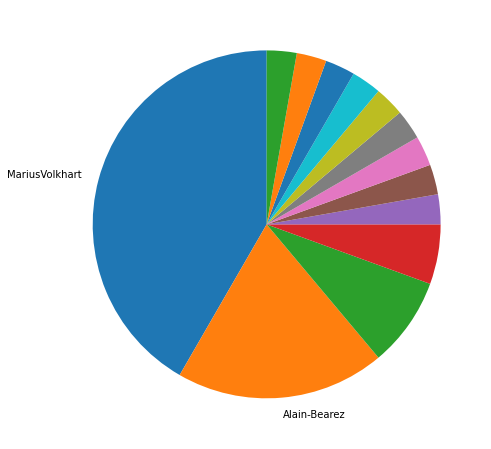
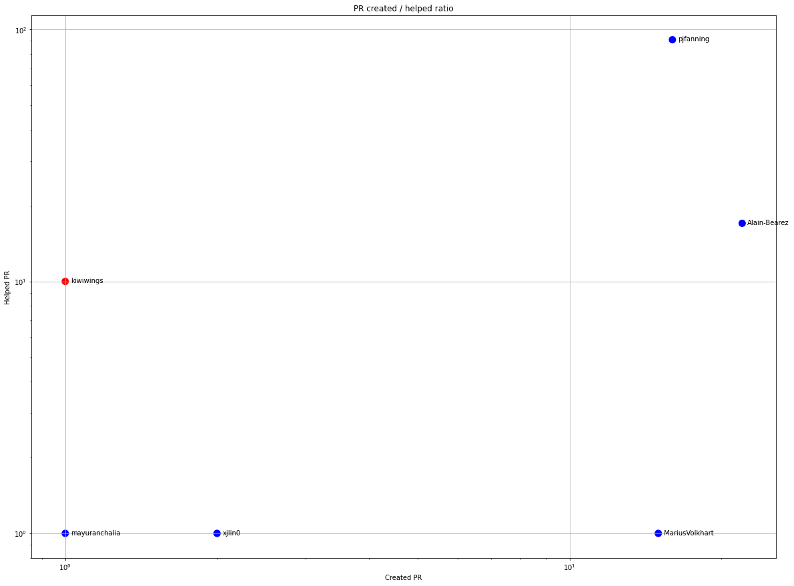
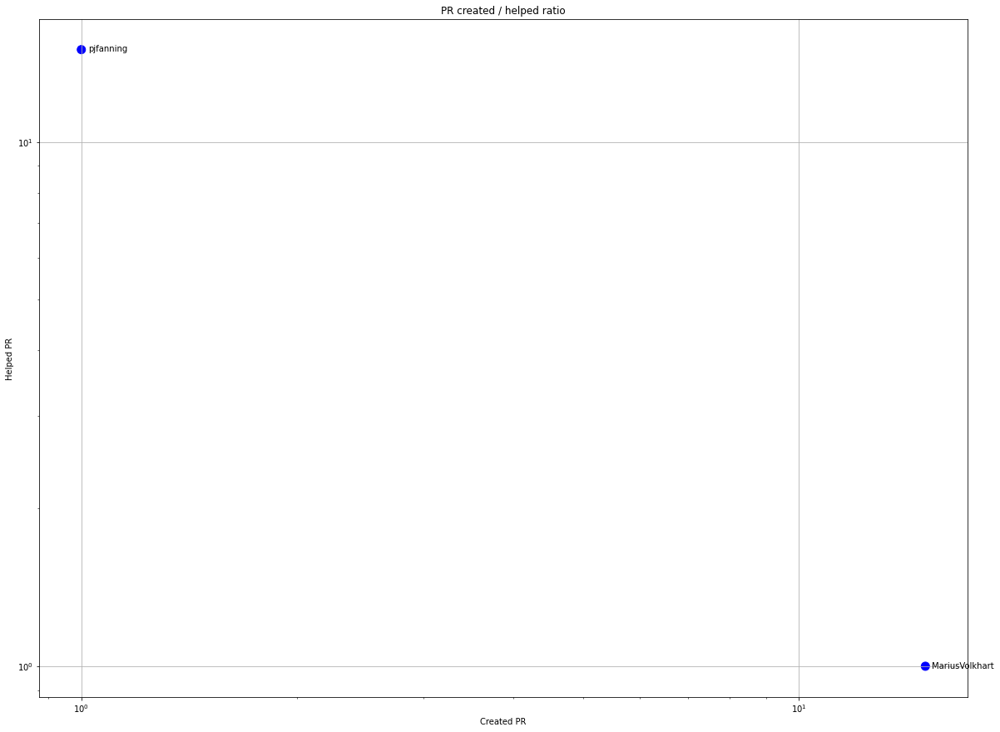
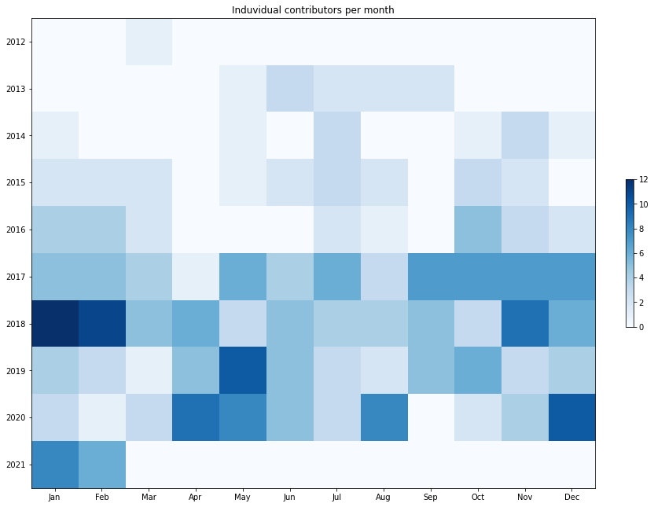
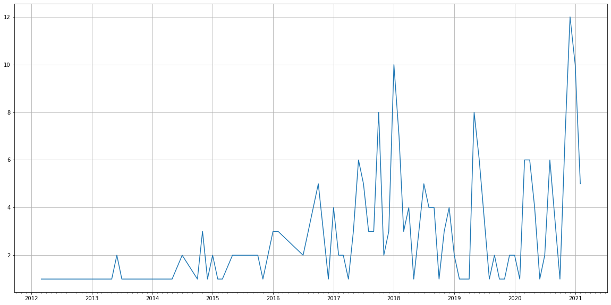
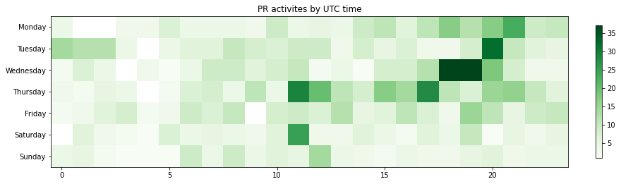

Latest record from the dataset:

<table border="1" class="dataframe">
  <thead>
    <tr style="text-align: right;">
      <th></th>
      <th>org</th>
      <th>repo</th>
      <th>type</th>
      <th>identifier</th>
      <th>subidentifier</th>
      <th>date</th>
      <th>author</th>
      <th>owner</th>
      <th>project</th>
    </tr>
  </thead>
  <tbody>
    <tr>
      <th>672</th>
      <td>apache</td>
      <td>poi</td>
      <td>PR_REVIEW_COMMENTED</td>
      <td>224</td>
      <td>NaN</td>
      <td>2021-02-12 08:17:42+00:00</td>
      <td>centic9</td>
      <td>MariusVolkhart</td>
      <td>poi</td>
    </tr>
  </tbody>
</table>

# Github Contributions per user

<table border="1" class="dataframe">
  <thead>
    <tr style="text-align: right;">
      <th></th>
      <th>contributions</th>
    </tr>
    <tr>
      <th>author</th>
      <th></th>
    </tr>
  </thead>
  <tbody>
    <tr>
      <th>pjfanning</th>
      <td>220</td>
    </tr>
    <tr>
      <th>asfgit</th>
      <td>163</td>
    </tr>
    <tr>
      <th>centic9</th>
      <td>82</td>
    </tr>
    <tr>
      <th>onealj</th>
      <td>56</td>
    </tr>
    <tr>
      <th>Alain-Bearez</th>
      <td>39</td>
    </tr>
    <tr>
      <th>Gagravarr</th>
      <td>15</td>
    </tr>
    <tr>
      <th>kiwiwings</th>
      <td>13</td>
    </tr>
    <tr>
      <th>asf-ci</th>
      <td>6</td>
    </tr>
    <tr>
      <th>bosofelipe</th>
      <td>3</td>
    </tr>
    <tr>
      <th>davidtnorth</th>
      <td>2</td>
    </tr>
  </tbody>
</table>

## Contributors per participations in PRs which are not created by self (helping PRs)

<table border="1" class="dataframe">
  <thead>
    <tr style="text-align: right;">
      <th></th>
      <th>identifier</th>
    </tr>
    <tr>
      <th>author</th>
      <th></th>
    </tr>
  </thead>
  <tbody>
    <tr>
      <th>asfgit</th>
      <td>92</td>
    </tr>
    <tr>
      <th>pjfanning</th>
      <td>91</td>
    </tr>
    <tr>
      <th>centic9</th>
      <td>52</td>
    </tr>
    <tr>
      <th>onealj</th>
      <td>27</td>
    </tr>
    <tr>
      <th>Alain-Bearez</th>
      <td>17</td>
    </tr>
    <tr>
      <th>kiwiwings</th>
      <td>10</td>
    </tr>
    <tr>
      <th>Gagravarr</th>
      <td>8</td>
    </tr>
    <tr>
      <th>asf-ci</th>
      <td>6</td>
    </tr>
    <tr>
      <th>snaketl</th>
      <td>1</td>
    </tr>
    <tr>
      <th>lycfr</th>
      <td>1</td>
    </tr>
    <tr>
      <th>tballison</th>
      <td>1</td>
    </tr>
    <tr>
      <th>tomerm</th>
      <td>1</td>
    </tr>
    <tr>
      <th>mzdravkov</th>
      <td>1</td>
    </tr>
    <tr>
      <th>megascus</th>
      <td>1</td>
    </tr>
    <tr>
      <th>mayuranchalia</th>
      <td>1</td>
    </tr>
    <tr>
      <th>mabafu</th>
      <td>1</td>
    </tr>
    <tr>
      <th>18876293672</th>
      <td>1</td>
    </tr>
    <tr>
      <th>jhny</th>
      <td>1</td>
    </tr>
    <tr>
      <th>lespea</th>
      <td>1</td>
    </tr>
    <tr>
      <th>jzheng2017</th>
      <td>1</td>
    </tr>
  </tbody>
</table>

## Contributors per participations in any PRs

<table border="1" class="dataframe">
  <thead>
    <tr style="text-align: right;">
      <th></th>
      <th>identifier</th>
    </tr>
    <tr>
      <th>author</th>
      <th></th>
    </tr>
  </thead>
  <tbody>
    <tr>
      <th>pjfanning</th>
      <td>107</td>
    </tr>
    <tr>
      <th>asfgit</th>
      <td>92</td>
    </tr>
    <tr>
      <th>centic9</th>
      <td>52</td>
    </tr>
    <tr>
      <th>Alain-Bearez</th>
      <td>39</td>
    </tr>
    <tr>
      <th>onealj</th>
      <td>27</td>
    </tr>
    <tr>
      <th>MariusVolkhart</th>
      <td>16</td>
    </tr>
    <tr>
      <th>kiwiwings</th>
      <td>11</td>
    </tr>
    <tr>
      <th>drmacro</th>
      <td>10</td>
    </tr>
    <tr>
      <th>Gagravarr</th>
      <td>8</td>
    </tr>
    <tr>
      <th>sandeeptiwari32</th>
      <td>7</td>
    </tr>
    <tr>
      <th>Sayi</th>
      <td>7</td>
    </tr>
    <tr>
      <th>BruceKuiLiu</th>
      <td>7</td>
    </tr>
    <tr>
      <th>hishidama</th>
      <td>7</td>
    </tr>
    <tr>
      <th>asf-ci</th>
      <td>6</td>
    </tr>
    <tr>
      <th>dourouc05</th>
      <td>6</td>
    </tr>
    <tr>
      <th>dhoelzl</th>
      <td>5</td>
    </tr>
    <tr>
      <th>RemboL</th>
      <td>5</td>
    </tr>
    <tr>
      <th>YoshikiHigo</th>
      <td>3</td>
    </tr>
    <tr>
      <th>gallonfizik</th>
      <td>3</td>
    </tr>
    <tr>
      <th>101hanbin</th>
      <td>3</td>
    </tr>
  </tbody>
</table>

# Bus factor (number of contributors responsible for the 50% of the prs) from last half year

## Contributors until the half of the all contributions

<table border="1" class="dataframe">
  <thead>
    <tr style="text-align: right;">
      <th></th>
      <th>author</th>
      <th>identifier</th>
      <th>cs</th>
      <th>ratio</th>
    </tr>
  </thead>
  <tbody>
    <tr>
      <th>0</th>
      <td>MariusVolkhart</td>
      <td>15</td>
      <td>15</td>
      <td>41.666667</td>
    </tr>
  </tbody>
</table>

## Pony number (bus factor)

    2

## Dev power (All the contributions in the ration of the top contributor)

    2.4000000000000012

    

    

## People with created PRs > reviewed/commented PRS

    

    

## Same graph with focusing to the last 6 month

Only contributors with both created pr and helped pr visible

    

    

# Number of individual contributors per month

Number of different Github users who either created PR, commented PR, added review to a PR

Note: only events from apache/hadoop-ozone repository are included. Earlier PRs/comments are not here.

    

    

# Number of PRs closed/created per month

    /usr/lib/python3.9/site-packages/pandas/core/arrays/datetimes.py:1101: UserWarning: Converting to PeriodArray/Index representation will drop timezone information.
      warnings.warn(

    

    

# PR activity heatmap

    

    

