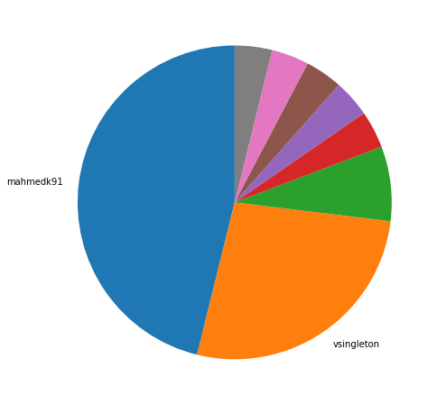
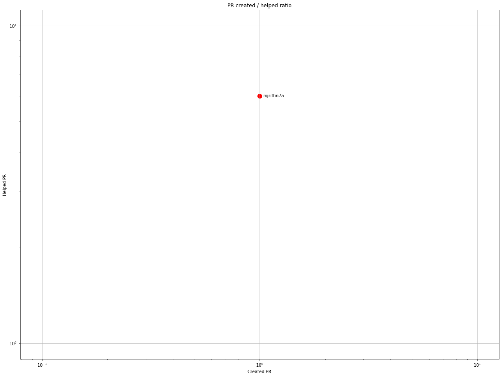
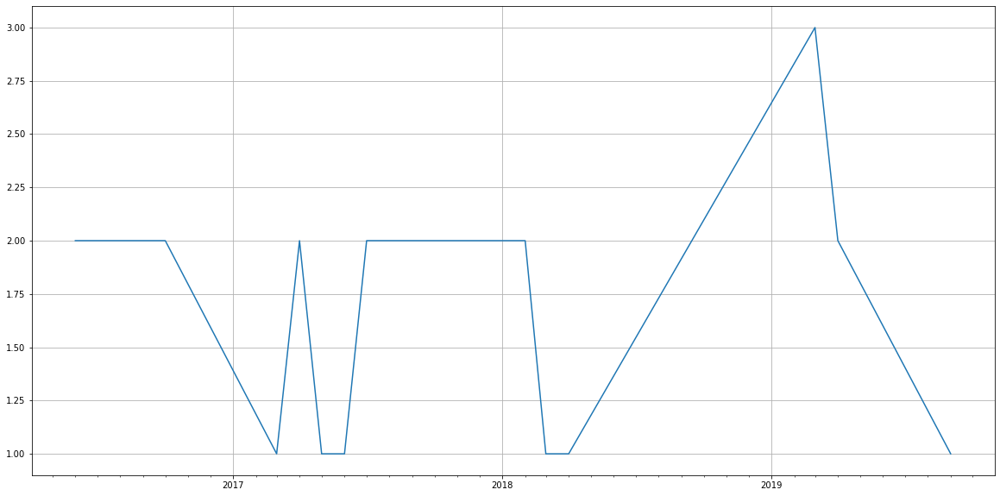
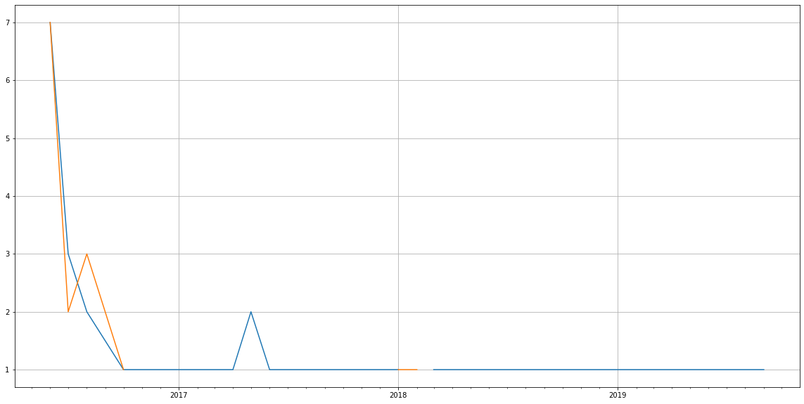
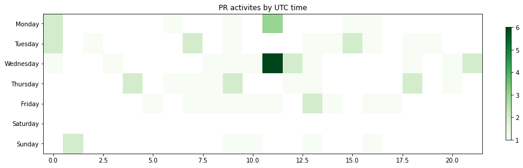

Latest record from the dataset:

<table border="1" class="dataframe">
  <thead>
    <tr style="text-align: right;">
      <th></th>
      <th>org</th>
      <th>repo</th>
      <th>type</th>
      <th>identifier</th>
      <th>subidentifier</th>
      <th>date</th>
      <th>author</th>
      <th>owner</th>
      <th>project</th>
    </tr>
  </thead>
  <tbody>
    <tr>
      <th>43</th>
      <td>apache</td>
      <td>portals-pluto</td>
      <td>PR_CREATED</td>
      <td>27</td>
      <td>NaN</td>
      <td>2019-09-23 13:16:45+00:00</td>
      <td>sloescape</td>
      <td>sloescape</td>
      <td>portals</td>
    </tr>
  </tbody>
</table>

# Github Contributions per user

<table border="1" class="dataframe">
  <thead>
    <tr style="text-align: right;">
      <th></th>
      <th>contributions</th>
    </tr>
    <tr>
      <th>author</th>
      <th></th>
    </tr>
  </thead>
  <tbody>
    <tr>
      <th>asfgit</th>
      <td>16</td>
    </tr>
    <tr>
      <th>ngriffin7a</th>
      <td>9</td>
    </tr>
  </tbody>
</table>

## Contributors per participations in PRs which are not created by self (helping PRs)

<table border="1" class="dataframe">
  <thead>
    <tr style="text-align: right;">
      <th></th>
      <th>identifier</th>
    </tr>
    <tr>
      <th>author</th>
      <th></th>
    </tr>
  </thead>
  <tbody>
    <tr>
      <th>asfgit</th>
      <td>16</td>
    </tr>
    <tr>
      <th>ngriffin7a</th>
      <td>6</td>
    </tr>
  </tbody>
</table>

## Contributors per participations in any PRs

<table border="1" class="dataframe">
  <thead>
    <tr style="text-align: right;">
      <th></th>
      <th>identifier</th>
    </tr>
    <tr>
      <th>author</th>
      <th></th>
    </tr>
  </thead>
  <tbody>
    <tr>
      <th>asfgit</th>
      <td>16</td>
    </tr>
    <tr>
      <th>mahmedk91</th>
      <td>12</td>
    </tr>
    <tr>
      <th>ngriffin7a</th>
      <td>7</td>
    </tr>
    <tr>
      <th>vsingleton</th>
      <td>7</td>
    </tr>
    <tr>
      <th>stiemannkj1</th>
      <td>2</td>
    </tr>
    <tr>
      <th>bd2019us</th>
      <td>1</td>
    </tr>
    <tr>
      <th>hwanders</th>
      <td>1</td>
    </tr>
    <tr>
      <th>phillip-kruger</th>
      <td>1</td>
    </tr>
    <tr>
      <th>sloescape</th>
      <td>1</td>
    </tr>
  </tbody>
</table>

# Bus factor (number of contributors responsible for the 50% of the prs)

## Contributors until the half of the all contributions

<table border="1" class="dataframe">
  <thead>
    <tr style="text-align: right;">
      <th></th>
      <th>author</th>
      <th>identifier</th>
      <th>cs</th>
      <th>ratio</th>
    </tr>
  </thead>
  <tbody>
    <tr>
      <th>0</th>
      <td>mahmedk91</td>
      <td>12</td>
      <td>12</td>
      <td>46.153846</td>
    </tr>
  </tbody>
</table>

## Pony number (bus factor)

    2

## Dev power (All the contributions in the ration of the top contributor)

    2.166666666666667

    

    

## People with created PRs > reviewed/commented PRS

    

    

## Same graph with focusing to the last 6 month

Only contributors with both created pr and helped pr visible

    

    

# Number of individual contributors per month

Number of different Github users who either created PR, commented PR, added review to a PR

Note: only events from apache/hadoop-ozone repository are included. Earlier PRs/comments are not here.

    /usr/lib/python3.9/site-packages/pandas/core/arrays/datetimes.py:1101: UserWarning: Converting to PeriodArray/Index representation will drop timezone information.
      warnings.warn(

<table border="1" class="dataframe">
  <thead>
    <tr style="text-align: right;">
      <th></th>
      <th>date</th>
      <th>author</th>
    </tr>
  </thead>
  <tbody>
    <tr>
      <th>5</th>
      <td>2017-04</td>
      <td>2</td>
    </tr>
    <tr>
      <th>6</th>
      <td>2017-05</td>
      <td>1</td>
    </tr>
    <tr>
      <th>7</th>
      <td>2017-06</td>
      <td>1</td>
    </tr>
    <tr>
      <th>8</th>
      <td>2017-07</td>
      <td>2</td>
    </tr>
    <tr>
      <th>9</th>
      <td>2017-08</td>
      <td>2</td>
    </tr>
    <tr>
      <th>10</th>
      <td>2018-01</td>
      <td>2</td>
    </tr>
    <tr>
      <th>11</th>
      <td>2018-02</td>
      <td>2</td>
    </tr>
    <tr>
      <th>12</th>
      <td>2018-03</td>
      <td>1</td>
    </tr>
    <tr>
      <th>13</th>
      <td>2018-04</td>
      <td>1</td>
    </tr>
    <tr>
      <th>14</th>
      <td>2019-03</td>
      <td>3</td>
    </tr>
    <tr>
      <th>15</th>
      <td>2019-04</td>
      <td>2</td>
    </tr>
    <tr>
      <th>16</th>
      <td>2019-09</td>
      <td>1</td>
    </tr>
  </tbody>
</table>

    

    

# Number of PRs closed/created per month

    /usr/lib/python3.9/site-packages/pandas/core/arrays/datetimes.py:1101: UserWarning: Converting to PeriodArray/Index representation will drop timezone information.
      warnings.warn(

    

    

## Monthly comments

    /usr/lib/python3.9/site-packages/pandas/core/arrays/datetimes.py:1101: UserWarning: Converting to PeriodArray/Index representation will drop timezone information.
      warnings.warn(

<table border="1" class="dataframe">
  <thead>
    <tr style="text-align: right;">
      <th></th>
      <th>identifier</th>
    </tr>
    <tr>
      <th>date</th>
      <th></th>
    </tr>
  </thead>
  <tbody>
    <tr>
      <th>2016-06</th>
      <td>9</td>
    </tr>
    <tr>
      <th>2016-07</th>
      <td>3</td>
    </tr>
    <tr>
      <th>2017-04</th>
      <td>3</td>
    </tr>
    <tr>
      <th>2017-08</th>
      <td>1</td>
    </tr>
    <tr>
      <th>2018-02</th>
      <td>1</td>
    </tr>
    <tr>
      <th>2018-04</th>
      <td>1</td>
    </tr>
    <tr>
      <th>2019-03</th>
      <td>4</td>
    </tr>
    <tr>
      <th>2019-04</th>
      <td>5</td>
    </tr>
  </tbody>
</table>

# PR activity heatmap

    

    

