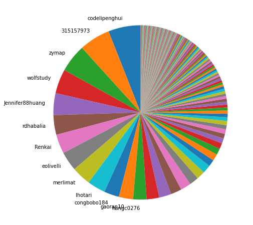
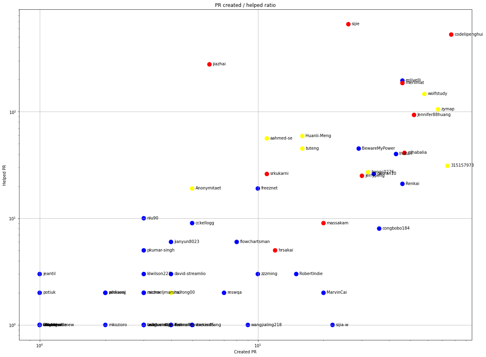
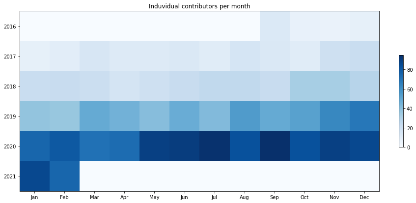
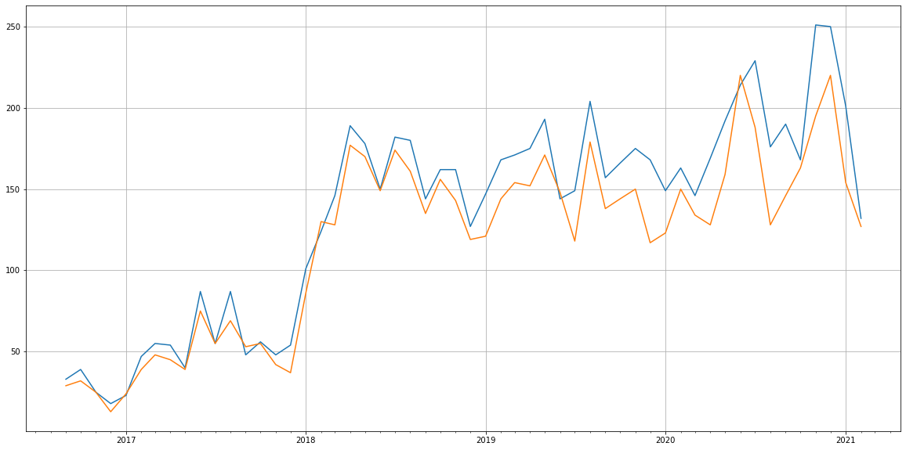
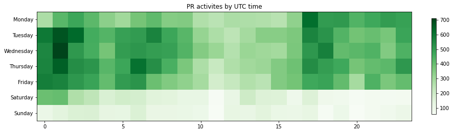

Latest record from the dataset:

<table border="1" class="dataframe">
  <thead>
    <tr style="text-align: right;">
      <th></th>
      <th>org</th>
      <th>repo</th>
      <th>type</th>
      <th>identifier</th>
      <th>subidentifier</th>
      <th>date</th>
      <th>author</th>
      <th>owner</th>
      <th>project</th>
    </tr>
  </thead>
  <tbody>
    <tr>
      <th>53085</th>
      <td>apache</td>
      <td>pulsar</td>
      <td>PR_CREATED</td>
      <td>9583</td>
      <td>NaN</td>
      <td>2021-02-14 08:43:55+00:00</td>
      <td>MarvinCai</td>
      <td>MarvinCai</td>
      <td>pulsar</td>
    </tr>
  </tbody>
</table>

# Github Contributions per user

<table border="1" class="dataframe">
  <thead>
    <tr style="text-align: right;">
      <th></th>
      <th>contributions</th>
    </tr>
    <tr>
      <th>author</th>
      <th></th>
    </tr>
  </thead>
  <tbody>
    <tr>
      <th>sijie</th>
      <td>8497</td>
    </tr>
    <tr>
      <th>merlimat</th>
      <td>5980</td>
    </tr>
    <tr>
      <th>codelipenghui</th>
      <td>2777</td>
    </tr>
    <tr>
      <th>jiazhai</th>
      <td>2669</td>
    </tr>
    <tr>
      <th>jerrypeng</th>
      <td>1150</td>
    </tr>
    <tr>
      <th>srkukarni</th>
      <td>992</td>
    </tr>
    <tr>
      <th>rdhabalia</th>
      <td>989</td>
    </tr>
    <tr>
      <th>wolfstudy</th>
      <td>750</td>
    </tr>
    <tr>
      <th>Jennifer88huang</th>
      <td>673</td>
    </tr>
    <tr>
      <th>tuteng</th>
      <td>638</td>
    </tr>
  </tbody>
</table>

## Contributors per participations in PRs which are not created by self (helping PRs)

<table border="1" class="dataframe">
  <thead>
    <tr style="text-align: right;">
      <th></th>
      <th>identifier</th>
    </tr>
    <tr>
      <th>author</th>
      <th></th>
    </tr>
  </thead>
  <tbody>
    <tr>
      <th>sijie</th>
      <td>3499</td>
    </tr>
    <tr>
      <th>merlimat</th>
      <td>2555</td>
    </tr>
    <tr>
      <th>jiazhai</th>
      <td>1334</td>
    </tr>
    <tr>
      <th>codelipenghui</th>
      <td>1226</td>
    </tr>
    <tr>
      <th>rdhabalia</th>
      <td>551</td>
    </tr>
    <tr>
      <th>srkukarni</th>
      <td>501</td>
    </tr>
    <tr>
      <th>jerrypeng</th>
      <td>470</td>
    </tr>
    <tr>
      <th>wolfstudy</th>
      <td>360</td>
    </tr>
    <tr>
      <th>tuteng</th>
      <td>311</td>
    </tr>
    <tr>
      <th>aahmed-se</th>
      <td>289</td>
    </tr>
    <tr>
      <th>Jennifer88huang</th>
      <td>272</td>
    </tr>
    <tr>
      <th>eolivelli</th>
      <td>233</td>
    </tr>
    <tr>
      <th>saandrews</th>
      <td>186</td>
    </tr>
    <tr>
      <th>ivankelly</th>
      <td>180</td>
    </tr>
    <tr>
      <th>jai1</th>
      <td>169</td>
    </tr>
    <tr>
      <th>Anonymitaet</th>
      <td>151</td>
    </tr>
    <tr>
      <th>yahoocla</th>
      <td>134</td>
    </tr>
    <tr>
      <th>zymap</th>
      <td>124</td>
    </tr>
    <tr>
      <th>nkurihar</th>
      <td>123</td>
    </tr>
    <tr>
      <th>cckellogg</th>
      <td>95</td>
    </tr>
  </tbody>
</table>

## Contributors per participations in any PRs

<table border="1" class="dataframe">
  <thead>
    <tr style="text-align: right;">
      <th></th>
      <th>identifier</th>
    </tr>
    <tr>
      <th>author</th>
      <th></th>
    </tr>
  </thead>
  <tbody>
    <tr>
      <th>sijie</th>
      <td>3946</td>
    </tr>
    <tr>
      <th>merlimat</th>
      <td>3487</td>
    </tr>
    <tr>
      <th>codelipenghui</th>
      <td>1481</td>
    </tr>
    <tr>
      <th>jiazhai</th>
      <td>1460</td>
    </tr>
    <tr>
      <th>rdhabalia</th>
      <td>1185</td>
    </tr>
    <tr>
      <th>jerrypeng</th>
      <td>801</td>
    </tr>
    <tr>
      <th>srkukarni</th>
      <td>796</td>
    </tr>
    <tr>
      <th>wolfstudy</th>
      <td>565</td>
    </tr>
    <tr>
      <th>tuteng</th>
      <td>538</td>
    </tr>
    <tr>
      <th>aahmed-se</th>
      <td>429</td>
    </tr>
    <tr>
      <th>Jennifer88huang</th>
      <td>395</td>
    </tr>
    <tr>
      <th>ivankelly</th>
      <td>377</td>
    </tr>
    <tr>
      <th>eolivelli</th>
      <td>291</td>
    </tr>
    <tr>
      <th>jai1</th>
      <td>289</td>
    </tr>
    <tr>
      <th>zymap</th>
      <td>245</td>
    </tr>
    <tr>
      <th>massakam</th>
      <td>231</td>
    </tr>
    <tr>
      <th>Anonymitaet</th>
      <td>229</td>
    </tr>
    <tr>
      <th>saandrews</th>
      <td>203</td>
    </tr>
    <tr>
      <th>cckellogg</th>
      <td>162</td>
    </tr>
    <tr>
      <th>Huanli-Meng</th>
      <td>151</td>
    </tr>
  </tbody>
</table>

# Bus factor (number of contributors responsible for the 50% of the prs) from last half year

## Contributors until the half of the all contributions

<table border="1" class="dataframe">
  <thead>
    <tr style="text-align: right;">
      <th></th>
      <th>author</th>
      <th>identifier</th>
      <th>cs</th>
      <th>ratio</th>
    </tr>
  </thead>
  <tbody>
    <tr>
      <th>0</th>
      <td>codelipenghui</td>
      <td>77</td>
      <td>77</td>
      <td>5.982906</td>
    </tr>
    <tr>
      <th>1</th>
      <td>315157973</td>
      <td>74</td>
      <td>151</td>
      <td>5.749806</td>
    </tr>
    <tr>
      <th>2</th>
      <td>zymap</td>
      <td>67</td>
      <td>218</td>
      <td>5.205905</td>
    </tr>
    <tr>
      <th>3</th>
      <td>wolfstudy</td>
      <td>58</td>
      <td>276</td>
      <td>4.506605</td>
    </tr>
    <tr>
      <th>4</th>
      <td>Jennifer88huang</td>
      <td>52</td>
      <td>328</td>
      <td>4.040404</td>
    </tr>
    <tr>
      <th>5</th>
      <td>rdhabalia</td>
      <td>47</td>
      <td>375</td>
      <td>3.651904</td>
    </tr>
    <tr>
      <th>6</th>
      <td>Renkai</td>
      <td>46</td>
      <td>421</td>
      <td>3.574204</td>
    </tr>
    <tr>
      <th>7</th>
      <td>eolivelli</td>
      <td>46</td>
      <td>467</td>
      <td>3.574204</td>
    </tr>
    <tr>
      <th>8</th>
      <td>merlimat</td>
      <td>46</td>
      <td>513</td>
      <td>3.574204</td>
    </tr>
    <tr>
      <th>9</th>
      <td>lhotari</td>
      <td>43</td>
      <td>556</td>
      <td>3.341103</td>
    </tr>
    <tr>
      <th>10</th>
      <td>congbobo184</td>
      <td>36</td>
      <td>592</td>
      <td>2.797203</td>
    </tr>
    <tr>
      <th>11</th>
      <td>gaoran10</td>
      <td>34</td>
      <td>626</td>
      <td>2.641803</td>
    </tr>
  </tbody>
</table>

## Pony number (bus factor)

    13

## Dev power (All the contributions in the ration of the top contributor)

    16.71428571428571

    

    

## People with created PRs > reviewed/commented PRS

    

    

## Same graph with focusing to the last 6 month

Only contributors with both created pr and helped pr visible

    

    

# Number of individual contributors per month

Number of different Github users who either created PR, commented PR, added review to a PR

Note: only events from apache/hadoop-ozone repository are included. Earlier PRs/comments are not here.

    

    

# Number of PRs closed/created per month

    /usr/lib/python3.9/site-packages/pandas/core/arrays/datetimes.py:1101: UserWarning: Converting to PeriodArray/Index representation will drop timezone information.
      warnings.warn(

    

    

# PR activity heatmap

    

    

