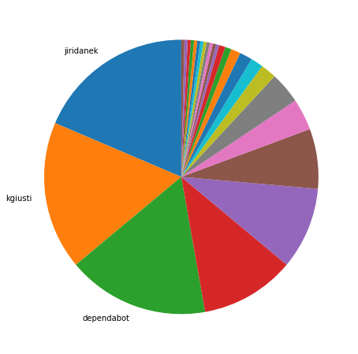
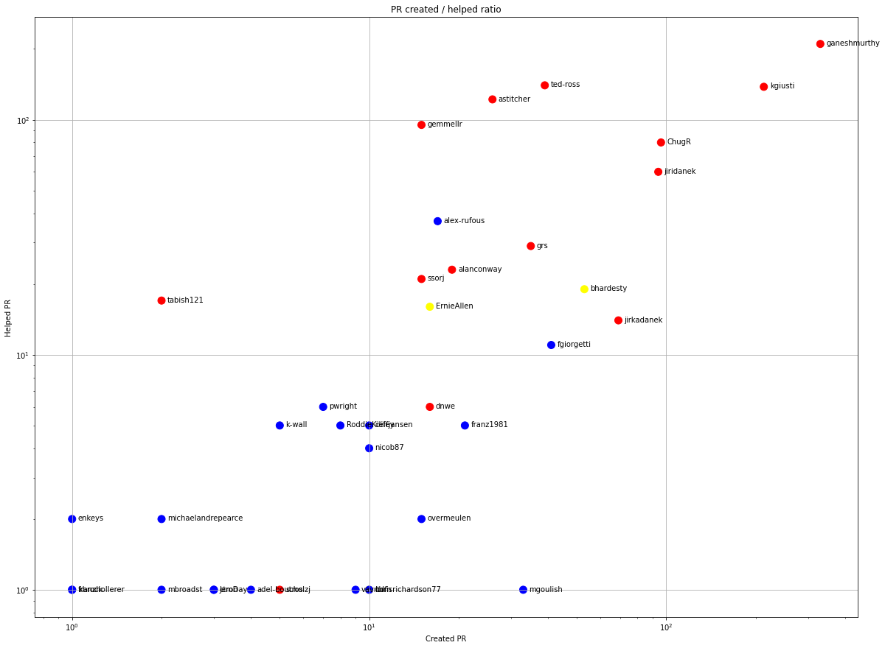
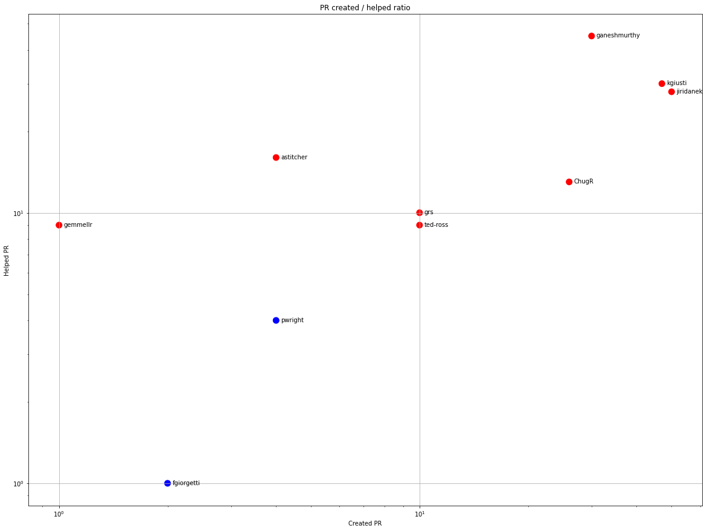
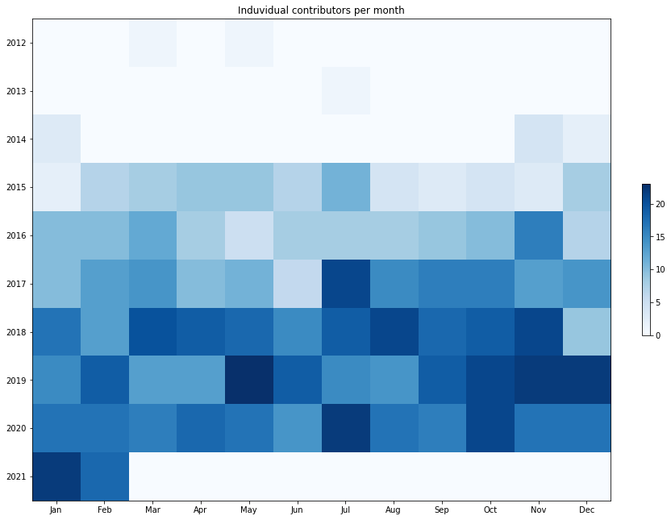
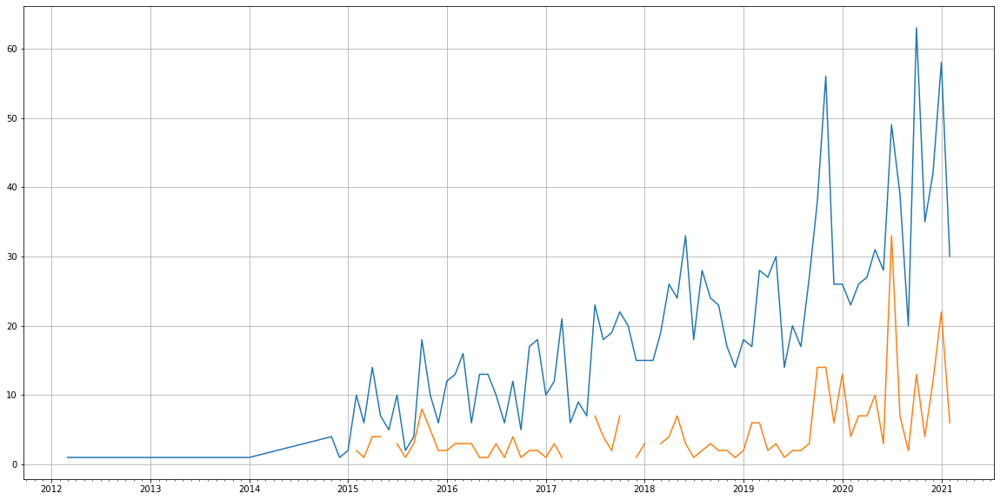
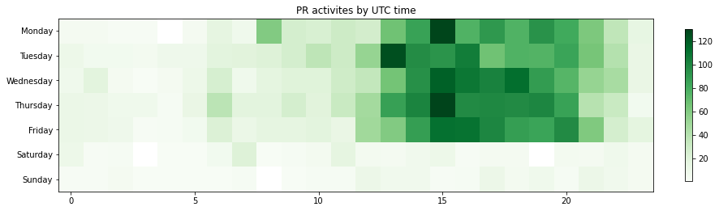

Latest record from the dataset:

<table border="1" class="dataframe">
  <thead>
    <tr style="text-align: right;">
      <th></th>
      <th>org</th>
      <th>repo</th>
      <th>type</th>
      <th>identifier</th>
      <th>subidentifier</th>
      <th>date</th>
      <th>author</th>
      <th>owner</th>
      <th>project</th>
    </tr>
  </thead>
  <tbody>
    <tr>
      <th>512</th>
      <td>apache</td>
      <td>qpid-dispatch</td>
      <td>PR_COMMENTED</td>
      <td>1031</td>
      <td>NaN</td>
      <td>2021-02-13 14:07:18+00:00</td>
      <td>codecov-io</td>
      <td>jiridanek</td>
      <td>qpid</td>
    </tr>
  </tbody>
</table>

# Github Contributions per user

<table border="1" class="dataframe">
  <thead>
    <tr style="text-align: right;">
      <th></th>
      <th>contributions</th>
    </tr>
    <tr>
      <th>author</th>
      <th></th>
    </tr>
  </thead>
  <tbody>
    <tr>
      <th>ganeshmurthy</th>
      <td>323</td>
    </tr>
    <tr>
      <th>astitcher</th>
      <td>303</td>
    </tr>
    <tr>
      <th>codecov-io</th>
      <td>262</td>
    </tr>
    <tr>
      <th>gemmellr</th>
      <td>231</td>
    </tr>
    <tr>
      <th>kgiusti</th>
      <td>228</td>
    </tr>
    <tr>
      <th>ted-ross</th>
      <td>204</td>
    </tr>
    <tr>
      <th>asfgit</th>
      <td>160</td>
    </tr>
    <tr>
      <th>jiridanek</th>
      <td>151</td>
    </tr>
    <tr>
      <th>ChugR</th>
      <td>104</td>
    </tr>
    <tr>
      <th>alex-rufous</th>
      <td>57</td>
    </tr>
  </tbody>
</table>

## Contributors per participations in PRs which are not created by self (helping PRs)

<table border="1" class="dataframe">
  <thead>
    <tr style="text-align: right;">
      <th></th>
      <th>identifier</th>
    </tr>
    <tr>
      <th>author</th>
      <th></th>
    </tr>
  </thead>
  <tbody>
    <tr>
      <th>codecov-io</th>
      <td>262</td>
    </tr>
    <tr>
      <th>ganeshmurthy</th>
      <td>210</td>
    </tr>
    <tr>
      <th>ted-ross</th>
      <td>140</td>
    </tr>
    <tr>
      <th>kgiusti</th>
      <td>138</td>
    </tr>
    <tr>
      <th>asfgit</th>
      <td>135</td>
    </tr>
    <tr>
      <th>astitcher</th>
      <td>122</td>
    </tr>
    <tr>
      <th>gemmellr</th>
      <td>95</td>
    </tr>
    <tr>
      <th>ChugR</th>
      <td>80</td>
    </tr>
    <tr>
      <th>jiridanek</th>
      <td>60</td>
    </tr>
    <tr>
      <th>alex-rufous</th>
      <td>37</td>
    </tr>
    <tr>
      <th>grs</th>
      <td>29</td>
    </tr>
    <tr>
      <th>alanconway</th>
      <td>23</td>
    </tr>
    <tr>
      <th>ssorj</th>
      <td>21</td>
    </tr>
    <tr>
      <th>codecov-commenter</th>
      <td>20</td>
    </tr>
    <tr>
      <th>bhardesty</th>
      <td>19</td>
    </tr>
    <tr>
      <th>tabish121</th>
      <td>17</td>
    </tr>
    <tr>
      <th>ErnieAllen</th>
      <td>16</td>
    </tr>
    <tr>
      <th>jenmalloy</th>
      <td>14</td>
    </tr>
    <tr>
      <th>jirkadanek</th>
      <td>14</td>
    </tr>
    <tr>
      <th>rhs</th>
      <td>14</td>
    </tr>
  </tbody>
</table>

## Contributors per participations in any PRs

<table border="1" class="dataframe">
  <thead>
    <tr style="text-align: right;">
      <th></th>
      <th>identifier</th>
    </tr>
    <tr>
      <th>author</th>
      <th></th>
    </tr>
  </thead>
  <tbody>
    <tr>
      <th>ganeshmurthy</th>
      <td>532</td>
    </tr>
    <tr>
      <th>kgiusti</th>
      <td>347</td>
    </tr>
    <tr>
      <th>codecov-io</th>
      <td>262</td>
    </tr>
    <tr>
      <th>ted-ross</th>
      <td>179</td>
    </tr>
    <tr>
      <th>ChugR</th>
      <td>174</td>
    </tr>
    <tr>
      <th>jiridanek</th>
      <td>152</td>
    </tr>
    <tr>
      <th>astitcher</th>
      <td>147</td>
    </tr>
    <tr>
      <th>asfgit</th>
      <td>135</td>
    </tr>
    <tr>
      <th>gemmellr</th>
      <td>102</td>
    </tr>
    <tr>
      <th>jirkadanek</th>
      <td>82</td>
    </tr>
    <tr>
      <th>bhardesty</th>
      <td>72</td>
    </tr>
    <tr>
      <th>dependabot</th>
      <td>66</td>
    </tr>
    <tr>
      <th>grs</th>
      <td>64</td>
    </tr>
    <tr>
      <th>alex-rufous</th>
      <td>53</td>
    </tr>
    <tr>
      <th>fgiorgetti</th>
      <td>52</td>
    </tr>
    <tr>
      <th>alanconway</th>
      <td>41</td>
    </tr>
    <tr>
      <th>ssorj</th>
      <td>36</td>
    </tr>
    <tr>
      <th>mgoulish</th>
      <td>34</td>
    </tr>
    <tr>
      <th>ErnieAllen</th>
      <td>32</td>
    </tr>
    <tr>
      <th>franz1981</th>
      <td>26</td>
    </tr>
  </tbody>
</table>

# Bus factor (number of contributors responsible for the 50% of the prs) from last half year

## Contributors until the half of the all contributions

<table border="1" class="dataframe">
  <thead>
    <tr style="text-align: right;">
      <th></th>
      <th>author</th>
      <th>identifier</th>
      <th>cs</th>
      <th>ratio</th>
    </tr>
  </thead>
  <tbody>
    <tr>
      <th>0</th>
      <td>jiridanek</td>
      <td>50</td>
      <td>50</td>
      <td>18.587361</td>
    </tr>
    <tr>
      <th>1</th>
      <td>kgiusti</td>
      <td>47</td>
      <td>97</td>
      <td>17.472119</td>
    </tr>
  </tbody>
</table>

## Pony number (bus factor)

    3

## Dev power (All the contributions in the ration of the top contributor)

    5.379999999999999

    

    

## People with created PRs > reviewed/commented PRS

    

    

## Same graph with focusing to the last 6 month

Only contributors with both created pr and helped pr visible

    

    

# Number of individual contributors per month

Number of different Github users who either created PR, commented PR, added review to a PR

Note: only events from apache/hadoop-ozone repository are included. Earlier PRs/comments are not here.

    

    

# Number of PRs closed/created per month

    /usr/lib/python3.9/site-packages/pandas/core/arrays/datetimes.py:1101: UserWarning: Converting to PeriodArray/Index representation will drop timezone information.
      warnings.warn(

    

    

# PR activity heatmap

    

    

