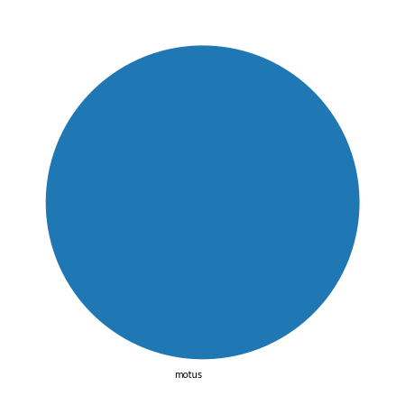
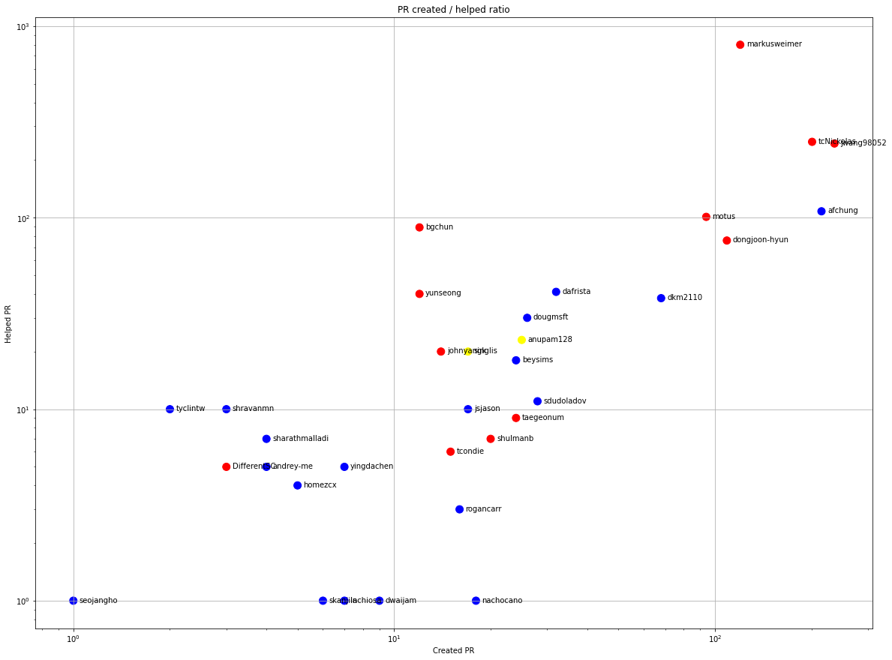
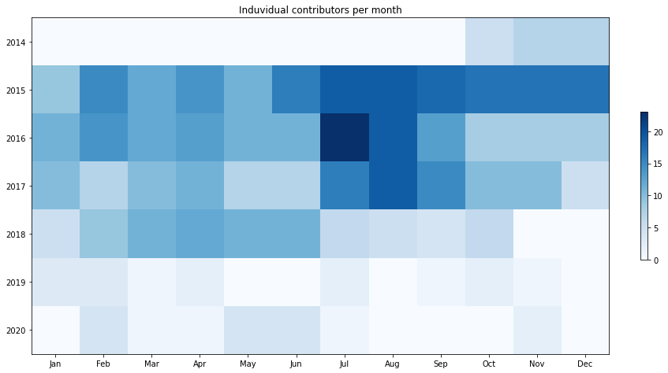
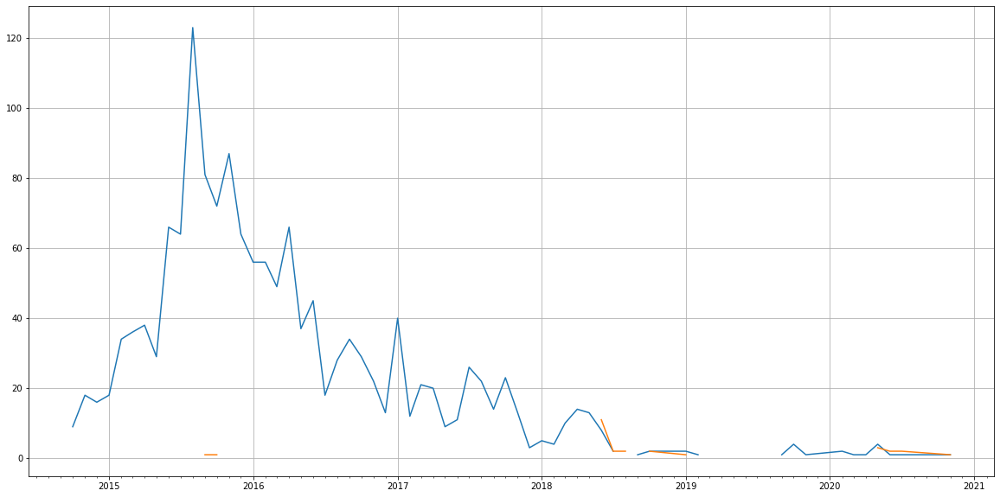
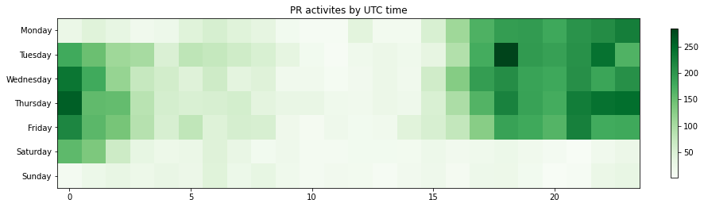

Latest record from the dataset:

<table border="1" class="dataframe">
  <thead>
    <tr style="text-align: right;">
      <th></th>
      <th>org</th>
      <th>repo</th>
      <th>type</th>
      <th>identifier</th>
      <th>subidentifier</th>
      <th>date</th>
      <th>author</th>
      <th>owner</th>
      <th>project</th>
    </tr>
  </thead>
  <tbody>
    <tr>
      <th>5812</th>
      <td>apache</td>
      <td>reef</td>
      <td>PR_MERGED</td>
      <td>1506</td>
      <td>NaN</td>
      <td>2020-11-09 17:15:26+00:00</td>
      <td>dongjoon-hyun</td>
      <td>motus</td>
      <td>reef</td>
    </tr>
  </tbody>
</table>

# Github Contributions per user

<table border="1" class="dataframe">
  <thead>
    <tr style="text-align: right;">
      <th></th>
      <th>contributions</th>
    </tr>
    <tr>
      <th>author</th>
      <th></th>
    </tr>
  </thead>
  <tbody>
    <tr>
      <th>asfbot</th>
      <td>2246</td>
    </tr>
    <tr>
      <th>markusweimer</th>
      <td>2043</td>
    </tr>
    <tr>
      <th>jwang98052</th>
      <td>743</td>
    </tr>
    <tr>
      <th>tcNickolas</th>
      <td>576</td>
    </tr>
    <tr>
      <th>motus</th>
      <td>337</td>
    </tr>
    <tr>
      <th>afchung</th>
      <td>317</td>
    </tr>
    <tr>
      <th>bgchun</th>
      <td>237</td>
    </tr>
    <tr>
      <th>dongjoon-hyun</th>
      <td>127</td>
    </tr>
    <tr>
      <th>dkm2110</th>
      <td>123</td>
    </tr>
    <tr>
      <th>singlis</th>
      <td>108</td>
    </tr>
  </tbody>
</table>

## Contributors per participations in PRs which are not created by self (helping PRs)

<table border="1" class="dataframe">
  <thead>
    <tr style="text-align: right;">
      <th></th>
      <th>identifier</th>
    </tr>
    <tr>
      <th>author</th>
      <th></th>
    </tr>
  </thead>
  <tbody>
    <tr>
      <th>markusweimer</th>
      <td>800</td>
    </tr>
    <tr>
      <th>asfbot</th>
      <td>493</td>
    </tr>
    <tr>
      <th>tcNickolas</th>
      <td>249</td>
    </tr>
    <tr>
      <th>jwang98052</th>
      <td>244</td>
    </tr>
    <tr>
      <th>afchung</th>
      <td>108</td>
    </tr>
    <tr>
      <th>motus</th>
      <td>101</td>
    </tr>
    <tr>
      <th>bgchun</th>
      <td>89</td>
    </tr>
    <tr>
      <th>dongjoon-hyun</th>
      <td>76</td>
    </tr>
    <tr>
      <th>dafrista</th>
      <td>41</td>
    </tr>
    <tr>
      <th>yunseong</th>
      <td>40</td>
    </tr>
    <tr>
      <th>dkm2110</th>
      <td>38</td>
    </tr>
    <tr>
      <th>dougmsft</th>
      <td>30</td>
    </tr>
    <tr>
      <th>anupam128</th>
      <td>23</td>
    </tr>
    <tr>
      <th>singlis</th>
      <td>20</td>
    </tr>
    <tr>
      <th>johnyangk</th>
      <td>20</td>
    </tr>
    <tr>
      <th>beysims</th>
      <td>18</td>
    </tr>
    <tr>
      <th>sdudoladov</th>
      <td>11</td>
    </tr>
    <tr>
      <th>shravanmn</th>
      <td>10</td>
    </tr>
    <tr>
      <th>jsjason</th>
      <td>10</td>
    </tr>
    <tr>
      <th>tyclintw</th>
      <td>10</td>
    </tr>
  </tbody>
</table>

## Contributors per participations in any PRs

<table border="1" class="dataframe">
  <thead>
    <tr style="text-align: right;">
      <th></th>
      <th>identifier</th>
    </tr>
    <tr>
      <th>author</th>
      <th></th>
    </tr>
  </thead>
  <tbody>
    <tr>
      <th>markusweimer</th>
      <td>920</td>
    </tr>
    <tr>
      <th>asfbot</th>
      <td>493</td>
    </tr>
    <tr>
      <th>jwang98052</th>
      <td>480</td>
    </tr>
    <tr>
      <th>tcNickolas</th>
      <td>450</td>
    </tr>
    <tr>
      <th>afchung</th>
      <td>323</td>
    </tr>
    <tr>
      <th>motus</th>
      <td>195</td>
    </tr>
    <tr>
      <th>dongjoon-hyun</th>
      <td>185</td>
    </tr>
    <tr>
      <th>dkm2110</th>
      <td>106</td>
    </tr>
    <tr>
      <th>bgchun</th>
      <td>101</td>
    </tr>
    <tr>
      <th>dafrista</th>
      <td>73</td>
    </tr>
    <tr>
      <th>dougmsft</th>
      <td>56</td>
    </tr>
    <tr>
      <th>yunseong</th>
      <td>52</td>
    </tr>
    <tr>
      <th>anupam128</th>
      <td>48</td>
    </tr>
    <tr>
      <th>beysims</th>
      <td>42</td>
    </tr>
    <tr>
      <th>sdudoladov</th>
      <td>39</td>
    </tr>
    <tr>
      <th>singlis</th>
      <td>37</td>
    </tr>
    <tr>
      <th>johnyangk</th>
      <td>34</td>
    </tr>
    <tr>
      <th>taegeonum</th>
      <td>33</td>
    </tr>
    <tr>
      <th>shulmanb</th>
      <td>27</td>
    </tr>
    <tr>
      <th>jsjason</th>
      <td>27</td>
    </tr>
  </tbody>
</table>

# Bus factor (number of contributors responsible for the 50% of the prs) from last half year

## Contributors until the half of the all contributions

<table border="1" class="dataframe">
  <thead>
    <tr style="text-align: right;">
      <th></th>
      <th>author</th>
      <th>identifier</th>
      <th>cs</th>
      <th>ratio</th>
    </tr>
  </thead>
  <tbody>
  </tbody>
</table>

## Pony number (bus factor)

    1

## Dev power (All the contributions in the ration of the top contributor)

    1.0

    

    

## People with created PRs > reviewed/commented PRS

    

    

## Same graph with focusing to the last 6 month

Only contributors with both created pr and helped pr visible

    

    

# Number of individual contributors per month

Number of different Github users who either created PR, commented PR, added review to a PR

Note: only events from apache/hadoop-ozone repository are included. Earlier PRs/comments are not here.

    

    

# Number of PRs closed/created per month

    /usr/lib/python3.9/site-packages/pandas/core/arrays/datetimes.py:1101: UserWarning: Converting to PeriodArray/Index representation will drop timezone information.
      warnings.warn(

    

    

# PR activity heatmap

    

    

