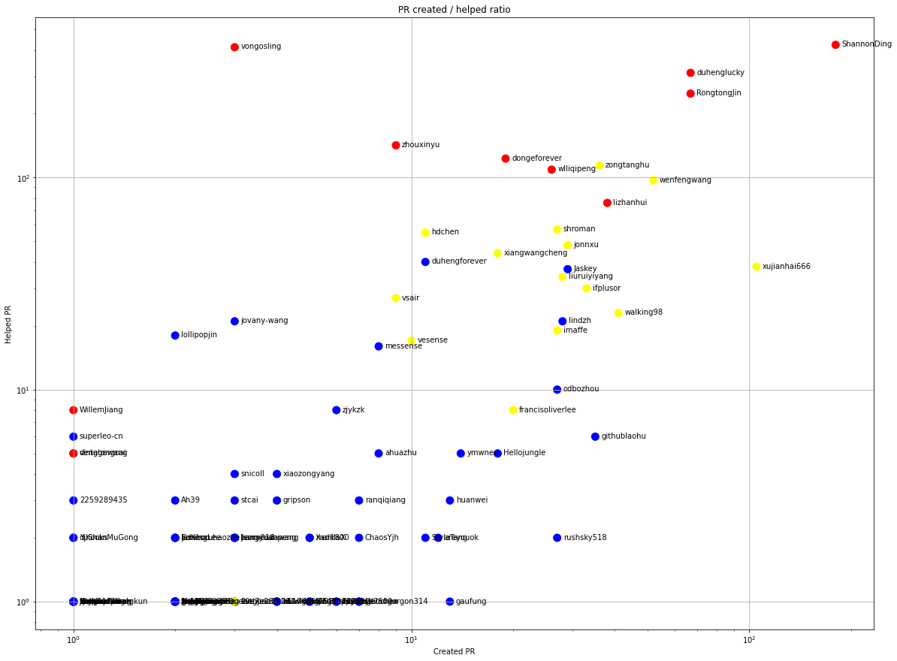
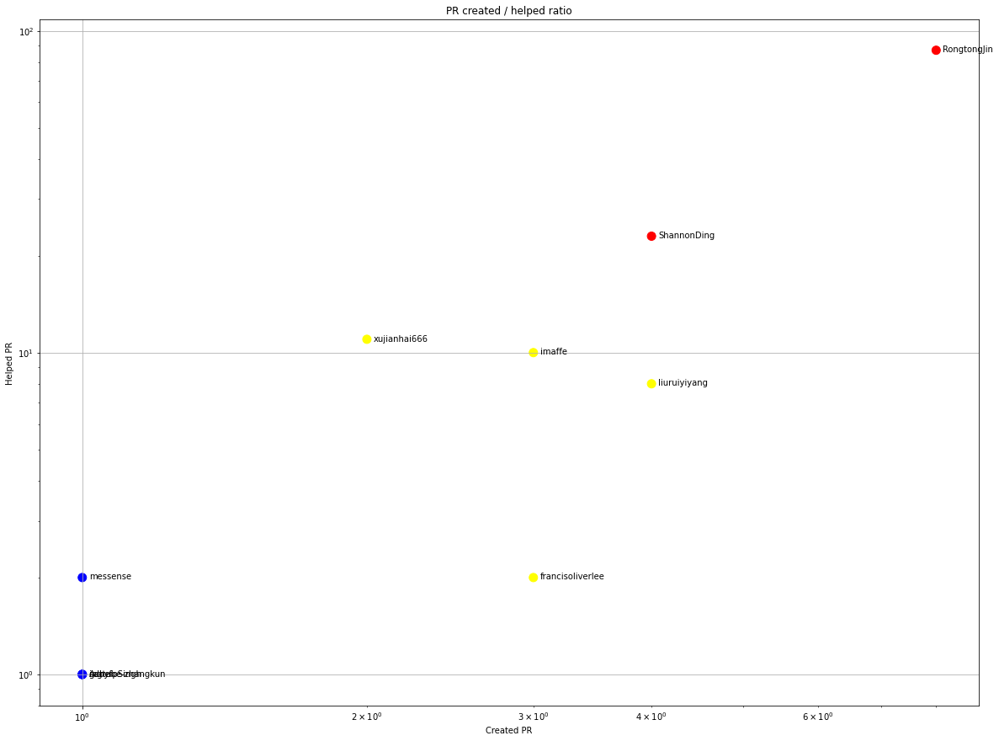

Latest record from the dataset:

<table border="1" class="dataframe">
  <thead>
    <tr style="text-align: right;">
      <th></th>
      <th>org</th>
      <th>repo</th>
      <th>type</th>
      <th>identifier</th>
      <th>subidentifier</th>
      <th>date</th>
      <th>author</th>
      <th>owner</th>
      <th>project</th>
    </tr>
  </thead>
  <tbody>
    <tr>
      <th>11885</th>
      <td>apache</td>
      <td>rocketmq-spring</td>
      <td>PR_REVIEW_COMMENTED</td>
      <td>347</td>
      <td>NaN</td>
      <td>2021-02-13 14:17:20+00:00</td>
      <td>RongtongJin</td>
      <td>liuliuzo</td>
      <td>rocketmq</td>
    </tr>
  </tbody>
</table>

# Github Contributions per user

<table border="1" class="dataframe">
  <thead>
    <tr style="text-align: right;">
      <th></th>
      <th>contributions</th>
    </tr>
    <tr>
      <th>author</th>
      <th></th>
    </tr>
  </thead>
  <tbody>
    <tr>
      <th>coveralls</th>
      <td>1532</td>
    </tr>
    <tr>
      <th>vongosling</th>
      <td>1136</td>
    </tr>
    <tr>
      <th>ShannonDing</th>
      <td>837</td>
    </tr>
    <tr>
      <th>duhenglucky</th>
      <td>502</td>
    </tr>
    <tr>
      <th>RongtongJin</th>
      <td>441</td>
    </tr>
    <tr>
      <th>zhouxinyu</th>
      <td>310</td>
    </tr>
    <tr>
      <th>codecov-io</th>
      <td>249</td>
    </tr>
    <tr>
      <th>zongtanghu</th>
      <td>236</td>
    </tr>
    <tr>
      <th>wlliqipeng</th>
      <td>229</td>
    </tr>
    <tr>
      <th>wenfengwang</th>
      <td>210</td>
    </tr>
  </tbody>
</table>

## Contributors per participations in PRs which are not created by self (helping PRs)

<table border="1" class="dataframe">
  <thead>
    <tr style="text-align: right;">
      <th></th>
      <th>identifier</th>
    </tr>
    <tr>
      <th>author</th>
      <th></th>
    </tr>
  </thead>
  <tbody>
    <tr>
      <th>coveralls</th>
      <td>961</td>
    </tr>
    <tr>
      <th>ShannonDing</th>
      <td>423</td>
    </tr>
    <tr>
      <th>vongosling</th>
      <td>412</td>
    </tr>
    <tr>
      <th>duhenglucky</th>
      <td>312</td>
    </tr>
    <tr>
      <th>RongtongJin</th>
      <td>249</td>
    </tr>
    <tr>
      <th>codecov-io</th>
      <td>243</td>
    </tr>
    <tr>
      <th>zhouxinyu</th>
      <td>142</td>
    </tr>
    <tr>
      <th>dongeforever</th>
      <td>123</td>
    </tr>
    <tr>
      <th>zongtanghu</th>
      <td>114</td>
    </tr>
    <tr>
      <th>wlliqipeng</th>
      <td>109</td>
    </tr>
    <tr>
      <th>wenfengwang</th>
      <td>97</td>
    </tr>
    <tr>
      <th>lizhanhui</th>
      <td>76</td>
    </tr>
    <tr>
      <th>shroman</th>
      <td>57</td>
    </tr>
    <tr>
      <th>hdchen</th>
      <td>55</td>
    </tr>
    <tr>
      <th>jonnxu</th>
      <td>48</td>
    </tr>
    <tr>
      <th>xiangwangcheng</th>
      <td>44</td>
    </tr>
    <tr>
      <th>duhengforever</th>
      <td>40</td>
    </tr>
    <tr>
      <th>xujianhai666</th>
      <td>38</td>
    </tr>
    <tr>
      <th>Jaskey</th>
      <td>37</td>
    </tr>
    <tr>
      <th>liuruiyiyang</th>
      <td>34</td>
    </tr>
  </tbody>
</table>

## Contributors per participations in any PRs

<table border="1" class="dataframe">
  <thead>
    <tr style="text-align: right;">
      <th></th>
      <th>identifier</th>
    </tr>
    <tr>
      <th>author</th>
      <th></th>
    </tr>
  </thead>
  <tbody>
    <tr>
      <th>coveralls</th>
      <td>961</td>
    </tr>
    <tr>
      <th>ShannonDing</th>
      <td>510</td>
    </tr>
    <tr>
      <th>vongosling</th>
      <td>414</td>
    </tr>
    <tr>
      <th>duhenglucky</th>
      <td>375</td>
    </tr>
    <tr>
      <th>RongtongJin</th>
      <td>314</td>
    </tr>
    <tr>
      <th>codecov-io</th>
      <td>243</td>
    </tr>
    <tr>
      <th>zhouxinyu</th>
      <td>151</td>
    </tr>
    <tr>
      <th>zongtanghu</th>
      <td>150</td>
    </tr>
    <tr>
      <th>wenfengwang</th>
      <td>147</td>
    </tr>
    <tr>
      <th>xujianhai666</th>
      <td>141</td>
    </tr>
    <tr>
      <th>dongeforever</th>
      <td>139</td>
    </tr>
    <tr>
      <th>wlliqipeng</th>
      <td>134</td>
    </tr>
    <tr>
      <th>lizhanhui</th>
      <td>113</td>
    </tr>
    <tr>
      <th>shroman</th>
      <td>80</td>
    </tr>
    <tr>
      <th>jonnxu</th>
      <td>76</td>
    </tr>
    <tr>
      <th>hdchen</th>
      <td>66</td>
    </tr>
    <tr>
      <th>Jaskey</th>
      <td>66</td>
    </tr>
    <tr>
      <th>xiangwangcheng</th>
      <td>62</td>
    </tr>
    <tr>
      <th>ifplusor</th>
      <td>62</td>
    </tr>
    <tr>
      <th>walking98</th>
      <td>61</td>
    </tr>
  </tbody>
</table>

# Bus factor (number of contributors responsible for the 50% of the prs) from last half year

## Contributors until the half of the all contributions

<table border="1" class="dataframe">
  <thead>
    <tr style="text-align: right;">
      <th></th>
      <th>author</th>
      <th>identifier</th>
      <th>cs</th>
      <th>ratio</th>
    </tr>
  </thead>
  <tbody>
    <tr>
      <th>0</th>
      <td>horizonzy</td>
      <td>22</td>
      <td>22</td>
      <td>9.090909</td>
    </tr>
    <tr>
      <th>1</th>
      <td>maixiaohai</td>
      <td>19</td>
      <td>41</td>
      <td>7.851240</td>
    </tr>
    <tr>
      <th>2</th>
      <td>zhangjidi2016</td>
      <td>10</td>
      <td>51</td>
      <td>4.132231</td>
    </tr>
    <tr>
      <th>3</th>
      <td>xxd763795151</td>
      <td>10</td>
      <td>61</td>
      <td>4.132231</td>
    </tr>
    <tr>
      <th>4</th>
      <td>RongtongJin</td>
      <td>8</td>
      <td>69</td>
      <td>3.305785</td>
    </tr>
    <tr>
      <th>5</th>
      <td>Git-Yang</td>
      <td>6</td>
      <td>75</td>
      <td>2.479339</td>
    </tr>
    <tr>
      <th>6</th>
      <td>fantow</td>
      <td>6</td>
      <td>81</td>
      <td>2.479339</td>
    </tr>
    <tr>
      <th>7</th>
      <td>lovelife-li</td>
      <td>5</td>
      <td>86</td>
      <td>2.066116</td>
    </tr>
    <tr>
      <th>8</th>
      <td>linjiemiao</td>
      <td>5</td>
      <td>91</td>
      <td>2.066116</td>
    </tr>
    <tr>
      <th>9</th>
      <td>jjz921024</td>
      <td>5</td>
      <td>96</td>
      <td>2.066116</td>
    </tr>
    <tr>
      <th>10</th>
      <td>heihaozi</td>
      <td>4</td>
      <td>100</td>
      <td>1.652893</td>
    </tr>
    <tr>
      <th>11</th>
      <td>liuruiyiyang</td>
      <td>4</td>
      <td>104</td>
      <td>1.652893</td>
    </tr>
    <tr>
      <th>12</th>
      <td>ShannonDing</td>
      <td>4</td>
      <td>108</td>
      <td>1.652893</td>
    </tr>
    <tr>
      <th>13</th>
      <td>imaffe</td>
      <td>3</td>
      <td>111</td>
      <td>1.239669</td>
    </tr>
    <tr>
      <th>14</th>
      <td>francisoliverlee</td>
      <td>3</td>
      <td>114</td>
      <td>1.239669</td>
    </tr>
    <tr>
      <th>15</th>
      <td>feiquan123</td>
      <td>3</td>
      <td>117</td>
      <td>1.239669</td>
    </tr>
    <tr>
      <th>16</th>
      <td>crazywen</td>
      <td>3</td>
      <td>120</td>
      <td>1.239669</td>
    </tr>
  </tbody>
</table>

## Pony number (bus factor)

    18

## Dev power (All the contributions in the ration of the top contributor)

    10.999999999999996

    

    

## People with created PRs > reviewed/commented PRS

    

    

## Same graph with focusing to the last 6 month

Only contributors with both created pr and helped pr visible

    

    

# Number of individual contributors per month

Number of different Github users who either created PR, commented PR, added review to a PR

Note: only events from apache/hadoop-ozone repository are included. Earlier PRs/comments are not here.

    

    

# Number of PRs closed/created per month

    /usr/lib/python3.9/site-packages/pandas/core/arrays/datetimes.py:1101: UserWarning: Converting to PeriodArray/Index representation will drop timezone information.
      warnings.warn(

    

    

# PR activity heatmap

    

    

