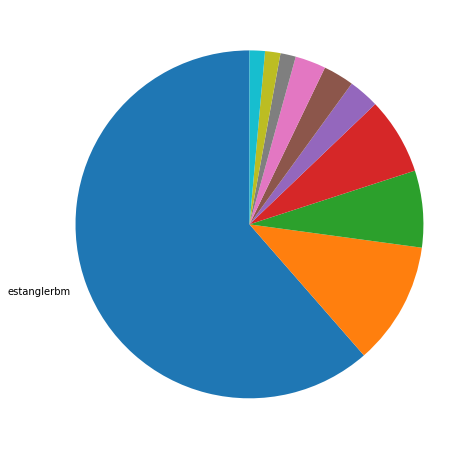
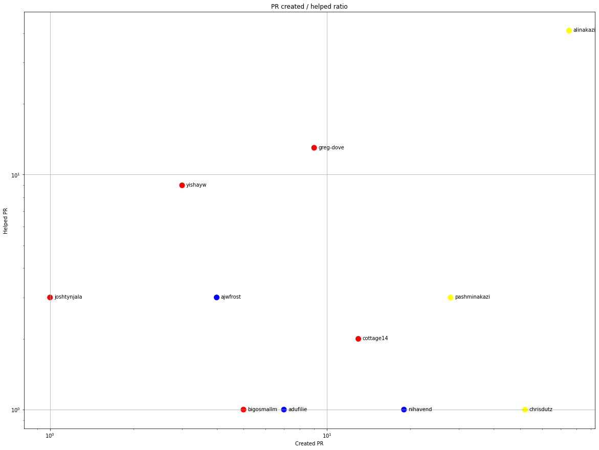
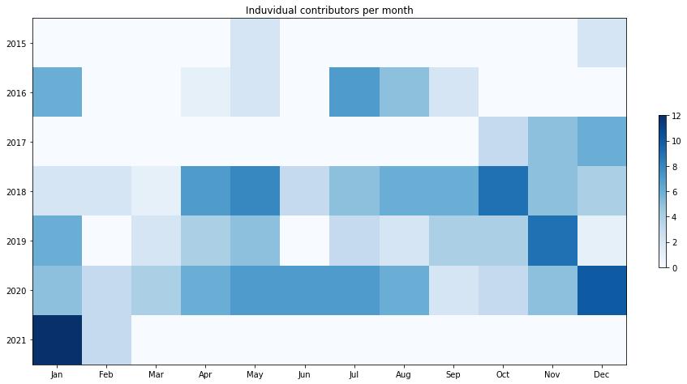
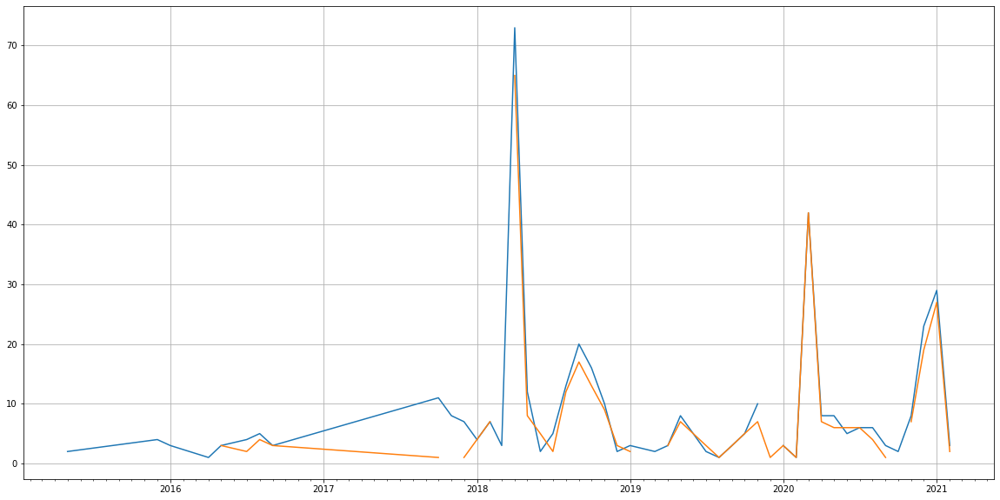
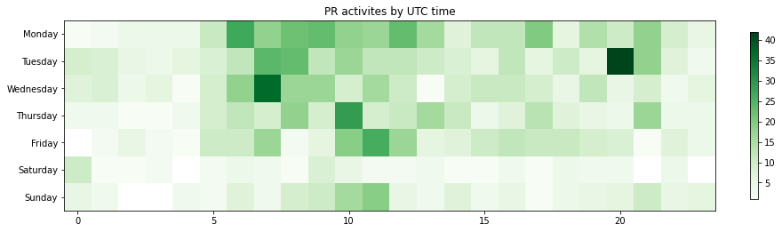

Latest record from the dataset:

<table border="1" class="dataframe">
  <thead>
    <tr style="text-align: right;">
      <th></th>
      <th>org</th>
      <th>repo</th>
      <th>type</th>
      <th>identifier</th>
      <th>subidentifier</th>
      <th>date</th>
      <th>author</th>
      <th>owner</th>
      <th>project</th>
    </tr>
  </thead>
  <tbody>
    <tr>
      <th>156</th>
      <td>apache</td>
      <td>royale-asjs</td>
      <td>PR_COMMENTED</td>
      <td>1079</td>
      <td>NaN</td>
      <td>2021-02-13 19:50:17+00:00</td>
      <td>carlosrovira</td>
      <td>brianraymes</td>
      <td>royale</td>
    </tr>
  </tbody>
</table>

# Github Contributions per user

<table border="1" class="dataframe">
  <thead>
    <tr style="text-align: right;">
      <th></th>
      <th>contributions</th>
    </tr>
    <tr>
      <th>author</th>
      <th></th>
    </tr>
  </thead>
  <tbody>
    <tr>
      <th>carlosrovira</th>
      <td>189</td>
    </tr>
    <tr>
      <th>aharui</th>
      <td>173</td>
    </tr>
    <tr>
      <th>Harbs</th>
      <td>160</td>
    </tr>
    <tr>
      <th>alinakazi</th>
      <td>55</td>
    </tr>
    <tr>
      <th>piotrzarzycki21</th>
      <td>37</td>
    </tr>
    <tr>
      <th>greg-dove</th>
      <td>33</td>
    </tr>
    <tr>
      <th>yishayw</th>
      <td>21</td>
    </tr>
    <tr>
      <th>asfgit</th>
      <td>17</td>
    </tr>
    <tr>
      <th>pentapache</th>
      <td>16</td>
    </tr>
    <tr>
      <th>joshtynjala</th>
      <td>7</td>
    </tr>
  </tbody>
</table>

## Contributors per participations in PRs which are not created by self (helping PRs)

<table border="1" class="dataframe">
  <thead>
    <tr style="text-align: right;">
      <th></th>
      <th>identifier</th>
    </tr>
    <tr>
      <th>author</th>
      <th></th>
    </tr>
  </thead>
  <tbody>
    <tr>
      <th>carlosrovira</th>
      <td>105</td>
    </tr>
    <tr>
      <th>Harbs</th>
      <td>91</td>
    </tr>
    <tr>
      <th>aharui</th>
      <td>78</td>
    </tr>
    <tr>
      <th>alinakazi</th>
      <td>41</td>
    </tr>
    <tr>
      <th>piotrzarzycki21</th>
      <td>21</td>
    </tr>
    <tr>
      <th>asfgit</th>
      <td>13</td>
    </tr>
    <tr>
      <th>greg-dove</th>
      <td>13</td>
    </tr>
    <tr>
      <th>pentapache</th>
      <td>9</td>
    </tr>
    <tr>
      <th>yishayw</th>
      <td>9</td>
    </tr>
    <tr>
      <th>dave2wave</th>
      <td>3</td>
    </tr>
    <tr>
      <th>joshtynjala</th>
      <td>3</td>
    </tr>
    <tr>
      <th>pashminakazi</th>
      <td>3</td>
    </tr>
    <tr>
      <th>asfbot</th>
      <td>3</td>
    </tr>
    <tr>
      <th>ajwfrost</th>
      <td>3</td>
    </tr>
    <tr>
      <th>cottage14</th>
      <td>2</td>
    </tr>
    <tr>
      <th>chrisdutz</th>
      <td>1</td>
    </tr>
    <tr>
      <th>adufilie</th>
      <td>1</td>
    </tr>
    <tr>
      <th>bigosmallm</th>
      <td>1</td>
    </tr>
    <tr>
      <th>nihavend</th>
      <td>1</td>
    </tr>
    <tr>
      <th>teotigraphix</th>
      <td>1</td>
    </tr>
  </tbody>
</table>

## Contributors per participations in any PRs

<table border="1" class="dataframe">
  <thead>
    <tr style="text-align: right;">
      <th></th>
      <th>identifier</th>
    </tr>
    <tr>
      <th>author</th>
      <th></th>
    </tr>
  </thead>
  <tbody>
    <tr>
      <th>alinakazi</th>
      <td>116</td>
    </tr>
    <tr>
      <th>carlosrovira</th>
      <td>105</td>
    </tr>
    <tr>
      <th>Harbs</th>
      <td>91</td>
    </tr>
    <tr>
      <th>aharui</th>
      <td>78</td>
    </tr>
    <tr>
      <th>chrisdutz</th>
      <td>52</td>
    </tr>
    <tr>
      <th>estanglerbm</th>
      <td>43</td>
    </tr>
    <tr>
      <th>pashminakazi</th>
      <td>31</td>
    </tr>
    <tr>
      <th>justinmclean</th>
      <td>26</td>
    </tr>
    <tr>
      <th>greg-dove</th>
      <td>21</td>
    </tr>
    <tr>
      <th>piotrzarzycki21</th>
      <td>21</td>
    </tr>
    <tr>
      <th>nihavend</th>
      <td>20</td>
    </tr>
    <tr>
      <th>cottage14</th>
      <td>15</td>
    </tr>
    <tr>
      <th>asfgit</th>
      <td>13</td>
    </tr>
    <tr>
      <th>yishayw</th>
      <td>12</td>
    </tr>
    <tr>
      <th>mjesteve</th>
      <td>11</td>
    </tr>
    <tr>
      <th>yestaro</th>
      <td>10</td>
    </tr>
    <tr>
      <th>hcsuk</th>
      <td>9</td>
    </tr>
    <tr>
      <th>LHR07-DBz</th>
      <td>9</td>
    </tr>
    <tr>
      <th>pentapache</th>
      <td>9</td>
    </tr>
    <tr>
      <th>Aszusz</th>
      <td>8</td>
    </tr>
  </tbody>
</table>

# Bus factor (number of contributors responsible for the 50% of the prs) from last half year

## Contributors until the half of the all contributions

<table border="1" class="dataframe">
  <thead>
    <tr style="text-align: right;">
      <th></th>
      <th>author</th>
      <th>identifier</th>
      <th>cs</th>
      <th>ratio</th>
    </tr>
  </thead>
  <tbody>
  </tbody>
</table>

## Pony number (bus factor)

    1

## Dev power (All the contributions in the ration of the top contributor)

    1.627906976744186

    

    

## People with created PRs > reviewed/commented PRS

    

    

## Same graph with focusing to the last 6 month

Only contributors with both created pr and helped pr visible

    

    

# Number of individual contributors per month

Number of different Github users who either created PR, commented PR, added review to a PR

Note: only events from apache/hadoop-ozone repository are included. Earlier PRs/comments are not here.

    

    

# Number of PRs closed/created per month

    /usr/lib/python3.9/site-packages/pandas/core/arrays/datetimes.py:1101: UserWarning: Converting to PeriodArray/Index representation will drop timezone information.
      warnings.warn(

    

    

# PR activity heatmap

    

    

