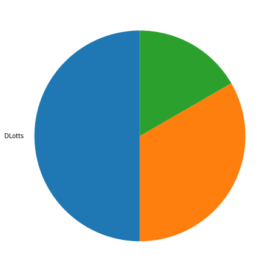
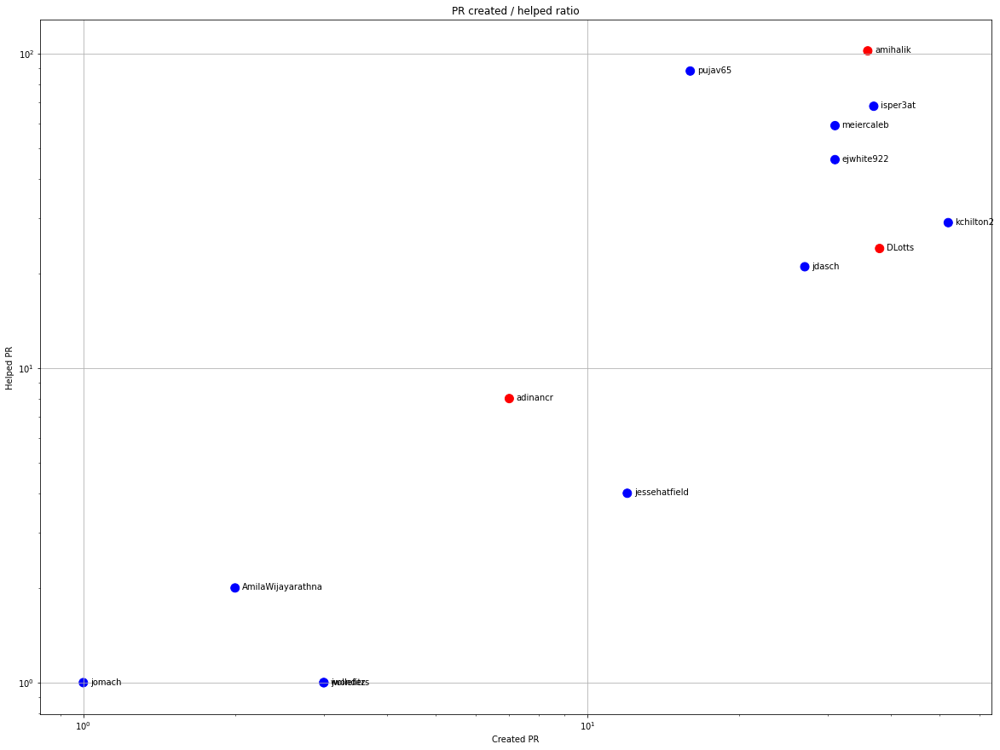
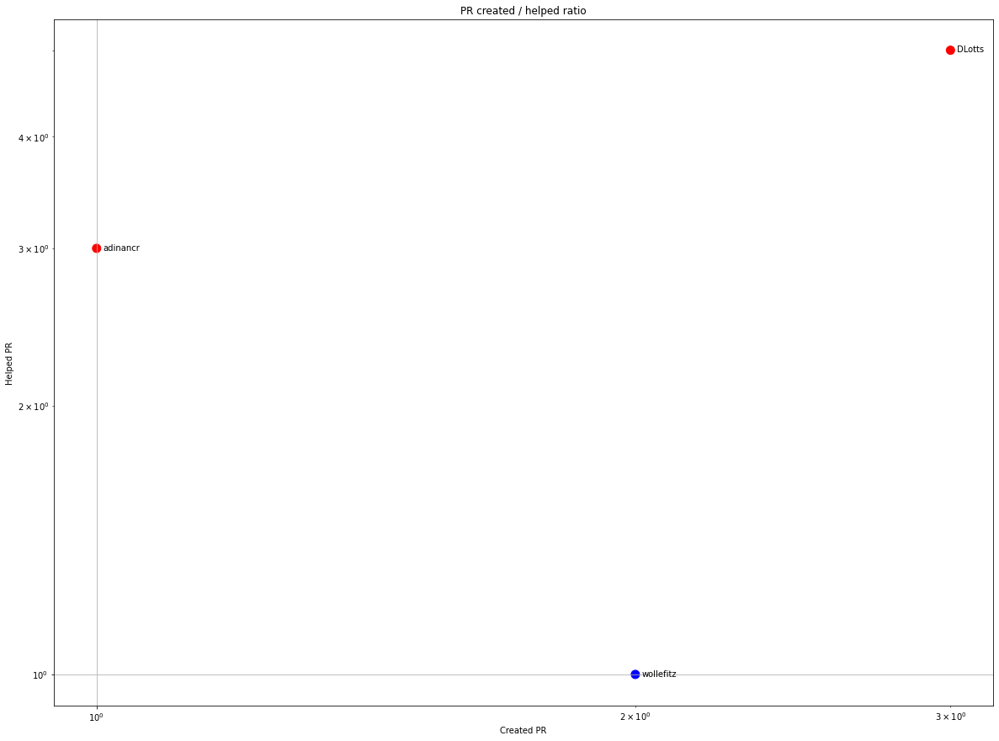
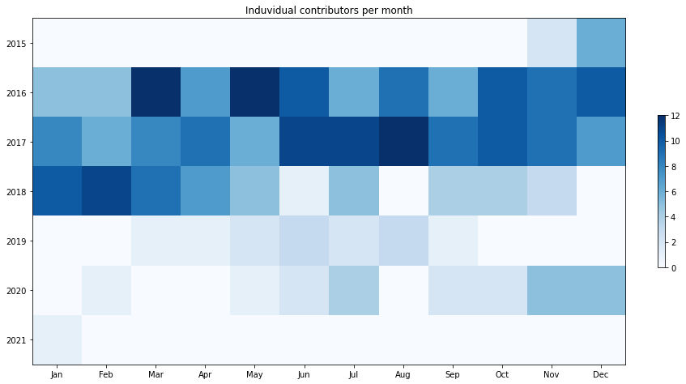
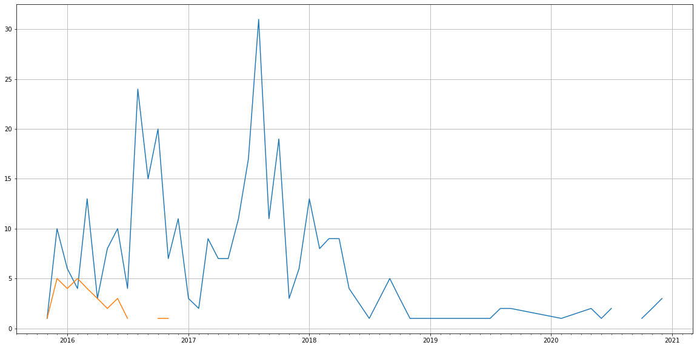
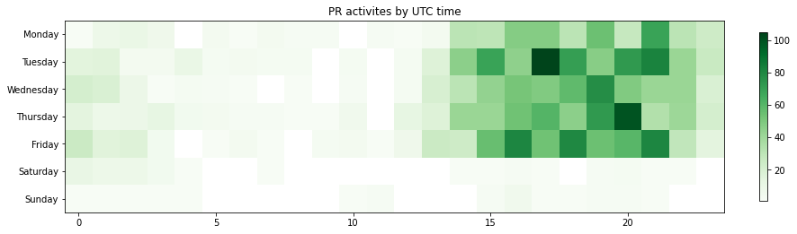

Latest record from the dataset:

<table border="1" class="dataframe">
  <thead>
    <tr style="text-align: right;">
      <th></th>
      <th>org</th>
      <th>repo</th>
      <th>type</th>
      <th>identifier</th>
      <th>subidentifier</th>
      <th>date</th>
      <th>author</th>
      <th>owner</th>
      <th>project</th>
    </tr>
  </thead>
  <tbody>
    <tr>
      <th>2661</th>
      <td>apache</td>
      <td>rya</td>
      <td>PR_COMMENTED</td>
      <td>315</td>
      <td>NaN</td>
      <td>2021-01-08 07:39:47+00:00</td>
      <td>brushworth</td>
      <td>brushworth</td>
      <td>rya</td>
    </tr>
  </tbody>
</table>

# Github Contributions per user

<table border="1" class="dataframe">
  <thead>
    <tr style="text-align: right;">
      <th></th>
      <th>contributions</th>
    </tr>
    <tr>
      <th>author</th>
      <th></th>
    </tr>
  </thead>
  <tbody>
    <tr>
      <th>asfgit</th>
      <td>622</td>
    </tr>
    <tr>
      <th>amihalik</th>
      <td>178</td>
    </tr>
    <tr>
      <th>pujav65</th>
      <td>174</td>
    </tr>
    <tr>
      <th>isper3at</th>
      <td>145</td>
    </tr>
    <tr>
      <th>meiercaleb</th>
      <td>108</td>
    </tr>
    <tr>
      <th>kchilton2</th>
      <td>89</td>
    </tr>
    <tr>
      <th>ejwhite922</th>
      <td>80</td>
    </tr>
    <tr>
      <th>jdasch</th>
      <td>73</td>
    </tr>
    <tr>
      <th>asfbot</th>
      <td>72</td>
    </tr>
    <tr>
      <th>DLotts</th>
      <td>33</td>
    </tr>
  </tbody>
</table>

## Contributors per participations in PRs which are not created by self (helping PRs)

<table border="1" class="dataframe">
  <thead>
    <tr style="text-align: right;">
      <th></th>
      <th>identifier</th>
    </tr>
    <tr>
      <th>author</th>
      <th></th>
    </tr>
  </thead>
  <tbody>
    <tr>
      <th>asfgit</th>
      <td>183</td>
    </tr>
    <tr>
      <th>amihalik</th>
      <td>102</td>
    </tr>
    <tr>
      <th>pujav65</th>
      <td>88</td>
    </tr>
    <tr>
      <th>isper3at</th>
      <td>68</td>
    </tr>
    <tr>
      <th>meiercaleb</th>
      <td>59</td>
    </tr>
    <tr>
      <th>ejwhite922</th>
      <td>46</td>
    </tr>
    <tr>
      <th>asfbot</th>
      <td>42</td>
    </tr>
    <tr>
      <th>kchilton2</th>
      <td>29</td>
    </tr>
    <tr>
      <th>DLotts</th>
      <td>24</td>
    </tr>
    <tr>
      <th>jdasch</th>
      <td>21</td>
    </tr>
    <tr>
      <th>joshelser</th>
      <td>9</td>
    </tr>
    <tr>
      <th>adinancr</th>
      <td>8</td>
    </tr>
    <tr>
      <th>jessehatfield</th>
      <td>4</td>
    </tr>
    <tr>
      <th>AmilaWijayarathna</th>
      <td>2</td>
    </tr>
    <tr>
      <th>jwonders</th>
      <td>1</td>
    </tr>
    <tr>
      <th>k-tipp</th>
      <td>1</td>
    </tr>
    <tr>
      <th>jomach</th>
      <td>1</td>
    </tr>
    <tr>
      <th>craighahn7</th>
      <td>1</td>
    </tr>
    <tr>
      <th>afs</th>
      <td>1</td>
    </tr>
    <tr>
      <th>theRealImy</th>
      <td>1</td>
    </tr>
  </tbody>
</table>

## Contributors per participations in any PRs

<table border="1" class="dataframe">
  <thead>
    <tr style="text-align: right;">
      <th></th>
      <th>identifier</th>
    </tr>
    <tr>
      <th>author</th>
      <th></th>
    </tr>
  </thead>
  <tbody>
    <tr>
      <th>asfgit</th>
      <td>183</td>
    </tr>
    <tr>
      <th>amihalik</th>
      <td>138</td>
    </tr>
    <tr>
      <th>isper3at</th>
      <td>105</td>
    </tr>
    <tr>
      <th>pujav65</th>
      <td>104</td>
    </tr>
    <tr>
      <th>meiercaleb</th>
      <td>90</td>
    </tr>
    <tr>
      <th>kchilton2</th>
      <td>81</td>
    </tr>
    <tr>
      <th>ejwhite922</th>
      <td>77</td>
    </tr>
    <tr>
      <th>DLotts</th>
      <td>61</td>
    </tr>
    <tr>
      <th>jdasch</th>
      <td>48</td>
    </tr>
    <tr>
      <th>asfbot</th>
      <td>42</td>
    </tr>
    <tr>
      <th>jessehatfield</th>
      <td>16</td>
    </tr>
    <tr>
      <th>adinancr</th>
      <td>15</td>
    </tr>
    <tr>
      <th>joshelser</th>
      <td>9</td>
    </tr>
    <tr>
      <th>AmilaWijayarathna</th>
      <td>4</td>
    </tr>
    <tr>
      <th>jwonders</th>
      <td>4</td>
    </tr>
    <tr>
      <th>wollefitz</th>
      <td>4</td>
    </tr>
    <tr>
      <th>jej2003</th>
      <td>3</td>
    </tr>
    <tr>
      <th>thn-w</th>
      <td>3</td>
    </tr>
    <tr>
      <th>Ejgood21</th>
      <td>3</td>
    </tr>
    <tr>
      <th>brushworth</th>
      <td>3</td>
    </tr>
  </tbody>
</table>

# Bus factor (number of contributors responsible for the 50% of the prs) from last half year

## Contributors until the half of the all contributions

<table border="1" class="dataframe">
  <thead>
    <tr style="text-align: right;">
      <th></th>
      <th>author</th>
      <th>identifier</th>
      <th>cs</th>
      <th>ratio</th>
    </tr>
  </thead>
  <tbody>
  </tbody>
</table>

## Pony number (bus factor)

    1

## Dev power (All the contributions in the ration of the top contributor)

    1.9999999999999998

    

    

## People with created PRs > reviewed/commented PRS

    

    

## Same graph with focusing to the last 6 month

Only contributors with both created pr and helped pr visible

    

    

# Number of individual contributors per month

Number of different Github users who either created PR, commented PR, added review to a PR

Note: only events from apache/hadoop-ozone repository are included. Earlier PRs/comments are not here.

    

    

# Number of PRs closed/created per month

    /usr/lib/python3.9/site-packages/pandas/core/arrays/datetimes.py:1101: UserWarning: Converting to PeriodArray/Index representation will drop timezone information.
      warnings.warn(

    

    

# PR activity heatmap

    

    

