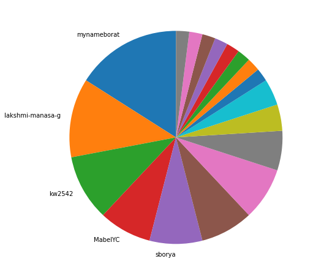
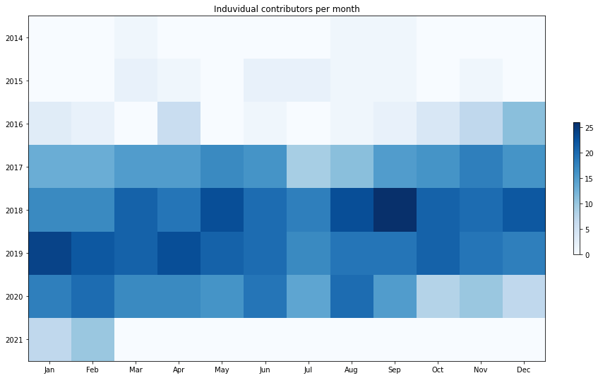

Latest record from the dataset:

<table border="1" class="dataframe">
  <thead>
    <tr style="text-align: right;">
      <th></th>
      <th>org</th>
      <th>repo</th>
      <th>type</th>
      <th>identifier</th>
      <th>subidentifier</th>
      <th>date</th>
      <th>author</th>
      <th>owner</th>
      <th>project</th>
    </tr>
  </thead>
  <tbody>
    <tr>
      <th>4184</th>
      <td>apache</td>
      <td>samza</td>
      <td>PR_COMMENTED</td>
      <td>1462</td>
      <td>NaN</td>
      <td>2021-02-12 22:01:33+00:00</td>
      <td>perkss</td>
      <td>perkss</td>
      <td>samza</td>
    </tr>
  </tbody>
</table>

# Github Contributions per user

<table border="1" class="dataframe">
  <thead>
    <tr style="text-align: right;">
      <th></th>
      <th>contributions</th>
    </tr>
    <tr>
      <th>author</th>
      <th></th>
    </tr>
  </thead>
  <tbody>
    <tr>
      <th>prateekm</th>
      <td>1060</td>
    </tr>
    <tr>
      <th>vjagadish1989</th>
      <td>621</td>
    </tr>
    <tr>
      <th>rmatharu</th>
      <td>425</td>
    </tr>
    <tr>
      <th>cameronlee314</th>
      <td>380</td>
    </tr>
    <tr>
      <th>shanthoosh</th>
      <td>358</td>
    </tr>
    <tr>
      <th>mynameborat</th>
      <td>354</td>
    </tr>
    <tr>
      <th>navina</th>
      <td>284</td>
    </tr>
    <tr>
      <th>xinyuiscool</th>
      <td>284</td>
    </tr>
    <tr>
      <th>nickpan47</th>
      <td>267</td>
    </tr>
    <tr>
      <th>jmakes</th>
      <td>193</td>
    </tr>
  </tbody>
</table>

## Contributors per participations in PRs which are not created by self (helping PRs)

<table border="1" class="dataframe">
  <thead>
    <tr style="text-align: right;">
      <th></th>
      <th>identifier</th>
    </tr>
    <tr>
      <th>author</th>
      <th></th>
    </tr>
  </thead>
  <tbody>
    <tr>
      <th>prateekm</th>
      <td>423</td>
    </tr>
    <tr>
      <th>vjagadish1989</th>
      <td>313</td>
    </tr>
    <tr>
      <th>xinyuiscool</th>
      <td>179</td>
    </tr>
    <tr>
      <th>shanthoosh</th>
      <td>171</td>
    </tr>
    <tr>
      <th>mynameborat</th>
      <td>155</td>
    </tr>
    <tr>
      <th>cameronlee314</th>
      <td>113</td>
    </tr>
    <tr>
      <th>jmakes</th>
      <td>108</td>
    </tr>
    <tr>
      <th>nickpan47</th>
      <td>107</td>
    </tr>
    <tr>
      <th>navina</th>
      <td>94</td>
    </tr>
    <tr>
      <th>sborya</th>
      <td>92</td>
    </tr>
    <tr>
      <th>rmatharu</th>
      <td>79</td>
    </tr>
    <tr>
      <th>atoomula</th>
      <td>70</td>
    </tr>
    <tr>
      <th>srinipunuru</th>
      <td>57</td>
    </tr>
    <tr>
      <th>vjagadish</th>
      <td>39</td>
    </tr>
    <tr>
      <th>bharathkk</th>
      <td>39</td>
    </tr>
    <tr>
      <th>Sanil15</th>
      <td>36</td>
    </tr>
    <tr>
      <th>dnishimura</th>
      <td>35</td>
    </tr>
    <tr>
      <th>lhaiesp</th>
      <td>35</td>
    </tr>
    <tr>
      <th>abhishekshivanna</th>
      <td>24</td>
    </tr>
    <tr>
      <th>fredji97</th>
      <td>23</td>
    </tr>
  </tbody>
</table>

## Contributors per participations in any PRs

<table border="1" class="dataframe">
  <thead>
    <tr style="text-align: right;">
      <th></th>
      <th>identifier</th>
    </tr>
    <tr>
      <th>author</th>
      <th></th>
    </tr>
  </thead>
  <tbody>
    <tr>
      <th>prateekm</th>
      <td>522</td>
    </tr>
    <tr>
      <th>vjagadish1989</th>
      <td>385</td>
    </tr>
    <tr>
      <th>shanthoosh</th>
      <td>308</td>
    </tr>
    <tr>
      <th>xinyuiscool</th>
      <td>254</td>
    </tr>
    <tr>
      <th>cameronlee314</th>
      <td>203</td>
    </tr>
    <tr>
      <th>mynameborat</th>
      <td>198</td>
    </tr>
    <tr>
      <th>sborya</th>
      <td>182</td>
    </tr>
    <tr>
      <th>rmatharu</th>
      <td>175</td>
    </tr>
    <tr>
      <th>jmakes</th>
      <td>161</td>
    </tr>
    <tr>
      <th>atoomula</th>
      <td>133</td>
    </tr>
    <tr>
      <th>nickpan47</th>
      <td>129</td>
    </tr>
    <tr>
      <th>navina</th>
      <td>123</td>
    </tr>
    <tr>
      <th>srinipunuru</th>
      <td>95</td>
    </tr>
    <tr>
      <th>Sanil15</th>
      <td>95</td>
    </tr>
    <tr>
      <th>dnishimura</th>
      <td>79</td>
    </tr>
    <tr>
      <th>weisong44</th>
      <td>74</td>
    </tr>
    <tr>
      <th>bharathkk</th>
      <td>68</td>
    </tr>
    <tr>
      <th>lhaiesp</th>
      <td>68</td>
    </tr>
    <tr>
      <th>kw2542</th>
      <td>55</td>
    </tr>
    <tr>
      <th>vjagadish</th>
      <td>48</td>
    </tr>
  </tbody>
</table>

# Bus factor (number of contributors responsible for the 50% of the prs) from last half year

## Contributors until the half of the all contributions

<table border="1" class="dataframe">
  <thead>
    <tr style="text-align: right;">
      <th></th>
      <th>author</th>
      <th>identifier</th>
      <th>cs</th>
      <th>ratio</th>
    </tr>
  </thead>
  <tbody>
    <tr>
      <th>0</th>
      <td>mynameborat</td>
      <td>8</td>
      <td>8</td>
      <td>16.0</td>
    </tr>
    <tr>
      <th>1</th>
      <td>lakshmi-manasa-g</td>
      <td>6</td>
      <td>14</td>
      <td>12.0</td>
    </tr>
    <tr>
      <th>2</th>
      <td>kw2542</td>
      <td>5</td>
      <td>19</td>
      <td>10.0</td>
    </tr>
    <tr>
      <th>3</th>
      <td>MabelYC</td>
      <td>4</td>
      <td>23</td>
      <td>8.0</td>
    </tr>
  </tbody>
</table>

## Pony number (bus factor)

    5

## Dev power (All the contributions in the ration of the top contributor)

    6.25

    

    

## People with created PRs > reviewed/commented PRS

    

    

## Same graph with focusing to the last 6 month

Only contributors with both created pr and helped pr visible

    

    

# Number of individual contributors per month

Number of different Github users who either created PR, commented PR, added review to a PR

Note: only events from apache/hadoop-ozone repository are included. Earlier PRs/comments are not here.

    

    

# Number of PRs closed/created per month

    /usr/lib/python3.9/site-packages/pandas/core/arrays/datetimes.py:1101: UserWarning: Converting to PeriodArray/Index representation will drop timezone information.
      warnings.warn(

    

    

# PR activity heatmap

    

    

