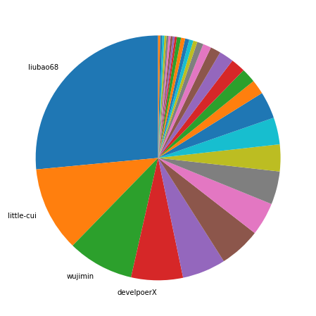
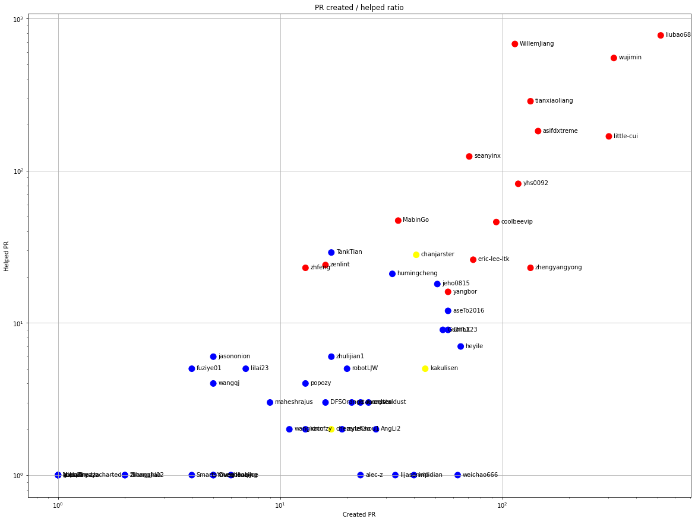
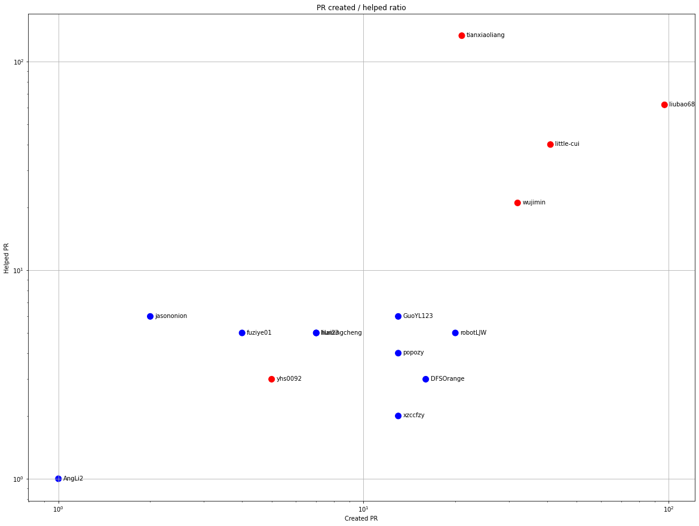
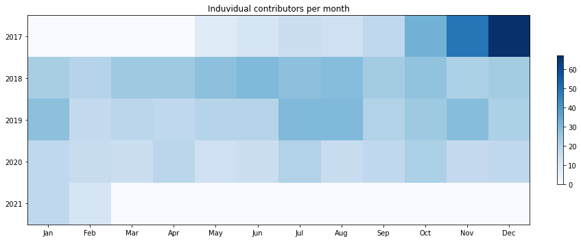
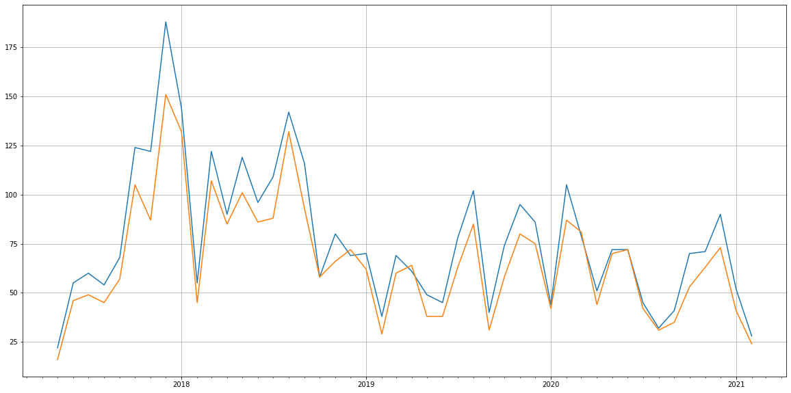
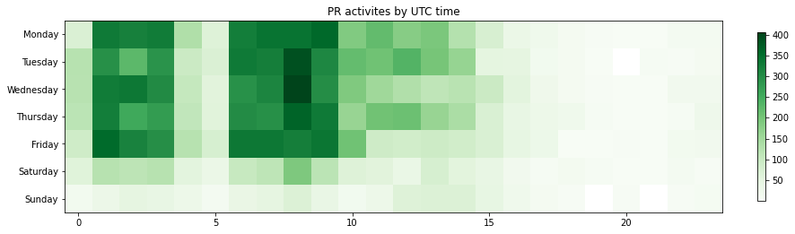

Latest record from the dataset:

<table border="1" class="dataframe">
  <thead>
    <tr style="text-align: right;">
      <th></th>
      <th>org</th>
      <th>repo</th>
      <th>type</th>
      <th>identifier</th>
      <th>subidentifier</th>
      <th>date</th>
      <th>author</th>
      <th>owner</th>
      <th>project</th>
    </tr>
  </thead>
  <tbody>
    <tr>
      <th>10975</th>
      <td>apache</td>
      <td>servicecomb-kie</td>
      <td>PR_CREATED</td>
      <td>173</td>
      <td>NaN</td>
      <td>2021-02-10 10:00:18+00:00</td>
      <td>tianxiaoliang</td>
      <td>tianxiaoliang</td>
      <td>servicecomb</td>
    </tr>
  </tbody>
</table>

# Github Contributions per user

<table border="1" class="dataframe">
  <thead>
    <tr style="text-align: right;">
      <th></th>
      <th>contributions</th>
    </tr>
    <tr>
      <th>author</th>
      <th></th>
    </tr>
  </thead>
  <tbody>
    <tr>
      <th>coveralls</th>
      <td>2733</td>
    </tr>
    <tr>
      <th>WillemJiang</th>
      <td>2669</td>
    </tr>
    <tr>
      <th>liubao68</th>
      <td>1948</td>
    </tr>
    <tr>
      <th>wujimin</th>
      <td>1482</td>
    </tr>
    <tr>
      <th>tianxiaoliang</th>
      <td>835</td>
    </tr>
    <tr>
      <th>codecov-io</th>
      <td>534</td>
    </tr>
    <tr>
      <th>asifdxtreme</th>
      <td>367</td>
    </tr>
    <tr>
      <th>little-cui</th>
      <td>304</td>
    </tr>
    <tr>
      <th>seanyinx</th>
      <td>279</td>
    </tr>
    <tr>
      <th>yhs0092</th>
      <td>158</td>
    </tr>
  </tbody>
</table>

## Contributors per participations in PRs which are not created by self (helping PRs)

<table border="1" class="dataframe">
  <thead>
    <tr style="text-align: right;">
      <th></th>
      <th>identifier</th>
    </tr>
    <tr>
      <th>author</th>
      <th></th>
    </tr>
  </thead>
  <tbody>
    <tr>
      <th>coveralls</th>
      <td>1312</td>
    </tr>
    <tr>
      <th>liubao68</th>
      <td>774</td>
    </tr>
    <tr>
      <th>WillemJiang</th>
      <td>680</td>
    </tr>
    <tr>
      <th>wujimin</th>
      <td>550</td>
    </tr>
    <tr>
      <th>codecov-io</th>
      <td>534</td>
    </tr>
    <tr>
      <th>tianxiaoliang</th>
      <td>286</td>
    </tr>
    <tr>
      <th>asifdxtreme</th>
      <td>182</td>
    </tr>
    <tr>
      <th>little-cui</th>
      <td>168</td>
    </tr>
    <tr>
      <th>seanyinx</th>
      <td>124</td>
    </tr>
    <tr>
      <th>yhs0092</th>
      <td>82</td>
    </tr>
    <tr>
      <th>MabinGo</th>
      <td>47</td>
    </tr>
    <tr>
      <th>coolbeevip</th>
      <td>46</td>
    </tr>
    <tr>
      <th>TankTian</th>
      <td>29</td>
    </tr>
    <tr>
      <th>chanjarster</th>
      <td>28</td>
    </tr>
    <tr>
      <th>eric-lee-ltk</th>
      <td>26</td>
    </tr>
    <tr>
      <th>zenlint</th>
      <td>24</td>
    </tr>
    <tr>
      <th>zhengyangyong</th>
      <td>23</td>
    </tr>
    <tr>
      <th>zhfeng</th>
      <td>23</td>
    </tr>
    <tr>
      <th>humingcheng</th>
      <td>21</td>
    </tr>
    <tr>
      <th>jeho0815</th>
      <td>18</td>
    </tr>
  </tbody>
</table>

## Contributors per participations in any PRs

<table border="1" class="dataframe">
  <thead>
    <tr style="text-align: right;">
      <th></th>
      <th>identifier</th>
    </tr>
    <tr>
      <th>author</th>
      <th></th>
    </tr>
  </thead>
  <tbody>
    <tr>
      <th>coveralls</th>
      <td>1312</td>
    </tr>
    <tr>
      <th>liubao68</th>
      <td>1190</td>
    </tr>
    <tr>
      <th>wujimin</th>
      <td>858</td>
    </tr>
    <tr>
      <th>WillemJiang</th>
      <td>725</td>
    </tr>
    <tr>
      <th>codecov-io</th>
      <td>534</td>
    </tr>
    <tr>
      <th>little-cui</th>
      <td>461</td>
    </tr>
    <tr>
      <th>tianxiaoliang</th>
      <td>371</td>
    </tr>
    <tr>
      <th>asifdxtreme</th>
      <td>301</td>
    </tr>
    <tr>
      <th>yhs0092</th>
      <td>200</td>
    </tr>
    <tr>
      <th>seanyinx</th>
      <td>158</td>
    </tr>
    <tr>
      <th>zhengyangyong</th>
      <td>148</td>
    </tr>
    <tr>
      <th>coolbeevip</th>
      <td>140</td>
    </tr>
    <tr>
      <th>eric-lee-ltk</th>
      <td>95</td>
    </tr>
    <tr>
      <th>MabinGo</th>
      <td>77</td>
    </tr>
    <tr>
      <th>yangbor</th>
      <td>73</td>
    </tr>
    <tr>
      <th>heyile</th>
      <td>72</td>
    </tr>
    <tr>
      <th>jeho0815</th>
      <td>69</td>
    </tr>
    <tr>
      <th>chanjarster</th>
      <td>69</td>
    </tr>
    <tr>
      <th>aseTo2016</th>
      <td>69</td>
    </tr>
    <tr>
      <th>ChinX</th>
      <td>66</td>
    </tr>
  </tbody>
</table>

# Bus factor (number of contributors responsible for the 50% of the prs) from last half year

## Contributors until the half of the all contributions

<table border="1" class="dataframe">
  <thead>
    <tr style="text-align: right;">
      <th></th>
      <th>author</th>
      <th>identifier</th>
      <th>cs</th>
      <th>ratio</th>
    </tr>
  </thead>
  <tbody>
    <tr>
      <th>0</th>
      <td>liubao68</td>
      <td>97</td>
      <td>97</td>
      <td>26.502732</td>
    </tr>
    <tr>
      <th>1</th>
      <td>little-cui</td>
      <td>41</td>
      <td>138</td>
      <td>11.202186</td>
    </tr>
    <tr>
      <th>2</th>
      <td>wujimin</td>
      <td>32</td>
      <td>170</td>
      <td>8.743169</td>
    </tr>
  </tbody>
</table>

## Pony number (bus factor)

    4

## Dev power (All the contributions in the ration of the top contributor)

    3.7731958762886597

    

    

## People with created PRs > reviewed/commented PRS

    

    

## Same graph with focusing to the last 6 month

Only contributors with both created pr and helped pr visible

    

    

# Number of individual contributors per month

Number of different Github users who either created PR, commented PR, added review to a PR

Note: only events from apache/hadoop-ozone repository are included. Earlier PRs/comments are not here.

    

    

# Number of PRs closed/created per month

    /usr/lib/python3.9/site-packages/pandas/core/arrays/datetimes.py:1101: UserWarning: Converting to PeriodArray/Index representation will drop timezone information.
      warnings.warn(

    

    

# PR activity heatmap

    

    

