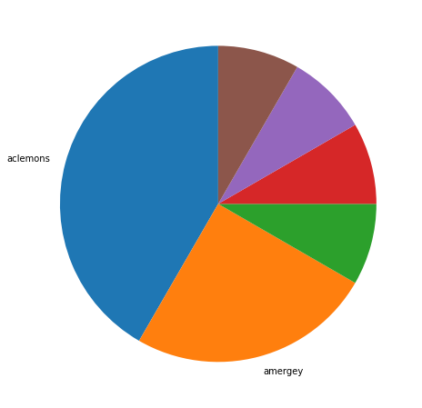
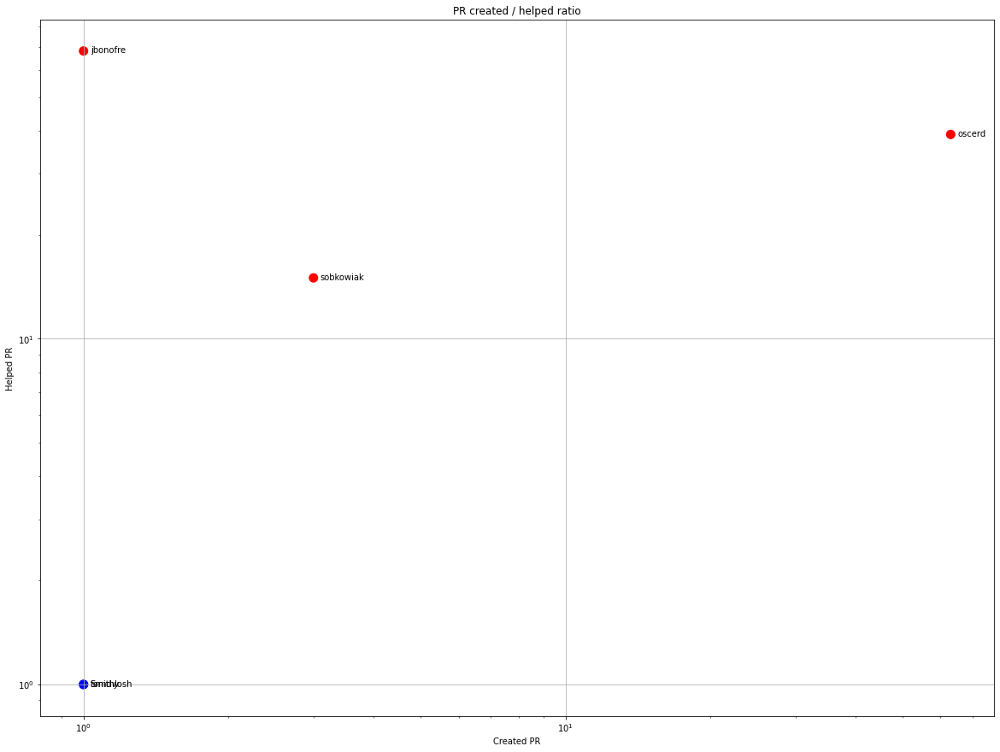
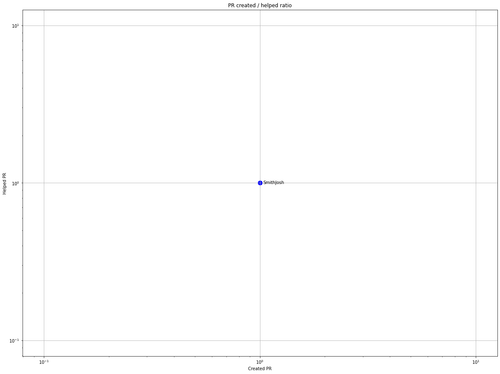
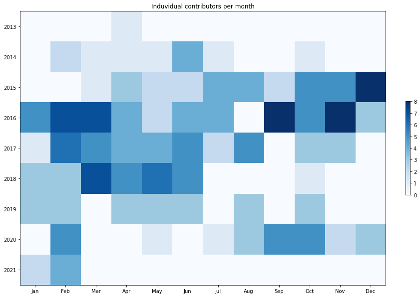
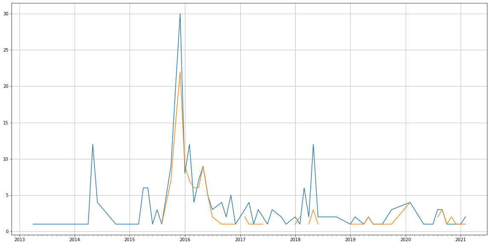
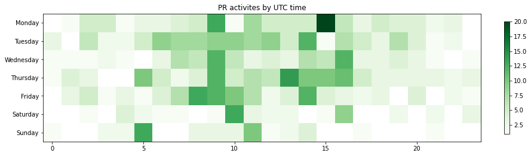

Latest record from the dataset:

<table border="1" class="dataframe">
  <thead>
    <tr style="text-align: right;">
      <th></th>
      <th>org</th>
      <th>repo</th>
      <th>type</th>
      <th>identifier</th>
      <th>subidentifier</th>
      <th>date</th>
      <th>author</th>
      <th>owner</th>
      <th>project</th>
    </tr>
  </thead>
  <tbody>
    <tr>
      <th>355</th>
      <td>apache</td>
      <td>servicemix-bundles</td>
      <td>PR_REVIEW_COMMENTED</td>
      <td>153</td>
      <td>NaN</td>
      <td>2021-02-04 11:27:57+00:00</td>
      <td>amergey</td>
      <td>amergey</td>
      <td>servicemix</td>
    </tr>
  </tbody>
</table>

# Github Contributions per user

<table border="1" class="dataframe">
  <thead>
    <tr style="text-align: right;">
      <th></th>
      <th>contributions</th>
    </tr>
    <tr>
      <th>author</th>
      <th></th>
    </tr>
  </thead>
  <tbody>
    <tr>
      <th>jbonofre</th>
      <td>133</td>
    </tr>
    <tr>
      <th>asfgit</th>
      <td>111</td>
    </tr>
    <tr>
      <th>oscerd</th>
      <td>65</td>
    </tr>
    <tr>
      <th>sobkowiak</th>
      <td>17</td>
    </tr>
    <tr>
      <th>ffang</th>
      <td>4</td>
    </tr>
    <tr>
      <th>demobox</th>
      <td>2</td>
    </tr>
    <tr>
      <th>SmithJosh</th>
      <td>1</td>
    </tr>
    <tr>
      <th>cstamas</th>
      <td>1</td>
    </tr>
    <tr>
      <th>gertv</th>
      <td>1</td>
    </tr>
    <tr>
      <th>janstey</th>
      <td>1</td>
    </tr>
  </tbody>
</table>

## Contributors per participations in PRs which are not created by self (helping PRs)

<table border="1" class="dataframe">
  <thead>
    <tr style="text-align: right;">
      <th></th>
      <th>identifier</th>
    </tr>
    <tr>
      <th>author</th>
      <th></th>
    </tr>
  </thead>
  <tbody>
    <tr>
      <th>asfgit</th>
      <td>93</td>
    </tr>
    <tr>
      <th>jbonofre</th>
      <td>68</td>
    </tr>
    <tr>
      <th>oscerd</th>
      <td>39</td>
    </tr>
    <tr>
      <th>sobkowiak</th>
      <td>15</td>
    </tr>
    <tr>
      <th>demobox</th>
      <td>2</td>
    </tr>
    <tr>
      <th>ffang</th>
      <td>2</td>
    </tr>
    <tr>
      <th>SmithJosh</th>
      <td>1</td>
    </tr>
    <tr>
      <th>cstamas</th>
      <td>1</td>
    </tr>
    <tr>
      <th>gertv</th>
      <td>1</td>
    </tr>
    <tr>
      <th>janstey</th>
      <td>1</td>
    </tr>
    <tr>
      <th>robertcsakany</th>
      <td>1</td>
    </tr>
    <tr>
      <th>seijoed</th>
      <td>1</td>
    </tr>
    <tr>
      <th>tomdw</th>
      <td>1</td>
    </tr>
  </tbody>
</table>

## Contributors per participations in any PRs

<table border="1" class="dataframe">
  <thead>
    <tr style="text-align: right;">
      <th></th>
      <th>identifier</th>
    </tr>
    <tr>
      <th>author</th>
      <th></th>
    </tr>
  </thead>
  <tbody>
    <tr>
      <th>asfgit</th>
      <td>93</td>
    </tr>
    <tr>
      <th>oscerd</th>
      <td>89</td>
    </tr>
    <tr>
      <th>jbonofre</th>
      <td>69</td>
    </tr>
    <tr>
      <th>lburgazzoli</th>
      <td>37</td>
    </tr>
    <tr>
      <th>sobkowiak</th>
      <td>17</td>
    </tr>
    <tr>
      <th>wimve</th>
      <td>13</td>
    </tr>
    <tr>
      <th>oliverlietz</th>
      <td>12</td>
    </tr>
    <tr>
      <th>cybermaniax</th>
      <td>9</td>
    </tr>
    <tr>
      <th>aclemons</th>
      <td>7</td>
    </tr>
    <tr>
      <th>cschneider</th>
      <td>3</td>
    </tr>
    <tr>
      <th>amergey</th>
      <td>3</td>
    </tr>
    <tr>
      <th>JLLeitschuh</th>
      <td>3</td>
    </tr>
    <tr>
      <th>johnpoth</th>
      <td>3</td>
    </tr>
    <tr>
      <th>nacx</th>
      <td>2</td>
    </tr>
    <tr>
      <th>ffang</th>
      <td>2</td>
    </tr>
    <tr>
      <th>grgrzybek</th>
      <td>2</td>
    </tr>
    <tr>
      <th>gzurowski</th>
      <td>2</td>
    </tr>
    <tr>
      <th>rjatkins</th>
      <td>2</td>
    </tr>
    <tr>
      <th>dependabot</th>
      <td>2</td>
    </tr>
    <tr>
      <th>demobox</th>
      <td>2</td>
    </tr>
  </tbody>
</table>

# Bus factor (number of contributors responsible for the 50% of the prs) from last half year

## Contributors until the half of the all contributions

<table border="1" class="dataframe">
  <thead>
    <tr style="text-align: right;">
      <th></th>
      <th>author</th>
      <th>identifier</th>
      <th>cs</th>
      <th>ratio</th>
    </tr>
  </thead>
  <tbody>
    <tr>
      <th>0</th>
      <td>aclemons</td>
      <td>5</td>
      <td>5</td>
      <td>41.666667</td>
    </tr>
  </tbody>
</table>

## Pony number (bus factor)

    2

## Dev power (All the contributions in the ration of the top contributor)

    2.4000000000000004

    

    

## People with created PRs > reviewed/commented PRS

    

    

## Same graph with focusing to the last 6 month

Only contributors with both created pr and helped pr visible

    

    

# Number of individual contributors per month

Number of different Github users who either created PR, commented PR, added review to a PR

Note: only events from apache/hadoop-ozone repository are included. Earlier PRs/comments are not here.

    

    

# Number of PRs closed/created per month

    /usr/lib/python3.9/site-packages/pandas/core/arrays/datetimes.py:1101: UserWarning: Converting to PeriodArray/Index representation will drop timezone information.
      warnings.warn(

    

    

# PR activity heatmap

    

    

